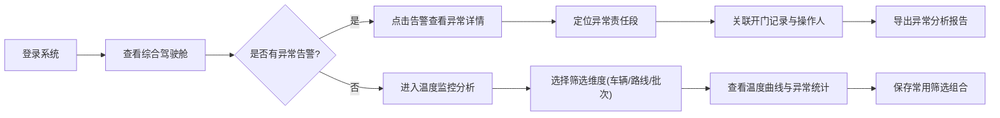
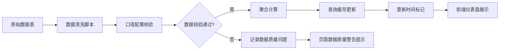

# 冷链物流温控追踪分析系统 - 产品需求文档

## 1. 产品概述

冷链物流温控追踪分析系统是面向质量管理人员的专业数据分析平台，将车辆定位、箱内温度、开门记录、到货时间和异常处理等多维度数据整合为可探索的交互式仪表盘。系统支持多维度对比分析、路线轨迹回放、温度异常追溯，并提供数据质量监控，确保质量管理人员能够快速识别问题、定位责任、优化冷链配送流程。

- **核心目标**：实现冷链物流全过程温度可视化监控与异常追溯，提升质量管理效率
- **目标用户**：质量管理人员、物流运营分析人员、合规审计人员
- **市场价值**：降低冷链货物损耗率，提升客户满意度，满足合规审计要求

## 2. 核心功能

### 2.1 用户角色

| 角色 | 登录方式 | 核心权限 |
|------|----------|----------|
| 质量管理人员 | 账号密码登录 | 查看仪表盘、筛选分析、导出报告、保存筛选组合 |
| 运营分析人员 | 账号密码登录 | 查看仪表盘、多维度对比、异常分析 |
| 系统管理员 | 账号密码登录 | 数据配置、用户管理、系统设置 |

### 2.2 功能模块

1. **综合驾驶舱**：关键指标概览、异常告警、数据质量状态
2. **温度监控分析**：温度曲线、异常时长统计、探头校准状态
3. **路线轨迹回放**：车辆定位轨迹、运输时段温度映射、地理可视化
4. **异常追溯分析**：异常事件详情、责任段定位、开门记录关联
5. **多维对比分析**：车辆/路线/批次/温控箱/客户多维度对比
6. **数据质量管理**：缺失值检查、异常点检测、样本量验证、更新状态

### 2.3 页面详情

| 页面名称 | 模块名称 | 功能描述 |
|-----------|-------------|---------------------|
| 综合驾驶舱 | KPI指标卡 | 展示在途车辆数、温度异常率、平均配送时长、准时到货率 |
| 综合驾驶舱 | 异常告警区 | 实时展示未处理异常事件，支持点击跳转详情 |
| 综合驾驶舱 | 数据质量状态 | 展示数据更新时间、缺失字段警告、数据完整性百分比 |
| 温度监控分析 | 温度曲线图 | Plotly交互式折线图，支持缩放、悬停查看详情、多批次叠加 |
| 温度监控分析 | 异常时长统计 | 柱状图展示各车辆/路线异常时长排名与占比 |
| 温度监控分析 | 探头状态面板 | 展示温度探头校准日期、校准状态、下次校准提醒 |
| 路线轨迹回放 | 地图可视化 | Leaflet地图展示车辆行驶轨迹，支持播放/暂停/倍速 |
| 路线轨迹回放 | 温度热力带 | 轨迹线上用颜色映射温度区间，直观展示温度异常路段 |
| 路线轨迹回放 | 关键事件标记 | 在轨迹上标记开门、卸货、异常发生等关键事件点 |
| 异常追溯分析 | 异常事件列表 | 表格展示所有异常事件，支持按类型/时间/责任方筛选 |
| 异常追溯分析 | 责任段定位 | 时间轴可视化定位异常发生的责任时段与关联操作 |
| 异常追溯分析 | 开门记录关联 | 展示异常时段内的开门记录、开门时长、操作人员 |
| 多维对比分析 | 维度选择器 | 支持选择车辆、路线、批次、温控箱、客户作为对比维度 |
| 多维对比分析 | 对比图表组 | 并列展示温度分布、异常次数、准时率等对比指标 |
| 数据质量管理 | 缺失值检查 | 热力图展示各字段缺失情况，按日期和数据表分组 |
| 数据质量管理 | 异常点检测 | 箱线图展示温度异常值分布，支持下钻查看详情 |
| 数据质量管理 | 样本量验证 | 统计各维度数据样本量，标记样本不足的分析维度 |

## 3. 核心流程

### 3.1 质量管理人员日常分析流程

### 3.2 数据处理与更新流程

## 4. 用户界面设计

### 4.1 设计风格

- **主色调**：专业冷蓝色系 (#165DFF)，传递冷链与科技感
- **辅助色**：温度异常警示色 (#FF4D4F)、正常状态色 (#52C41A)、警告色 (#FAAD14)
- **按钮风格**：圆角矩形 (8px)、轻微阴影、悬停微放大效果
- **字体**：标题使用 "Noto Sans SC" 粗体，正文使用 "Inter" 常规体
- **布局风格**：卡片式布局，顶部导航 + 左侧筛选栏 + 主内容区三栏结构
- **图标风格**：线性图标 (lucide-react)，保持简洁统一
- **数据可视化风格**：Plotly 深色主题，高对比度配色，支持响应式

### 4.2 页面设计概述

| 页面名称 | 模块名称 | UI 元素 |
|-----------|-------------|----------|
| 综合驾驶舱 | KPI指标卡 | 渐变背景卡片、数字动画、趋势箭头、悬停上浮效果 |
| 综合驾驶舱 | 异常告警区 | 红色闪烁提示角标、列表项hover高亮、紧急程度标签 |
| 温度监控分析 | 温度曲线图 | Plotly交互式图表、双Y轴(温度/开门状态)、异常区间阴影 |
| 路线轨迹回放 | 地图可视化 | Leaflet地图、自定义轨迹线颜色、播放控制条、时间轴 |
| 多维对比分析 | 对比图表组 | 可拖拽布局、图表切换动画、同步筛选联动 |
| 数据质量管理 | 缺失值检查 | 热力图单元格tooltip、缺失严重程度颜色梯度 |

### 4.3 响应式设计

- **桌面端优先** (1440px+)：三栏完整布局，图表最佳展示尺寸
- **平板端** (768px-1439px)：筛选栏可折叠，图表自适应缩放
- **移动端** (<768px)：底部tab导航，单列流式布局，核心指标优先展示
- **触控优化**：增大点击热区(≥44px)，支持手势缩放图表

### 4.4 动效与交互

- **页面加载**：骨架屏渐进式加载，图表区域先显示占位再渲染
- **筛选联动**：图表切换使用淡入淡出过渡 (300ms ease)
- **告警提示**：新异常出现时使用脉冲动画吸引注意力
- **悬停效果**：卡片轻微上浮 (+2px)，阴影加深
- **数据更新**：数据刷新时数字滚动动画，更新时间标记闪烁
