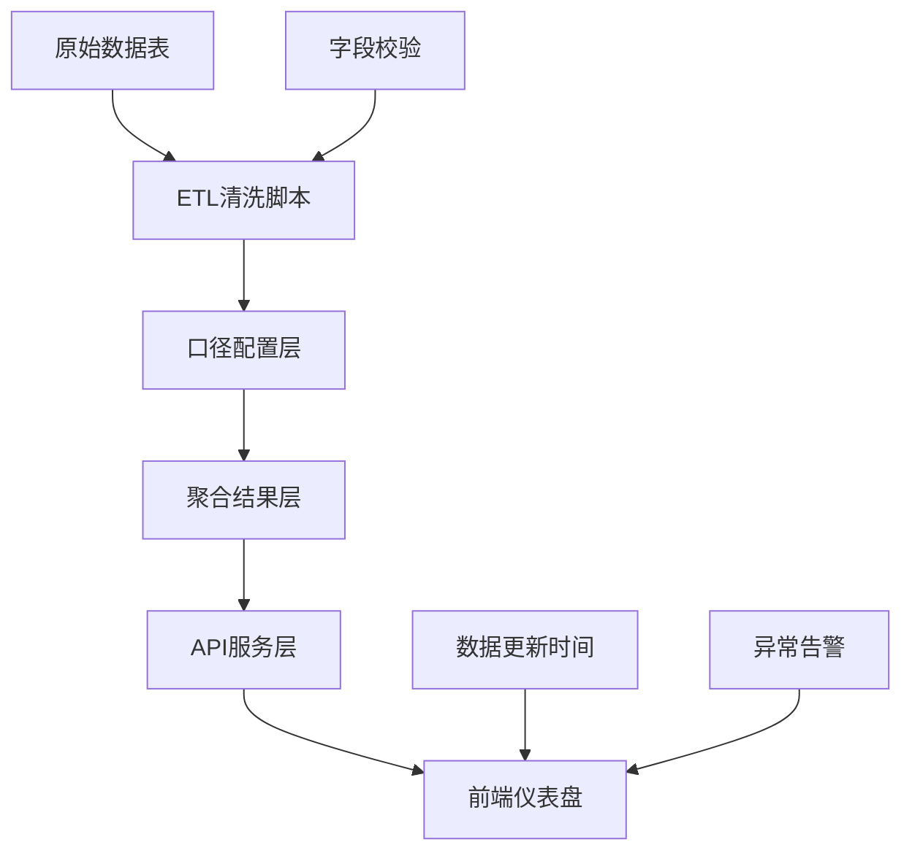

## 1. 产品概述
共享单车运营调度分析工作台，面向城市出行运营团队，将骑行起终点、站点余量、早晚高峰、维修车、天气等多源数据整合为可视化仪表盘，支持实时监控、趋势预测、调度决策和效果追溯。
- 核心目标：提升车辆调度效率，降低空驶率，减少站点堆积/短缺，保障用户体验
- 目标用户：城市运营经理、调度专员、数据分析师、运维主管
- 核心价值：从"经验调度"转向"数据驱动调度"，提供可追溯、可验证的决策依据

## 2. 核心 Features

### 2.1 用户角色
| 角色 | 登录方式 | 核心权限 |
|------|----------|----------|
| 运营管理员 | SSO/账号密码 | 全部看板、导出报表、配置口径、管理用户 |
| 调度专员 | SSO/账号密码 | 实时监控、调度记录、站点告警、保存筛选 |
| 数据分析师 | SSO/账号密码 | 多维分析、峰值预测、原始数据追溯、自定义报表 |
| 运维主管 | SSO/账号密码 | 维修车辆监控、站点状态、调度效果对比 |

### 2.2 功能模块
1. **总览仪表盘**：核心KPI卡片、地图流向、实时告警、高峰时段热力
2. **站点分析**：站点详情、余量趋势、供需缺口、周边线路分析
3. **线路分析**：OD流向图、热门线路排行、时段分布对比
4. **调度管理**：调度记录、调度效果对比、车辆状态追踪
5. **预测中心**：峰值预测、供需预警、天气影响分析
6. **数据管理**：ETL状态监控、口径配置、筛选组合管理、导出任务

### 2.3 页面详情
| 页面名称 | 模块名称 | 功能描述 |
|----------|----------|----------|
| 总览仪表盘 | KPI指标卡 | 展示今日骑行量、活跃车辆、可用车辆、调度次数、告警数，支持环比 |
| 总览仪表盘 | 地图流向图 | Mapbox地图展示站点位置、实时余量、OD流向弧线，支持缩放和点击 |
| 总览仪表盘 | 实时告警列表 | 展示站点短缺/堆积告警、维修车超时告警，支持一键派单 |
| 总览仪表盘 | 高峰时段热力 | 24小时骑行热力图，标注早晚高峰区间和异常值 |
| 站点分析 | 站点筛选面板 | 支持按区域、状态、余量区间、线路关联筛选 |
| 站点分析 | 站点详情 | 站点基础信息、24h余量趋势、7天对比、周边OD线路 |
| 线路分析 | OD流向矩阵 | 起终点区域流向矩阵，颜色深度表示流量 |
| 线路分析 | 热门线路排行 | TOP线路列表，支持按时段、工作日/周末筛选 |
| 调度管理 | 调度记录列表 | 调度任务、执行状态、车辆数、耗时、效果评分 |
| 调度管理 | 效果对比面板 | 调度前后站点余量对比、供需缺口变化、ROI指标 |
| 预测中心 | 峰值预测曲线 | 未来24h/72h骑行量预测，带置信区间和异常注释 |
| 预测中心 | 天气关联分析 | 天气类型与骑行量相关性、降水/高温影响系数 |
| 数据管理 | ETL状态监控 | 各数据源更新时间、更新状态、字段完整性校验结果 |
| 数据管理 | 口径配置 | 可调度库存定义、高峰时段定义、告警阈值配置 |
| 数据管理 | 筛选组合管理 | 保存/加载常用筛选条件，支持设为默认视图 |
| 数据管理 | 导出任务 | CSV/Excel导出，支持异步任务和进度提示 |

## 3. 核心流程

### 3.1 日常监控流程
运营专员登录 → 查看总览仪表盘 → 识别告警站点 → 查看站点详情和周边线路 → 创建调度任务 → 追踪调度执行 → 验证调度效果

### 3.2 数据分析流程
数据分析师选择分析维度 → 配置筛选条件 → 保存筛选组合 → 查看多图表联动 → 下钻到原始记录验证 → 导出分析报告

### 3.3 数据校验流程
ETL定时执行 → 字段完整性校验 → 异常值检测 → 更新数据时间戳 → 页面展示校验结果 → 数据异常时弹出醒目提示

## 4. 用户界面设计

### 4.1 设计风格
- **主色调**：深蓝 #1E3A5F（专业、可靠）+ 亮橙 #FF7A00（活力、警示）+ 青蓝 #00B4D8（数据、科技）
- **辅助色**：成功绿 #10B981、告警黄 #F59E0B、危险红 #EF4444、中性灰 #64748B
- **按钮风格**：圆角6px，微阴影，hover时有轻微上浮效果
- **字体**：标题使用 Space Grotesk，正文使用 Inter，数字使用 JetBrains Mono（等宽字体增强可读性）
- **布局风格**：Metabase/Superset风格的侧边导航 + 可拖拽卡片布局 + 深色主题为默认
- **视觉细节**：卡片采用半透明玻璃态效果， subtle 噪点纹理背景，数据图表有细腻的渐变和发光效果

### 4.2 页面设计概览
| 页面名称 | 模块名称 | UI元素 |
|----------|----------|--------|
| 总览仪表盘 | KPI卡片 | 玻璃态卡片、数字渐变、环比趋势迷你图、状态指示灯 |
| 总览仪表盘 | 地图流向 | Mapbox暗色底图、站点发光标记、弧线流向动画、悬浮信息框 |
| 总览仪表盘 | 告警列表 | 带时间轴的列表、优先级颜色标记、操作按钮组 |
| 站点分析 | 筛选面板 | 可折叠侧边栏、多选标签、时间范围选择器、滑块 |
| 站点分析 | 详情面板 | 分标签页布局、趋势折线图、数据表格、关联图表 |
| 数据管理 | ETL状态 | 数据源卡片、进度条、状态徽章、错误详情展开 |

### 4.3 响应式
- Desktop-first设计，主断点 1280px / 1024px / 768px
- 大屏优先展示多列卡片，小屏自动堆叠
- 地图组件在移动端支持手势缩放，筛选面板可收起
- 表格在窄屏变为卡片列表展示

### 4.4 数据可视化规范
- 地图流向：使用贝塞尔曲线连接OD，线宽与流量正相关，带流动光效动画
- 峰值预测：实际值用实线，预测值用虚线+置信区间半透明填充
- 站点余量：使用三色渐变（红-黄-绿）表示状态，数字实时跳动
- 异常注释：在图表上用标记点+气泡展示数据异常原因（如天气、活动）
- 数据更新提示：页面顶部固定栏显示最后更新时间，数据异常时背景变红闪烁
