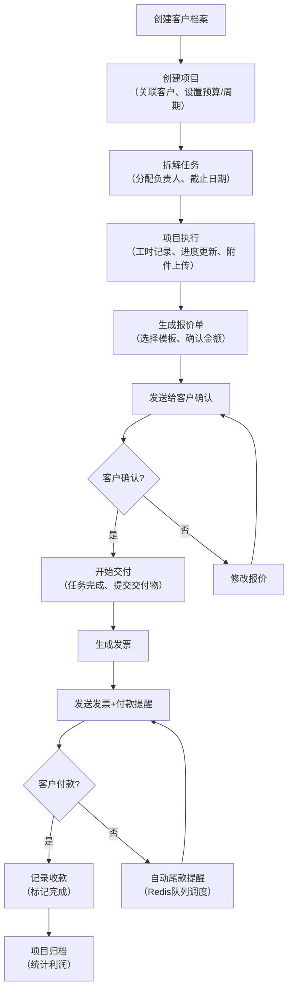
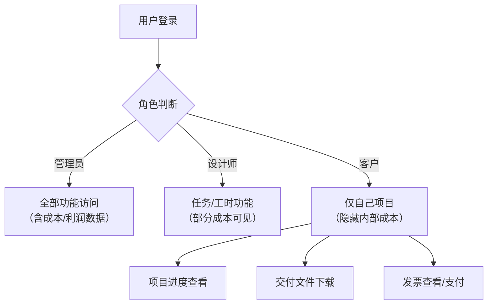

## 1. 产品概述

自由职业项目收款和工时平台，帮助独立设计师/开发者管理多客户项目，整合客户管理、项目跟踪、工时记录、报价开票、收款提醒全流程。

- 解决问题：多项目并行时报价、交付节点、尾款提醒容易遗漏，群消息和表格效率低下
- 目标用户：独立设计师、自由职业者、小型工作室
- 核心价值：项目看板可视化、全流程自动化提醒、收支数据透明化

## 2. 核心功能

### 2.1 用户角色

| 角色 | 注册方式 | 核心权限 |
|------|----------|----------|
| 管理员/平台所有者 | 预设账号 | 全部功能：客户、项目、任务、工时、报价、发票、收款、统计报表 |
| 设计师/成员 | 管理员邀请 | 任务分配、工时记录、项目进度更新 |
| 客户 | 邀请注册 | 仅查看自己项目的交付进度、文件、发票，无法查看内部工时成本 |

### 2.2 功能模块

1. **仪表板**：收入概览、待办任务、最近项目、逾期提醒
2. **客户管理**：客户信息、联系人、关联项目、收款历史
3. **项目看板**：多维度筛选（时间/状态/负责人）、拖拽状态、进度追踪
4. **任务管理**：任务分配、优先级、截止日期、依赖关系、附件
5. **工时记录**：计时器、手动录入、工时统计、成本核算（内部可见）
6. **报价单**：模板管理、项目报价、版本历史、客户确认
7. **发票管理**：发票生成、发送、状态追踪、PDF导出
8. **收款管理**：收款记录、分期管理、尾款提醒、账龄分析
9. **统计报表**：收入趋势、项目利润率、资源利用率、客户价值
10. **附件管理**：项目文件、交付物、版本追踪
11. **审计日志**：状态变更、操作历史、可追溯记录

### 2.3 页面详情

| 页面名称 | 模块名称 | 功能描述 |
|----------|----------|----------|
| 登录页 | 身份认证 | 邮箱密码登录、测试账号快捷登录 |
| 仪表板 | 数据概览 | 本月收入、进行中项目、待开发票、逾期提醒、最近活动 |
| 客户列表 | 客户管理 | 客户列表、搜索筛选、新增/编辑客户、客户详情入口 |
| 客户详情 | 客户信息 | 基本信息、关联项目、收款历史、联系人 |
| 项目看板 | 项目管理 | 看板视图、多维度筛选、拖拽更新状态、项目卡片 |
| 项目详情 | 项目信息 | 基本信息、任务列表、工时统计、附件、活动日志 |
| 任务详情 | 任务管理 | 任务描述、分配、优先级、截止日期、工时、评论、附件 |
| 工时记录 | 工时管理 | 计时器、手动录入、工时列表、按项目/人员统计 |
| 报价单列表 | 报价管理 | 报价单列表、状态筛选、新建报价、模板选择 |
| 报价单详情 | 报价详情 | 报价项目、金额、备注、发送、确认、PDF预览 |
| 发票列表 | 发票管理 | 发票列表、状态筛选、新建发票、关联项目/报价 |
| 发票详情 | 发票详情 | 发票项目、金额、税务、发送、付款提醒、PDF导出 |
| 收款记录 | 收款管理 | 收款列表、新建收款、关联发票、分期记录 |
| 统计报表 | 数据分析 | 收入趋势、项目利润、资源利用率、客户价值排行 |
| 客户视图（客户角色） | 客户门户 | 我的项目、项目进度、交付文件、我的发票 |

## 3. 核心流程

### 主业务流程：项目从创建到收款完成

### 权限控制流程

## 4. 用户界面设计

### 4.1 设计风格

- **设计方向**：专业商务风格，清晰高效，适合长时间使用的管理后台
- **主色调**：深蓝色（#1e3a8a）作为主色，代表专业和信任
- **辅助色**：翡翠绿（#059669）代表成功/已完成，琥珀色（#d97706）代表警告/进行中，红色（#dc2626）代表错误/逾期
- **中性色**：深灰（#1f2937）、中灰（#6b7280）、浅灰（#f3f4f6）、白色（#ffffff）
- **按钮风格**：圆角6px，悬停有轻微阴影和颜色加深，点击有按压反馈
- **字体**：Inter 作为主字体，清晰现代的无衬线字体
- **布局风格**：左侧导航栏 + 顶部工具栏 + 主内容区的经典后台布局，卡片式设计
- **图标风格**：Lucide 图标库，线性风格，统一 20px 尺寸

### 4.2 页面设计概览

| 页面名称 | 模块名称 | UI 元素 |
|----------|----------|---------|
| 登录页 | 登录表单 | 居中卡片布局，品牌 Logo，邮箱/密码输入，测试账号快捷登录按钮 |
| 仪表板 | 数据概览 | 4个统计卡片（收入、项目、待办、逾期），图表区域，最近活动列表 |
| 项目看板 | 看板视图 | 顶部筛选栏（时间/状态/负责人），多列看板（待开始/进行中/已完成/已归档），可拖拽卡片 |
| 客户列表 | 列表视图 | 搜索框，筛选按钮，客户卡片（头像、名称、联系人、项目数、应收金额） |
| 报价单详情 | 详情页 | 两栏布局，左侧报价项目列表，右侧客户信息、状态、操作按钮 |
| 统计报表 | 图表页 | 标签页切换（收入/利润/资源），多种图表类型，时间范围选择器 |

### 4.3 响应式设计

- **桌面优先**：针对 1280px+ 宽度优化，适合办公场景
- **平板适配**：1024px 时侧边栏可收起，内容区自适应
- **移动端**：768px 以下采用底部导航，看板转为列表视图
- **触摸优化**：按钮最小 44px，卡片足够间距便于点击

### 4.4 动画与交互

- 页面加载：内容区域淡入 + 轻微上移
- 看板拖拽：拖拽时阴影加深，放置区域高亮
- 数据更新：数字变化时滚动动画
- 模态框：背景模糊 + 缩放出现
- 按钮/链接：悬停时颜色过渡 150ms
