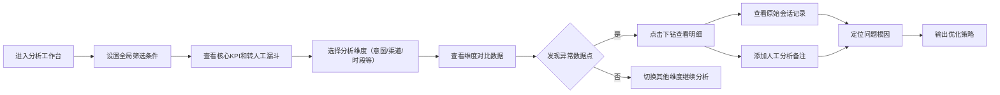

## 1. 产品概述

在线客服机器人转人工率分析运营复盘工作台，为客服产品经理提供多维度数据分析能力，支持下钻、对比和异常标注，驱动机器人体验优化。

- **核心问题**：客服产品经理难以快速定位机器人转人工率高的根因，缺乏多维度交叉分析和异常追踪能力
- **目标用户**：客服产品经理、运营分析师
- **产品价值**：通过数据驱动的复盘，降低转人工率，提升机器人解决率和用户满意度

## 2. 核心功能

### 2.1 用户角色

| 角色 | 登录方式 | 核心权限 |
|------|----------|----------|
| 客服产品经理 | 企业SSO | 查看所有分析维度、添加备注、导出数据 |
| 运营分析师 | 企业SSO | 查看分析数据、筛选对比 |

### 2.2 功能模块

1. **数据概览仪表盘**：核心指标卡片、转人工漏斗、全局筛选器
2. **多维度对比分析**：按意图/渠道/时段/客户等级/版本进行交叉对比
3. **意图热度分析**：意图分布热力图、低样本预警
4. **满意度趋势**：时间序列趋势图、异常点检测
5. **失败问法样例**：转人工会话的典型问法展示
6. **明细表下钻**：点击异常点查看原始会话记录
7. **人工备注系统**：为异常数据点添加分析备注

### 2.3 页面详情

| 页面名称 | 模块名称 | 功能描述 |
|---------|---------|----------|
| 分析工作台 | 全局筛选栏 | 时间范围、渠道、版本、客户等级筛选 |
| 分析工作台 | KPI指标卡 | 会话量、转人工率、满意度、平均轮次等核心指标 |
| 分析工作台 | 转人工漏斗 | 会话接入→机器人识别→转人工→人工处理的转化漏斗 |
| 分析工作台 | 维度选择器 | 切换分析维度：意图/渠道/时段/客户等级/版本 |
| 分析工作台 | 维度对比表 | 按所选维度展示对比数据，支持排序和筛选 |
| 分析工作台 | 意图热度图 | 各意图的会话量和转人工率散点图/热力图 |
| 分析工作台 | 满意度趋势图 | 按时间维度展示满意度变化趋势 |
| 分析工作台 | 失败问法列表 | 展示转人工会话的用户问题和机器人回答样例 |
| 明细弹窗 | 会话明细表 | 展示筛选后的原始会话记录，支持分页 |
| 明细弹窗 | 备注编辑 | 为异常数据点添加人工备注 |

## 3. 核心流程

## 4. 用户界面设计

### 4.1 设计风格

- **主色调**：深蓝色 #1e3a5f（专业、信赖），辅以青色 #0ea5e9（数据可视化）
- **辅助色**：红色 #ef4444（异常预警）、绿色 #10b981（正常指标）、橙色 #f59e0b（警告）
- **字体**：标题使用 Inter SemiBold，正文使用 Inter Regular，数字使用 JetBrains Mono
- **布局风格**：卡片式布局，网格系统，充足留白，层次分明
- **图表风格**：ECharts 极简风格，柔和渐变，清晰的数据标签
- **交互细节**：悬停高亮、平滑过渡、卡片阴影、微动画

### 4.2 页面设计概述

| 页面名称 | 模块名称 | UI元素 |
|---------|---------|--------|
| 分析工作台 | 顶部导航 | Logo、页面标题、用户信息、帮助按钮 |
| 分析工作台 | 筛选栏 | 日期范围选择器、下拉筛选、对比维度切换 |
| 分析工作台 | KPI区域 | 4-6个指标卡片，带环比变化箭头 |
| 分析工作台 | 图表区域 | 左侧漏斗图，右侧维度对比表格 |
| 分析工作台 | 下方图表区 | 三栏布局：意图热度、满意度趋势、失败问法 |
| 明细弹窗 | 弹窗头部 | 标题、关闭按钮、维度筛选条件展示 |
| 明细弹窗 | 表格区域 | 会话明细表，支持列排序 |
| 明细弹窗 | 备注区域 | 备注输入框、保存按钮、历史备注列表 |

### 4.3 响应式

- **设计优先级**：Desktop-first，适配 1440px 及以上分辨率
- **平板适配**：图表区域改为上下布局，表格支持横向滚动
- **交互优化**：点击区域不小于 44px，支持触控操作

### 4.4 特殊设计说明

- **低样本提示**：样本量 &lt; 30 的意图在排序时标记星号，提示"样本量不足，结论仅供参考"
- **异常点高亮**：转人工率高于阈值或满意度低于阈值的数据点用红色边框高亮
- **备注标记**：已添加备注的数据点显示小图标，悬停展示备注摘要
