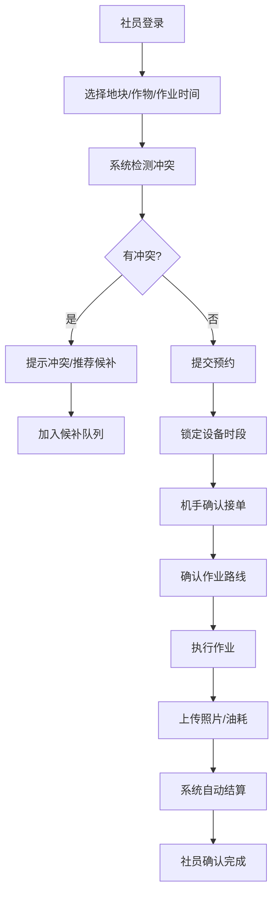

# 农业合作社农机共享平台 - 产品需求文档 (PRD)

## 1. 产品概述

农业合作社农机共享平台是一个面向农业合作社的智能化农机设备管理与调度系统，解决农机设备利用率低、调度效率差、作业跟踪难等问题。通过数字化管理，实现拖拉机、插秧机、无人机等设备的在线预约、路线优化、作业监控和智能结算，提升农业生产效率。

- 目标用户：合作社社员、农机手、平台管理员
- 核心价值：提高农机利用率、降低运营成本、实现作业全流程可追溯

## 2. 核心功能

### 2.1 用户角色

| 角色 | 注册方式 | 核心权限 |
|------|----------|----------|
| 社员 | 合作社审核注册 | 提交作业预约、查看地块地图、查看个人积分、结算确认 |
| 机手 | 合作社认证注册 | 查看预约任务、确认作业路线、上传作业照片和油耗、查看工单 |
| 管理员 | 系统分配 | 设备档案管理、维修工单处理、油耗监控、结算审核、审计日志查看 |

### 2.2 功能模块

1. **登录与权限控制**：角色认证、路由守卫、会话管理
2. **首页仪表盘**：数据概览、待办事项、快捷操作
3. **设备档案管理**：设备列表、设备详情、维护记录、状态监控
4. **地块地图**：GIS地图展示、地块信息、作业历史
5. **预约系统**：预约提交、时间锁定、冲突检测、候补排队
6. **作业执行**：机手接单、路线确认、照片上传、油耗记录
7. **维修工单**：故障上报、工单分配、维修记录、状态跟踪
8. **结算中心**：三种价格体系（社员自用/合作社补贴/跨村租赁）、积分管理、账单明细
9. **系统管理**：审计日志、用户管理、参数配置

### 2.3 页面详情

| 页面名称 | 模块名称 | 功能描述 |
|---------|---------|----------|
| 登录页 | 身份认证 | 角色选择登录、密码重置、记住登录状态 |
| 仪表盘 | 数据概览 | 设备利用率统计、今日预约数、待处理工单、月度收入趋势 |
| 设备列表 | 设备档案 | 设备卡片展示、筛选搜索、状态标签、设备详情入口 |
| 设备详情 | 设备档案 | 基本信息、维护历史、作业记录、油耗统计、故障记录 |
| 地块地图 | GIS地图 | 交互式地图、地块边界绘制、作业区域高亮、地块信息弹窗 |
| 预约列表 | 预约管理 | 预约状态筛选、时间轴展示、冲突提示、操作按钮 |
| 新建预约 | 预约提交 | 地块选择、设备选择、作业类型、时间选择、作物信息、价格预估 |
| 作业执行 | 机手端 | 任务列表、路线导航、照片上传、油耗填写、作业完成确认 |
| 维修工单 | 设备维护 | 工单列表、故障详情、维修进度、配件更换记录 |
| 结算中心 | 财务管理 | 账单列表、价格明细、积分抵扣、结算状态、导出报表 |
| 审计日志 | 系统管理 | 操作日志、登录记录、数据变更历史、筛选查询 |

## 3. 核心流程

### 3.1 预约作业流程

社员登录系统 → 选择地块和作业类型 → 选择设备和时间段 → 系统检测预约冲突 → 提交预约申请 → 系统锁定设备时段 → 机手确认接单 → 规划作业路线 → 执行作业 → 上传作业照片和油耗 → 系统自动结算 → 社员确认

### 3.2 异常处理流程

- **雨天取消**：检测到雨天预警 → 自动取消预约 → 不扣除积分 → 通知相关人员
- **设备故障**：设备上报故障 → 取消相关预约 → 自动重排候补预约 → 创建维修工单
- **预约撤回**：社员申请撤回 → 检查时间窗口 → 释放设备时段 → 候补自动补上

## 4. 用户界面设计

### 4.1 设计风格

- **主色调**：农业绿色系 (#2D6A4F) 作为主色，代表生机与农业
- **辅助色**：土壤棕色 (#774936) 作为辅助色，金黄色 (#D4A373) 作为强调色
- **中性色**：浅灰色背景，深灰色文字，确保良好的可读性
- **按钮风格**：圆角矩形按钮，悬停时有微缩放效果，主按钮使用渐变绿色
- **字体**：标题使用 Noto Serif SC（稳重有力量），正文使用 Noto Sans SC（清晰易读）
- **布局风格**：卡片式布局，左侧导航栏 + 顶部工具栏 + 主内容区
- **图标风格**：线性图标，搭配农业相关元素（麦穗、拖拉机、田地图标）
- **视觉元素**： subtle 的农作物纹理背景，数据可视化使用农业主题配色

### 4.2 页面设计概述

| 页面名称 | 模块名称 | UI元素 |
|---------|---------|--------|
| 登录页 | 认证模块 | 渐变背景、农业主题插画、卡片式登录框、角色选择标签页 |
| 仪表盘 | 数据概览 | 统计卡片网格、趋势图表、待办事项列表、快捷操作按钮组 |
| 设备列表 | 设备档案 | 搜索筛选栏、卡片网格布局、设备状态标签、分页器 |
| 地块地图 | GIS展示 | 全屏地图、侧边栏地块列表、弹窗详情、缩放控制 |
| 预约表单 | 新建预约 | 分步表单、日期时间选择器、设备日历、价格实时计算 |
| 结算中心 | 财务管理 | 标签页切换、账单列表、价格对比表格、积分抵扣滑块 |

### 4.3 响应式

- 桌面端优先设计，采用 12 列网格布局
- 平板端：导航栏折叠为汉堡菜单，卡片自适应排列
- 移动端：单列布局，底部导航栏，触摸优化的按钮尺寸

### 4.4 地图交互

- 使用 Leaflet 实现交互式地块地图
- 地块采用多边形绘制，不同作业状态使用不同颜色填充
- 支持地图缩放、平移、点击查看详情
- 作业路线规划使用虚线展示
