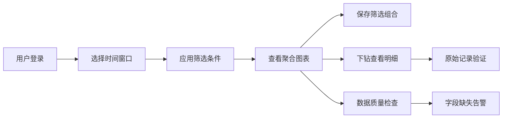

## 1. 产品概述
公共图书馆借阅行为分析仪表盘，为图书馆馆员提供数据驱动的决策支持。整合借书、续借、预约、逾期、读者年龄段和活动参与数据，支持多维度筛选与对比分析。

- 核心目标：将原始借阅数据转化为可探索的可视化仪表盘，辅助图书馆资源优化配置
- 目标用户：图书馆馆员、数据分析人员、馆藏管理团队
- 核心价值：数据可视化探索、少儿数据隐私保护、数据质量可追溯

## 2. 核心功能

### 2.1 用户角色
| 角色 | 登录方式 | 核心权限 |
|------|----------|----------|
| 图书馆馆员 | 系统内置账号 | 查看仪表盘、筛选分析、保存筛选组合、导出数据 |
| 数据管理员 | 管理员账号 | 数据管理、ETL配置、原始记录查看 |

### 2.2 功能模块
1. **仪表盘首页**：核心KPI卡片、主题趋势图、分馆对比图
2. **预约分析页**：预约等待时长、热门预约排行、预约完成率
3. **逾期分析页**：逾期热区图、逾期趋势、读者分组逾期对比
4. **读者分析页**：年龄段分布、活动参与分析、少儿聚合数据
5. **数据质量页**：ETL状态监控、字段完整性检查、原始记录验证

### 2.3 页面详情
| 页面名称 | 模块名称 | 功能描述 |
|----------|----------|----------|
| 仪表盘首页 | KPI指标卡 | 显示总借阅量、活跃读者、预约量、逾期率等核心指标 |
| 仪表盘首页 | 筛选器面板 | 支持按馆藏、读者分组、主题、分馆、月份筛选，可保存常用组合 |
| 仪表盘首页 | 主题趋势图 | 按时间维度展示各主题借阅量变化趋势 |
| 仪表盘首页 | 分馆对比图 | 柱状图对比各分馆的借阅、预约、逾期指标 |
| 预约分析页 | 预约等待分析 | 平均等待时长、等待时长分布直方图 |
| 预约分析页 | 热门预约排行 | 按预约量排序的热门图书列表 |
| 逾期分析页 | 逾期热区图 | 热力图展示各分馆各时间段的逾期分布 |
| 读者分析页 | 年龄段分析 | 各年龄段读者借阅行为对比，少儿数据仅聚合展示 |
| 数据质量页 | ETL状态 | 显示数据更新时间、更新状态、失败告警 |
| 数据质量页 | 原始记录验证 | 支持从聚合数据下钻到原始记录，验证数据可追溯性 |

## 3. 核心流程

## 4. 用户界面设计

### 4.1 设计风格
- 主色调：深蓝 #1e3a5f（专业、可信），辅助色：琥珀 #f59e0b（强调），警告色：红 #ef4444
- 字体：标题使用 Playfair Display（衬线，学术感），正文使用 Source Sans Pro（易读）
- 布局：Tableau风格，左侧筛选面板，右侧网格状图表区域
- 组件：卡片式容器，清晰的边框分隔，数据密集但层次分明

### 4.2 页面设计概览
| 页面名称 | 模块名称 | UI元素 |
|----------|----------|--------|
| 仪表盘首页 | KPI卡片 | 四列网格，每个卡片含数值、趋势箭头、环比百分比 |
| 仪表盘首页 | 筛选面板 | 可折叠侧边栏，多组下拉筛选器，保存/加载按钮 |
| 仪表盘首页 | 图表区域 | 2x2网格布局，支持拖拽调整大小，悬停显示详情 |
| 数据质量页 | 告警面板 | 红色/黄色/绿色状态指示器，清晰的错误信息 |

### 4.3 响应式
- 桌面端优先，适配 1280px 以上分辨率
- 平板端：筛选器移至顶部，图表改为单列堆叠
- 移动端：核心KPI优先展示，图表可横向滚动

### 4.4 数据可视化设计
- 折线图：主题趋势，多条彩色折线，图例可点击切换
- 柱状图：分馆对比，分组柱状图，支持正负值
- 热力图：逾期热区，颜色深浅表示逾期程度
- 直方图：预约等待时长分布
