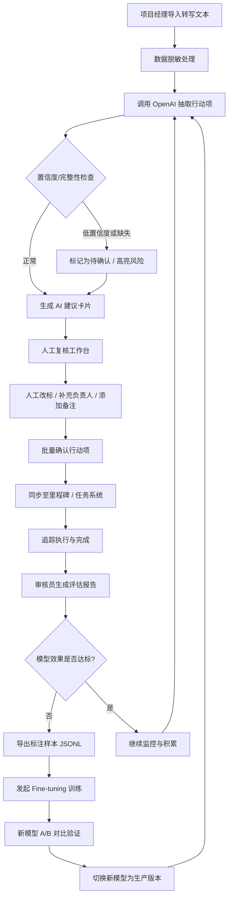

## 1. 产品概述

本系统是基于 AI 的会议纪要行动项提取与管理平台，旨在通过 OpenAI 大模型自动从会议转写文本中抽取行动项、负责人、截止日期、议题及项目里程碑，结合人工复核工作台形成「导入 → 抽取 → 确认 → 同步 → 追踪」的完整闭环，支持反复迭代优化模型质量。

- **解决问题**：传统会议纪要整理依赖人工阅读、手动摘录行动项，费时费力且易遗漏；人工记录的行动项无标准化结构，难以追踪负责人与截止日期
- **目标用户**：项目经理、产品经理、会议组织者、团队负责人、QA/评估工程师
- **核心价值**：将会议纪要整理效率提升 70% 以上，所有行动项可溯源、可追踪、可评估、可迭代

---

## 2. 核心功能

### 2.1 用户角色

| 角色 | 注册方式 | 核心权限 |
|------|---------|----------|
| 普通用户（团队成员） | 后台创建 / 邮箱登录 | 导入转写、查看本人负责的行动项、确认任务 |
| 项目经理 | 后台创建 | 创建会议、批量确认行动项、分配负责人、查看项目里程碑、查看质量报告 |
| 审核员（标注/评估） | 后台创建 | 改标行动项、添加备注、生成评估报告、导出训练样本、触发重新训练 |
| 系统管理员 | 超级管理员创建 | 用户管理、权限分配、API 调用监控、系统配置、数据脱敏规则配置 |

### 2.2 功能模块

1. **工作台首页**：行动项概览、待确认列表、低置信度提示、统计卡片、快捷入口
2. **会议管理页**：会议列表、新建/导入会议、会议详情（转写原文+发言时间轴+议题）
3. **行动项工作台**：AI 建议并排展示、人工改标、备注、证据高亮、批量确认、回滚
4. **项目里程碑页**：里程碑创建、关联行动项、进度追踪、甘特式视图
5. **质量评估中心**：评估报告生成、指标看板（Precision/Recall/F1）、标注数据管理
6. **模型与训练中心**：Fine-tuning 样本导出、训练任务提交、版本管理、A/B 对比
7. **系统后台**：用户/RBAC 权限、数据脱敏规则、API 调用监控日志、速率限制配置

### 2.3 页面详情

| 页面名称 | 模块名称 | 功能描述 |
|---------|---------|----------|
| 工作台首页 | 统计卡片 | 总会议数、待确认行动项、低置信度数、本月完成率 |
| 工作台首页 | 待确认行动项列表 | 按优先级/置信度排序，支持一键跳转改标 |
| 工作台首页 | 风险提示区 | 低置信度、数据缺失、未找到负责人等警告卡片 |
| 工作台首页 | 快捷操作 | 新建会议、批量导入、导出样本 |
| 会议管理页 | 会议列表 | 搜索/筛选、状态标签、操作列（抽取/详情/删除） |
| 会议管理页 | 会议详情-转写区 | 发言人+时间轴展示，支持按证据高亮对应原文片段 |
| 会议管理页 | 会议详情-议题区 | 议题卡片、关联行动项、里程碑标签 |
| 行动项工作台 | AI 建议列 | 模型输出字段+置信度徽章+证据链+缺失字段提示 |
| 行动项工作台 | 人工编辑列 | 字段可编辑下拉/输入框、备注输入框、待确认标记 |
| 行动项工作台 | 批量操作栏 | 全选/批量确认/批量分配负责人/导出 CSV |
| 行动项工作台 | 历史版本抽屉 | 每次变更版本记录+操作人+时间戳+一键回滚 |
| 项目里程碑页 | 里程碑看板 | 按状态列分栏、拖拽排序、里程碑详情弹层 |
| 质量评估中心 | 指标总览 | 各字段抽取准确率、混淆矩阵、错误类型分布 |
| 质量评估中心 | 评估任务 | 新建评估集、人工标注界面、评分历史 |
| 模型与训练中心 | 样本管理 | 筛选导出 JSONL、查看样本详情 |
| 模型与训练中心 | 训练版本 | 版本列表、训练进度、效果对比、一键切换当前模型 |
| 系统后台 | 用户/RBAC | 角色创建、权限勾选矩阵、用户分配角色 |
| 系统后台 | 脱敏规则 | 正则配置、敏感词库、映射查看、测试工具 |
| 系统后台 | 调用监控 | 按时间轴展示 API 调用量/Token 数/失败率、速率限制告警 |

---

## 3. 核心流程

### 3.1 主流程描述

项目经理导入会议转写文本 → 系统自动执行数据脱敏 → 调用 OpenAI API 抽取行动项（含置信度、原文证据、缺失标记）→ 在工作台并排展示 AI 建议与原始转写 → 人工逐项/批量改标、补充负责人、添加备注 → 确认后同步至里程碑任务系统 → 审核员定期基于人工修正结果生成评估报告 → 导出高质量标注数据 → 发起模型重新训练 → 新模型上线后 A/B 验证 → 形成质量闭环迭代。

### 3.2 Mermaid 流程图

---

## 4. 用户界面设计

### 4.1 设计风格

- **主色调**：深海蓝 `#1e3a8a` 作为主色（专业、可信），珊瑚橙 `#f97316` 作为强调色（行动、告警），中性色使用 Slate 灰阶
- **按钮风格**：圆角 `6px`、主按钮带轻微阴影、悬停上浮 1px 过渡、disabled 状态灰化
- **字体**：标题使用「思源黑体 / Noto Sans SC」700 加粗，正文使用 400/500 常规，代码与置信度标签使用等宽字体 `JetBrains Mono`
- **布局风格**：三栏式工作台（左侧导航 + 中间主内容 + 右侧详情/证据抽屉），卡片化信息容器，分层阴影营造立体深度
- **图标风格**：统一使用 Lucide 线性图标，告警类搭配红色圆点徽标，置信度使用色阶徽章（绿→黄→红渐变）

### 4.2 页面设计概览

| 页面名称 | 模块名称 | UI 元素 |
|---------|---------|---------|
| 工作台首页 | 统计卡片 | 渐变色卡片背景 + 大号数字 + 趋势小箭头 |
| 工作台首页 | 风险提示区 | 橙色渐变卡片 + 警告图标 + 「立即处理」主按钮 |
| 工作台首页 | 行动项列表 | 斑马纹表格行 + 置信度胶囊 + 状态标签 |
| 会议管理页 | 时间轴转写 | 左侧发言人头像色块 + 时间戳 + 正文段落（可高亮） |
| 行动项工作台 | 并排双列 | 左列 AI 建议（带置信度徽章/证据链），右列人工编辑 |
| 行动项工作台 | 证据高亮 | 原文对应段落黄色荧光背景 + 点击联动跳转 |
| 行动项工作台 | 历史版本抽屉 | 右侧滑入抽屉 + Diff 差异对比（新增绿色/删除红色） |
| 质量评估中心 | 指标看板 | ECharts 环形图/柱状图 + 热图颜色映射 |
| 系统后台 | 调用监控 | 时间序列折线图 + 告警红点标记 + 速率限制进度条 |

### 4.3 响应式

- **桌面优先**：1440px 以上为标准设计，保证工作台三栏布局充分展示
- **平板适配**：1024px 折叠右侧证据抽屉为可弹出浮层
- **移动适配**：768px 以下单栏堆叠，隐藏部分次要统计，保留核心改标操作
- **触控优化**：移动端按钮最小点击区域 44×44px，表格支持左右滑动

### 4.4 非适用（无 3D 场景）
