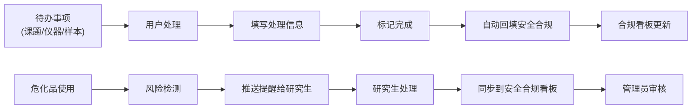

## 1. 产品概述

试剂库存数据登记站是一个面向科研实验室的全栈管理系统，用于管理试剂库存、实验数据归档、安全合规追踪和仪器预约。系统服务于科研人员、研究生和实验室管理员，实现从试剂领用申请到实验数据归档的全流程数字化管理。

核心价值在于通过统一平台整合课题报表、仪器预约、样本去向等待办事项，强化危化品风险管控，并确保所有操作可追溯、可导出，满足安全合规要求。

## 2. 核心功能

### 2.1 用户角色

| 角色 | 描述 | 核心权限 |
|------|------|----------|
| 科研人员/研究生 | 系统主要使用者 | 提交领用申请、查看待办、处理危化风险提醒、查看个人数据 |
| 实验室管理员 | 后台管理者 | 归档实验数据、管理安全合规、导出数据、处理待办审核 |

### 2.2 功能模块

1. **首页待办面板**: 课题报表待办、仪器预约待办、样本去向待办
2. **前台功能**: 试剂领用申请提交、实验数据归档、安全合规数据导出
3. **后台功能**: 实验数据管理、安全合规看板、危化风险提醒处理
4. **通知系统**: 危化风险提醒推送、待办状态更新通知
5. **数据联动**: 待办处理回填安全合规、危化处理同步到看板
6. **响应式展示**: 宽屏表格展示，窄屏卡片展示，状态和负责人字段保留

### 2.3 页面详情

| 页面名称 | 模块名称 | 功能描述 |
|-----------|-------------|---------------------|
| 首页 | 待办事项面板 | 展示三类待办（课题报表、仪器预约、样本去向），点击可处理，处理完成后回填安全合规 |
| 首页 | 快捷入口区 | 领用申请、数据归档、合规导出的快捷入口 |
| 首页 | 危化风险提醒 | 研究生专属提醒区，高亮展示待处理危化风险 |
| 领用申请页 | 申请表单 | 试剂选择、数量填写、用途说明、提交申请 |
| 实验数据归档页 | 归档表单 | 实验记录上传、试剂使用记录、数据关联安全合规 |
| 安全合规页 | 数据列表 | 安全合规记录查询、筛选、导出（CSV/PDF） |
| 后台管理页 | 实验数据管理 | 审核、归档、删除实验数据记录 |
| 后台管理页 | 安全合规看板 | 合规状态总览、风险统计、处理进度追踪 |
| 后台管理页 | 危化风险处理 | 查看风险提醒、审核处理结果、同步到合规看板 |

## 3. 核心流程

### 3.1 试剂领用流程
研究生登录系统 → 首页查看待办 → 进入领用申请 → 选择试剂填写信息 → 提交申请 → 系统自动关联安全合规记录 → 待办状态更新

### 3.2 危化风险处理流程
系统检测到危化品使用异常 → 推送风险提醒给研究生 → 研究生查看并处理 → 填写处理措施 → 提交处理结果 → 系统自动同步到安全合规看板 → 管理员审核确认

### 3.3 待办回填流程
用户处理课题报表/仪器预约/样本去向待办 → 填写处理详情 → 标记完成 → 系统自动创建安全合规记录 → 合规看板数据更新

## 4. 用户界面设计

### 4.1 设计风格
- **主色调**: 深蓝色系 (#0F172A, #1E40AF, #3B82F6)，体现专业、严谨、可信赖的科研氛围
- **辅助色**: 橙红色 (#EA580C) 用于危化风险警示，翠绿色 (#059669) 用于安全状态
- **中性色**: 灰白色系背景，深色文字，确保数据可读性
- **字体**: 标题使用 Space Grotesk，正文使用 Inter，数字等宽字体使用 JetBrains Mono
- **按钮风格**: 圆角 8px，悬停有微妙阴影和色阶变化，禁用状态清晰
- **布局风格**: 卡片式布局，细边框区分模块，留白充足，层次分明
- **图标风格**: Lucide 线性图标，统一 20px 尺寸，配色与功能语义匹配

### 4.2 页面设计概述

| 页面名称 | 模块名称 | UI 元素 |
|-----------|-------------|-------------|
| 首页 | 待办事项面板 | 三栏卡片布局，每类待办独立卡片，显示数量徽章、优先级标识、状态标签 |
| 首页 | 危化风险提醒 | 橙色边框警示卡片，闪烁动画，紧急程度标签，一键处理按钮 |
| 领用申请页 | 申请表单 | 分步表单，试剂选择支持搜索联想，实时库存显示，提交后成功动画 |
| 安全合规页 | 数据表格 | 固定表头可滚动表格，筛选器面板，导出按钮组，行悬停高亮 |
| 后台管理页 | 合规看板 | 数据统计卡片网格，状态分布图例，风险趋势迷你图，处理进度条 |

### 4.3 响应式设计
- **设计原则**: Desktop-first，移动端自适应
- **断点**: 768px 以下切换为移动端布局
- **表格适配**: 宽屏展示完整表格，窄屏（<768px）自动转为卡片列表，每条记录转为独立卡片
- **关键字段保留**: 无论表格还是卡片视图，**状态标签**和**负责人**字段必须始终可见，置于显眼位置
- **触控优化**: 移动端按钮最小 44x44px，卡片间距增大，便于触控操作
- **导航适配**: 桌面端顶部导航栏，移动端底部 Tab 栏 + 汉堡菜单

### 4.4 微交互与动效
- 页面加载：内容区域淡入上滑，首屏骨架屏占位
- 卡片悬停：轻微上浮 + 阴影增强
- 状态变更：状态标签切换时带有缩放过渡动画
- 危化提醒：呼吸灯效果，边框脉动
- 数据导出：进度条动画，完成后文件图标弹跳
