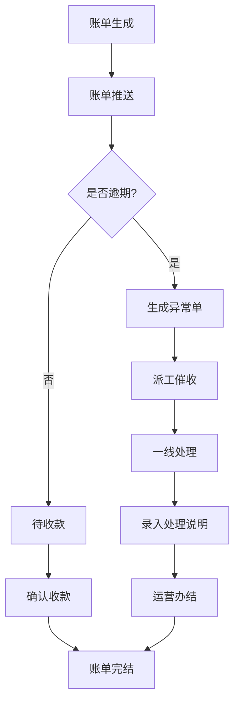
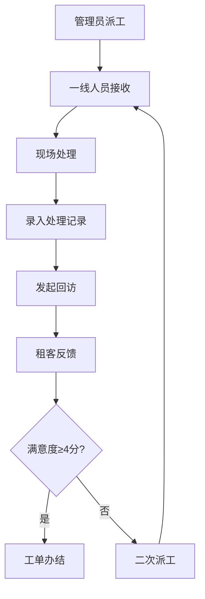
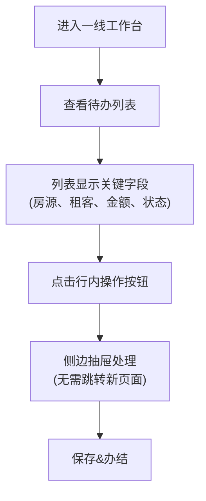

## 1. 产品概述

联合办公房源租后服务中心，为长租公寓运营团队提供一体化的租后管理平台。解决租金收缴、派工回访、业主结算、合同签署等核心业务流程中跳转多、效率低、审计难的问题。

- **目标用户**：财务专员、一线运营人员、管理人员
- **核心价值**：减少页面跳转、关键字段直达、异常自动预警、变更全程可追溯

## 2. 核心功能

### 2.1 用户角色

| 角色 | 注册方式 | 核心权限 |
|------|----------|----------|
| 财务专员 | Clerk 企业认证 | 租约查询、账单管理、收租进度、业主结算、合同签署、异常单处理 |
| 一线人员 | Clerk 企业认证 | 派工接收、租客回访、运营办结、现场处理说明录入 |
| 管理员 | Clerk 企业认证 | 派工分配、人员管理、权限配置、审计查询、数据统计 |

### 2.2 功能模块

1. **仪表盘**：租金逾期预警、待办任务统计、收租进度概览
2. **租约管理**：租约查询、租约详情、关键字段快速筛选
3. **账单管理**：账单列表、账单详情、租金逾期异常单生成
4. **派工管理**：派工列表、派工分配、派工状态追踪
5. **租客回访**：回访记录、回访模板、满意度统计
6. **业主结算**：结算单生成、结算记录、对账明细
7. **合同签署**：待签合同列表、签署状态、合同归档
8. **变更记录**：字段级变更追踪、审计查询、操作日志
9. **系统设置**：角色权限、数据字典、通知配置

### 2.3 页面详情

| 页面名称 | 模块名称 | 功能描述 |
|---------|---------|----------|
| 仪表盘 | 数据概览 | 租金逾期预警卡片、待办任务列表、收租进度趋势图 |
| 租约列表 | 租约查询 | 多条件筛选（房源、租客、状态）、关键字段直达详情、导出功能 |
| 租约详情 | 租约信息 | 租约基本信息、账单流水、派工记录、变更历史一体化展示 |
| 账单列表 | 账单管理 | 按条件检索到具体记录、批量操作、逾期自动标记、异常单生成 |
| 账单详情 | 账单信息 | 收款记录、逾期计算、异常单关联、操作记录 |
| 派工列表 | 派工管理 | 派工分配、状态流转、优先级标记、关键字段显示 |
| 派工详情 | 派工信息 | 处理记录、图片上传、回访关联、办结说明 |
| 业主结算 | 结算管理 | 结算单列表、生成结算、对账明细、少跳转流程 |
| 合同签署 | 合同管理 | 待签列表、签署入口、合同预览、签署状态追踪 |
| 变更记录 | 审计追踪 | 按字段查询、变更前后对比、操作人筛选、时间范围 |

## 3. 核心流程

### 3.1 租金收缴流程

### 3.2 派工回访流程

### 3.3 一线人员少跳转流程

## 4. 用户界面设计

### 4.1 设计风格

- **主色调**：深邃藏青 `#1E3A5F` - 体现财务专业感和信任感
- **辅助色**：活力橙 `#F97316` - 用于预警、逾期、重要操作
- **成功色**：翠绿 `#059669` - 已收款、已办结
- **警告色**：琥珀 `#D97706` - 待处理、进行中
- **中性色**：冷灰系列 `#F8FAFC, #F1F5F9, #E2E8F0, #94A3B8, #475569, #0F172A`
- **按钮风格**：4px 微圆角，悬停阴影反馈，主要操作使用实心按钮
- **字体**：展示字体使用 Inter，数字使用 JetBrains Mono 增强可读性
- **布局风格**：侧边导航 + 顶部状态栏 + 内容区卡片式布局
- **图标风格**：Lucide 线性图标，保持统一 20px 尺寸

### 4.2 页面设计概述

| 页面名称 | 模块名称 | UI 元素 |
|---------|---------|----------|
| 仪表盘 | 数据概览 | 卡片网格布局、渐变统计卡片、趋势折线图、逾期警告列表 |
| 租约列表 | 租约查询 | 顶部筛选栏、数据表格（关键字段高亮）、行内操作按钮、分页 |
| 租约详情 | 租约信息 | 标签页布局（基本信息/账单/派工/变更）、关键信息置顶卡片 |
| 账单列表 | 账单管理 | 高级筛选面板、状态标签、逾期行高亮、批量操作工具栏 |
| 业主结算 | 结算管理 | 左右分栏布局（左侧列表/右侧详情）、快速结算按钮 |
| 合同签署 | 合同管理 | 卡片式列表、签署状态进度条、预览弹窗 |
| 变更记录 | 审计追踪 | 筛选表单、变更对比视图、时间轴展示 |
| 一线工作台 | 待办中心 | 紧凑列表布局、行内关键字段、抽屉式处理面板 |

### 4.3 交互特性

- **少跳转设计**：
  - 列表行内展示关键字段（房源、租客、金额、到期日）
  - 点击行内操作按钮弹出侧边抽屉，保留列表上下文
  - 常用操作（收款、派工、办结）在当前页面完成
- **状态可视化**：
  - 租金逾期天数以渐变色标签显示（1-7天黄色，8-30天橙色，30+天红色）
  - 派工状态使用进度条和图标双重标识
- **搜索体验**：
  - 支持拼音首字母快速搜索
  - 搜索历史记录
  - 多条件组合筛选的条件记忆

### 4.4 响应式

- **桌面端优先**：针对 1920×1080 及以上分辨率优化
- **平板适配**：侧边栏可折叠，表格支持横向滚动
- **移动端**：卡片式列表展示，底部导航栏，优化触控区域
- **触控优化**：按钮最小高度 44px，行高适当增加

## 5. 数据安全与审计

### 5.1 字段级变更记录

所有核心实体的关键字段变更都需要记录：
- 租约：租金、租期、押金、租客信息
- 账单：应收金额、实收金额、到账日期、状态
- 派工：处理人、状态、优先级

### 5.2 审计查询

支持按以下条件检索变更记录：
- 操作人、操作时间范围
- 变更字段名、变更前后值
- 业务实体类型和 ID
