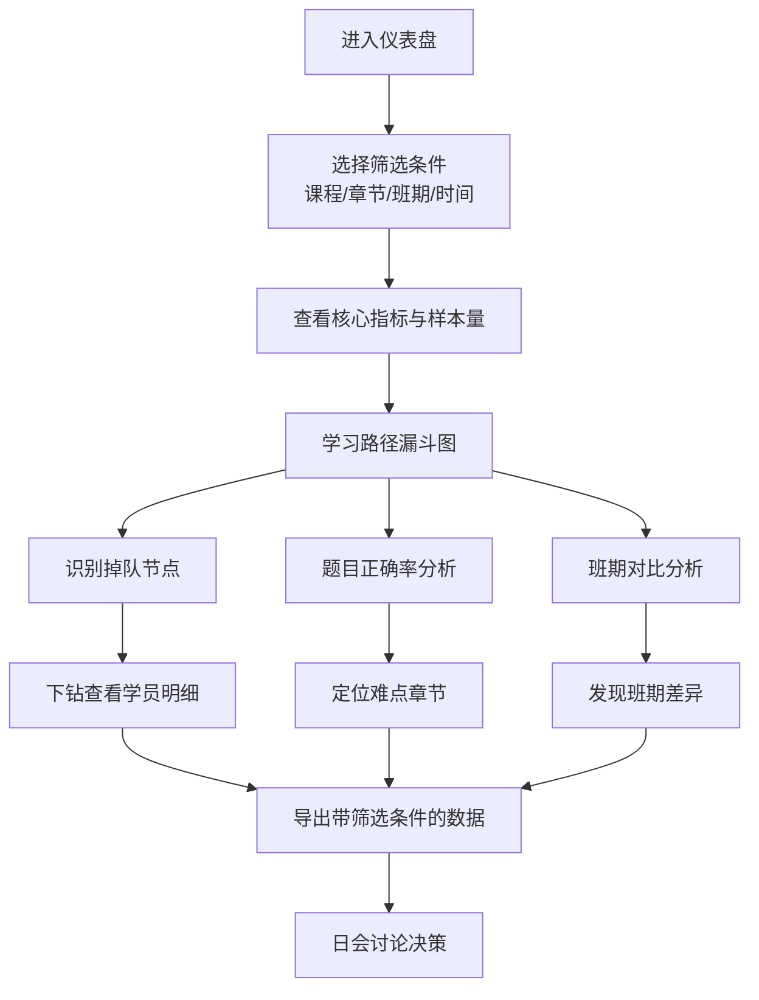

## 1. 产品概述
在线课程学习路径可视化仪表盘，帮助课程运营人员从多维度分析学员学习行为数据，识别掉队节点，对比班期表现，支持日会决策讨论。解决目前仅靠 Excel 总数无法解释数据变化原因的问题。

- **核心目标**：将学习行为数据转化为可交互、可下钻、可追溯的可视化分析工具
- **目标用户**：课程运营人员、教学管理人员
- **核心价值**：提升运营决策效率，快速定位学习路径问题，支持数据驱动的教学优化

## 2. 核心功能

### 2.1 用户角色
| 角色 | 登录方式 | 核心权限 |
|------|----------|----------|
| 运营人员 | 账号登录 | 查看仪表盘、筛选分析、保存视图、导出数据 |
| 管理员 | 账号登录 | 所有运营权限 + 用户管理 + 数据源配置 |

### 2.2 功能模块
1. **筛选器面板**：课程、章节、学员、班期、题目、时间窗口多维度筛选
2. **学习路径图**：可视化展示从视频观看→作业提交→测验→讨论→证书的完整路径转化
3. **掉队节点分析**：识别各环节流失率高的节点，支持下钻查看具体学员
4. **题目正确率分析**：按章节、知识点展示题目正确率，识别难点
5. **班期对比面板**：多班期横向对比核心指标，识别差异
6. **数据导出**：带筛选条件导出，确保结论可追溯
7. **视图管理**：保存常用筛选视图，日会快速调用

### 2.3 页面详情
| 页面名称 | 模块名称 | 功能描述 |
|-----------|-------------|---------------------|
| 仪表盘首页 | 筛选器面板 | 课程、章节、学员、班期、题目、时间窗口筛选，实时联动 |
| 仪表盘首页 | 核心指标卡片 | 完成率、参与率、平均时长、证书获取率等KPI，带样本量提示 |
| 仪表盘首页 | 学习路径漏斗图 | 展示各环节转化人数与转化率，标注掉队节点 |
| 仪表盘首页 | 掉队节点详情 | 点击漏斗节点下钻查看具体掉队学员列表与原因 |
| 仪表盘首页 | 题目正确率趋势 | 按章节/知识点展示正确率分布，支持异常点高亮 |
| 仪表盘首页 | 班期对比图表 | 多班期核心指标对比，支持选中高亮 |
| 仪表盘首页 | 时间窗口切换 | 日/周/月/自定义时间范围切换 |
| 视图管理 | 保存视图 | 将当前筛选条件保存为命名视图 |
| 视图管理 | 视图列表 | 快速切换已保存的视图 |
| 数据导出 | 导出面板 | 预览筛选条件，导出CSV/Excel，导出文件包含筛选元数据 |
| 数据明细 | 可追溯明细 | 点击图表数据点查看原始明细数据，支持缺失值标注 |

## 3. 核心流程

### 3.1 主分析流程
运营人员进入仪表盘 → 选择/保存筛选视图 → 查看学习路径整体转化 → 识别掉队节点 → 下钻查看具体学员 → 分析题目正确率 → 班期横向对比 → 导出带筛选条件的数据 → 日会讨论决策

### 3.2 关键业务规则
- **首次完成率计算**：补课学员不重复计入，仅统计首次完成的学员
- **导出规则**：导出文件必须包含筛选条件元数据，防止图表结论被误读
- **缺失值处理**：数据缺失时明确标注，不做隐式填充
- **异常点检测**：自动标注入完成率异常高/低的数据点

## 4. 用户界面设计

### 4.1 设计风格
- **设计调性**：专业、数据驱动、简洁高效的企业级仪表盘风格
- **主色调**：深蓝 #165DFF（专业可信）+ 翠绿 #00B42A（完成/通过）+ 珊瑚红 #F53F3F（掉队/异常）
- **辅助色**：浅灰 #F2F3F5（背景）+ 中灰 #86909C（次要文字）
- **按钮风格**：圆角 6px，简洁扁平化，主按钮实色填充，次按钮描边
- **字体**：展示字体用 Inter SemiBold，正文字体用 Inter Regular，等宽数据用 JetBrains Mono
- **布局风格**：侧边筛选栏 + 主内容卡片式网格布局，信息密度适中
- **图标风格**：Ant Design 风格线性图标，简洁统一

### 4.2 页面设计概览
| 页面名称 | 模块名称 | UI 元素 |
|-----------|-------------|----------|
| 仪表盘首页 | 顶部导航 | Logo、视图切换、时间窗口、导出按钮、用户头像 |
| 仪表盘首页 | 左侧筛选栏 | 可折叠筛选面板，多维度筛选器级联 |
| 仪表盘首页 | 核心指标区 | 4-6 个 KPI 卡片，带趋势箭头和样本量角标 |
| 仪表盘首页 | 学习路径区 | 横向漏斗图，节点可点击，掉队节点红色高亮 |
| 仪表盘首页 | 正确率分析区 | 分组柱状图 + 折线图组合，支持hover详情 |
| 仪表盘首页 | 班期对比区 | 雷达图 + 分组柱状图，支持多选对比 |
| 数据明细 | 抽屉面板 | 右侧滑出，展示原始数据表格，支持排序搜索 |

### 4.3 响应式设计
- **桌面优先**：以 1440px 宽度为基准设计，适配 1280px-1920px
- **平板适配**：筛选栏收起为顶部下拉，网格布局自动调整列数
- **触摸优化**：按钮最小点击区域 44px，图表支持手指缩放

### 4.4 动效设计
- 页面加载：卡片 staggered 渐入（延迟 50ms 递增）
- 筛选变化：图表数据平滑过渡动画（300ms ease-out）
- 节点高亮：掉队节点呼吸动画，吸引注意力
- 抽屉滑入：右侧滑入 + 背景遮罩淡入（200ms）
