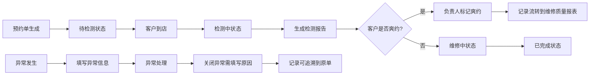

## 1. 产品概述
汽车保养客户回访台 - 面向汽车售后服务团队的日常维保预约与客户关系管理工具，解决线索分配、客户回访、维修质量追踪等核心业务痛点。
- 目标用户：售后服务顾问、维修主管、线索分配专员
- 核心价值：提升客户回厂率、规范服务流程、实现维修质量全链路追溯

## 2. 核心功能

### 2.1 用户角色
| 角色 | 注册方式 | 核心权限 |
|------|----------|----------|
| 前台接待 | 系统分配账号 | 查看检测项目、登记预约、处理异常 |
| 售后顾问 | 系统分配账号 | 线索分配、客户回访、查看维修质量 |
| 维修主管 | 系统分配账号 | 维修质量报表、规则配置、全数据查看 |
| 系统管理员 | 系统分配账号 | 基础配置管理、账号管理 |

### 2.2 功能模块
1. **首页仪表盘**：今日待办、异常记录、快捷入口
2. **前台工作台**：检测项目查看、预约登记
3. **线索管理**：线索列表、线索分配
4. **回访管理**：回访任务、回访记录
5. **维修质量**：按状态展示、质量报表、流转记录
6. **基础配置**：车辆档案、检测模板、配件报价、规则管理

### 2.3 页面详情
| 页面名称 | 模块名称 | 功能描述 |
|----------|----------|----------|
| 首页仪表盘 | 今日待办 | 展示今日待回访、待分配、待处理异常的数量和列表 |
| 首页仪表盘 | 异常记录 | 展示未关闭异常，支持快速关闭并填写原因 |
| 前台工作台 | 检测项目 | 查看各检测模板项目及标准，关联车辆档案 |
| 线索管理 | 线索分配 | 展示未分配线索，支持批量分配给售后顾问 |
| 回访管理 | 回访任务 | 按顾问展示待回访客户，记录回访结果 |
| 维修质量 | 状态展示 | 按待检测、检测中、已完成、异常等状态分类展示 |
| 维修质量 | 质量报表 | 展示流转记录、爽约处理记录、异常处理记录 |
| 基础配置 | 车辆档案 | 车辆信息CRUD，关联车主信息 |
| 基础配置 | 检测模板 | 检测项目模板CRUD，支持配置检测项和标准 |
| 基础配置 | 配件报价 | 配件信息及报价CRUD |
| 基础配置 | 规则管理 | 规则启停配置，显示生效时间 |

## 3. 核心流程

### 3.1 线索分配与回访流程

### 3.2 维修质量追踪流程

## 4. 用户界面设计

### 4.1 设计风格
- 主色调：专业蓝色系 (#165DFF)，辅以沉稳深灰 (#1D2129)，突出工具属性
- 强调色：橙色 (#FF7D00) 用于异常提醒，绿色 (#00B42A) 用于完成状态
- 按钮风格：直角轻微圆角 (4px)，扁平化设计，突出功能导向
- 字体：思源黑体 - 清晰易读的无衬线字体，适合长时间办公使用
- 布局风格：左侧导航 + 顶部状态栏 + 主内容区，典型的企业级后台布局
- 图标风格：线性简洁图标，使用 Ant Design Vue 图标库

### 4.2 页面设计概览
| 页面名称 | 模块名称 | UI 元素 |
|----------|----------|---------|
| 首页仪表盘 | 今日待办 | 数据卡片、待办列表、快速操作按钮、状态标签 |
| 首页仪表盘 | 异常记录 | 异常列表、优先级标识、关闭弹窗、原因输入框 |
| 前台工作台 | 检测项目 | 分类标签页、检测项表格、标准说明、关联车辆信息 |
| 线索管理 | 线索分配 | 线索卡片、批量选择、分配下拉框、分配历史记录 |
| 维修质量 | 状态展示 | 状态标签页 (Tab)、状态流转时间线、操作按钮 |
| 维修质量 | 质量报表 | 图表统计、流转记录列表、爽约标记追溯 |
| 基础配置 | 规则管理 | 开关按钮、生效时间显示、启停记录时间轴 |

### 4.3 响应式设计
- 桌面优先设计，支持 1280px 及以上分辨率
- 左侧导航可折叠，适配不同屏幕宽度
- 表格支持水平滚动，适配小屏显示
- 移动端适配：简化导航，优化表单输入体验

### 4.4 交互设计
- 页面加载：骨架屏 + 淡入动画
- 数据操作：操作反馈 Toast、确认弹窗
- 状态变化：平滑过渡动画，高亮提示
- 表单交互：实时校验，错误提示
- 异常处理：强提醒弹窗，必填原因验证
