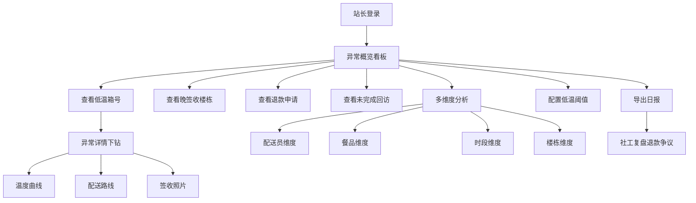

## 1. 产品概述

社区养老餐配送温度与准时率看板系统，为站长提供配送质量监控与数据分析平台。通过实时监控低温箱号、晚签收楼栋、退款申请和未完成回访等异常指标，支持多维度下钻分析，帮助站长快速定位问题、优化配送路线、提升服务质量。

- 目标用户：社区养老餐配送站长、运营人员、社工
- 核心价值：温度透明化、配送准时化、异常可追溯、争议可复盘

## 2. 核心功能

### 2.1 用户角色

| 角色 | 登录方式 | 核心权限 |
|------|----------|----------|
| 站长 | 账号密码登录 | 查看所有看板、配置阈值、导出日报、处理异常 |
| 社工 | 账号密码登录 | 查看异常详情、处理退款申请、完成回访 |

### 2.2 功能模块

1. **异常概览看板**：低温箱号列表、晚签收楼栋、退款申请、未完成回访
2. **多维度分析**：配送员维度、餐品维度、时段维度、楼栋维度
3. **异常下钻**：箱号详情、配送路线、签收照片、温度曲线
4. **配置管理**：低温阈值配置、采样规则配置
5. **数据导出**：带筛选条件的日报导出

### 2.3 页面详情

| 页面名称 | 模块名称 | 功能描述 |
|----------|----------|----------|
| 异常概览页 | 顶部筛选栏 | 日期选择、配送员筛选、餐品筛选、楼栋筛选 |
| 异常概览页 | 核心指标卡片 | 低温箱数、晚签收数、退款申请数、未完成回访数 |
| 异常概览页 | 低温箱号列表 | 箱号、最低温度、采样次数、状态（待复核/已确认）、操作 |
| 异常概览页 | 晚签收楼栋排行 | 楼栋名称、晚签收次数、平均延迟、准时率 |
| 异常概览页 | 退款申请列表 | 申请人、原因、金额、状态、操作 |
| 异常概览页 | 未完成回访列表 | 用户、配送日期、回访状态、操作 |
| 多维度分析页 | 维度切换标签 | 配送员、餐品、时段、楼栋 |
| 多维度分析页 | 配送员维度 | 配送员排名、准时率、低温次数、完成单量 |
| 多维度分析页 | 餐品维度 | 各餐品温度分布、低温发生率 |
| 多维度分析页 | 时段维度 | 各时段准时率、温度趋势 |
| 多维度分析页 | 楼栋维度 | 楼栋热力图、各楼栋指标对比 |
| 异常详情页 | 基本信息 | 箱号、配送员、餐品、配送日期 |
| 异常详情页 | 温度曲线 | ECharts 温度折线图、阈值线标记 |
| 异常详情页 | 配送路线 | 地图轨迹展示、各节点时间 |
| 异常详情页 | 签收照片 | 签收现场照片查看 |
| 配置页 | 阈值配置 | 低温阈值设置、采样次数要求 |
| 日报导出 | 导出设置 | 筛选条件确认、导出格式选择 |

## 3. 核心流程

站长登录系统后，首先进入异常概览页面，查看当日核心异常指标。点击低温箱号可进入详情页，查看温度曲线和配送路线；也可切换至多维度分析页面，从不同角度分析配送质量。发现问题后可配置阈值或导出日报，便于社工团队复盘退款争议。

## 4. 用户界面设计

### 4.1 设计风格

- **主色调**：医疗蓝 (#1E88E5)，代表专业、可靠、温暖
- **辅助色**：警告橙 (#FF9800)、危险红 (#F44336)、成功绿 (#4CAF50)
- **背景色**：浅灰蓝渐变背景，营造洁净专业的氛围
- **按钮风格**：圆角 8px，轻微阴影，hover 有轻微上浮效果
- **字体**：标题使用 Noto Sans SC Bold，正文使用 Noto Sans SC Regular
- **布局风格**：卡片式布局，清晰的信息层级，适当的留白
- **图标风格**：线性图标，统一 24px 尺寸，与主色调保持一致

### 4.2 页面设计概览

| 页面名称 | 模块名称 | UI 元素 |
|----------|----------|---------|
| 异常概览页 | 核心指标卡片 | 渐变背景卡片、大字号数字、趋势箭头、图标装饰 |
| 异常概览页 | 数据表格 | 斑马纹、hover 高亮、状态标签（待复核/已确认） |
| 异常概览页 | 排行榜 | 排名徽章、进度条、对比柱状图 |
| 多维度分析页 | 维度标签 | 下划线切换、活跃态高亮、平滑过渡动画 |
| 多维度分析页 | ECharts 图表 | 统一配色、Tooltip 自定义、数据标签 |
| 异常详情页 | 温度曲线 | 阈值参考线、异常点标记、区域渐变填充 |
| 异常详情页 | 图片预览 | 灯箱效果、左右切换、放大缩小 |

### 4.3 响应式

- Desktop-first 设计，优先适配 1440px 及以上大屏
- 平板端 (1024px)：侧边栏收起，表格支持横向滚动
- 移动端 (768px)：卡片堆叠布局，简化数据展示

### 4.4 交互细节

- 页面加载：卡片依次淡入，带轻微延迟的 staggered 动画
- 数据刷新：骨架屏占位，内容加载后平滑过渡
- 表格行 hover：背景色变化，右侧操作按钮渐显
- 模态框：背景模糊，从底部滑入的动画效果
- 温度曲线：鼠标悬停显示十字准星和详细数据点
