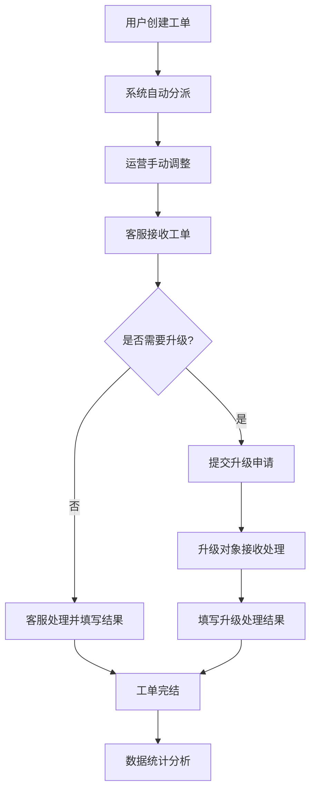

## 1. 产品概述

电商售后工单中心，为电商企业提供一站式售后工单管理解决方案，整合客服工单处理、知识检索、会话质检、数据统计等核心功能。

- 解决痛点：工单分派混乱、升级依赖人工记忆、数据重复导出、售后知识分散、处理时效无监控
- 目标用户：售后经理、运营人员、客服人员
- 产品价值：提升售后处理效率30%，降低工单升级遗漏率100%，统一数据出口减少重复劳动

## 2. 核心功能

### 2.1 用户角色

| 角色 | 登录方式 | 核心权限 |
|------|----------|----------|
| 售后经理 | 账号密码登录 | 知识库搜索、教程查阅、知识命中查询、查看统计报表 |
| 运营人员 | 账号密码登录 | 工单分派、优先级设置、工单筛选导出、质检管理、改进动作追踪 |
| 客服人员 | 账号密码登录 | 处理分配工单、添加备注、填写处理结果、查看个人待办 |
| 系统管理员 | 账号密码登录 | 用户管理、角色权限配置、系统参数设置 |

### 2.2 功能模块

1. **首屏仪表盘**：待办工单入口、异常工单入口、报表统计入口
2. **工单管理中心**：工单列表、工单详情、分派、优先级设置、升级处理
3. **售后知识库**：答案搜索、教程查阅、查询记录、命中提醒
4. **运营管理中心**：客服工单筛选、会话质检入口、改进动作追踪、数据导出去重
5. **统计报表**：响应时长统计、处理结果分析、工单趋势报表

### 2.3 页面详情

| 页面名称 | 模块名称 | 功能描述 |
|----------|----------|----------|
| 首屏仪表盘 | 待办工单卡片 | 展示个人待办数、紧急工单、即将超时工单，点击进入工单列表 |
| 首屏仪表盘 | 异常工单卡片 | 展示超时未处理、升级未响应、重复投诉工单，快速定位问题 |
| 首屏仪表盘 | 报表入口卡片 | 展示今日/本周/本月核心指标，点击进入详细报表 |
| 工单列表页 | 筛选区域 | 多条件组合筛选（状态、优先级、时间、客服、类型等） |
| 工单列表页 | 批量操作 | 批量分派、批量调整优先级、批量导出（去重校验） |
| 工单详情页 | 工单信息 | 展示工单基本信息、用户信息、商品信息 |
| 工单详情页 | 处理记录 | 完整的处理轨迹、备注记录、升级历史 |
| 工单详情页 | 升级处理 | 升级原因、升级对象、响应时长自动计时、处理结果录入 |
| 工单详情页 | 时长统计 | 首次响应时长、平均处理时长、总耗时自动计算展示 |
| 知识库搜索页 | 搜索区域 | 关键词搜索、分类筛选、热门推荐 |
| 知识库搜索页 | 结果展示 | 答案列表、关联教程、命中次数展示 |
| 知识库搜索页 | 查询记录 | 保留历史查询、自动关联命中答案、提醒设置 |
| 运营管理页 | 客服工单筛选 | 按客服、时间、处理结果筛选，支持导出 |
| 运营管理页 | 会话质检入口 | 关联工单会话记录、质检评分入口 |
| 运营管理页 | 改进动作追踪 | 问题改进项跟踪、责任人、进度、完成状态 |
| 统计报表页 | 时长统计 | 平均响应时长、首次响应时长、各环节耗时分布 |
| 统计报表页 | 结果分析 | 处理结果占比、解决率、复发率 |
| 统计报表页 | 趋势分析 | 工单量趋势、升级率趋势、满意度趋势 |

## 3. 核心流程

### 3.1 工单处理主流程

用户创建工单 → 系统自动分派/运营手动分派 → 客服接收处理 → 需升级时提交升级申请 → 升级对象接收并处理 → 填写处理结果 → 工单完结 → 数据统计

### 3.2 售后经理知识检索流程

售后经理输入问题 → 系统检索知识库 → 展示匹配答案和教程 → 记录查询和命中结果 → 可设置后续更新提醒 → 点击查看详细内容

### 3.3 运营数据导出流程

运营选择筛选条件 → 系统校验是否已导出过该条件数据 → 提示重复导出风险 → 确认后生成导出文件 → 记录导出历史防止重复

## 4. 用户界面设计

### 4.1 设计风格

- **主色调**：专业深蓝 (#1E40AF)，传递稳重可靠的企业级产品气质
- **辅助色**：警示橙 (#F97316) 用于异常和紧急状态，成功绿 (#10B981) 用于已完成状态
- **中性色**：深灰 (#1F2937) 用于正文，中灰 (#6B7280) 用于辅助文字，浅灰 (#F3F4F6) 用于背景
- **按钮风格**：圆角 6px，悬停有微妙阴影和颜色加深，点击有按压反馈
- **字体**：标题使用 "Noto Sans SC" 700 加粗，正文使用 "Noto Sans SC" 400 常规，数字使用等宽字体
- **布局风格**：左侧导航 + 顶部操作栏 + 内容卡片区，清晰的信息层级
- **图标风格**：使用 lucide-react 线性图标，保持统一的 20px 尺寸

### 4.2 页面设计概览

| 页面名称 | 模块名称 | UI 元素 |
|----------|----------|----------|
| 首屏仪表盘 | 三大入口卡片 | 大图标 + 数字指标 + 趋势箭头 + 渐变背景色，悬停有上浮动画 |
| 首屏仪表盘 | 快捷操作区 | 圆形图标按钮组，支持一键创建工单、快速搜索 |
| 工单列表页 | 数据表格 | 斑马纹行，悬停高亮，支持列宽调整，固定表头 |
| 工单详情页 | 时间线 | 垂直时间线展示处理轨迹，不同状态用不同颜色圆点标记 |
| 工单详情页 | 时长统计卡片 | 带图标的数值卡片，关键指标用大号字体和颜色强调 |
| 知识库搜索页 | 搜索框 | 大尺寸居中搜索框，带热门标签快捷输入 |
| 知识库搜索页 | 结果卡片 | 卡片式布局，展示标题、摘要、命中次数、匹配度 |
| 运营管理页 | 分类标签页 | Tab 切换三个入口：客服工单 / 会话质检 / 改进动作 |
| 统计报表页 | 图表区 | ECharts 折线图、柱状图、饼图组合，支持时间范围切换 |

### 4.3 响应式设计

- 采用桌面优先设计，最小支持 1280px 宽度
- 侧边栏在 1024px 以下自动收起为图标模式
- 表格在小屏幕下支持横向滚动
- 优化触控操作，按钮最小点击区域 44x44px

### 4.4 动效设计

- 页面加载：骨架屏占位，内容渐入加载
- 卡片悬停：微妙上浮 + 阴影加深
- 数据更新：数字滚动动画，突出变化
- 状态变更：平滑过渡动画，避免突兀跳转
- 通知提醒：右上角滑入，带有轻微弹跳效果
