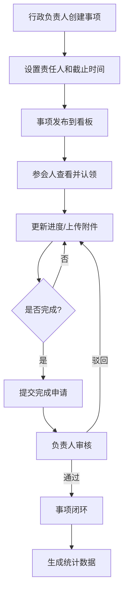

## 1. 产品概述

周会事项状态看板系统是一款面向企业行政团队的协同管理工具，帮助行政负责人高效跟踪周会待办事项的执行进度，实现事项认领、进度更新、附件管理和统计分析的全流程数字化。

- 解决周会事项跟踪效率低、责任不清、延期失控等问题
- 目标用户：行政负责人、部门主管、参会人员
- 核心价值：提升事项闭环率，实现透明化管理，留存操作审计痕迹

## 2. 核心功能

### 2.1 用户角色

| 角色 | 注册方式 | 核心权限 |
|------|----------|----------|
| 管理员 | 管理员后台创建 | 系统配置、用户管理、催办规则设置、查看所有部门数据 |
| 部门主管 | 管理员创建 | 查看本部门事项、审批事项、配置本部门催办规则 |
| 普通用户 | 管理员创建 | 认领待办、更新进度、上传附件、发表评论 |

### 2.2 功能模块

1. **看板首页**：事项状态看板、筛选过滤、快速搜索
2. **事项详情页**：进度更新、附件上传、评论记录、操作日志
3. **统计分析页**：部门闭环率、延期事项列表、趋势图表
4. **后台配置页**：用户管理、部门管理、催办规则配置
5. **登录页**：身份认证、权限校验

### 2.3 页面详情

| 页面名称 | 模块名称 | 功能描述 |
|----------|----------|----------|
| 看板首页 | 状态看板 | 按待办/进行中/已完成/已延期四象限展示事项卡片 |
| 看板首页 | 筛选栏 | 按部门、责任人、截止时间、优先级筛选 |
| 看板首页 | 快速操作 | 一键认领、批量分配、导出报表 |
| 事项详情页 | 进度面板 | 进度百分比更新、状态流转、备注说明 |
| 事项详情页 | 附件管理 | 多文件上传、版本历史、下载预览 |
| 事项详情页 | 评论区 | 实时评论、@提及、时间线展示 |
| 事项详情页 | 操作日志 | 完整记录所有操作：操作人、时间、动作、变更内容 |
| 统计分析页 | 部门统计 | 各部门闭环率排名、延期事项数量 |
| 统计分析页 | 延期列表 | 按部门查看所有延期事项及超期天数 |
| 后台配置页 | 用户管理 | 用户增删改、角色分配、部门归属 |
| 后台配置页 | 催办规则 | 配置提前提醒天数、重复催办频率、通知渠道 |
| 后台配置页 | 事项模板 | 预设周会事项模板、自定义字段配置 |

## 3. 核心流程

### 3.1 主业务流程

行政负责人创建周会事项 → 分配责任人和截止时间 → 参会人认领事项 → 定期更新进度并上传附件 → 完成后提交审核 → 负责人确认闭环

### 3.2 催办流程

系统检测临近截止事项 → 自动发送催办通知 → 用户收到提醒 → 更新进度或说明原因 → 记录催办日志

## 4. 用户界面设计

### 4.1 设计风格

- **主色调**：深海蓝 (#0F3460) 作为主色，搭配琥珀橙 (#E94560) 作为警示色，薄荷绿 (#21BF73) 作为成功色
- **按钮风格**：圆角 6px，轻微悬浮效果，点击反馈
- **字体**：标题使用 "Noto Sans SC" Bold，正文使用 "Noto Sans SC" Regular
- **布局风格**：卡片式布局，顶部导航 + 侧边栏 + 主内容区
- **图标风格**：使用 Lucide React 线性图标，统一 18px 尺寸

### 4.2 页面设计概述

| 页面名称 | 模块名称 | UI 元素 |
|----------|----------|----------|
| 看板首页 | 状态看板 | 拖拽式卡片、状态徽章、进度条、悬停预览 |
| 看板首页 | 筛选栏 | 下拉选择器、日期范围、搜索框、重置按钮 |
| 事项详情页 | 时间线 | 垂直时间线、头像、状态图标、渐变连接线 |
| 事项详情页 | 附件列表 | 文件图标缩略图、版本标签、上传进度动画 |
| 统计分析页 | 数据图表 | 柱状图（闭环率）、饼图（状态分布）、趋势折线图 |
| 统计分析页 | 延期列表 | 红色高亮行、超期天数徽章、优先级标识 |
| 后台配置页 | 规则配置 | 开关组件、滑块、时间选择器、测试发送按钮 |

### 4.3 响应式设计

- 桌面端（≥1280px）：侧边栏展开 + 四列看板布局
- 平板端（768px-1279px）：侧边栏收起 + 两列看板布局
- 移动端（<768px）：底部导航 + 单列流式布局，触摸优化

## 5. 数据与审计要求

### 5.1 数据关联

所有待办事项、附件版本、评论记录必须关联到同一条主记录，确保：
- 可追溯每个事项的完整处理历史
- 明确显示谁在何时做了什么操作
- 附件缺失的操作必须记录日志

### 5.2 操作日志

- 记录所有状态变更、附件上传/删除、评论发表
- 特殊记录：附件缺失时的操作（如标记完成但无附件）
- 日志不可删除、不可修改，仅管理员可查看
