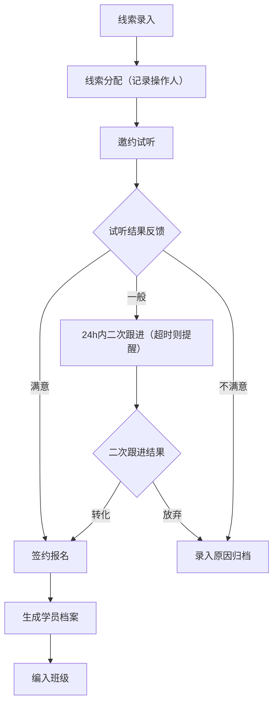
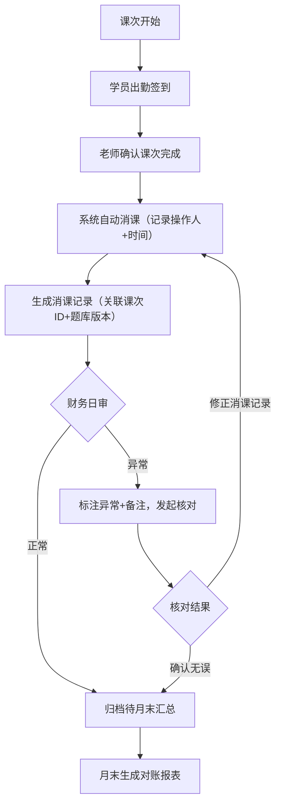

## 1. 产品概述

排课消课台是艺考培训行业的校区级运营管理后台，面向校区校长及管理层，整合招生转化、教学管理、家校沟通、财务对账四大核心场景。通过打通一线教学数据（班级/作品反馈）、管理流程数据（线索/试听跟进）和运营数据（消课/续费/对账），解决校区数据分散、跟进遗漏、对账溯源难的痛点，实现校区运营全链路数字化管理。

- 核心价值：消除数据孤岛，降低教务沟通成本，提前识别续费风险，提升跨部门对账效率
- 目标用户：校区校长、教务主管、教学主管、财务人员

## 2. 核心功能

### 2.1 用户角色

| 角色 | 注册方式 | 核心权限 |
|------|----------|----------|
| 校区校长 | Clerk 邀请注册 | 全部模块可见，数据报表导出，续费风险分析，跨部门对账 |
| 教务主管 | Clerk 邀请注册 | 线索跟进、试听安排、排课管理、提醒配置 |
| 教学主管 | Clerk 邀请注册 | 班级课表、作品反馈、消课记录、题库版本管理 |
| 财务人员 | Clerk 邀请注册 | 消课对账、原始记录追溯、批量导出 |

### 2.2 功能模块

1. **仪表盘首页**：核心指标卡、续费风险预警列表、试听未跟进提醒、今日待办
2. **招生转化管理**：线索列表/详情/跟进记录、试听课排期/结果反馈、转化漏斗分析
3. **教学一线台**：班级列表与课表、作品提交与反馈记录、消课记录查询
4. **家校反馈中心**：反馈消息提醒、反馈历史追溯、未读提醒配置
5. **跨部门对账台**：消课记录对账、班级课表溯源、题库版本追踪、操作日志审计
6. **报表复盘中心**：月度转化报表、续费风险报表、批量下载中心、操作人记录
7. **系统设置**：校区信息、员工管理、角色权限、提醒规则配置

### 2.3 页面详情

| 页面名称 | 模块名称 | 功能描述 |
|----------|----------|----------|
| 仪表盘 | 核心指标卡 | 展示本月线索数、试听数、转化率、消课时、续费预警数等 KPI，支持时间范围切换 |
| 仪表盘 | 续费风险列表 | 按风险等级（高/中/低）展示临近续费的学员，显示剩余课时、跟进状态、历史续费情况 |
| 仪表盘 | 试听未跟进提醒 | 红色角标展示超过 24 小时未跟进的试听记录，一键分配教务跟进 |
| 仪表盘 | 今日待办 | 聚合今日需跟进线索、待反馈作品、待确认消课记录，点击跳转对应页面 |
| 线索管理 | 线索列表 | 分页展示线索来源/等级/状态，支持按来源、意向专业、跟进人、时间范围筛选 |
| 线索管理 | 线索详情 | 展示基础信息、跟进时间线、试听记录、标签管理，支持添加跟进备注 |
| 线索管理 | 批量操作 | 支持批量分配跟进人、批量标记状态、批量导出（记录操作人/时间） |
| 试听管理 | 试听排期 | 日历视图展示试听课安排，支持拖拽调课，冲突检测 |
| 试听管理 | 结果反馈 | 记录试听满意度、家长反馈、意向等级，关联后续转化动作 |
| 教学一线台 | 班级列表 | 展示全部班级（进行中/已结课），显示专业方向、人数、剩余课时、任课老师 |
| 教学一线台 | 班级课表 | 周/月视图切换，支持点击课次查看消课状态、学员出勤、任课老师备注 |
| 教学一线台 | 作品反馈 | 作品提交列表，支持分维度评分（构图/色彩/创意），评语记录，历史版本对比 |
| 家校反馈中心 | 消息中心 | 按时间倒序展示家校反馈消息，已读/未读状态，支持按家长、学员、班级筛选 |
| 家校反馈中心 | 历史追溯 | 展示完整反馈历史（含回复），支持按时间、类型筛选，导出 PDF |
| 跨部门对账台 | 消课记录 | 按日期/班级/学员多维查询消课记录，支持追溯原始课次、操作人、备注 |
| 跨部门对账台 | 题库版本 | 记录各班级使用的教学题库版本号、启用时间、变更记录，支持对比差异 |
| 跨部门对账台 | 操作日志 | 全量操作审计（新增/修改/删除/导出），记录操作人、IP、时间、前后数据快照 |
| 报表复盘中心 | 月度报表 | 线索转化率、试听到课率、消课时分布、续费率，支持同比环比 |
| 报表复盘中心 | 续费风险报表 | 风险学员名单、预警原因、跟进状态、建议动作，月底复盘专用视图 |
| 报表复盘中心 | 批量下载 | 所有导出任务列表，记录文件名、操作人、导出时间、状态，支持重新下载 |
| 系统设置 | 校区基础信息 | 校区名称、地址、联系方式、Logo 配置 |
| 系统设置 | 员工管理 | 员工列表、角色分配、Clerk 账号关联、离职冻结 |
| 系统设置 | 提醒规则 | 试听未跟进提醒时效、续费预警天数、家校反馈超时提醒时间 |

## 3. 核心流程

### 3.1 招生转化流程

市场活动/转介绍产生线索 → 教务分配线索 → 电话邀约试听 → 排定试听课 → 家长带学员试听 → 老师反馈试听结果 → 教务跟进转化 → 签订合同/报名 → 进入班级教学

### 3.2 消课与对账流程

学员到课出勤 → 老师标记课次完成 → 系统自动扣除对应课时 → 生成消课记录 → 财务日结对账 → 追溯原始课次/出勤记录 → 异常标注（课时不足、消课冲突） → 月末汇总报表

### 3.3 续费风险识别流程

系统按规则扫描学员剩余课时 → 低于预警阈值标记风险 → 推送提醒给教务/校长 → 教务介入跟进 → 跟进结果回填 → 月度风险报表汇总 → 月底复盘分析

## 4. 用户界面设计

### 4.1 设计风格

艺考培训行业属性偏专业、严谨但又不失艺术感。整体采用 **"专业机构 + 艺术质感"** 融合风格：

- **主色调**：深海蓝 `#1E3A5F`（信任/专业），搭配墨金 `#B8860B`（质感/艺术）作为高亮色
- **辅助色**：警示红 `#E53935`（风险/未跟进）、成功绿 `#43A047`（已转化/消课正常）、提醒橙 `#FB8C00`（待跟进/预警）
- **背景**：主背景为浅灰蓝 `#F5F7FA`，卡片背景纯白 `#FFFFFF`，顶部导航条用深海蓝渐变
- **按钮风格**：圆角 6px，主按钮采用深海蓝填充+白色文字，悬停时墨金描边过渡；次要按钮为白底+深蓝描边
- **字体**：标题用 `Noto Serif SC`（宋体衬线，体现专业稳重），正文用 `Inter`（无衬线，提升可读性），数据 KPI 用 `JetBrains Mono`（等宽数字，便于对比）
- **布局风格**：三栏式后台布局（左侧导航折叠、顶部状态栏、主内容区），卡片式模块组织，关键数据模块加墨金细线点缀
- **图标**：统一使用 `lucide-react` 线性图标，KPI 卡图标加墨金描边圆环

### 4.2 页面设计概览

| 页面名称 | 模块名称 | UI 元素 |
|----------|----------|----------|
| 仪表盘 | 核心指标卡 | 大字号数字 + 同比环比小标签 + 墨金细描边图标 + 渐入动画（stagger 0.05s） |
| 仪表盘 | 风险预警卡 | 左侧竖条色带区分风险等级，hover 卡片上浮 2px + 阴影加深 |
| 招生线索 | 筛选器 | 横向排列常用筛选标签（可折叠高级筛选），筛选条件已选态带墨金底色 |
| 招生线索 | 数据表格 | 斑马行纹，状态用彩色圆角 chip，操作列悬停显示更多按钮 |
| 教学一线台 | 课表日历 | 课次色块按班级配色区分，点击展开详情抽屉，消课完成带绿色对勾角标 |
| 教学一线台 | 作品反馈 | 左侧缩略图瀑布流，右侧评分雷达图 + 评语编辑器，支持分维度打分 |
| 对账台 | 追溯视图 | 时间线式追溯链，每条记录右侧展开箭头显示操作人+IP+数据快照 |
| 报表中心 | 下载中心 | 任务列表带进度条，完成项带下载按钮，记录操作人时间戳 |
| 通用组件 | Toast 提醒 | 顶部滑入式通知，未跟进提醒持续显示不自动消失，需手动关闭 |
| 通用组件 | 审批弹窗 | 深色遮罩 + 白色卡片，操作区固定底部，双按钮确认/取消 |

### 4.3 响应式

桌面优先设计（1440px 基准），适配以下断点：
- `≥ 1280px`：三栏完整布局，左侧导航展开
- `768px - 1279px`：左侧导航折叠为图标栏，内容区自适应
- `< 768px`：底部 Tab 导航，卡片单列堆叠，表格横向滚动

### 4.4 动效细节

- 页面首次加载：主内容区模块按从左到右、从上到下顺序 stagger 渐入（`opacity 0 → 1, translateY 8px → 0`）
- 数据筛选：筛选条件变更后，表格行整体轻微透明度变化（0.5s 过渡）
- 风险提醒：高风险卡片边框呼吸灯效果（`box-shadow` 1s 呼吸循环）
- 课表月份切换：左右滑动过渡，旧月向左滑出，新月从右滑入
