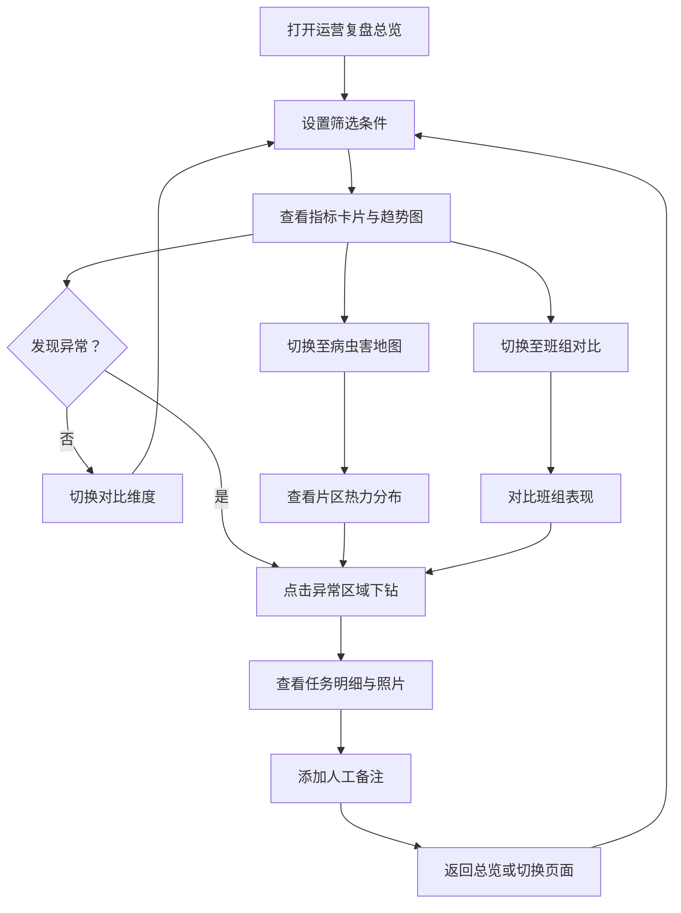

## 1. 产品概述

城市绿化养护运营复盘工作台，面向园林养护主管，通过多维度对比分析养护任务（浇水、修剪、病虫害防治、巡检拍照）与天气数据，快速发现异常并下钻至明细记录，支持人工备注和雨天自动延期区分，实现养护运营的数据驱动复盘与持续改进。

- 目标用户：城市园林养护主管、片区负责人
- 核心价值：将散落在各片区的养护记录与天气数据聚合对比，自动识别异常逾期，减少人工排查成本

## 2. 核心功能

### 2.1 用户角色

| 角色 | 权限 |
|------|------|
| 园林养护主管 | 全量查看所有片区数据、对比分析、写备注、导出 |
| 片区负责人 | 查看本片区数据、写备注 |

### 2.2 功能模块

1. **运营复盘总览页**：全局筛选面板、任务完成趋势图、天气关联图、关键指标卡片
2. **病虫害地图页**：片区级病虫害热力地图、虫害类型分布、时间趋势
3. **班组对比页**：班组任务完成率对比、逾期率对比、工时效率对比
4. **明细下钻页**：任务明细表、巡检照片、人工备注编辑、延期原因区分

### 2.3 页面详情

| 页面名称 | 模块名称 | 功能描述 |
|----------|----------|----------|
| 运营复盘总览 | 全局筛选面板 | 按片区、植物类型、任务类型、班组、日期范围筛选 |
| 运营复盘总览 | 关键指标卡片 | 总任务数、完成率、逾期率（区分雨天延期/人工逾期）、病虫害事件数 |
| 运营复盘总览 | 任务完成趋势 | ECharts 折线图，按日/周/月聚合，支持多班组叠加对比 |
| 运营复盘总览 | 天气关联图 | ECharts 双轴图：降雨量 vs 逾期率，标注雨天延期区间 |
| 病虫害地图 | 片区热力地图 | ECharts 地图/散点图，按片区着色显示病虫害严重度 |
| 病虫害地图 | 虫害类型分布 | ECharts 饼图/旭日图，展示病虫害分类及占比 |
| 病虫害地图 | 时间趋势 | ECharts 折线图，展示病虫害报告数随时间变化 |
| 班组对比 | 完成率雷达图 | ECharts 雷达图，多维度对比各班组表现 |
| 班组对比 | 逾期率柱状图 | ECharts 分组柱状图，区分雨天延期和人工逾期 |
| 班组对比 | 工时效率散点图 | ECharts 散点图，任务量 vs 完成时长 |
| 明细下钻 | 任务明细表 | 可排序、可筛选的数据表，展示每条养护记录详情 |
| 明细下钻 | 巡检照片缩略图 | 明细行展开查看巡检照片 |
| 明细下钻 | 人工备注 | 点击异常行弹出备注编辑弹窗，支持保存历史备注 |
| 明细下钻 | 延期原因标签 | 雨天自动延期（蓝色标签）vs 人工逾期（红色标签）区分显示 |

## 3. 核心流程

用户打开运营复盘总览页 → 选择筛选条件（片区/植物类型/任务类型/班组/日期）→ 查看趋势图与指标卡片 → 发现异常点（如某片区病虫害激增）→ 点击异常区域下钻至明细表 → 查看具体任务记录与巡检照片 → 为异常记录添加人工备注 → 返回总览页继续分析

## 4. 用户界面设计

### 4.1 设计风格

- **主色调**：深林绿 `#1B4332` + 活力草绿 `#40916C` + 暖阳橙 `#E76F51`（异常警示）
- **辅色**：天蓝 `#219EBC`（雨天延期标识）、炭灰 `#2D3436`（文字）
- **背景**：`#F8F9FA` 浅灰白，卡片白底 + 微阴影
- **字体**：标题用 `Noto Serif SC`（典雅衬线），正文用 `Noto Sans SC`
- **布局**：左侧固定筛选面板（240px）+ 右侧内容区，顶部导航标签页切换
- **圆角**：卡片 8px 圆角，按钮 6px 圆角
- **图标**：Lucide Icons

### 4.2 页面设计概览

| 页面名称 | 模块名称 | UI 元素 |
|----------|----------|---------|
| 运营复盘总览 | 筛选面板 | 固定左侧栏，下拉多选、日期范围选择器、重置按钮 |
| 运营复盘总览 | 指标卡片 | 4列卡片网格，数字突出，趋势箭头，微动画 |
| 运营复盘总览 | 趋势图 | ECharts 折线图，悬浮 tooltip，可点击下钻 |
| 运营复盘总览 | 天气关联 | ECharts 双轴图，降雨量柱+逾期率线，雨天区间半透明遮罩 |
| 病虫害地图 | 热力地图 | ECharts 散点地图，圆点大小=严重度，颜色=类型 |
| 病虫害地图 | 分布图 | ECharts 环形图，悬浮显示详情 |
| 班组对比 | 雷达图 | ECharts 雷达图，多边形填充半透明 |
| 班组对比 | 柱状图 | ECharts 分组柱状图，蓝/红双色区分延期类型 |
| 明细下钻 | 数据表 | 斑马纹表格，行悬浮高亮，延期标签色彩编码 |
| 明细下钻 | 备注弹窗 | 居中弹窗，文本域+保存按钮，历史备注时间线 |

### 4.3 响应式

桌面优先设计，左侧筛选面板在平板以下折叠为顶部下拉抽屉，图表自适应容器宽度，明细表支持横向滚动。

### 4.4 口径说明

- **完成率** = 按时完成数 / 总任务数（不含雨天延期）
- **逾期率** = 逾期数 / 总任务数，其中逾期分为「雨天自动延期」和「人工逾期」
- **雨天自动延期判定**：任务计划执行日降雨量 ≥ 10mm，系统自动标记延期，不计入人工逾期
- **病虫害严重度** = 片区病虫害报告数 / 片区养护面积（亩）
- **班组工时效率** = 完成任务数 / 班组总工时（人天）
