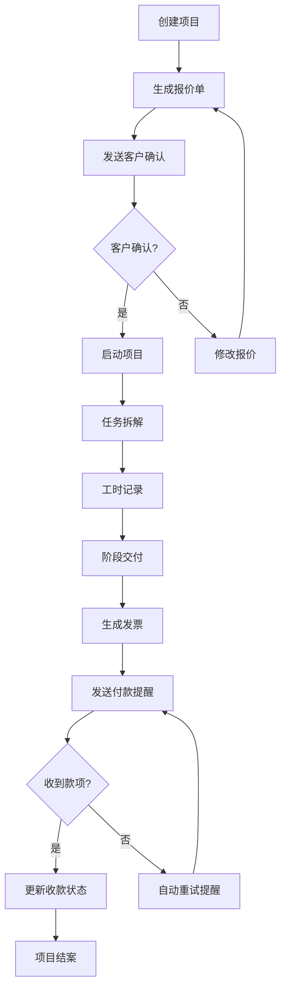

## 1. 产品概述

自由职业项目收款与工时管理平台，帮助独立设计师和自由职业者统一管理客户、项目、任务、工时、报价单、发票和收款流程，解决多项目并行时报价遗忘、交付节点混乱、尾款催收不及时等痛点。

- **目标用户**：独立设计师、自由职业者、小型工作室
- **核心价值**：一个系统搞定从报价到收款的全流程，移动端优先适配现场作业场景

## 2. 核心功能

### 2.1 用户角色

| 角色 | 注册方式 | 核心权限 |
|------|----------|----------|
| 管理员/设计师 | 邮箱/手机号注册 | 全部功能：项目看板、工时记录、报价模板、发票开具、收款管理、收入统计、客户管理、系统配置 |
| 客户 | 邀请链接注册 | 仅查看自己项目的交付进度、文件下载、确认报价和发票，不可见内部工时成本 |

### 2.2 功能模块

1. **项目看板**：拖拽式看板管理项目阶段，状态流转可视化
2. **工时记录**：计时器、手动录入、批量导入，支持移动端离线记录
3. **报价管理**：报价模板库、在线报价生成、客户确认、版本追溯
4. **发票收款**：发票生成、付款提醒、多渠道收款记录、尾款自动催收
5. **收入统计**：月度/年度收入报表、项目利润率分析、客户贡献排名
6. **客户门户**：客户独立登录入口，查看专属项目进度和文件
7. **移动端适配**：扫码识别、拍照上传附件、离线数据缓存、网络恢复后自动补提交
8. **操作审计**：所有关键操作记录人和时间，支持历史回溯

### 2.3 页面详情

| 页面名称 | 模块名称 | 功能描述 |
|----------|----------|----------|
| 登录/注册 | 身份认证 | 邮箱/手机号登录、客户邀请注册、密码重置 |
| 仪表盘 | 数据概览 | 今日待办、进行中项目数、待收款金额、本月工时统计 |
| 项目看板 | 看板视图 | 拖拽式状态流转、快速筛选、搜索、批量操作 |
| 项目详情 | 信息管理 | 基本信息、任务列表、工时汇总、附件管理、操作日志 |
| 工时记录 | 计时面板 | 实时计时器、手动录入、历史记录、按项目/日期筛选 |
| 报价列表 | 报价管理 | 报价单列表、状态筛选、新建报价、导出PDF |
| 报价编辑 | 报价生成 | 模板选择、项目明细、自动计算、客户邮件发送 |
| 发票列表 | 发票管理 | 发票生成、付款状态、发送记录、催款提醒 |
| 收款记录 | 收款管理 | 收款登记、分期记录、尾款提醒、对账明细 |
| 收入统计 | 报表中心 | 收入趋势图、项目盈利分析、客户价值排名、导出Excel |
| 客户列表 | 客户管理 | 客户信息、联系人、关联项目、发送邀请 |
| 客户门户 | 客户视图 | 我的项目、进度查看、文件下载、报价确认 |
| 系统设置 | 配置管理 | 报价模板、通知设置、个人信息、团队管理 |

## 3. 核心流程

### 3.1 项目全流程
设计师创建项目 → 制定报价单 → 发送给客户确认 → 客户确认后启动项目 → 任务拆解与工时记录 → 阶段交付与验收 → 生成发票 → 发送付款提醒 → 收款登记 → 项目结案

### 3.2 工时记录流程
移动端打开计时器 → 选择项目/任务 → 开始计时 → 网络断开时本地缓存 → 网络恢复后自动同步 → 管理员后台校验确认

### 3.3 付款提醒流程
设置付款节点 → 系统自动检测到期日 → 提前N天发送提醒 → 未付款自动重试（最多3次） → 人工介入标记 → 收款后关闭提醒

## 4. 用户界面设计

### 4.1 设计风格
- **主色调**：深海蓝 (#1e3a5f)，传达专业、可信赖的品牌感
- **辅助色**：暖橙色 (#f59e0b) 用于强调和提醒，翠绿 (#10b981) 用于成功状态，玫红 (#ef4444) 用于警告和错误
- **中性色**：从纯白到深灰的12级灰度体系，确保信息层级清晰
- **按钮风格**：圆角8px，悬停有微阴影和色阶变化，点击有按压反馈
- **字体**：标题使用 "Space Grotesk" 现代无衬线字体，正文使用 "Inter" 确保可读性
- **布局风格**：卡片式布局，清晰的视觉分区，大量留白减少认知负担
- **图标风格**：线性风格图标，统一2px描边，配合品牌色调

### 4.2 页面设计概述

| 页面名称 | 模块名称 | UI 元素 |
|----------|----------|---------|
| 仪表盘 | 数据概览 | 大数字卡片、趋势迷你图、待办事项列表、快捷操作按钮 |
| 项目看板 | 看板视图 | 可拖拽列、卡片缩略信息、状态标签、快速筛选栏、搜索框 |
| 工时记录 | 计时面板 | 大尺寸计时器、项目选择器、备注输入、开始/暂停/完成按钮 |
| 报价编辑 | 表单布局 | 分段式表单、动态行添加、实时计算总价、模板选择下拉 |
| 收入统计 | 图表展示 | 面积图趋势、柱状图对比、数据表格、筛选器组 |
| 客户门户 | 简约视图 | 项目卡片、进度条、文件列表、确认按钮 |

### 4.3 响应式设计
- **桌面端**：1280px+，侧边导航 + 主内容区，多列布局
- **平板端**：768px-1279px，折叠式侧边栏，自适应列数
- **移动端**：320px-767px，底部Tab导航，单列布局，大点击区域，表单元素占满宽度
- **触摸优化**：最小44x44px点击区域，滑动手势支持，关键操作防误触确认

### 4.4 交互动效
- 页面加载：元素错落淡入（staggered fade-in）
- 看板拖拽：吸附效果 + 位置占位动画
- 按钮点击：scale(0.98) 微缩放反馈
- 状态变更：颜色渐变过渡 + 轻量toast提示
- 数据加载：骨架屏占位，内容渐进式呈现
