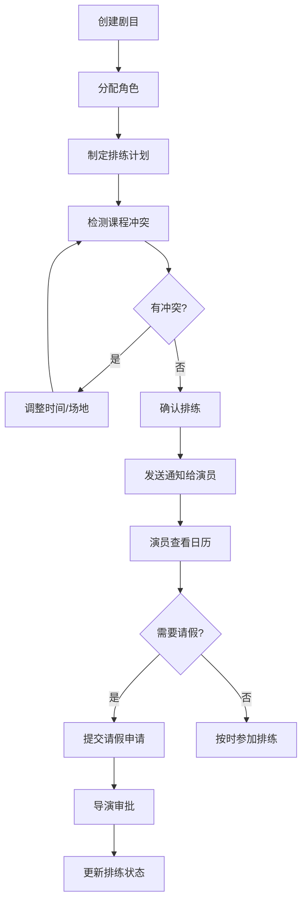
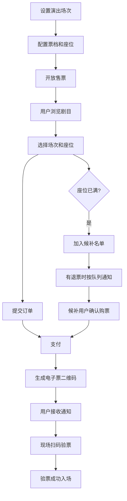
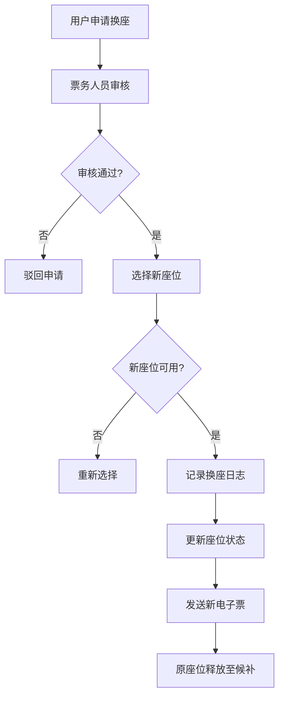

# 校园戏剧社排练和票务管理系统 - 产品需求文档 (PRD)

## 1. 产品概述

校园戏剧社排练和票务管理系统是专为校园戏剧社团设计的内部长期使用的管理系统，解决每学期多剧目排练协调、小剧场票务管理、人员调度和财务记录等核心问题。

- 解决问题：排练场地冲突、演员课程冲突、临时请假协调、票务座位管理、财务记录混乱
- 目标用户：社团干事、导演、演员、票务人员、普通观众
- 核心价值：提升社团运营效率，实现全流程数字化管理

## 2. 核心功能

### 2.1 用户角色与权限

| 角色 | 注册方式 | 核心权限 |
|------|----------|----------|
| 超级管理员 | 系统初始化 | 全部权限、用户管理、系统配置 |
| 社团干事 | 管理员邀请 | 剧目管理、排练调度、票务审核、财务记录 |
| 导演 | 管理员邀请 | 角色分配、排练计划、请假审批 |
| 演员 | 自主注册/邀请 | 查看排练、请假申请、角色信息 |
| 票务人员 | 管理员邀请 | 售票、验票、换座处理 |
| 普通用户 | 自主注册 | 浏览剧目、在线选座购票、查看订单 |

### 2.2 功能模块

1. **用户认证与权限**：登录注册、RBAC 权限控制、个人中心
2. **剧目管理**：剧目信息、角色管理、审核流程
3. **排练管理**：排练场地、排练计划、日历视图、课程冲突检测、请假管理
4. **票务系统**：票档管理、在线选座、候补名单、换座记录、扫码验票
5. **财务管理**：收入记录、支出记录、收支统计、报表导出
6. **消息通知**：排练提醒、票务通知、请假审批通知、系统公告
7. **后台管理**：数据统计、报表导出、操作日志、系统配置
8. **移动端**：响应式表单、扫码、拍照上传、离线缓存补提交

### 2.3 页面详情

| 页面名称 | 模块名称 | 功能描述 |
|----------|----------|----------|
| 登录页 | 认证模块 | 账号密码登录、记住登录、忘记密码 |
| 首页/仪表盘 | 数据概览 | 今日排练、待售演出、收支统计、待办事项 |
| 剧目列表 | 剧目管理 | 剧目查询、新增剧目、状态筛选、剧目详情入口 |
| 剧目详情 | 剧目管理 | 剧目信息、角色列表、排练计划、票务设置 |
| 角色管理 | 剧目管理 | 角色列表、角色分配、演员信息 |
| 排练日历 | 排练管理 | 月/周/日视图、冲突标记、新增排练、排练详情 |
| 场地管理 | 排练管理 | 场地列表、场地预约、使用记录 |
| 请假管理 | 排练管理 | 请假申请、请假审批、请假记录 |
| 选座购票 | 票务系统 | 座位图、票档选择、确认订单、在线支付 |
| 订单管理 | 票务系统 | 订单列表、订单详情、退票、换座 |
| 扫码验票 | 票务系统 | 二维码扫描、验票状态、手动输入 |
| 候补名单 | 票务系统 | 候补队列、候补转正式、通知发送 |
| 财务记录 | 财务管理 | 收入列表、支出列表、新增记录、分类统计 |
| 报表中心 | 财务管理 | 多维度筛选、报表预览、导出 Excel/PDF |
| 用户管理 | 后台管理 | 用户列表、角色分配、权限设置 |
| 消息中心 | 通知模块 | 消息列表、已读未读、消息详情 |
| 个人中心 | 用户模块 | 个人信息、修改密码、我的订单、我的排练 |

## 3. 核心业务流程

### 3.1 排练调度流程

### 3.2 票务销售流程

### 3.3 换座流程

## 4. 用户界面设计

### 4.1 设计风格

- **设计主题**：戏剧艺术感与现代简约结合，采用剧场红与幕布黑为主色调
- **主色调**：深酒红 #8B0000 (剧场幕布感)
- **辅助色**：金色 #D4AF37 (舞台灯光感)、墨绿 #006400 (后台感)
- **中性色**：深灰 #1A1A2E、浅灰 #F5F5F5、纯白 #FFFFFF
- **字体组合**：
  - 标题：Playfair Display (戏剧感衬线字体)
  - 正文：Noto Sans SC (清晰易读的无衬线字体)
- **按钮风格**：圆角 8px，悬停有微光效果，主按钮采用渐变酒红
- **卡片风格**：轻微阴影，边角圆润，hover 时有轻微上浮
- **图标风格**：线性图标，配合戏剧元素（面具、聚光灯、幕布等）

### 4.2 页面设计概览

| 页面名称 | 模块名称 | UI 元素 |
|----------|----------|---------|
| 登录页 | 认证模块 | 全屏背景图（剧场剪影）、居中登录卡片、玻璃拟态效果 |
| 仪表盘 | 数据概览 | 数据卡片网格、今日排练时间轴、快捷操作区 |
| 排练日历 | 排练管理 | 月历视图、彩色事件标记、冲突高亮提醒 |
| 选座页面 | 票务系统 | 可视化座位图、舞台标识、不同票档颜色区分、已选座位高亮 |
| 扫码验票 | 票务系统 | 全屏取景框、扫描动画、验票结果状态提示 |
| 财务报表 | 财务管理 | 图表组合（折线图+饼图）、筛选条件区、数据表格 |

### 4.3 响应式设计

- **设计策略**：Desktop-first，移动端自适应优化
- **断点设计**：
  - 桌面端：≥ 1024px，完整功能布局
  - 平板端：768px - 1024px，侧边栏收起，卡片重排
  - 移动端：< 768px，底部导航栏，单列布局，大触摸目标
- **移动端优化**：
  - 表单元素高度 ≥ 44px
  - 按钮点击区域 ≥ 48x48px
  - 支持拍照上传、手势缩放座位图
  - 离线数据缓存，网络恢复后自动同步

### 4.4 动效设计

- 页面加载：元素渐入 + 轻微位移
- 座位选择：点击时缩放反馈 + 颜色过渡
- 日历切换：平滑滑动过渡
- 通知弹出：从顶部滑入 + 轻微弹性
- 扫码成功：圆环扩散动画 + 绿色勾选
