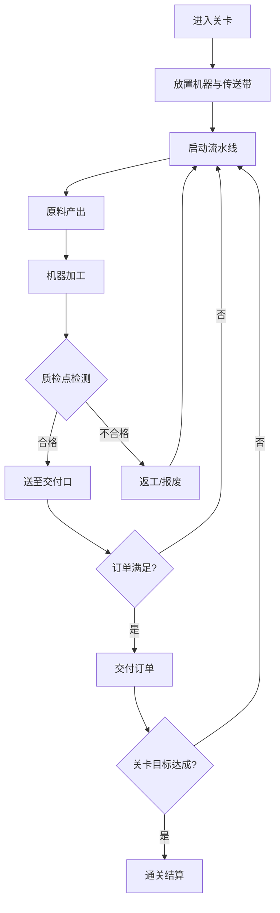
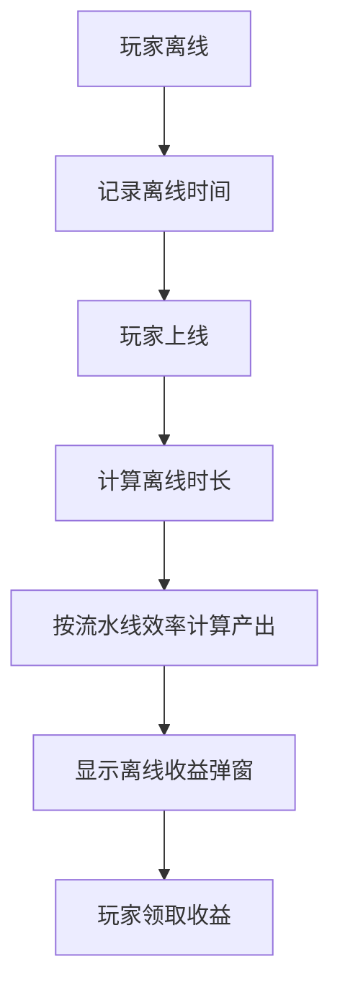

## 1. 产品概述

复古工厂流水线放置游戏——玩家在网格化工厂中布置机器、传送带和质检点，使原料经流水线加工后按时交付订单。核心乐趣来自"布局策略 × 数值成长"：不同机器组合与升级路线产生可感知的策略差异，而非单纯等待。

- 目标用户：放置/经营类游戏爱好者，偏好轻度策略与视觉反馈
- 产品价值：提供有深度的工厂布局策略体验，支持离线收益与成就驱动长线留存

## 2. 核心功能

### 2.1 用户角色

| 角色 | 说明 |
|------|------|
| 厂长（玩家） | 单人游戏，无注册，本地存档 |

### 2.2 功能模块

1. **工厂车间页**：网格画布、机器/传送带放置、产品流动动画、瓶颈提示
2. **订单面板**：当前订单列表、倒计时、交付按钮、奖励预览
3. **升级商店**：机器升级、新机器解锁、传送带加速
4. **关卡选择页**：关卡列表、星级评价、锁定/解锁状态
5. **成就页**：成就列表、进度条、解锁动画
6. **设置页**：音量、自动存档、重置存档、离线收益开关
7. **数据统计页**：总收入、交付订单数、在线时长、瓶颈次数

### 2.3 页面详情

| 页面名称 | 模块名称 | 功能描述 |
|----------|----------|----------|
| 工厂车间 | 网格画布 | 8×6 可放置网格，支持拖放机器和传送带，显示产品流动粒子动画 |
| 工厂车间 | 机器面板 | 底部机器选择栏，点击后放置到网格，显示成本和产出 |
| 工厂车间 | 瓶颈提示 | 当某机器积压超过阈值时，该格闪烁黄色警告并弹出提示 |
| 工厂车间 | 质检点 | 放置在传送带末端，标记合格/不合格产品，不合格需返工 |
| 订单面板 | 订单列表 | 右侧浮动面板，显示当前可接订单、已接订单、倒计时 |
| 订单面板 | 交付按钮 | 订单完成条件满足后可点击交付，获得金币与经验 |
| 订单面板 | 奖励预览 | 鼠标悬停订单显示金币、经验、特殊奖励 |
| 升级商店 | 机器升级 | 选择已放置机器，花费金币提升速度/质量/容量 |
| 升级商店 | 解锁机器 | 消耗经验解锁新机器类型（切割机、焊接机、喷涂机等） |
| 关卡选择 | 关卡地图 | 横向滚动的工厂地图，每关有不同布局需求和订单 |
| 关卡选择 | 星级评价 | 每关 1-3 星，基于交付速度和合格率 |
| 成就页 | 成就列表 | 按类别展示成就（生产、订单、升级、特殊），显示进度 |
| 设置页 | 音频设置 | 背景音乐、音效音量滑块 |
| 设置页 | 存档管理 | 手动存档、自动存档间隔、重置当前关卡、重置全部存档 |
| 设置页 | 离线收益 | 开关离线收益计算，显示上次离线收益 |
| 数据统计 | 统计面板 | 展示总收入、总交付、各机器运行时长等关键指标 |

## 3. 核心流程

### 3.1 主游戏循环

1. 玩家进入关卡，获得初始资金和可用机器
2. 在网格上放置机器和传送带，构建从原料口到交付口的完整流水线
3. 原料自动从原料口产出，沿传送带依次经过各机器加工
4. 产品到达质检点进行质量检测，合格品送至交付口
5. 交付口积累成品后，玩家可点击交付满足订单
6. 订单奖励金币和经验，金币用于升级/购买，经验用于解锁
7. 完成关卡目标订单后通关，获得星级评价

### 3.2 流程图

### 3.3 离线收益流程

## 4. 用户界面设计

### 4.1 设计风格

- **主色调**：深棕色 (#2D1B0E) + 铁锈橙 (#C45D2C) + 工业绿 (#4A7C59)
- **辅助色**：蒸汽白 (#E8DCC8)、黄铜金 (#D4A84B)、警告红 (#C44B4B)
- **按钮风格**：3D 铆钉按钮，金属质感边框，按下有凹陷效果
- **字体**：像素风标题字体 (Press Start 2P) + 工业风正文 (VT323)
- **布局风格**：顶部状态栏 + 中央网格画布 + 底部机器选择栏 + 右侧订单面板
- **图标风格**：像素风工业图标，齿轮、扳手、传送带等

### 4.2 页面设计概览

| 页面名称 | 模块名称 | UI 元素 |
|----------|----------|---------|
| 工厂车间 | 网格画布 | 深色网格背景、带金属边框的格子、产品流动粒子、蒸汽效果 |
| 工厂车间 | 机器面板 | 底部横栏、像素图标、价格标签、拖放手柄 |
| 工厂车间 | 瓶颈提示 | 黄色脉冲边框、浮动文字气泡、音效提示 |
| 订单面板 | 订单卡片 | 纸质便签风格、盖章效果、倒计时沙漏 |
| 升级商店 | 升级按钮 | 进度条、等级标识、金属质感按钮 |
| 关卡选择 | 关卡节点 | 工厂建筑图标、连接线路、星星标识 |
| 成就页 | 成就徽章 | 齿轮形徽章、金属边框、解锁光效 |
| 设置页 | 滑块控件 | 工业风旋钮、管道连接装饰 |

### 4.3 响应式设计

- 桌面优先，最小支持 1024×768
- 网格画布自适应缩放，保持 8:6 比例
- 订单面板在窄屏下折叠为底部抽屉
- 触摸设备支持拖放放置

### 4.4 动效设计

- 机器运转：齿轮旋转动画、活塞往复运动
- 传送带：滚动条纹动画 + 产品移动粒子
- 质检点：合格绿灯闪烁 / 不合格红灯闪烁 + 警报音效
- 订单完成：盖章动画 + 金币飞溅粒子
- 升级完成：闪光特效 + 机器外观变化
- 瓶颈警告：脉冲边框 + 浮动气泡
- 离线收益：金币堆叠动画 + 弹窗滑入

## 5. 数值设计原则

### 5.1 策略差异要求

- **速度路线**：升级机器速度 → 高产出但低质量 → 需要更多质检返工
- **质量路线**：升级机器精度 → 高合格率减少返工 → 单位产出较低
- **容量路线**：升级缓冲区 → 大批量处理抗波动 → 初始投资大
- **混合路线**：根据关卡订单特性灵活搭配

### 5.2 关键数值

| 机器类型 | 基础速度 | 基础质量 | 升级费用倍率 | 最大等级 |
|----------|----------|----------|-------------|----------|
| 冲压机 | 2s/件 | 85% | ×1.8 | 10 |
| 切割机 | 3s/件 | 80% | ×2.0 | 10 |
| 焊接机 | 4s/件 | 75% | ×2.2 | 10 |
| 喷涂机 | 3s/件 | 90% | ×1.9 | 10 |
| 质检点 | 1s/件 | — | ×1.5 | 5 |
| 传送带 | 0.5s/格 | — | ×1.3 | 5 |

### 5.3 订单数值

| 订单难度 | 数量要求 | 时间限制 | 金币奖励 | 经验奖励 |
|----------|----------|----------|----------|----------|
| 简单 | 5-10件 | 120s | 50-100 | 10-20 |
| 普通 | 10-20件 | 180s | 100-250 | 20-40 |
| 困难 | 20-40件 | 240s | 250-500 | 40-80 |
| 精英 | 40+件 | 300s | 500-1000 | 80-150 |

## 6. 扩展性设计

- 关卡数据采用 JSON 配置，支持热加载新关卡
- 机器类型通过注册表模式扩展，新增机器无需修改核心逻辑
- 成就系统支持动态添加新成就条件
- 存档结构版本化，支持向前兼容迁移
- 音频资源通过资源管理器加载，支持替换音效包
- 排行榜接口预留（本地存储 + 远端上传预留）
