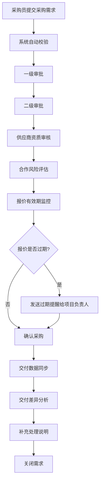

## 1. 产品概述

工程材料供应商准入管理系统是面向工程项目的全流程供应商管理平台，实现从采购需求提交、供应商资质审核、价格监控到交付验收的闭环管理。系统解决工程材料采购中供应商资质不透明、价格波动难追踪、审批流程繁琐、文档管理混乱等痛点，帮助工程项目负责人高效管理供应商准入全生命周期。

## 2. 核心功能

### 2.1 用户角色

| 角色 | 注册方式 | 核心权限 |
|------|----------|----------|
| 采购员 | 系统分配账号 | 提交采购需求、上传附件、查看审批进度、补充处理说明 |
| 审核员 | 系统分配账号 | 审核供应商资质、评估合作风险、维护发票状态 |
| 项目负责人 | 系统分配账号 | 查看价格看板、接收报价过期提醒、审批采购需求 |
| 系统管理员 | 系统分配账号 | 维护审批层级、规格附件、发票状态配置、用户管理 |

### 2.2 功能模块

1. **采购需求前台**：需求提交、附件上传、进度查询、备注补充
2. **供应商审核后台**：资质审核、风险评估、审批流转
3. **价格波动看板**：价格趋势图、波动预警、历史对比
4. **系统管理后台**：审批层级配置、发票状态维护、规格附件管理
5. **提醒中心**：报价过期提醒、审批通知、异常告警
6. **交付差异看板**：交付同步、差异分析、数据统计
7. **附件管理中心**：附件上传、下载、分类归档

### 2.3 页面详情

| 页面名称 | 模块名称 | 功能描述 |
|---------|----------|---------|
| 采购需求提交页 | 需求表单 | 填写材料名称、规格、数量、预算、期望交付时间，上传需求附件 |
| 采购需求列表页 | 列表查询 | 查看所有需求状态、审批进度、操作入口 |
| 供应商审核列表页 | 资质审核 | 查看供应商资质、营业执照、资质证书、审核操作 |
| 合作风险评估页 | 风险评估 | 风险等级评估、历史合作记录、风险备注 |
| 价格波动看板页 | 价格监控 | 价格趋势图表、波动预警、历史价格对比 |
| 审批层级配置页 | 流程配置 | 可视化配置审批节点、审批人、审批条件 |
| 发票状态维护页 | 状态管理 | 配置发票状态字典、流转规则 |
| 规格附件维护页 | 附件模板 | 上传规格标准文档、模板管理 |
| 提醒中心页 | 消息列表 | 报价过期提醒、审批通知、下载入口 |
| 交付差异看板页 | 交付分析 | 交付数据同步、差异对比、统计报表 |
| 需求详情页 | 详情展示 | 需求详情、审批记录、附件管理、补充说明 |

## 3. 核心流程

### 3.1 采购需求审批流程

采购员提交采购需求（含附件）→ 系统校验 → 多级审批（按配置的审批层级）→ 供应商资质审核 → 合作风险评估 → 报价有效期监控 → 报价过期提醒（项目负责人）→ 确认采购 → 交付同步 → 交付差异分析 → 关闭需求（补充处理说明）

### 3.2 系统管理员维护流程

管理员登录 → 进入系统管理 → 选择维护模块（审批层级/发票状态/规格附件）→ 在线编辑 → 保存配置 → 实时生效

## 4. 用户界面设计

### 4.1 设计风格

- 主色调：工业蓝 (#1e3a5f) 搭配 警示橙 (#ff6b35)
- 辅助色：成功绿 (#28a745)、警告黄 (#ffc107)、危险红 (#dc3545)
- 按钮风格：圆角矩形，悬停微动画，阴影层次
- 字体：标题使用思源黑体 Bold，正文使用思源黑体 Regular
- 布局风格：卡片式布局，左侧导航栏，顶部状态栏
- 图标风格：线性图标，统一圆角，hover 微动效

### 4.2 页面设计概述

| 页面名称 | 模块名称 | UI 元素 |
|---------|----------|---------|
| 采购需求提交页 | 表单区域 | 表单分步引导、拖拽上传区域、表单验证提示 |
| 价格波动看板页 | 图表区域 | 折线图、热力图、数据卡片、筛选条件 |
| 供应商审核列表页 | 数据表格 | 状态标签、操作按钮、分页、搜索 |
| 审批层级配置页 | 配置区域 | 拖拽排序、节点编辑、连线动画 |
| 提醒中心页 | 消息列表 | 未读标记、批量操作、快捷入口 |
| 交付差异看板页 | 统计区域 | 柱状图、差异高亮、数据导出 |

### 4.3 响应式

- 桌面端优先设计（1920px 基准）
- 平板端自适应（1024px ~ 1440px）
- 移动端关键信息展示（768px 以下）
- 触摸优化：按钮最小高度 44px，手势支持

## 5. 非功能性需求

### 5.1 性能要求
- 页面加载时间 < 2s
- API 响应时间 < 500ms
- 支持 100+ 并发用户

### 5.2 安全要求
- 用户身份认证与权限控制
- 附件病毒扫描
- 操作日志审计
- 数据加密传输

### 5.3 可用性要求
- 系统可用性 99.5%
- 数据备份机制
- 异常处理友好提示
