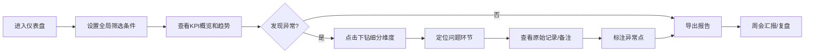

## 1. 产品概述

招聘流程效率仪表盘是面向人事运营团队的数据分析平台，通过可视化方式追踪和分析招聘全流程效率，支持从整体趋势到职位、部门、招聘官、渠道、阶段的多维度下钻，帮助团队快速识别瓶颈、优化招聘体验。

- 核心用户：人事运营专员、招聘经理、HR负责人
- 核心价值：数据驱动的招聘流程优化，提升招聘效率和候选人体验
- 设计风格：Power BI 风格的企业级数据分析平台，专业、清晰、高效

## 2. 核心功能

### 2.1 用户角色

| 角色 | 说明 | 核心权限 |
|------|------|----------|
| 人事运营 | 日常使用仪表盘复盘 | 查看所有数据、导出报告、标注异常 |
| 招聘经理 | 查看团队招聘数据 | 查看本部门数据、导出报告 |
| 招聘官 | 查看个人负责的招聘数据 | 查看个人数据、录入备注 |
| 管理员 | 系统配置和数据管理 | 批量导入数据、配置数据字典、权限管理 |

### 2.2 功能模块

1. **仪表盘概览**：核心指标卡片、趋势折线图、招聘漏斗图
2. **流程效率分析**：阶段耗时分析、瓶颈识别、部门/招聘官对比
3. **渠道质量分析**：各渠道简历量、转化率、质量评分
4. **面试官负载**：面试轮次分布、面试官工作量统计
5. **候选人体验**：反馈统计、各阶段满意度
6. **数据管理**：批量导入、数据字典、缺失值处理、异常点标注
7. **报告导出**：CSV导出、PDF导出、截图导出

### 2.3 页面详情

| 页面名称 | 模块名称 | 功能描述 |
|-----------|-------------|---------------------|
| 仪表盘概览 | 顶部筛选栏 | 时间范围、部门、职位、招聘官、渠道多维度筛选，筛选状态全局联动 |
| 仪表盘概览 | KPI指标卡 | 显示职位发布数、简历数、面试数、Offer数、入职数、平均招聘周期 |
| 仪表盘概览 | 趋势图 | 按月/周展示各阶段数据变化趋势，支持点击下钻 |
| 仪表盘概览 | 招聘漏斗 | 展示从简历到入职的转化漏斗，点击可查看明细 |
| 流程效率分析 | 阶段耗时 | 各阶段平均耗时、中位数、P75/P90分位，箱线图展示 |
| 流程效率分析 | 部门对比 | 各部门招聘效率横向对比，柱状图 |
| 流程效率分析 | 招聘官排名 | 按效率指标排名，支持多维度排序 |
| 渠道质量分析 | 渠道漏斗 | 各渠道从简历到入职的转化漏斗对比 |
| 渠道质量分析 | 成本效益 | 各渠道人均招聘成本、质量评分 |
| 面试官负载 | 工作量统计 | 各面试官面试轮次、时长统计 |
| 面试官负载 | 日程分布 | 面试时间分布热力图 |
| 候选人反馈 | 满意度统计 | 各阶段满意度评分、趋势 |
| 候选人反馈 | 关键词云 | 反馈关键词词云 |
| 数据管理 | 数据导入 | CSV批量导入数据，字段映射、重复检测 |
| 数据管理 | 数据字典 | 字段定义、枚举值配置、单位说明 |
| 数据管理 | 数据质量 | 缺失值统计、异常值检测、数据清洗建议 |
| 原始记录 | 明细列表 | 候选人全流程记录，支持搜索、筛选、导出 |
| 原始记录 | 详情弹窗 | 单条记录完整信息，包含时间线、备注、异常标注 |

## 3. 核心流程

### 3.1 日常复盘流程
用户登录 → 选择时间范围和筛选条件 → 查看整体KPI和趋势 → 发现异常指标 → 点击下钻查看细分维度 → 定位问题部门/招聘官/渠道 → 查看原始记录和备注 → 导出报告用于周会

### 3.2 数据导入流程
管理员进入数据管理 → 上传CSV文件 → 系统自动识别字段 → 用户映射字段 → 预览数据质量（缺失值、异常值） → 确认导入 → 系统处理数据并更新仪表盘

### 3.3 流程图

## 4. 用户界面设计

### 4.1 设计风格
- **主色调**：深蓝色系（#0F4C81）作为主色，体现专业、可信赖的企业级应用感
- **辅助色**：青绿色（#00B4D8）用于强调和交互，橙色（#F77F00）用于警告和异常点
- **成功色**：绿色（#2A9D8F），危险色：红色（#E63946）
- **中性色**：深灰（#1D3557）、中灰（#457B9D）、浅灰（#F1FAEE）
- **字体**：Inter 作为主要字体，搭配 Roboto Mono 用于数据展示
- **布局**：顶部导航 + 左侧筛选栏 + 主内容区的经典BI布局
- **卡片**：白色卡片带轻微阴影，圆角8px，边框1px浅灰
- **数据可视化**：ECharts 图表，专业配色，支持交互

### 4.2 页面设计概述

| 页面名称 | 模块名称 | UI元素 |
|-----------|-------------|-------------|
| 仪表盘概览 | 顶部筛选栏 | 下拉选择器、日期范围选择、搜索框、筛选标签 |
| 仪表盘概览 | KPI卡片 | 大数字指标、同比环比、趋势小箭头、图标 |
| 仪表盘概览 | 图表区域 | 漏斗图、折线图、柱状图，带图例和工具提示 |
| 流程效率分析 | 阶段耗时 | 箱线图、表格，支持排序和筛选 |
| 数据管理 | 数据导入 | 拖拽上传区域、字段映射表格、预览区域 |
| 原始记录 | 明细列表 | 数据表格、分页、行点击展开详情 |

### 4.3 响应式设计
- Desktop-first 设计，适配 1440px 及以上分辨率
- 平板设备：筛选栏折叠为顶部下拉
- 移动设备：图表自适应宽度，表格支持横向滚动

### 4.4 交互设计
- 图表联动：筛选条件变化时所有图表实时更新
- 下钻交互：点击图表元素（柱状、漏斗段）自动筛选对应维度
- 悬停效果：卡片和图表元素有轻微放大和阴影加深
- 异常标注：异常数据点用橙色圆点标记，悬停显示异常原因
- 加载状态：骨架屏 + 进度条，数据更新时有淡入过渡动画
