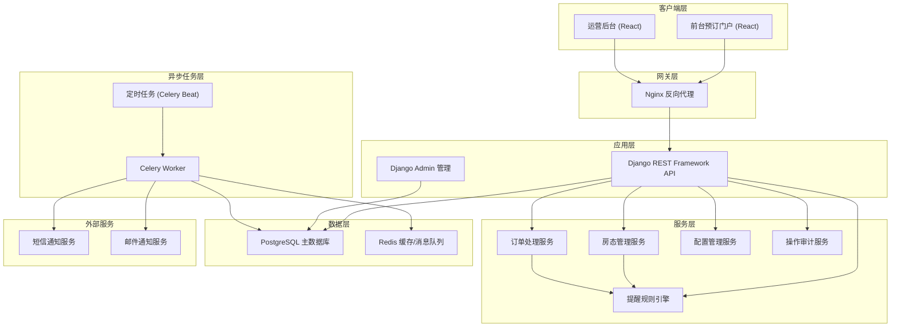
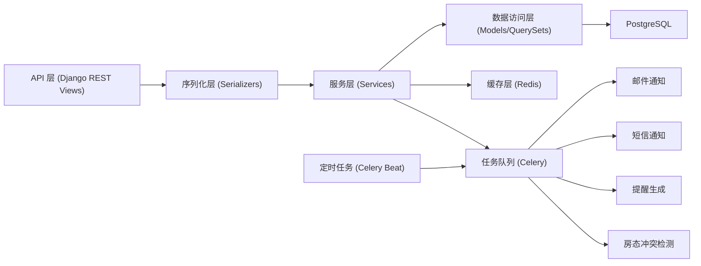
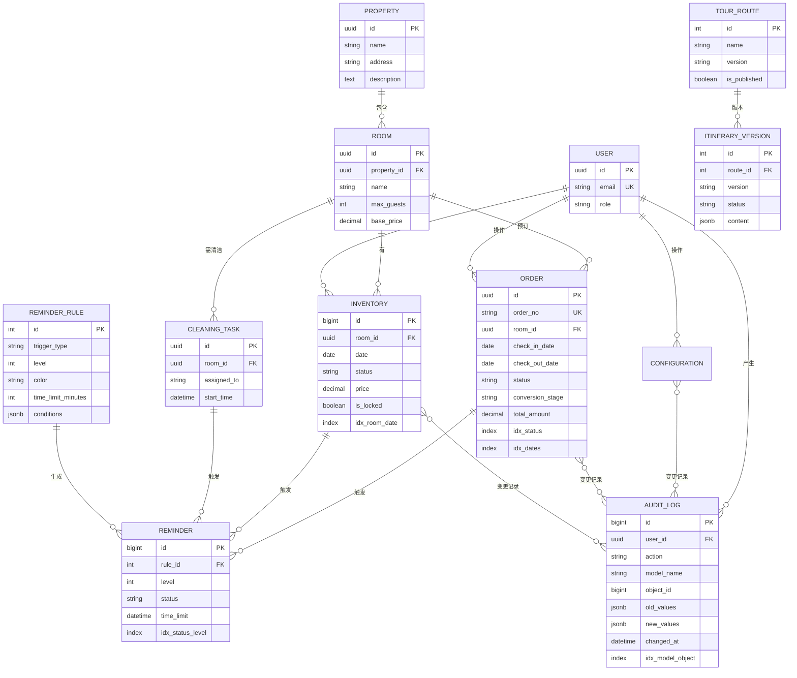

## 1. 架构设计

青禾房态行程台采用前后端分离架构，前端使用 React + TypeScript + Vite，后端使用 Django + Django REST Framework，数据库使用 PostgreSQL，异步任务使用 Celery + Redis。



## 2. 技术描述

### 2.1 前端技术栈
- **框架**：React@18 + TypeScript
- **构建工具**：Vite@5
- **路由**：react-router-dom@6
- **状态管理**：zustand@4
- **UI 框架**：Tailwind CSS@3 + shadcn/ui
- **图表库**：recharts@2
- **HTTP 客户端**：axios@1
- **图标库**：lucide-react@0.344
- **日期处理**：dayjs@1

### 2.2 后端技术栈
- **框架**：Django@5.0 + Django REST Framework@3.15
- **Python 版本**：Python@3.11
- **数据库**：PostgreSQL@16
- **ORM**：Django ORM
- **异步任务**：Celery@5.3 + Redis@7
- **认证**：Django REST Framework SimpleJWT
- **数据库版本管理**：Django Migrations
- **API 文档**：drf-spectacular

### 2.3 项目目录结构

```
qinghe/
├── frontend/                    # 前端 React 项目
│   ├── src/
│   │   ├── components/          # 通用组件
│   │   ├── pages/               # 页面组件
│   │   ├── hooks/               # 自定义 hooks
│   │   ├── stores/              # zustand 状态管理
│   │   ├── services/            # API 服务
│   │   ├── utils/               # 工具函数
│   │   ├── types/               # TypeScript 类型定义
│   │   └── App.tsx
│   ├── package.json
│   ├── tsconfig.json
│   ├── vite.config.ts
│   └── tailwind.config.js
├── backend/                     # 后端 Django 项目
│   ├── apps/
│   │   ├── properties/          # 房源/房型管理
│   │   ├── inventory/           # 房态管理
│   │   ├── orders/              # 订单管理
│   │   ├── configuration/       # 配置管理
│   │   ├── reminders/           # 提醒系统
│   │   ├── audit/               # 操作审计
│   │   └── users/               # 用户管理
│   ├── config/                  # Django 配置
│   ├── celery_tasks/            # Celery 任务
│   ├── requirements.txt
│   └── manage.py
└── docker-compose.yml           # Docker 编排
```

## 3. 路由定义

### 3.1 前端路由

| 路由 | 页面 | 说明 |
|------|------|------|
| / | 预订首页 | 民宿展示、房态日历、预订入口 |
| /booking | 预订确认 | 房型选择、订单填写 |
| /booking/success | 预订成功 | 订单确认信息 |
| /admin/login | 后台登录 | 运营后台登录页 |
| /admin/dashboard | 数据看板 | 运营数据概览 |
| /admin/inventory | 房态管理 | 房态日历、价格维护 |
| /admin/orders | 订单管理 | 订单列表、筛选、转化追踪 |
| /admin/orders/:id | 订单详情 | 订单详情、状态操作 |
| /admin/configuration/routes | 导览路线 | 导览路线配置 |
| /admin/configuration/cleaning | 清洁任务 | 清洁任务配置 |
| /admin/configuration/itineraries | 行程版本 | 行程版本管理 |
| /admin/reminders/rules | 提醒规则 | 提醒规则配置 |
| /admin/reminders/center | 提醒中心 | 待处理提醒列表 |
| /admin/audit/history | 操作历史 | 变更记录、差异对比 |
| /admin/users | 用户管理 | 用户列表、权限管理 |

### 3.2 后端 API 路由

| 路由 | 方法 | 说明 |
|------|------|------|
| /api/properties/ | GET | 获取民宿列表 |
| /api/properties/:id/ | GET | 获取民宿详情 |
| /api/rooms/ | GET | 获取房型列表 |
| /api/rooms/:id/ | GET | 获取房型详情 |
| /api/inventory/calendar/ | GET | 获取房态日历数据 |
| /api/inventory/calendar/ | PUT | 批量更新房态 |
| /api/inventory/pricing/ | GET | 获取价格列表 |
| /api/inventory/pricing/ | PUT | 批量更新价格 |
| /api/orders/ | GET | 获取订单列表（支持筛选） |
| /api/orders/ | POST | 创建订单 |
| /api/orders/:id/ | GET | 获取订单详情 |
| /api/orders/:id/ | PATCH | 更新订单状态 |
| /api/orders/conversion/ | GET | 获取转化漏斗数据 |
| /api/configuration/routes/ | GET/POST | 导览路线列表/创建 |
| /api/configuration/routes/:id/ | GET/PUT/DELETE | 导览路线详情/更新/删除 |
| /api/configuration/cleaning/ | GET/POST | 清洁任务列表/创建 |
| /api/configuration/cleaning/:id/ | GET/PUT/DELETE | 清洁任务详情/更新/删除 |
| /api/configuration/itineraries/ | GET/POST | 行程版本列表/创建 |
| /api/configuration/itineraries/:id/ | GET/PUT/DELETE | 行程版本详情/更新/删除 |
| /api/reminders/rules/ | GET/POST | 提醒规则列表/创建 |
| /api/reminders/rules/:id/ | GET/PUT/DELETE | 提醒规则详情/更新/删除 |
| /api/reminders/ | GET | 提醒列表 |
| /api/reminders/:id/ | PATCH | 标记提醒处理 |
| /api/audit/history/ | GET | 操作历史列表 |
| /api/audit/history/:id/diff/ | GET | 获取变更差异 |
| /api/auth/login/ | POST | 用户登录 |
| /api/auth/refresh/ | POST | 刷新 Token |
| /api/users/me/ | GET | 获取当前用户信息 |

## 4. API 类型定义

```typescript
// 房型
interface Room {
  id: number;
  name: string;
  propertyId: number;
  propertyName: string;
  description: string;
  maxGuests: number;
  basePrice: number;
  images: string[];
  amenities: string[];
}

// 房态日历项
interface InventoryItem {
  date: string;
  roomId: number;
  status: 'available' | 'booked' | 'maintenance' | 'closed';
  price: number;
  isLocked: boolean;
}

// 订单
interface Order {
  id: string;
  orderNo: string;
  guestName: string;
  guestPhone: string;
  guestEmail: string;
  roomId: number;
  roomName: string;
  checkInDate: string;
  checkOutDate: string;
  nights: number;
  adults: number;
  children: number;
  totalAmount: number;
  status: 'pending' | 'confirmed' | 'checked_in' | 'checked_out' | 'cancelled' | 'no_show';
  conversionStage: 'inquiry' | 'quoted' | 'deposit_paid' | 'fully_paid' | 'completed';
  createdAt: string;
  updatedAt: string;
  remarks: string;
}

// 提醒规则
interface ReminderRule {
  id: number;
  name: string;
  triggerType: 'inventory_conflict' | 'order_status' | 'checkin_reminder' | 'cleaning_due';
  level: 1 | 2 | 3 | 4;
  color: string;
  timeLimitMinutes: number;
  conditions: Record<string, any>;
  actions: string[];
  isActive: boolean;
}

// 提醒
interface Reminder {
  id: number;
  ruleId: number;
  ruleName: string;
  level: 1 | 2 | 3 | 4;
  color: string;
  title: string;
  content: string;
  relatedType: 'order' | 'inventory' | 'cleaning';
  relatedId: number;
  status: 'pending' | 'processing' | 'resolved' | 'ignored';
  timeLimit: string;
  createdAt: string;
  handledBy: string;
  handledAt: string;
}

// 导览路线
interface TourRoute {
  id: number;
  name: string;
  description: string;
  duration: number;
  waypoints: Waypoint[];
  version: string;
  isPublished: boolean;
}

// 清洁任务
interface CleaningTask {
  id: number;
  name: string;
  roomTypeId: number;
  assignedTo: string;
  estimatedMinutes: number;
  checklists: string[];
  startTime: string;
  endTime: string;
}

// 行程版本
interface ItineraryVersion {
  id: number;
  version: string;
  name: string;
  description: string;
  content: Record<string, any>;
  status: 'draft' | 'published' | 'archived';
  createdAt: string;
  createdBy: string;
}

// 操作历史
interface AuditLog {
  id: number;
  action: 'create' | 'update' | 'delete';
  modelName: string;
  objectId: number;
  objectName: string;
  changedBy: string;
  changedAt: string;
  oldValues: Record<string, any>;
  newValues: Record<string, any>;
  diff: FieldDiff[];
}

interface FieldDiff {
  field: string;
  oldValue: any;
  newValue: any;
  changed: boolean;
}
```

## 5. 后端服务架构



### 5.1 核心模块职责

| 模块 | 职责 |
|------|------|
| properties | 民宿和房型的基础信息管理 |
| inventory | 房态日历管理、价格策略、冲突检测 |
| orders | 订单生命周期管理、转化漏斗追踪 |
| configuration | 导览路线、清洁任务、行程版本配置 |
| reminders | 提醒规则引擎、提醒生成和处理 |
| audit | 操作日志记录、差异对比 |
| users | 用户管理、权限控制、JWT 认证 |

## 6. 数据模型

### 6.1 实体关系图



### 6.2 关键索引设计

```sql
-- 房态表联合索引，支持快速查询某房型日期范围的房态
CREATE INDEX idx_inventory_room_date ON inventory (room_id, date);

-- 订单状态和日期索引，支持订单筛选和转化分析
CREATE INDEX idx_orders_status ON orders (status);
CREATE INDEX idx_orders_checkin ON orders (check_in_date);
CREATE INDEX idx_orders_conversion ON orders (conversion_stage);

-- 提醒状态和级别索引，支持快速获取待处理提醒
CREATE INDEX idx_reminders_pending ON reminders (status, level) WHERE status = 'pending';

-- 审计日志索引，支持按模型和对象查询历史
CREATE INDEX idx_audit_model_object ON audit_log (model_name, object_id);
CREATE INDEX idx_audit_user_time ON audit_log (user_id, changed_at DESC);

-- 房态冲突检测唯一约束
CREATE UNIQUE INDEX idx_inventory_unique ON inventory (room_id, date);
```

### 6.3 初始化数据

```sql
-- 插入示例民宿
INSERT INTO property (id, name, address, description) VALUES
('p1', '青禾山居', '杭州市西湖区龙井路88号', '坐落于茶山之间的精品民宿'),
('p2', '青禾海畔', '舟山市普陀区朱家尖', '面朝大海的海景民宿');

-- 插入示例房型
INSERT INTO room (id, property_id, name, max_guests, base_price) VALUES
('r1', 'p1', '茶山观景大床房', 2, 688),
('r2', 'p1', '竹林露台双床房', 4, 888),
('r3', 'p2', '海景豪华套房', 2, 1288);

-- 插入提醒规则
INSERT INTO reminder_rule (id, name, trigger_type, level, color, time_limit_minutes, conditions) VALUES
(1, '房态重复预订冲突', 'inventory_conflict', 1, '#E53935', 15, '{"conflict_type": "double_booking"}'),
(2, '订单30分钟未确认', 'order_status', 2, '#FB8C00', 30, '{"status": "pending", "minutes": 30}'),
(3, '入住前24小时提醒', 'checkin_reminder', 3, '#FDD835', 1440, '{"hours_before": 24}'),
(4, '清洁任务超时', 'cleaning_due', 2, '#FB8C00', 60, '{}');

-- 插入管理员用户 (密码: admin123456)
INSERT INTO user (id, email, role, password_hash) VALUES
('u1', 'admin@qinghe.com', 'super_admin', 'pbkdf2_sha256$...');
```
