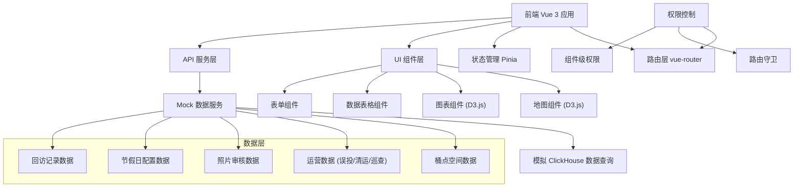
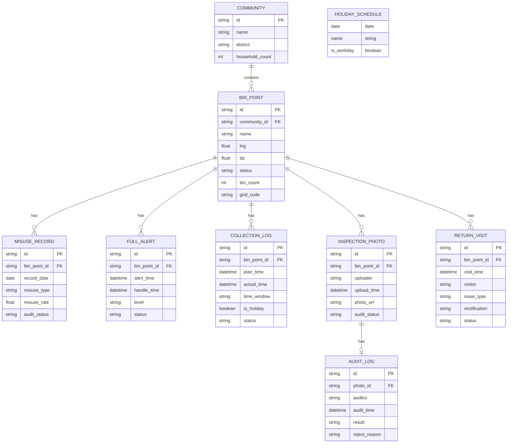

## 1. 架构设计



## 2. 技术描述

- **前端**: Vue 3.4 + TypeScript + Vite 5.0
- **路由**: vue-router 4.x
- **状态管理**: Pinia 2.x
- **可视化**: D3.js 7.x (地图 + 图表)
- **样式**: Tailwind CSS 3.x
- **图标**: lucide-vue-next
- **后端**: 无真实后端，使用 Mock 数据模拟 ClickHouse 查询
- **数据存储**: 前端本地 Mock 数据 + localStorage 持久化

## 3. 路由定义

| 路由路径 | 页面名称 | 权限要求 | 说明 |
|---------|---------|---------|------|
| / | 桶点地图首页 | 公开 | 系统入口，D3 地图可视化 |
| /login | 登录页 | 公开 | 项目经理/审核员登录 |
| /manager | 项目经理工作台 | 项目经理 | 数据概览 + 快捷入口 |
| /manager/misuse | 误投趋势分析 | 项目经理 | 误投率趋势、分类统计 |
| /manager/full-alert | 桶满报警监控 | 项目经理 | 实时报警、历史记录 |
| /manager/efficiency | 清运效率分析 | 项目经理 | 时间窗分析、节假日筛选 |
| /manager/inspection | 巡查覆盖管理 | 项目经理 | 覆盖率、回访记录 |
| /manager/community | 社区对比排名 | 项目经理 | 多维度排名、横向对比 |
| /audit | 照片审核中心 | 审核员/项目经理 | 待审照片、驳回记录 |
| /public | 公开数据看板 | 公开 | 脱敏聚合数据、无照片 |
| /settings | 系统设置 | 项目经理 | 节假日配置、权限管理 |

## 4. 数据模型

### 4.1 核心数据模型



### 4.2 数据索引设计

- **空间索引**: 基于 GeoHash 对桶点经纬度进行编码，支持快速区域查询
- **时间索引**: 所有记录表按日期分区，模拟 ClickHouse 的 MergeTree 引擎
- **审计索引**: 审核状态 + 社区 + 时间 复合索引，支持排名快速计算

## 5. 权限控制设计

### 5.1 路由守卫

```typescript
// 路由守卫逻辑伪代码
router.beforeEach((to, from, next) => {
  const userStore = useUserStore()
  
  // 公开页面无需登录
  if (to.meta.public) {
    next()
    return
  }
  
  // 检查登录状态
  if (!userStore.isLoggedIn) {
    next('/login')
    return
  }
  
  // 检查角色权限
  if (to.meta.roles && !to.meta.roles.includes(userStore.role)) {
    next('/403')
    return
  }
  
  next()
})
```

### 5.2 组件级权限

- 使用自定义指令 `v-permission` 控制按钮/元素显示
- 使用全局方法 `$hasPermission` 进行编程式权限判断
- 照片组件仅在内部页面渲染，公开页面自动隐藏

## 6. 核心功能实现要点

### 6.1 D3 地图可视化

- 使用 GeoJSON 绘制城市区域边界
- 实现缩放、平移、框选交互
- 桶点按状态着色，支持气泡聚合
- 空间搜索使用 R-tree 索引优化

### 6.2 节假日筛选逻辑

- 清运效率计算时自动排除节假日
- 提供节假日手动排除/包含开关
- 节假日数据在图表中使用特殊样式标记

### 6.3 审核数据隔离

- 社区排名仅使用 `audit_status = 'approved'` 的数据
- 驳回的照片记录保留但不计入统计
- 公开数据额外进行脱敏和聚合处理

### 6.4 照片权限控制

- 内部页面: 完整照片展示 + 审核操作
- 公开页面: 完全不渲染照片相关 DOM
- 使用路由层级控制，而非单纯 CSS 隐藏
