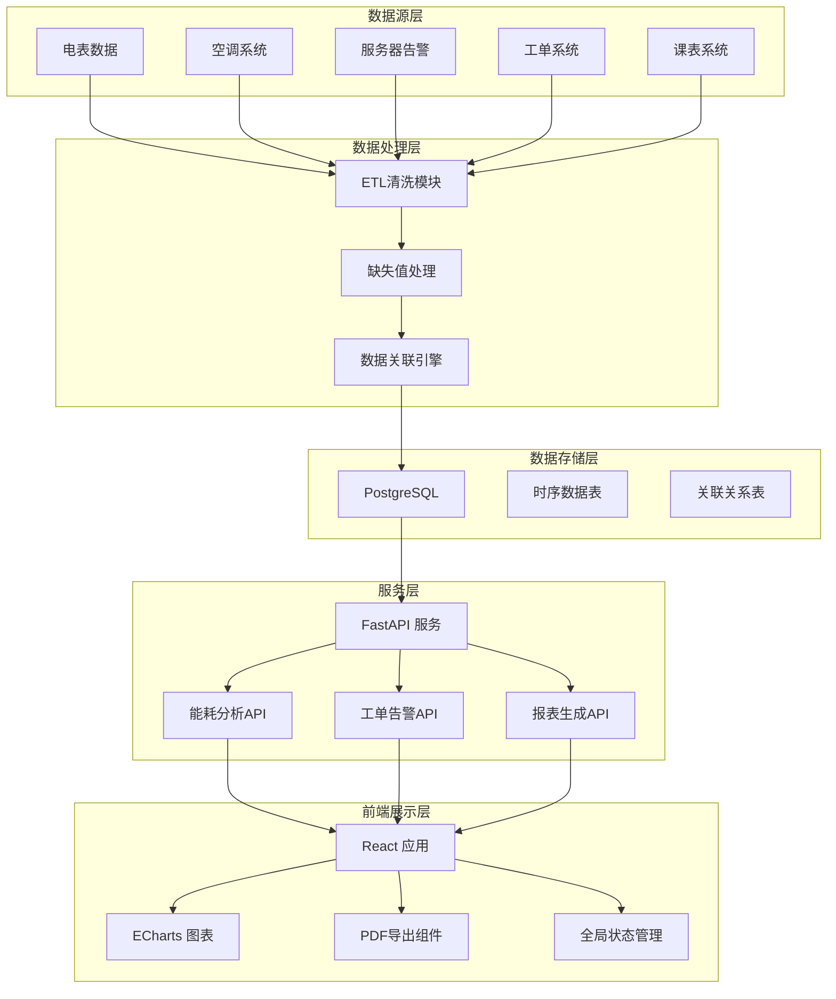
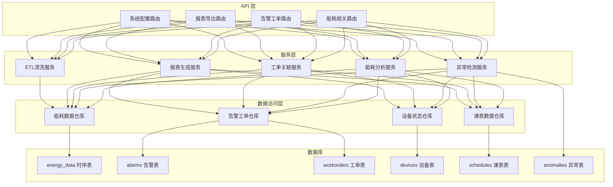
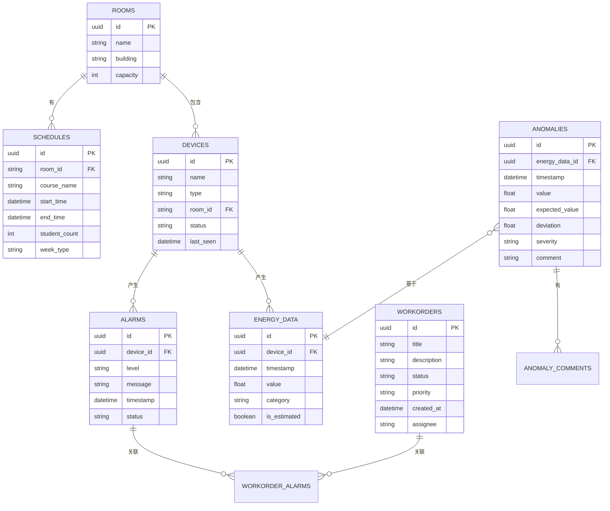

# 高校机房能耗与故障看板 - 技术架构文档

## 1. 架构设计



## 2. 技术描述

### 2.1 技术栈选择

| 层级 | 技术选型 | 版本 | 说明 |
|------|----------|------|------|
| 前端框架 | React | 18.x | 组件化开发， Hooks 管理状态 |
| 构建工具 | Vite | 5.x | 快速开发构建 |
| 图表库 | ECharts | 5.x | 丰富的图表类型，支持交互 |
| UI 框架 | Ant Design | 5.x | 企业级组件库 |
| 状态管理 | Zustand | 4.x | 轻量级状态管理，支持筛选上下文保留 |
| PDF导出 | html2canvas + jsPDF | 最新 | 前端生成PDF报表 |
| 后端框架 | FastAPI | 0.100+ | 高性能异步API，自动生成文档 |
| 数据库 | PostgreSQL | 15+ | 支持时序数据和复杂查询 |
| ORM | SQLAlchemy | 2.x | 异步支持 |
| 数据库驱动 | asyncpg | 最新 | 异步PostgreSQL驱动 |

### 2.2 项目结构

```
project/
├── backend/
│   ├── app/
│   │   ├── api/              # API路由
│   │   ├── core/             # 配置、安全等
│   │   ├── models/           # SQLAlchemy模型
│   │   ├── schemas/          # Pydantic schema
│   │   ├── services/         # 业务逻辑
│   │   └── etl/              # ETL数据清洗模块
│   ├── alembic/              # 数据库迁移
│   └── requirements.txt
├── frontend/
│   ├── src/
│   │   ├── components/       # 可复用组件
│   │   ├── pages/            # 页面组件
│   │   ├── stores/           # Zustand状态管理
│   │   ├── services/         # API调用
│   │   ├── types/            # TypeScript类型
│   │   └── utils/            # 工具函数
│   └── package.json
└── .trae/documents/
```

## 3. 路由定义

### 3.1 前端路由

| 路由 | 页面 | 说明 |
|------|------|------|
| / | 总览看板 | 核心指标和能耗趋势 |
| /energy | 能耗分析 | 多维度能耗对比和分解 |
| /faults | 故障监控 | 告警和工单管理 |
| /reports | 报表中心 | PDF导出和历史报表 |

### 3.2 后端API路由

| 路由 | 方法 | 说明 |
|------|------|------|
| /api/overview | GET | 获取总览看板数据 |
| /api/energy/trend | GET | 获取能耗趋势数据 |
| /api/energy/breakdown | GET | 获取能耗分类分解数据 |
| /api/energy/compare | GET | 考试周vs普通周对比 |
| /api/energy/anomalies | GET | 获取异常能耗点列表 |
| /api/energy/anomalies/{id} | GET | 获取单个异常点详情（关联工单、告警、课表） |
| /api/energy/anomalies/{id}/comment | POST | 添加异常点注释 |
| /api/alarms | GET | 获取告警列表 |
| /api/alarms/{id} | GET | 获取单个告警详情 |
| /api/workorders | GET | 获取工单列表 |
| /api/workorders/{id} | GET | 获取单个工单详情 |
| /api/devices/status | GET | 获取设备在线状态 |
| /api/schedule | GET | 获取课表数据 |
| /api/export/pdf | POST | 生成并导出PDF报表 |
| /api/filter/options | GET | 获取筛选器选项（机房、周类型等） |

## 4. API数据模型定义

```typescript
// 核心指标
interface OverviewMetrics {
  totalEnergy: number;
  pue: number;
  onlineDevices: number;
  pendingWorkorders: number;
  energyTrend: number[];
  comparedToYesterday: number;
}

// 能耗数据点
interface EnergyDataPoint {
  timestamp: string;
  value: number;
  category: 'total' | 'ac' | 'server' | 'lighting';
  deviceId?: string;
  isOffline?: boolean;
}

// 异常能耗点
interface AnomalyPoint {
  id: string;
  timestamp: string;
  value: number;
  expectedValue: number;
  deviation: number;
  severity: 'low' | 'medium' | 'high';
  possibleCauses: string[];
  relatedSchedule?: ScheduleItem[];
  relatedAlarms?: AlarmItem[];
  relatedWorkorders?: WorkorderItem[];
  acStrategy?: ACRecord;
  comment?: string;
}

// 课表项
interface ScheduleItem {
  id: string;
  courseName: string;
  roomId: string;
  startTime: string;
  endTime: string;
  studentCount: number;
}

// 告警项
interface AlarmItem {
  id: string;
  deviceId: string;
  deviceName: string;
  level: 'info' | 'warning' | 'critical';
  message: string;
  timestamp: string;
  status: 'active' | 'acknowledged' | 'resolved';
}

// 工单项
interface WorkorderItem {
  id: string;
  title: string;
  description: string;
  status: 'pending' | 'processing' | 'completed';
  priority: 'low' | 'medium' | 'high';
  createdAt: string;
  assignee?: string;
  relatedAlarmIds?: string[];
}

// 设备状态
interface DeviceStatus {
  id: string;
  name: string;
  type: 'meter' | 'ac' | 'server' | 'ups';
  status: 'online' | 'offline' | 'maintenance';
  lastSeen: string;
  roomId: string;
}

// 筛选上下文
interface FilterContext {
  roomIds: string[];
  timeRange: { start: string; end: string };
  timeWindow: 'day' | 'week' | 'month';
  weekType: 'all' | 'exam' | 'normal';
  includeMaintenance: boolean;
  deviceTypes: string[];
}
```

## 5. 服务架构



## 6. 数据模型

### 6.1 ER 图



### 6.2 DDL 语句

```sql
-- 机房表
CREATE TABLE rooms (
    id UUID PRIMARY KEY DEFAULT gen_random_uuid(),
    name VARCHAR(100) NOT NULL,
    building VARCHAR(100) NOT NULL,
    capacity INTEGER,
    created_at TIMESTAMP DEFAULT CURRENT_TIMESTAMP
);

-- 设备表
CREATE TABLE devices (
    id UUID PRIMARY KEY DEFAULT gen_random_uuid(),
    name VARCHAR(100) NOT NULL,
    type VARCHAR(50) NOT NULL, -- meter, ac, server, ups
    room_id UUID REFERENCES rooms(id),
    status VARCHAR(20) DEFAULT 'online', -- online, offline, maintenance
    last_seen TIMESTAMP,
    created_at TIMESTAMP DEFAULT CURRENT_TIMESTAMP
);

-- 能耗数据表（时序）
CREATE TABLE energy_data (
    id UUID PRIMARY KEY DEFAULT gen_random_uuid(),
    device_id UUID REFERENCES devices(id),
    timestamp TIMESTAMP NOT NULL,
    value FLOAT NOT NULL,
    category VARCHAR(20) NOT NULL, -- total, ac, server, lighting
    is_estimated BOOLEAN DEFAULT false,
    created_at TIMESTAMP DEFAULT CURRENT_TIMESTAMP
);

CREATE INDEX idx_energy_data_timestamp ON energy_data(timestamp);
CREATE INDEX idx_energy_data_device ON energy_data(device_id);

-- 告警表
CREATE TABLE alarms (
    id UUID PRIMARY KEY DEFAULT gen_random_uuid(),
    device_id UUID REFERENCES devices(id),
    level VARCHAR(20) NOT NULL, -- info, warning, critical
    message TEXT NOT NULL,
    timestamp TIMESTAMP NOT NULL,
    status VARCHAR(20) DEFAULT 'active', -- active, acknowledged, resolved
    created_at TIMESTAMP DEFAULT CURRENT_TIMESTAMP
);

-- 工单表
CREATE TABLE workorders (
    id UUID PRIMARY KEY DEFAULT gen_random_uuid(),
    title VARCHAR(200) NOT NULL,
    description TEXT,
    status VARCHAR(20) DEFAULT 'pending', -- pending, processing, completed
    priority VARCHAR(20) DEFAULT 'medium', -- low, medium, high
    created_at TIMESTAMP DEFAULT CURRENT_TIMESTAMP,
    assignee VARCHAR(100)
);

-- 工单告警关联表
CREATE TABLE workorder_alarms (
    workorder_id UUID REFERENCES workorders(id),
    alarm_id UUID REFERENCES alarms(id),
    PRIMARY KEY (workorder_id, alarm_id)
);

-- 课表表
CREATE TABLE schedules (
    id UUID PRIMARY KEY DEFAULT gen_random_uuid(),
    room_id UUID REFERENCES rooms(id),
    course_name VARCHAR(200) NOT NULL,
    start_time TIMESTAMP NOT NULL,
    end_time TIMESTAMP NOT NULL,
    student_count INTEGER,
    week_type VARCHAR(20) DEFAULT 'normal', -- normal, exam
    created_at TIMESTAMP DEFAULT CURRENT_TIMESTAMP
);

-- 异常记录表
CREATE TABLE anomalies (
    id UUID PRIMARY KEY DEFAULT gen_random_uuid(),
    energy_data_id UUID REFERENCES energy_data(id),
    timestamp TIMESTAMP NOT NULL,
    value FLOAT NOT NULL,
    expected_value FLOAT,
    deviation FLOAT,
    severity VARCHAR(20) DEFAULT 'medium', -- low, medium, high
    comment TEXT,
    created_at TIMESTAMP DEFAULT CURRENT_TIMESTAMP
);

-- 空调运行策略表
CREATE TABLE ac_strategies (
    id UUID PRIMARY KEY DEFAULT gen_random_uuid(),
    room_id UUID REFERENCES rooms(id),
    timestamp TIMESTAMP NOT NULL,
    target_temp FLOAT,
    mode VARCHAR(20), -- cool, heat, auto
    fan_speed VARCHAR(20),
    created_at TIMESTAMP DEFAULT CURRENT_TIMESTAMP
);
```
