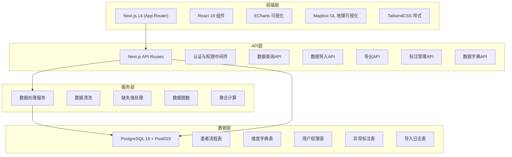
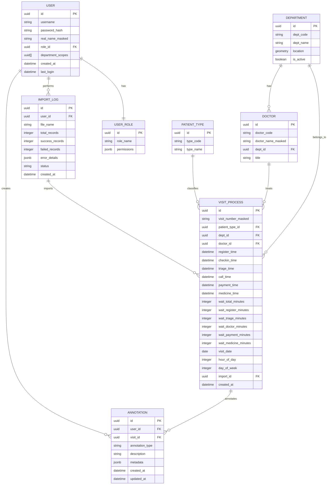

## 1. 架构设计



## 2. 技术描述

### 2.1 前端技术栈
- **框架**: Next.js 14 (App Router) + React 18 + TypeScript
- **样式**: TailwindCSS 3.4
- **可视化**: ECharts 5.5（桑基图、柱状图、折线图、热力图、箱线图）
- **地理可视化**: Mapbox GL JS 3.x
- **状态管理**: React Context + useReducer（轻量级全局状态）
- **UI组件库**: 基于TailwindCSS自定义组件 + Radix UI原语
- **PDF导出**: jsPDF + html2canvas
- **CSV导出**: 原生Blob + FileSaver

### 2.2 后端技术栈
- **服务端**: Next.js API Routes (Node.js 20)
- **数据库**: PostgreSQL 16 + PostGIS 3.4
- **ORM**: Prisma 5.x
- **认证**: JWT + bcrypt
- **文件上传**: multer + express-fileupload
- **数据校验**: Zod

### 2.3 初始化工具
- 使用 `create-next-app@latest` 初始化项目
- TypeScript 严格模式
- ESLint + Prettier 代码规范

## 3. 路由定义

| 路由 | 页面用途 | 权限要求 |
|------|----------|----------|
| `/login` | 用户登录页 | 公开 |
| `/dashboard` | 数据看板主页 | 已登录用户 |
| `/analysis/process` | 流程瓶颈分析 | 已登录用户 |
| `/analysis/comparison` | 多维度对比分析 | 已登录用户 |
| `/analysis/trend` | 趋势分析与异常标注 | 已登录用户 |
| `/data/import` | 批量数据导入 | 管理员/分析员 |
| `/data/dictionary` | 数据字典管理 | 管理员 |
| `/data/quality` | 数据质量监控 | 管理员/分析员 |
| `/export` | 报表导出中心 | 已登录用户 |
| `/admin/users` | 用户管理 | 系统管理员 |

### API 路由
| API路径 | 方法 | 用途 |
|---------|------|------|
| `/api/auth/login` | POST | 用户登录 |
| `/api/visits/query` | POST | 流程数据多维查询 |
| `/api/visits/metrics` | GET | 获取KPI指标数据 |
| `/api/visits/sankey` | GET | 获取桑基图数据 |
| `/api/departments` | GET | 获取科室列表 |
| `/api/doctors` | GET | 获取医生列表 |
| `/api/annotations` | GET/POST/PUT/DELETE | 异常标注CRUD |
| `/api/import/upload` | POST | CSV文件上传 |
| `/api/import/preview` | POST | 导入数据预览校验 |
| `/api/import/commit` | POST | 确认导入入库 |
| `/api/export/csv` | POST | 导出CSV数据 |
| `/api/export/pdf` | POST | 导出PDF报告 |
| `/api/dictionary/*` | REST | 数据字典管理 |

## 4. 数据模型

### 4.1 ER图



### 4.2 数据库Schema (DDL)

```sql
-- 启用PostGIS扩展
CREATE EXTENSION IF NOT EXISTS postgis;
CREATE EXTENSION IF NOT EXISTS postgis_topology;

-- 用户角色表
CREATE TABLE user_roles (
    id UUID PRIMARY KEY DEFAULT gen_random_uuid(),
    role_name VARCHAR(50) NOT NULL UNIQUE,
    permissions JSONB NOT NULL DEFAULT '{}'::JSONB,
    created_at TIMESTAMPTZ NOT NULL DEFAULT NOW()
);

-- 用户表
CREATE TABLE users (
    id UUID PRIMARY KEY DEFAULT gen_random_uuid(),
    username VARCHAR(100) NOT NULL UNIQUE,
    password_hash VARCHAR(255) NOT NULL,
    real_name_masked VARCHAR(100),
    role_id UUID NOT NULL REFERENCES user_roles(id),
    department_scopes UUID[] DEFAULT '{}'::UUID[],
    created_at TIMESTAMPTZ NOT NULL DEFAULT NOW(),
    last_login TIMESTAMPTZ
);

-- 科室表（带地理位置）
CREATE TABLE departments (
    id UUID PRIMARY KEY DEFAULT gen_random_uuid(),
    dept_code VARCHAR(50) NOT NULL UNIQUE,
    dept_name VARCHAR(100) NOT NULL,
    location GEOGRAPHY(POINT, 4326),
    floor_number INTEGER,
    is_active BOOLEAN NOT NULL DEFAULT true,
    created_at TIMESTAMPTZ NOT NULL DEFAULT NOW()
);

CREATE INDEX idx_departments_location ON departments USING GIST(location);

-- 医生表
CREATE TABLE doctors (
    id UUID PRIMARY KEY DEFAULT gen_random_uuid(),
    doctor_code VARCHAR(50) NOT NULL UNIQUE,
    doctor_name_masked VARCHAR(100) NOT NULL,
    dept_id UUID NOT NULL REFERENCES departments(id),
    title VARCHAR(50),
    is_active BOOLEAN NOT NULL DEFAULT true,
    created_at TIMESTAMPTZ NOT NULL DEFAULT NOW()
);

-- 患者类型表
CREATE TABLE patient_types (
    id UUID PRIMARY KEY DEFAULT gen_random_uuid(),
    type_code VARCHAR(50) NOT NULL UNIQUE,
    type_name VARCHAR(100) NOT NULL,
    description TEXT,
    is_active BOOLEAN NOT NULL DEFAULT true,
    created_at TIMESTAMPTZ NOT NULL DEFAULT NOW()
);

-- 就诊流程主表
CREATE TABLE visit_processes (
    id UUID PRIMARY KEY DEFAULT gen_random_uuid(),
    visit_number_masked VARCHAR(100) NOT NULL,
    patient_type_id UUID REFERENCES patient_types(id),
    dept_id UUID NOT NULL REFERENCES departments(id),
    doctor_id UUID REFERENCES doctors(id),
    register_time TIMESTAMPTZ,
    checkin_time TIMESTAMPTZ,
    triage_time TIMESTAMPTZ,
    call_time TIMESTAMPTZ,
    payment_time TIMESTAMPTZ,
    medicine_time TIMESTAMPTZ,
    wait_total_minutes INTEGER,
    wait_register_minutes INTEGER,
    wait_triage_minutes INTEGER,
    wait_doctor_minutes INTEGER,
    wait_payment_minutes INTEGER,
    wait_medicine_minutes INTEGER,
    visit_date DATE NOT NULL,
    hour_of_day INTEGER,
    day_of_week INTEGER,
    import_id UUID,
    created_at TIMESTAMPTZ NOT NULL DEFAULT NOW()
);

CREATE INDEX idx_visit_date ON visit_processes(visit_date);
CREATE INDEX idx_visit_dept ON visit_processes(dept_id);
CREATE INDEX idx_visit_doctor ON visit_processes(doctor_id);
CREATE INDEX idx_visit_hour ON visit_processes(hour_of_day);
CREATE INDEX idx_visit_weekday ON visit_processes(day_of_week);

-- 异常标注表
CREATE TABLE annotations (
    id UUID PRIMARY KEY DEFAULT gen_random_uuid(),
    user_id UUID NOT NULL REFERENCES users(id),
    visit_id UUID REFERENCES visit_processes(id),
    annotation_type VARCHAR(50) NOT NULL,
    description TEXT NOT NULL,
    metadata JSONB DEFAULT '{}'::JSONB,
    created_at TIMESTAMPTZ NOT NULL DEFAULT NOW(),
    updated_at TIMESTAMPTZ NOT NULL DEFAULT NOW()
);

CREATE INDEX idx_annotations_visit ON annotations(visit_id);
CREATE INDEX idx_annotations_user ON annotations(user_id);

-- 导入日志表
CREATE TABLE import_logs (
    id UUID PRIMARY KEY DEFAULT gen_random_uuid(),
    user_id UUID NOT NULL REFERENCES users(id),
    file_name VARCHAR(255) NOT NULL,
    total_records INTEGER NOT NULL DEFAULT 0,
    success_records INTEGER NOT NULL DEFAULT 0,
    failed_records INTEGER NOT NULL DEFAULT 0,
    error_details JSONB,
    status VARCHAR(50) NOT NULL DEFAULT 'pending',
    created_at TIMESTAMPTZ NOT NULL DEFAULT NOW()
);

-- 数据质量规则表
CREATE TABLE data_quality_rules (
    id UUID PRIMARY KEY DEFAULT gen_random_uuid(),
    rule_code VARCHAR(50) NOT NULL UNIQUE,
    rule_name VARCHAR(100) NOT NULL,
    rule_description TEXT,
    severity VARCHAR(20) NOT NULL,
    is_active BOOLEAN NOT NULL DEFAULT true
);

-- 初始化角色数据
INSERT INTO user_roles (role_name, permissions) VALUES
('admin', '{"all": true}'::JSONB),
('analyst', '{"dashboard": true, "analysis": true, "import": true, "export": true, "annotate": true}'::JSONB),
('department_head', '{"dashboard": true, "analysis": true, "export": true, "annotate": true, "dept_scope": true}'::JSONB);

-- 初始化患者类型
INSERT INTO patient_types (type_code, type_name) VALUES
('normal', '普通门诊'),
('emergency', '急诊'),
('followup', '复诊'),
('vip', '特需门诊');
```

## 5. 权限过滤机制

### 5.1 行级权限控制
通过 PostgreSQL RLS (Row Level Security) 实现数据权限过滤：

```sql
-- 启用行级安全
ALTER TABLE visit_processes ENABLE ROW LEVEL SECURITY;

-- 管理员可查看全部
CREATE POLICY admin_all_access ON visit_processes
    FOR ALL USING (
        EXISTS (
            SELECT 1 FROM users u
            JOIN user_roles r ON u.role_id = r.id
            WHERE u.id = current_setting('app.user_id')::UUID
            AND r.role_name = 'admin'
        )
    );

-- 科室主任仅看本科室
CREATE POLICY dept_head_scope ON visit_processes
    FOR SELECT USING (
        EXISTS (
            SELECT 1 FROM users u
            WHERE u.id = current_setting('app.user_id')::UUID
            AND dept_id = ANY(u.department_scopes)
        )
    );
```

### 5.2 数据脱敏规则
- 患者姓名：显示前1位 + `***`
- 就诊号：哈希脱敏后显示
- 医生姓名：显示姓 + `医生`（如：张医生）
- 所有可识别个人信息在入库前脱敏处理

## 6. 关键维度校验口径

| 维度 | 计算口径 | 说明 |
|------|----------|------|
| 平均等待时间 | `SUM(wait_total_minutes) / COUNT(*)` | 全流程总等待时间均值 |
| 挂号等待 | `checkin_time - register_time` | 从挂号到签到 |
| 分诊等待 | `triage_time - checkin_time` | 签到到分诊 |
| 就诊等待 | `call_time - triage_time` | 分诊到叫号 |
| 缴费等待 | `payment_time - call_time` | 就诊到缴费 |
| 取药等待 | `medicine_time - payment_time` | 缴费到取药 |
| 时段划分 | 0-6凌晨, 6-12上午, 12-14午间, 14-18下午, 18-24晚间 | 按hour_of_day划分 |
| 异常判定 | 等待时间 > P95 或 < 0 | 基于统计分位数 |

## 7. 缺失值处理策略

| 字段 | 处理方式 |
|------|----------|
| 时间戳缺失 | 标记为缺失，不纳入该环节等待计算 |
| 科室缺失 | 归类为"未分配"科室 |
| 医生缺失 | 归类为"未分配"医生 |
| 患者类型缺失 | 使用"普通门诊"默认值 |
| 等待时间计算异常 | 置为NULL，不计入统计均值 |
