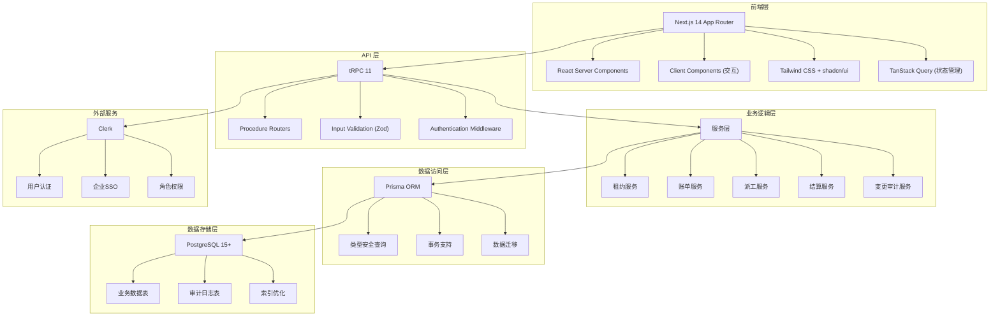
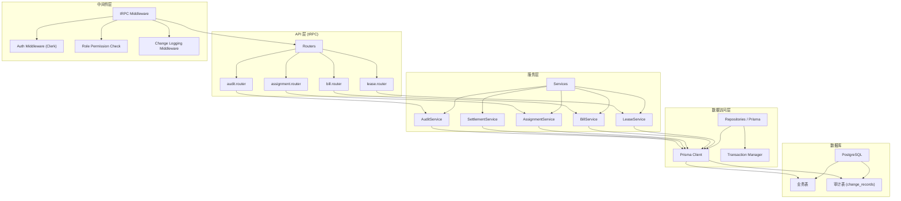
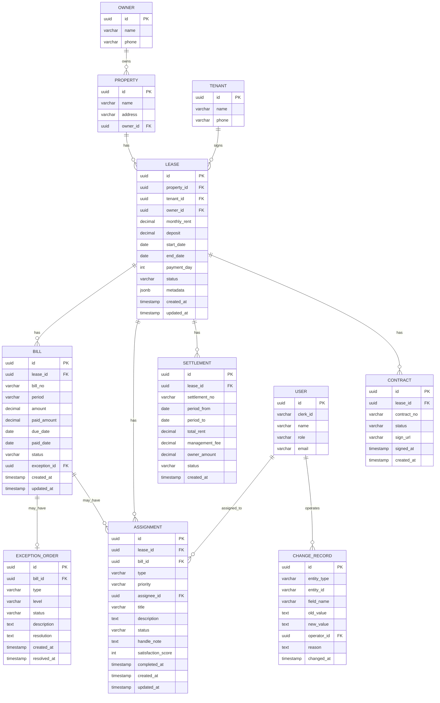

## 1. 架构设计



## 2. 技术描述

### 2.1 核心技术栈

| 层级 | 技术选型 | 版本 | 用途 |
|------|---------|------|------|
| 前端框架 | Next.js | 14.x | App Router, RSC, SSR |
| 前端语言 | TypeScript | 5.x | 类型安全 |
| UI 框架 | Tailwind CSS | 3.x | 原子化 CSS |
| UI 组件 | shadcn/ui | latest | 高质量组件库 |
| 图标库 | lucide-react | latest | 图标组件 |
| 状态管理 | TanStack Query | 5.x | 服务端状态管理 |
| API 框架 | tRPC | 11.x | 端到端类型安全 API |
| 数据校验 | Zod | 3.x | Schema 校验 |
| ORM | Prisma | 5.x | 数据库访问 |
| 数据库 | PostgreSQL | 15.x | 关系型数据库 |
| 认证服务 | Clerk | latest | 用户认证与权限 |
| 图表库 | recharts | 2.x | 数据可视化 |
| 表单处理 | react-hook-form | 7.x | 表单管理 |
| 日期处理 | date-fns | 3.x | 日期格式化与计算 |

### 2.2 项目初始化方式

使用官方 Next.js + tRPC + Prisma 模板初始化项目，然后添加 Clerk 集成。

```bash
npx create-t3-app@latest . \
  --packageManager pnpm \
  --template next \
  --prisma \
  --trpc \
  --tailwind \
  --typescript \
  --noGit \
  --noInstall
```

## 3. 路由定义

### 3.1 前端路由 (Next.js App Router)

| 路由 | 页面用途 | 权限要求 |
|------|---------|----------|
| `/` | 仪表盘首页 | 已登录 |
| `/dashboard` | 数据概览仪表盘 | 已登录 |
| `/leases` | 租约列表 | 财务/管理员 |
| `/leases/[id]` | 租约详情 | 财务/管理员 |
| `/bills` | 账单列表 | 财务/管理员 |
| `/bills/[id]` | 账单详情 | 财务/管理员 |
| `/assignments` | 派工列表 | 全部已登录用户 |
| `/assignments/[id]` | 派工详情 | 全部已登录用户 |
| `/settlements` | 业主结算 | 财务/管理员 |
| `/contracts` | 合同签署 | 财务/管理员 |
| `/audit` | 变更记录审计 | 管理员 |
| `/workbench` | 一线工作台 | 一线人员/管理员 |
| `/settings` | 系统设置 | 管理员 |

### 3.2 tRPC API 路由

| Router | 路径 | 主要方法 |
|--------|------|----------|
| leaseRouter | `/api/trpc/lease.*` | list, getById, create, update, search |
| billRouter | `/api/trpc/bill.*` | list, getById, create, pay, generateException, search |
| assignmentRouter | `/api/trpc/assignment.*` | list, getById, create, assign, updateStatus, complete |
| settlementRouter | `/api/trpc/settlement.*` | list, getById, create, confirm |
| contractRouter | `/api/trpc/contract.*` | list, getById, updateStatus |
| auditRouter | `/api/trpc/audit.*` | list, searchByField, getChangeHistory |
| dashboardRouter | `/api/trpc/dashboard.*` | getStats, getOverdueList, getCollectionTrend |

## 4. API 类型定义

### 4.1 核心实体类型

```typescript
// 租约类型
interface Lease {
  id: string;
  propertyId: string;
  propertyName: string;
  tenantId: string;
  tenantName: string;
  tenantPhone: string;
  ownerId: string;
  ownerName: string;
  monthlyRent: number;
  deposit: number;
  startDate: Date;
  endDate: Date;
  paymentDay: number;
  status: 'ACTIVE' | 'EXPIRED' | 'TERMINATED' | 'PENDING';
  createdAt: Date;
  updatedAt: Date;
}

// 账单类型
interface Bill {
  id: string;
  leaseId: string;
  billNo: string;
  period: string;
  amount: number;
  paidAmount: number;
  dueDate: Date;
  paidDate: Date | null;
  status: 'UNPAID' | 'PARTIAL' | 'PAID' | 'OVERDUE' | 'EXCEPTION';
  exceptionId: string | null;
  createdAt: Date;
  updatedAt: Date;
}

// 派工类型
interface Assignment {
  id: string;
  billId: string | null;
  leaseId: string;
  type: 'COLLECTION' | 'REPAIR' | 'VISIT' | 'COMPLAINT';
  priority: 'LOW' | 'MEDIUM' | 'HIGH' | 'URGENT';
  assigneeId: string;
  assigneeName: string;
  title: string;
  description: string;
  status: 'PENDING' | 'IN_PROGRESS' | 'COMPLETED' | 'CANCELLED';
  handleNote: string | null;
  completedAt: Date | null;
  createdAt: Date;
  updatedAt: Date;
}

// 异常单类型
interface ExceptionOrder {
  id: string;
  billId: string;
  type: 'OVERDUE' | 'DISPUTE' | 'DAMAGE';
  level: 'NORMAL' | 'SERIOUS' | 'CRITICAL';
  status: 'OPEN' | 'HANDLING' | 'RESOLVED' | 'CLOSED';
  description: string;
  resolution: string | null;
  createdAt: Date;
}

// 变更记录类型
interface ChangeRecord {
  id: string;
  entityType: 'LEASE' | 'BILL' | 'ASSIGNMENT' | 'SETTLEMENT';
  entityId: string;
  fieldName: string;
  oldValue: string | null;
  newValue: string | null;
  operatorId: string;
  operatorName: string;
  changedAt: Date;
  reason: string | null;
}
```

### 4.2 请求/响应 Schema

```typescript
// 账单搜索输入
interface BillSearchInput {
  leaseId?: string;
  status?: BillStatus[];
  periodFrom?: string;
  periodTo?: string;
  tenantName?: string;
  propertyName?: string;
  minAmount?: number;
  maxAmount?: number;
  isOverdue?: boolean;
  page: number;
  pageSize: number;
}

// 派工完成输入
interface AssignmentCompleteInput {
  id: string;
  handleNote: string;
  satisfactionScore?: number;
  needFollowUp?: boolean;
}

// 变更记录搜索输入
interface AuditSearchInput {
  entityType?: ChangeRecordEntityType;
  entityId?: string;
  fieldName?: string;
  operatorId?: string;
  changedFrom?: Date;
  changedTo?: Date;
  oldValue?: string;
  newValue?: string;
  page: number;
  pageSize: number;
}
```

## 5. 服务端架构



## 6. 数据模型

### 6.1 ER 图



### 6.2 Prisma Schema 定义

```prisma
model Lease {
  id          String   @id @default(uuid())
  propertyId  String
  property    Property @relation(fields: [propertyId], references: [id])
  tenantId    String
  tenant      Tenant   @relation(fields: [tenantId], references: [id])
  ownerId     String
  owner       Owner    @relation(fields: [ownerId], references: [id])
  monthlyRent Decimal  @db.Decimal(10, 2)
  deposit     Decimal  @db.Decimal(10, 2)
  startDate   DateTime @db.Date
  endDate     DateTime @db.Date
  paymentDay  Int
  status      LeaseStatus
  bills       Bill[]
  assignments Assignment[]
  settlements Settlement[]
  contracts   Contract[]
  createdAt   DateTime @default(now())
  updatedAt   DateTime @updatedAt

  @@index([status])
  @@index([tenantId])
  @@index([propertyId])
}

model Bill {
  id           String          @id @default(uuid())
  leaseId      String
  lease        Lease           @relation(fields: [leaseId], references: [id])
  billNo       String          @unique
  period       String
  amount       Decimal         @db.Decimal(10, 2)
  paidAmount   Decimal         @default(0) @db.Decimal(10, 2)
  dueDate      DateTime        @db.Date
  paidDate     DateTime?       @db.Date
  status       BillStatus
  exceptionId  String?
  exception    ExceptionOrder? @relation(fields: [exceptionId], references: [id])
  assignments  Assignment[]
  createdAt    DateTime        @default(now())
  updatedAt    DateTime        @updatedAt

  @@index([status])
  @@index([dueDate])
  @@index([leaseId])
}

model Assignment {
  id                String     @id @default(uuid())
  leaseId           String
  lease             Lease      @relation(fields: [leaseId], references: [id])
  billId            String?
  bill              Bill?      @relation(fields: [billId], references: [id])
  type              AssignmentType
  priority          Priority
  assigneeId        String
  assignee          User       @relation(fields: [assigneeId], references: [id], name: "assignee")
  title             String
  description       String
  status            AssignmentStatus
  handleNote        String?
  satisfactionScore Int?
  completedAt       DateTime?
  createdAt         DateTime   @default(now())
  updatedAt         DateTime   @updatedAt

  @@index([status])
  @@index([assigneeId])
  @@index([priority])
}

model ExceptionOrder {
  id         String     @id @default(uuid())
  billId     String     @unique
  bill       Bill       @relation(fields: [billId], references: [id])
  type       ExceptionType
  level      ExceptionLevel
  status     ExceptionStatus
  description String
  resolution String?
  createdAt  DateTime   @default(now())
  resolvedAt DateTime?
}

model ChangeRecord {
  id          String   @id @default(uuid())
  entityType  String
  entityId    String
  fieldName   String
  oldValue    String?
  newValue    String?
  operatorId  String
  operator    User     @relation(fields: [operatorId], references: [id], name: "operator")
  reason      String?
  changedAt   DateTime @default(now())

  @@index([entityType, entityId])
  @@index([fieldName])
  @@index([changedAt])
}

enum LeaseStatus {
  PENDING
  ACTIVE
  EXPIRED
  TERMINATED
}

enum BillStatus {
  UNPAID
  PARTIAL
  PAID
  OVERDUE
  EXCEPTION
}

enum AssignmentType {
  COLLECTION
  REPAIR
  VISIT
  COMPLAINT
}

enum AssignmentStatus {
  PENDING
  IN_PROGRESS
  COMPLETED
  CANCELLED
}

enum Priority {
  LOW
  MEDIUM
  HIGH
  URGENT
}
```

### 6.3 初始数据 (Seed)

```typescript
// 初始用户、角色、示例租约和账单数据
// 用于开发环境演示
```

## 7. 关键技术实现

### 7.1 字段级变更追踪实现

在 tRPC 中间件层面实现自动变更追踪：
- 对 update 操作进行拦截
- 对比变更前后的字段值
- 自动记录到 change_records 表
- 支持配置需要追踪的字段

### 7.2 租金逾期自动检测

- 使用 PostgreSQL 定时任务或 Vercel Cron
- 每日凌晨扫描未支付账单
- 超过 dueDate 自动标记为 OVERDUE
- 逾期超过 X 天自动生成异常单并派工

### 7.3 少跳转设计实现

- 使用 React Server Components 预加载列表关键字段
- 抽屉组件（Drawer）承载详情编辑
- URL 状态同步，支持刷新和分享
- 并行数据加载减少等待时间

### 7.4 权限控制

- 基于 Clerk 的角色元数据
- tRPC 中间件进行接口级权限校验
- 前端根据角色动态渲染菜单和按钮
- 敏感操作二次确认
