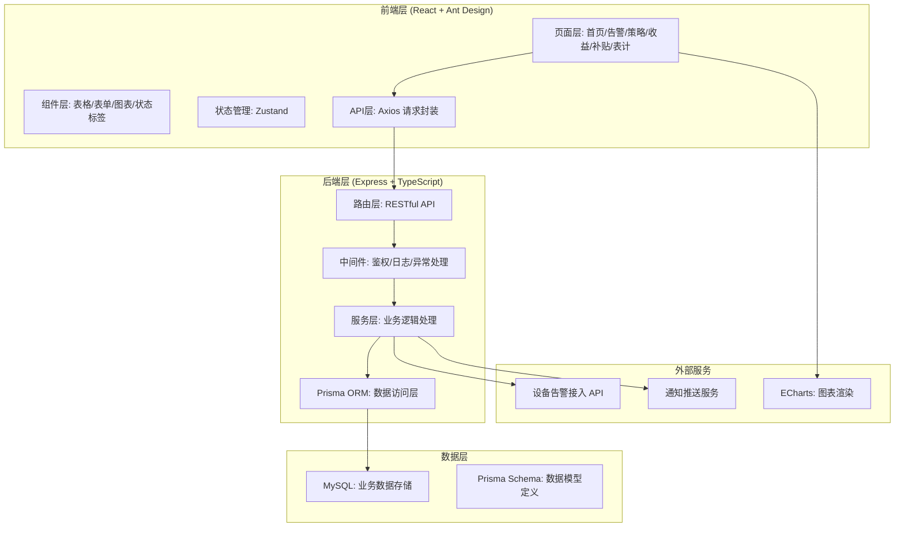
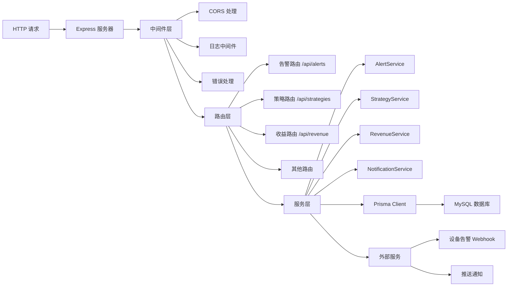
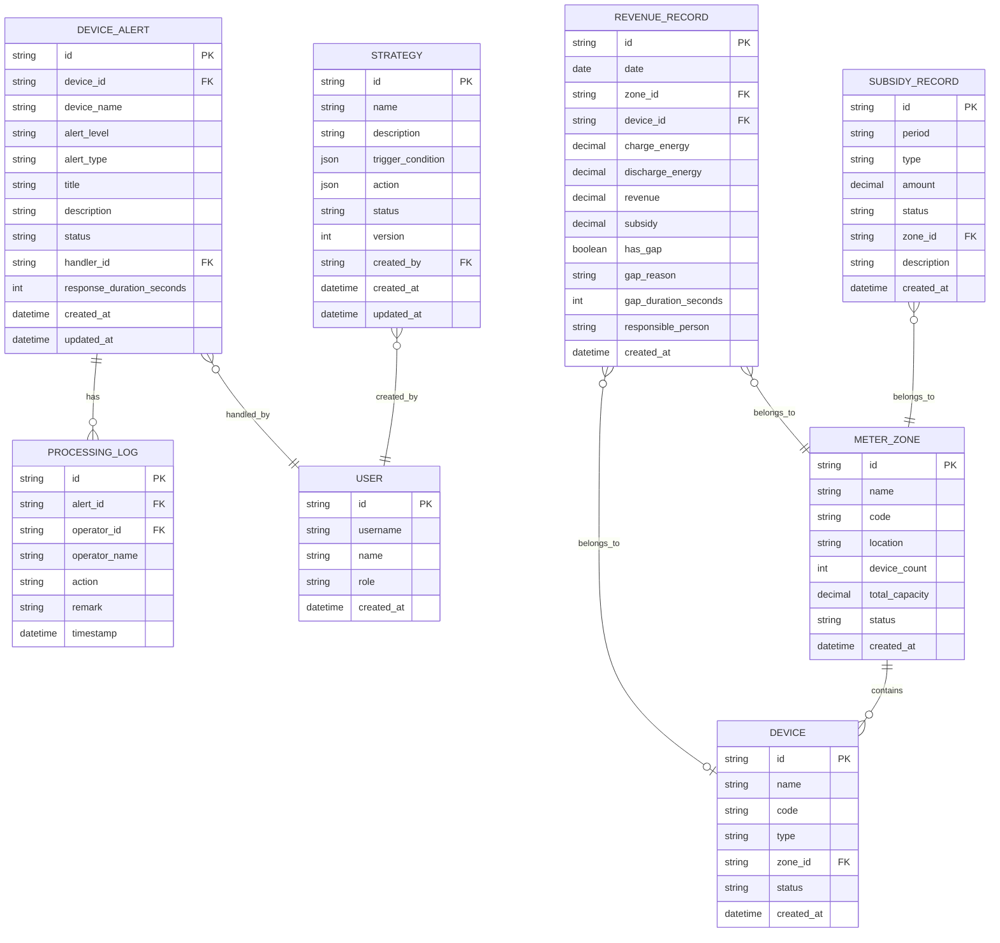

## 1. 架构设计



## 2. 技术描述

- **前端框架**: React@18 + TypeScript
- **UI 组件库**: Ant Design@5
- **状态管理**: Zustand@4
- **路由管理**: React Router DOM@6
- **HTTP 客户端**: Axios@1
- **图表库**: ECharts@5 + echarts-for-react
- **图标库**: @ant-design/icons + lucide-react
- **构建工具**: Vite@5
- **样式方案**: TailwindCSS@3 + Ant Design 主题
- **后端框架**: Express@4 + TypeScript
- **ORM**: Prisma@5
- **数据库**: MySQL@8
- **开发语言**: TypeScript 严格模式

## 3. 路由定义

### 前端路由

| 路由路径 | 页面名称 | 说明 |
|----------|----------|------|
| / | 首页仪表盘 | 关键指标概览、告警统计、收益趋势 |
| /alerts | 设备告警列表 | 告警列表、筛选、状态操作 |
| /alerts/:id | 设备告警详情 | 告警详情、处理记录 |
| /strategies | 策略配置列表 | 策略列表、启停控制 |
| /strategies/create | 创建策略 | 策略表单编辑 |
| /strategies/:id/edit | 编辑策略 | 策略表单编辑 |
| /revenue | 储能收益总览 | 收益概览、趋势分析 |
| /revenue/detail | 储能收益明细 | 下钻明细、缺口分析 |
| /subsidies | 补贴记录列表 | 补贴记录、筛选查询 |
| /meters | 表计分区列表 | 分区列表、设备关联 |

### 后端 API 路由

| 方法 | 路由路径 | 说明 |
|------|----------|------|
| GET | /api/dashboard/stats | 获取首页统计数据 |
| GET | /api/dashboard/trends | 获取趋势数据 |
| GET | /api/alerts | 获取告警列表 |
| GET | /api/alerts/:id | 获取告警详情 |
| PUT | /api/alerts/:id/status | 更新告警状态 |
| POST | /api/alerts/webhook | 设备告警 webhook 接入 |
| GET | /api/strategies | 获取策略列表 |
| GET | /api/strategies/:id | 获取策略详情 |
| POST | /api/strategies | 创建策略 |
| PUT | /api/strategies/:id | 更新策略 |
| PUT | /api/strategies/:id/toggle | 启停策略 |
| GET | /api/revenue/summary | 收益总览 |
| GET | /api/revenue/details | 收益明细 |
| GET | /api/revenue/gaps | 数据缺口分析 |
| GET | /api/subsidies | 补贴记录列表 |
| GET | /api/meters | 表计分区列表 |

## 4. API 定义

### 类型定义

```typescript
// 告警状态枚举
type AlertStatus = 'PENDING' | 'PROCESSING' | 'COMPLETED' | 'ABNORMAL_CLOSED';

// 告警级别
type AlertLevel = 'INFO' | 'WARNING' | 'ERROR' | 'CRITICAL';

// 策略状态
type StrategyStatus = 'ACTIVE' | 'INACTIVE';

// 设备告警
interface DeviceAlert {
  id: string;
  deviceId: string;
  deviceName: string;
  alertLevel: AlertLevel;
  alertType: string;
  title: string;
  description: string;
  status: AlertStatus;
  handlerId?: string;
  handlerName?: string;
  responseDuration?: number;
  createdAt: string;
  updatedAt: string;
  processingLogs: ProcessingLog[];
}

// 处理记录
interface ProcessingLog {
  id: string;
  alertId: string;
  operatorId: string;
  operatorName: string;
  action: string;
  remark: string;
  timestamp: string;
}

// 运行策略
interface Strategy {
  id: string;
  name: string;
  description: string;
  triggerCondition: Record<string, any>;
  action: Record<string, any>;
  status: StrategyStatus;
  version: number;
  createdBy: string;
  createdAt: string;
  updatedAt: string;
}

// 储能收益
interface RevenueRecord {
  id: string;
  date: string;
  zoneId: string;
  zoneName: string;
  deviceId?: string;
  deviceName?: string;
  chargeEnergy: number;
  dischargeEnergy: number;
  revenue: number;
  subsidy: number;
  hasGap: boolean;
  gapReason?: string;
  gapDuration?: number;
  responsiblePerson?: string;
  createdAt: string;
}

// 补贴记录
interface SubsidyRecord {
  id: string;
  period: string;
  type: string;
  amount: number;
  status: 'PENDING' | 'APPROVED' | 'PAID';
  description: string;
  createdAt: string;
}

// 表计分区
interface MeterZone {
  id: string;
  name: string;
  code: string;
  location: string;
  deviceCount: number;
  onlineCount: number;
  totalCapacity: number;
  status: 'NORMAL' | 'WARNING' | 'ERROR';
}
```

### 请求响应示例

**GET /api/alerts**
```typescript
// Query: { page: 1, pageSize: 20, status?: AlertStatus, level?: AlertLevel, deviceId?: string }
// Response:
{
  data: DeviceAlert[],
  total: number,
  page: number,
  pageSize: number
}
```

**PUT /api/alerts/:id/status**
```typescript
// Body: { status: AlertStatus, remark: string, operatorId: string }
// Response:
{
  success: boolean,
  data: DeviceAlert
}
```

## 5. 服务器架构图



## 6. 数据模型

### 6.1 数据模型定义



### 6.2 Prisma Schema 定义

```prisma
generator client {
  provider = "prisma-client-js"
}

datasource db {
  provider = "mysql"
  url      = env("DATABASE_URL")
}

enum AlertStatus {
  PENDING
  PROCESSING
  COMPLETED
  ABNORMAL_CLOSED
}

enum AlertLevel {
  INFO
  WARNING
  ERROR
  CRITICAL
}

enum StrategyStatus {
  ACTIVE
  INACTIVE
}

enum UserRole {
  ADMIN
  OPERATOR
  ANALYST
}

model User {
  id        String   @id @default(cuid())
  username  String   @unique
  name      String
  role      UserRole @default(OPERATOR)
  createdAt DateTime @default(now())
  alerts    DeviceAlert[]
  strategies Strategy[]
  logs      ProcessingLog[]
}

model Device {
  id        String   @id @default(cuid())
  name      String
  code      String   @unique
  type      String
  zoneId    String
  status    String
  createdAt DateTime @default(now())
  zone      MeterZone @relation(fields: [zoneId], references: [id])
  alerts    DeviceAlert[]
  revenueRecords RevenueRecord[]
}

model MeterZone {
  id            String   @id @default(cuid())
  name          String
  code          String   @unique
  location      String
  deviceCount   Int      @default(0)
  totalCapacity Decimal  @default(0) @db.Decimal(10, 2)
  status        String   @default("NORMAL")
  createdAt     DateTime @default(now())
  devices       Device[]
  revenueRecords RevenueRecord[]
  subsidies     SubsidyRecord[]
}

model DeviceAlert {
  id                  String          @id @default(cuid())
  deviceId            String
  deviceName          String
  alertLevel          AlertLevel
  alertType           String
  title               String
  description         String
  status              AlertStatus     @default(PENDING)
  handlerId           String?
  responseDurationSeconds Int?
  createdAt           DateTime        @default(now())
  updatedAt           DateTime        @updatedAt
  handler             User?           @relation(fields: [handlerId], references: [id])
  processingLogs      ProcessingLog[]
}

model ProcessingLog {
  id           String   @id @default(cuid())
  alertId      String
  operatorId   String
  operatorName String
  action       String
  remark       String
  timestamp    DateTime @default(now())
  alert        DeviceAlert @relation(fields: [alertId], references: [id])
  operator     User     @relation(fields: [operatorId], references: [id])
}

model Strategy {
  id               String         @id @default(cuid())
  name             String
  description      String
  triggerCondition Json
  action           Json
  status           StrategyStatus @default(ACTIVE)
  version          Int            @default(1)
  createdById      String
  createdAt        DateTime       @default(now())
  updatedAt        DateTime       @updatedAt
  createdBy        User           @relation(fields: [createdById], references: [id])
}

model RevenueRecord {
  id                   String   @id @default(cuid())
  date                 DateTime
  zoneId               String
  deviceId             String?
  chargeEnergy         Decimal  @db.Decimal(10, 4)
  dischargeEnergy      Decimal  @db.Decimal(10, 4)
  revenue              Decimal  @db.Decimal(10, 2)
  subsidy              Decimal  @default(0) @db.Decimal(10, 2)
  hasGap               Boolean  @default(false)
  gapReason            String?
  gapDurationSeconds   Int?
  responsiblePerson    String?
  createdAt            DateTime @default(now())
  zone                 MeterZone @relation(fields: [zoneId], references: [id])
  device               Device?  @relation(fields: [deviceId], references: [id])
}

model SubsidyRecord {
  id          String   @id @default(cuid())
  period      String
  type        String
  amount      Decimal  @db.Decimal(10, 2)
  status      String   @default("PENDING")
  zoneId      String
  description String
  createdAt   DateTime @default(now())
  zone        MeterZone @relation(fields: [zoneId], references: [id])
}
```
