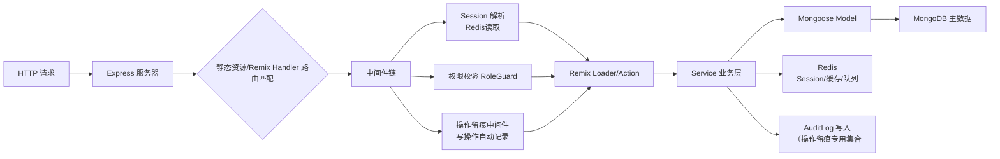
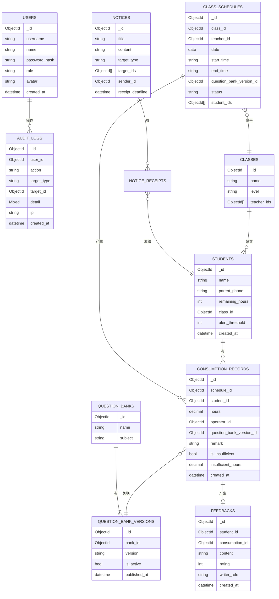

## 1. 架构设计

```mermaid
graph TB
    subgraph "前端层 Remix SPA & Pages
        A1["Remix SSR/CSR 路由
登录/工作台/报表/通知后台/课表/题库"] --> B1["React 18 + TypeScript
组件层：Tailwind CSS 组件库
状态：Zustand
图标：lucide-react"]
    end

    subgraph "服务层 Remix Loader/Action + Express 中间件"
        C1["Express 4.x
自定义Express服务器
挂载Remix request handler"] --> C2["认证中间件
session + JWT"]
        C1 --> C3["操作留痕中间件
AOP 拦截所有写操作"]
        C1 --> C4["通知催发定时任务
node-cron 24h回执检查"]
    end

    subgraph "业务逻辑层 Service"
        D1["消课服务
课时校验+扣减
不足检测+提醒"]
        D2["课表服务
周视图+调课"]
        D3["通知回执服务
模板+发送+催发"]
        D4["报表服务
多维统计+月度复盘"]
    end

    subgraph "数据层"
        E1["MongoDB 6.x
Mongoose ODM
9 张核心集合"]
        E2["Redis 7.x
ioredis 客户端
session缓存
课表热点缓存
课时不足提醒队列
操作留痕缓冲"]
    end

    A1 -- Remix loaders/actions --> C1
    C1 --> D1 & D2 & D3 & D4
    D1 & D2 & D3 & D4 --> E1
    D1 & D2 & D3 & D4 --> E2
```

## 2. 技术说明

| 层级 | 技术选型 | 版本 | 用途说明 |
|------|----------|------|---------|
| 全栈框架 | Remix | 2.x | SSR/CSR 混合，Loader/Action 数据加载，路由式路由，Express 自定义服务器 |
| 前端 UI | React + TypeScript | 18.x + 5.x | 类型安全组件开发 |
| 样式方案 | Tailwind CSS | 3.4.x | Utility-First CSS，响应式工具类 |
| 状态管理 | Zustand | 4.x | 全局轻量状态（用户/筛选条件/消课面板状态 |
| 后端服务器 | Express | 4.19.x | 自定义 server，挂载Remix handler，自定义中间件 |
| 主数据库 | MongoDB + Mongoose | 6.x + 8.x | 文档型存储，适合教务数据灵活结构 |
| 缓存/队列 | Redis + ioredis | 7.x + 5.x | Session 存储、热点课表缓存、提醒队列、操作留痕缓冲 |
| 认证 | Remix Auth + jsonwebtoken + bcryptjs | - | Cookie-based Session，密码加密 |
| 定时任务 | node-cron | 3.x | 回执催发、月度复盘自动预计算 |
| 图表 | recharts | 2.12.x | 课时统计柱状图、课时不足对比图 |
| 初始化 | 手动 create-remix（custom express 模板） | - | 项目脚手架 |

## 3. 路由定义（Remix File-based Routes）

| 文件路径（app/routes/） | 页面/接口用途 | 对应角色 |
|------------------------|---------------|----------|
| `_index` | 根 Layout，登录后跳转工作台 | - |
| `login` | 登录页 | 全部 |
| `dashboard` | 教务工作台（入口页+课表+消课录入同区） | 教务/管理员 |
| `reports.index` | 课时统计报表（多维筛选+操作留痕+家校反馈嵌入） | 全部 |
| `reports.monthly` | 月度复盘页面 | 管理员/运营 |
| `notices.index` | 通知列表+回执看板 | 运营/管理员 |
| `notices.new` | 新建/编辑通知 | 运营/管理员 |
| `schedule` | 班级课表（周视图） | 教务/管理员 |
| `question-bank` | 题库版本管理 | 教务/管理员 |
| `api.logout` | 登出 Action | 全部 |

## 4. API 定义（Remix Action + Express 补充接口
```typescript
// ===== 共享类型定义 shared/types.ts

export interface User {
  id: string;
  username: string;
  name: string;
  role: 'teacher' | 'operator' | 'admin';
  avatar?: string;
}

export interface Student {
  id: string;
  name: string;
  parentPhone: string;
  remainingHours: number;
  classId: string;
  alertThreshold: number; // 课时预警阈值，默认3
}

export interface ClassSchedule {
  id: string;
  classId: string;
  className: string;
  teacherId: string;
  teacherName: string;
  date: string; // YYYY-MM-DD
  startTime: string; // HH:mm
  endTime: string;
  questionBankVersionId: string;
  status: 'pending' | 'completed' | 'cancelled';
  studentIds: string[];
}

export interface ConsumptionRecord {
  id: string;
  scheduleId: string;
  studentId: string;
  studentName: string;
  hours: number;
  operatorId: string;
  operatorName: string;
  questionBankVersionId: string;
  questionBankVersionName: string;
  remark?: string;
  isInsufficient: boolean; // 课时不足标记
  insufficientHours?: number; // 缺口数
  createdAt: string;
}

export interface AuditLog {
  id: string;
  userId: string;
  userName: string;
  action: 'create_consumption' | 'update_schedule' | 'publish_notice' | 'adjust_hours';
  targetType: 'consumption' | 'schedule' | 'notice' | 'student';
  targetId: string;
  detail: Record<string, any>;
  ip?: string;
  createdAt: string;
}

export interface Notice {
  id: string;
  title: string;
  content: string;
  templateId?: string;
  senderId: string;
  targetType: 'all' | 'class' | 'students';
  targetIds: string[];
  publishedAt: string;
  receiptDeadline: string;
}

export interface NoticeReceipt {
  id: string;
  noticeId: string;
  studentId: string;
  parentName: string;
  isRead: boolean;
  isConfirmed: boolean;
  feedback?: string;
  readAt?: string;
  confirmedAt?: string;
}

export interface Feedback {
  id: string;
  studentId: string;
  consumptionId?: string; // 关联消课记录
  content: string;
  rating?: number;
  createdAt: string;
  writerRole: 'parent' | 'teacher';
}

// ===== Action 请求/响应

// POST /dashboard (Remix action - 消课提交
export interface CreateConsumptionRequest {
  scheduleId: string;
  items: {
    studentId: string;
    hours: number;
  }[];
  questionBankVersionId: string;
  remark?: string;
}

export interface CreateConsumptionResponse {
  success: boolean;
  records: ConsumptionRecord[];
  insufficientAlerts: {
    studentId: string;
    studentName: string;
    remaining: number;
    shortage: number;
  }[];
}

// GET /reports?range=7d&classId=xxx
export interface ReportQuery {
  startDate: string;
  endDate: string;
  classId?: string;
  studentId?: string;
}

export interface ReportItem {
  date: string;
  totalHours: number;
  studentCount: number;
  abnormalCount: number;
  records: ConsumptionRecord[];
  auditLogs: AuditLog[]; // 每条记录关联的操作留痕
  feedbacks: Feedback[]; // 嵌入的家校反馈
}

// POST /notices/new
export interface CreateNoticeRequest {
  title: string;
  content: string;
  targetType: 'all' | 'class' | 'students';
  targetIds: string[];
  receiptDeadline: string;
}
```

## 5. 服务器架构图



**操作留痕中间件**：Express 层面拦截所有 POST/PUT/DELETE 请求，自动从 session 取当前用户，组装操作日志写入 AuditLog 集合，Redis 先写缓冲，5s 落库。

## 6. 数据模型

### 6.1 ER Diagram



### 6.2 Mongoose Schema 索引与初始数据

```javascript
// mongoose schemas & 索引

// users 索引：username(唯一)
db.users.createIndex({ username: 1 }, { unique: true });

// students 索引：class_id, remaining_hours(用于课时预警查询)
db.students.createIndex({ class_id: 1 });
db.students.createIndex({ remaining_hours: 1 });

// class_schedules 复合索引：class_id + date（课表查询主力查询
db.class_schedules.createIndex({ class_id: 1, date: 1 });
db.class_schedules.createIndex({ date: 1, status: 1 });

// consumption_records 复合索引：student_id + created_at（报表查询
db.consumption_records.createIndex({ student_id: 1, created_at: -1 });
db.consumption_records.createIndex({ schedule_id: 1 });
db.consumption_records.createIndex({ is_insufficient: 1 });

// audit_logs TTL 索引：created_at（保留90天
db.audit_logs.createIndex({ created_at: 1 }, { expireAfterSeconds: 7776000 });
db.audit_logs.createIndex({ target_type: 1, target_id: 1 });

// notices + notice_receipts
db.notices.createIndex({ published_at: -1 });
db.notice_receipts.createIndex({ notice_id: 1, student_id: 1 }, { unique: true });
db.notice_receipts.createIndex({ is_confirmed: 1, receipt_deadline: 1 }); // 催发查询用

// feedbacks
db.feedbacks.createIndex({ consumption_id: 1 });
db.feedbacks.createIndex({ student_id: 1, created_at: -1 });

// ====== 初始种子数据

// 初始管理员
db.users.insertOne({
  username: 'admin',
  name: '北桥教务长',
  password_hash: '...bcrypt加密后的散列',
  role: 'admin',
  created_at: ISODate()
});

// 初始班级 + 学员 + 课表示例数据（见 api/seed/init.ts 脚本中完整
```

### 6.3 Redis Key 设计

| Key 模式 | 类型 | TTL | 用途 |
|-----------|------|-----|------|
| `session:{sid}` | Hash | 7d | 用户会话 |
| `schedule:date:{YYYY-MM-DD}` | JSON | 1h | 当日课表缓存 |
| `hours:alert:list | Set | - | 课时不足学员实时预警队列 |
| `audit:buffer` | List | - | 操作留痕缓冲队列，批量落库 |
| `notice:unreceipt:{date}` | ZSet | - | 当日未回执学员集合，score为催发用 |
