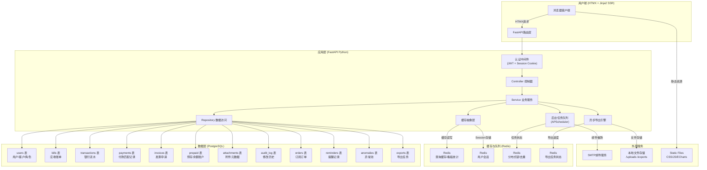

## 1. 架构设计



## 2. 技术说明

- **后端框架**：FastAPI 0.115.x + Pydantic v2 + Uvicorn
- **服务端渲染**：Jinja2 模板引擎 + HTMX 1.9.x（无前端构建步骤）
- **前端增强**：Alpine.js 3.x（轻量交互）、ECharts 5.x（趋势图/看板）、Lucide Icons（SVG图标）
- **ORM & 迁移**：SQLAlchemy 2.0.x（异步模式 asyncpg） + Alembic
- **数据库**：PostgreSQL 16.x
- **缓存**：Redis 7.x + redis-py async 客户端
- **后台任务**：APScheduler（内置，轻量级定时任务：提醒扫描、现金预测计算、导出清理）
- **认证**：python-jose（JWT）+ passlib（bcrypt）+ Session Cookie（双token：短期访问+长期刷新）
- **导出**：openpyxl（Excel生成）+ asyncio（异步后台导出）
- **文件上传**：python-multipart + aiofiles（异步文件处理）
- **数据校验**：pydantic v2（请求/响应模型）+ 自定义校验器（税号、手机号、邮箱格式）
- **环境配置**：pydantic-settings + .env 文件
- **代码风格**：ruff（lint）+ black（format）+ mypy（类型检查）

## 3. 路由定义

| 路由前缀 | 方法 | 用途 | 权限 |
|---------|------|------|------|
| `/auth/login` | POST | 用户登录，返回Session Cookie | 公开 |
| `/auth/logout` | POST | 用户登出 | 登录用户 |
| `/auth/register` | POST | 客户自助注册 | 公开 |
| `/` | GET | 工作台首页（管理员）/ 我的账单（客户） | 登录用户 |
| `/admin/dashboard` | GET | 工作台首页：今日任务+异常池+趋势图 | 管理员 |
| `/admin/bills` | GET | 应收账单列表（含优先级标签+筛选） | 管理员 |
| `/admin/bills/{bill_id}` | GET/PUT | 账单详情处理（附件/备注/历史） | 管理员 |
| `/admin/bills/{bill_id}/attachments` | POST/DELETE | 附件上传/删除 | 管理员 |
| `/admin/bills/{bill_id}/notes` | POST | 新增备注 | 管理员 |
| `/admin/transactions` | GET | 流水列表+导入入口 | 管理员 |
| `/admin/transactions/import` | POST | 流水CSV/Excel导入 | 管理员 |
| `/admin/transactions/{txn_id}/match` | POST | 手动匹配账单 | 管理员 |
| `/admin/transactions/auto-match` | POST | 触发智能匹配 | 管理员 |
| `/admin/reconciliation` | GET | 订单-账单-流水三方对账 | 管理员 |
| `/admin/collection` | GET | 回款看板+KPI+进度 | 管理员 |
| `/admin/collection/reminders` | GET/POST | 提醒配置与发送日志 | 管理员 |
| `/admin/invoices` | GET | 发票申请列表（含校验状态） | 管理员 |
| `/admin/invoices/{inv_id}/validate` | POST | 发票信息校验 | 管理员 |
| `/admin/prepaid` | GET | 预存余额账户总览 | 管理员 |
| `/admin/prepaid/{account_id}` | GET | 预存账户明细 | 管理员 |
| `/admin/cashflow-forecast` | GET | 现金预测报表+账龄分析 | 管理员 |
| `/admin/exports` | GET/POST | 导出任务中心 | 管理员 |
| `/admin/exports/{task_id}/download` | GET | 下载导出文件 | 管理员 |
| `/admin/anomalies` | GET | 异常池列表+分类筛选 | 管理员 |
| `/admin/anomalies/{anom_id}/resolve` | POST | 处理异常 | 管理员 |
| `/client/bills` | GET | 客户端：我的账单列表 | 客户 |
| `/client/bills/{bill_id}` | GET | 客户端：账单详情 | 客户 |
| `/client/bills/{bill_id}/pay` | GET/POST | 客户端：付款入口 | 客户 |
| `/client/bills/{bill_id}/pay/prepaid` | POST | 客户端：预存抵扣付款 | 客户 |
| `/client/invoices` | GET/POST | 客户端：发票申请 | 客户 |
| `/client/prepaid` | GET | 客户端：预存中心+充值 | 客户 |
| `/client/prepaid/recharge` | POST | 客户端：在线充值 | 客户 |

## 4. API 数据模型定义

```typescript
// 核心实体类型定义
type BillStatus = 'DRAFT' | 'ISSUED' | 'PARTIAL' | 'PAID' | 'OVERDUE' | 'VOID';
type InvoiceStatus = 'PENDING' | 'APPROVED' | 'ISSUING' | 'ISSUED' | 'MAILED' | 'ERROR';
type TxnMatchStatus = 'UNMATCHED' | 'PARTIAL' | 'MATCHED' | 'ANOMALY';
type AnomalyType = 'TXN_UNMATCHED' | 'INVOICE_ERROR' | 'AMOUNT_DIFF' | 'OVERDUE_LIMIT' | 'FORECAST_WARN';
type PrepaidTxnType = 'RECHARGE' | 'DEDUCT' | 'REFUND' | 'ADJUST';
type ExportType = 'CASHFLOW' | 'INVOICE_ERRORS' | 'CHANGE_LOG' | 'BILL_DETAIL' | 'RECONCILIATION';

interface User {
  id: string;
  email: string;
  name: string;
  role: 'ADMIN' | 'CLIENT';
  client_id?: string;  // 客户角色关联
  avatar?: string;
  created_at: string;
}

interface Client {
  id: string;
  name: string;
  tax_id: string;
  contact_name: string;
  contact_phone: string;
  address: string;
  bank_name: string;
  bank_account: string;
  prepaid_balance: number;
  credit_limit: number;
  created_at: string;
}

interface Bill {
  id: string;
  bill_no: string;
  client_id: string;
  client_name: string;
  order_id?: string;
  period_start: string;  // 账期开始
  period_end: string;    // 账期结束
  issue_date: string;    // 出账日期
  due_date: string;      // 到期日期
  total_amount: number;  // 应收总额
  paid_amount: number;   // 已收金额
  remaining_amount: number;
  status: BillStatus;
  days_overdue: number;
  // 优先级标签相关
  invoice_status: InvoiceStatus | null;
  invoice_requested: boolean;
  prepaid_sufficient: boolean;
  forecast_impact: 'INCREASE' | 'DECREASE' | 'NONE';
  forecast_score: number;
  // 元数据
  created_by?: string;
  created_at: string;
  updated_at: string;
}

interface BankTransaction {
  id: string;
  txn_no: string;       // 银行流水号
  txn_date: string;
  amount: number;
  direction: 'IN' | 'OUT';
  counterparty: string;  // 对方户名
  counterparty_account: string;
  summary: string;       // 摘要/备注
  balance_after: number;
  match_status: TxnMatchStatus;
  matched_amount: number;
  matched_bill_ids: string[];
  confidence_score: number;  // 智能匹配置信度
  imported_at: string;
  import_batch: string;
}

interface PaymentMatch {
  id: string;
  transaction_id: string;
  bill_id: string;
  amount: number;
  match_type: 'AUTO' | 'MANUAL' | 'PREPAID';
  matched_by?: string;
  matched_at: string;
  remark?: string;
}

interface Invoice {
  id: string;
  invoice_no?: string;
  bill_id: string;
  client_id: string;
  title: string;           // 发票抬头
  tax_id: string;          // 税号
  address?: string;
  phone?: string;
  bank_name?: string;
  bank_account?: string;
  amount: number;
  type: 'VAT_SPECIAL' | 'VAT_NORMAL' | 'ELECTRONIC';
  status: InvoiceStatus;
  validation_errors: InvoiceError[];  // 校验错误清单
  applied_by?: string;      // 申请人
  applied_at: string;
  issued_at?: string;
  mailed_at?: string;
  tracking_no?: string;
}

interface InvoiceError {
  field: string;
  error_code: string;
  message: string;
  severity: 'WARNING' | 'ERROR';
}

interface PrepaidAccount {
  id: string;
  client_id: string;
  current_balance: number;
  total_recharged: number;
  total_deducted: number;
  expired_at?: string;
  updated_at: string;
}

interface PrepaidTransaction {
  id: string;
  account_id: string;
  type: PrepaidTxnType;
  amount: number;
  balance_before: number;
  balance_after: number;
  related_bill_id?: string;
  operator_id?: string;
  remark?: string;
  created_at: string;
}

interface Attachment {
  id: string;
  bill_id?: string;
  invoice_id?: string;
  txn_id?: string;
  filename: string;
  original_name: string;
  file_size: number;
  mime_type: string;
  storage_path: string;
  uploaded_by: string;
  uploaded_at: string;
}

interface Note {
  id: string;
  bill_id: string;
  content: string;
  is_internal: boolean;  // true=内部备注, false=客户可见
  author_id: string;
  author_name: string;
  mentions: string[];
  created_at: string;
}

interface AuditLog {
  id: string;
  entity_type: 'BILL' | 'INVOICE' | 'TXN' | 'CLIENT' | 'PREPAID';
  entity_id: string;
  field_name: string;
  old_value?: string;
  new_value?: string;
  operator_id: string;
  operator_name: string;
  operator_ip: string;
  change_reason?: string;
  created_at: string;
}

interface Anomaly {
  id: string;
  type: AnomalyType;
  severity: 'LOW' | 'MEDIUM' | 'HIGH' | 'CRITICAL';
  title: string;
  description: string;
  related_entity_type?: string;
  related_entity_id?: string;
  status: 'OPEN' | 'PROCESSING' | 'RESOLVED' | 'IGNORED';
  assignee_id?: string;
  resolved_at?: string;
  resolved_note?: string;
  created_at: string;
}

interface CashForecast {
  forecast_date: string;  // 预测日期
  week_start: string;
  week_end: string;
  confirmed_inflow: number;   // 已确认回款（已出账且到期）
  projected_inflow: number;   // 预测回款（按历史回款率推算）
  estimated_outflow: number;  // 预计支出（配置项）
  net_cashflow: number;
  confidence_level: 'HIGH' | 'MEDIUM' | 'LOW';
}

interface AgingBucket {
  bucket: '0-30' | '31-60' | '61-90' | '90+';
  bill_count: number;
  total_amount: number;
  percentage: number;
}

interface ExportTask {
  id: string;
  type: ExportType;
  status: 'PENDING' | 'PROCESSING' | 'COMPLETED' | 'FAILED';
  parameters: Record<string, any>;
  file_name?: string;
  file_size?: number;
  row_count?: number;
  error_message?: string;
  created_by: string;
  created_at: string;
  started_at?: string;
  completed_at?: string;
  expires_at: string;
}

interface DashboardStats {
  today_tasks: {
    due_today: number;
    unmatched_txns: number;
    pending_invoices: number;
    open_anomalies: number;
  };
  kpis: {
    month_receivable: number;
    month_collected: number;
    collection_rate: number;
    overdue_amount: number;
    avg_collection_days: number;
    month_over_month: { collection_rate: number; overdue_amount: number };
  };
  aging_buckets: AgingBucket[];
  trend_data: Array<{
    month: string;
    receivable: number;
    collected: number;
    rate: number;
  }>;
  forecast_cards: {
    d30: CashForecast;
    d60: CashForecast;
    d90: CashForecast;
  };
}
```

## 5. 服务端分层架构图

```mermaid
graph TB
    subgraph "路由层 (Routers)"
        R1["auth_router<br>/auth/*"]
        R2["dashboard_router<br>/admin/dashboard"]
        R3["bill_router<br>/admin/bills/*"]
        R4["txn_router<br>/admin/transactions/*"]
        R5["invoice_router<br>/admin/invoices/*"]
        R6["prepaid_router<br>/admin/prepaid/*"]
        R7["forecast_router<br>/admin/cashflow-forecast"]
        R8["export_router<br>/admin/exports/*"]
        R9["anomaly_router<br>/admin/anomalies/*"]
        R10["client_router<br>/client/*"]
    end

    subgraph "服务层 (Services)"
        S1["AuthService<br>认证/权限/Session"]
        S2["DashboardService<br>统计聚合/趋势计算"]
        S3["BillService<br>账单CRUD/状态流转/优先级标签"]
        S4["TransactionService<br>流水导入/智能匹配/对账"]
        S5["InvoiceService<br>发票申请/信息校验/状态流转"]
        S6["PrepaidService<br>余额管理/充值抵扣/流水"]
        S7["ForecastService<br>回款预测/账龄分析算法"]
        S8["ExportService<br>异步生成Excel/下载管理"]
        S9["AnomalyService<br>异常检测/自动生成/处理"]
        S10["AuditService<br>变更记录/审计日志写入"]
        S11["NotificationService<br>邮件/站内提醒发送"]
    end

    subgraph "数据访问层 (Repositories)"
        P1["UserRepo"]
        P2["BillRepo"]
        P3["TransactionRepo"]
        P4["PaymentRepo"]
        P5["InvoiceRepo"]
        P6["PrepaidRepo"]
        P7["NoteRepo"]
        P8["AttachmentRepo"]
        P9["AuditRepo"]
        P10["AnomalyRepo"]
        P11["ReminderRepo"]
        P12["ExportRepo"]
        P13["OrderRepo"]
    end

    subgraph "基础设施"
        DB["PostgreSQL<br>(SQLAlchemy Async)"]
        RD["Redis<br>(查询缓存/Session/任务状态)"]
        FS2["文件系统<br>uploads/ exports/"]
        SCH["APScheduler<br>定时任务调度"]
        MAIL["SMTP 邮件服务"]
    end

    R1 --> S1
    R2 --> S2
    R3 --> S3 --> S10
    R4 --> S4 --> S9
    R5 --> S5 --> S10
    R6 --> S6 --> S10
    R7 --> S7
    R8 --> S8
    R9 --> S9
    R10 --> S3; R10 --> S5; R10 --> S6

    S1 --> P1; S2 --> P2; S2 --> P3; S2 --> P4; S2 --> P10
    S3 --> P2; S3 --> P7; S3 --> P8
    S4 --> P3; S4 --> P4; S4 --> P13
    S5 --> P5; S5 --> P8
    S6 --> P6
    S7 --> P2; S7 --> P3; S7 --> P4
    S8 --> P12; S8 --> FS2
    S9 --> P10
    S10 --> P9
    S11 --> P11; S11 --> MAIL

    P1 --> DB; P2 --> DB; P3 --> DB; P4 --> DB; P5 --> DB; P6 --> DB
    P7 --> DB; P8 --> DB; P9 --> DB; P10 --> DB; P11 --> DB; P12 --> DB; P13 --> DB

    S2 --> RD; S7 --> RD; S8 --> RD; S1 --> RD
    SCH --> S9; SCH --> S11; SCH --> S7; SCH --> S8
```



## 6. 数据模型

### 6.1 ER 图

```mermaid
erDiagram
    users ||--o{ clients : "manages"
    users {
        uuid id PK
        string email UK
        string password_hash
        string name
        enum role
        uuid client_id FK
        datetime created_at
    }
    clients ||--o{ bills : "has"
    clients ||--|| prepaid_accounts : "has"
    clients ||--o{ invoices : "requests"
    clients ||--o{ orders : "has"
    clients {
        uuid id PK
        string name
        string tax_id
        string contact_name
        decimal credit_limit
        decimal prepaid_balance
        datetime created_at
    }
    orders ||--o{ bills : "generates"
    orders {
        uuid id PK
        uuid client_id FK
        string order_no
        string product_name
        decimal amount
        datetime start_date
        datetime end_date
        enum status
    }
    bills ||--o{ payments : "receives"
    bills ||--o{ notes : "has"
    bills ||--o{ attachments : "has"
    bills ||--o{ audit_logs : "tracked"
    bills {
        uuid id PK
        string bill_no UK
        uuid client_id FK
        uuid order_id FK
        date period_start
        date period_end
        date issue_date
        date due_date
        decimal total_amount
        decimal paid_amount
        enum status
        int days_overdue
        bool invoice_requested
        datetime created_at
    }
    bank_transactions ||--o{ payments : "matches"
    bank_transactions ||--o{ audit_logs : "tracked"
    bank_transactions {
        uuid id PK
        string txn_no UK
        date txn_date
        decimal amount
        enum direction
        string counterparty
        string summary
        enum match_status
        decimal matched_amount
        float confidence_score
        string import_batch
    }
    payments {
        uuid id PK
        uuid transaction_id FK
        uuid bill_id FK
        decimal amount
        enum match_type
        uuid matched_by FK
        datetime matched_at
    }
    invoices ||--o{ attachments : "has"
    invoices ||--o{ audit_logs : "tracked"
    invoices {
        uuid id PK
        uuid bill_id FK
        uuid client_id FK
        string title
        string tax_id
        decimal amount
        enum type
        enum status
        jsonb validation_errors
        datetime applied_at
    }
    prepaid_accounts ||--o{ prepaid_transactions : "has"
    prepaid_accounts {
        uuid id PK
        uuid client_id FK UK
        decimal current_balance
        decimal total_recharged
        decimal total_deducted
        datetime updated_at
    }
    prepaid_transactions {
        uuid id PK
        uuid account_id FK
        enum type
        decimal amount
        decimal balance_before
        decimal balance_after
        uuid related_bill_id FK
        datetime created_at
    }
    attachments {
        uuid id PK
        uuid bill_id FK
        uuid invoice_id FK
        string filename
        string original_name
        int file_size
        string storage_path
        uuid uploaded_by FK
        datetime uploaded_at
    }
    notes {
        uuid id PK
        uuid bill_id FK
        text content
        bool is_internal
        uuid author_id FK
        datetime created_at
    }
    audit_logs {
        uuid id PK
        enum entity_type
        uuid entity_id
        string field_name
        text old_value
        text new_value
        uuid operator_id FK
        string operator_ip
        string change_reason
        datetime created_at
    }
    anomalies {
        uuid id PK
        enum type
        enum severity
        string title
        text description
        enum status
        uuid assignee_id FK
        datetime created_at
    }
    reminders {
        uuid id PK
        uuid bill_id FK
        enum type
        int days_before
        string channel
        enum status
        datetime sent_at
    }
    export_tasks {
        uuid id PK
        enum type
        enum status
        jsonb parameters
        string file_name
        int file_size
        int row_count
        uuid created_by FK
        datetime created_at
        datetime expires_at
    }
```

### 6.2 DDL 初始化语句

```sql
-- ========== 枚举类型 ==========
CREATE TYPE user_role AS ENUM ('ADMIN', 'CLIENT');
CREATE TYPE bill_status AS ENUM ('DRAFT', 'ISSUED', 'PARTIAL', 'PAID', 'OVERDUE', 'VOID');
CREATE TYPE invoice_status AS ENUM ('PENDING', 'APPROVED', 'ISSUING', 'ISSUED', 'MAILED', 'ERROR');
CREATE TYPE invoice_type AS ENUM ('VAT_SPECIAL', 'VAT_NORMAL', 'ELECTRONIC');
CREATE TYPE txn_match_status AS ENUM ('UNMATCHED', 'PARTIAL', 'MATCHED', 'ANOMALY');
CREATE TYPE match_type AS ENUM ('AUTO', 'MANUAL', 'PREPAID');
CREATE TYPE prepaid_txn_type AS ENUM ('RECHARGE', 'DEDUCT', 'REFUND', 'ADJUST');
CREATE TYPE anomaly_type AS ENUM ('TXN_UNMATCHED', 'INVOICE_ERROR', 'AMOUNT_DIFF', 'OVERDUE_LIMIT', 'FORECAST_WARN');
CREATE TYPE anomaly_severity AS ENUM ('LOW', 'MEDIUM', 'HIGH', 'CRITICAL');
CREATE TYPE anomaly_status AS ENUM ('OPEN', 'PROCESSING', 'RESOLVED', 'IGNORED');
CREATE TYPE reminder_type AS ENUM ('BEFORE_DUE', 'OVERDUE_DAILY', 'OVERDUE_LIMIT');
CREATE TYPE reminder_channel AS ENUM ('EMAIL', 'IN_APP', 'SMS');
CREATE TYPE reminder_status AS ENUM ('PENDING', 'SENT', 'FAILED');
CREATE TYPE export_type AS ENUM ('CASHFLOW', 'INVOICE_ERRORS', 'CHANGE_LOG', 'BILL_DETAIL', 'RECONCILIATION');
CREATE TYPE export_status AS ENUM ('PENDING', 'PROCESSING', 'COMPLETED', 'FAILED');
CREATE TYPE audit_entity AS ENUM ('BILL', 'INVOICE', 'TXN', 'CLIENT', 'PREPAID');

-- ========== 核心业务表 ==========
CREATE TABLE IF NOT EXISTS users (
    id UUID PRIMARY KEY DEFAULT gen_random_uuid(),
    email VARCHAR(255) UNIQUE NOT NULL,
    password_hash VARCHAR(255) NOT NULL,
    name VARCHAR(100) NOT NULL,
    role user_role NOT NULL DEFAULT 'CLIENT',
    client_id UUID NULL,
    avatar_url VARCHAR(500),
    last_login_at TIMESTAMP,
    created_at TIMESTAMP NOT NULL DEFAULT CURRENT_TIMESTAMP,
    updated_at TIMESTAMP NOT NULL DEFAULT CURRENT_TIMESTAMP
);
CREATE INDEX idx_users_role ON users(role);
CREATE INDEX idx_users_client_id ON users(client_id);

CREATE TABLE IF NOT EXISTS clients (
    id UUID PRIMARY KEY DEFAULT gen_random_uuid(),
    name VARCHAR(200) NOT NULL,
    tax_id VARCHAR(50) UNIQUE,
    contact_name VARCHAR(100),
    contact_phone VARCHAR(50),
    address TEXT,
    bank_name VARCHAR(200),
    bank_account VARCHAR(100),
    credit_limit DECIMAL(15, 2) NOT NULL DEFAULT 0,
    prepaid_balance DECIMAL(15, 2) NOT NULL DEFAULT 0,
    created_at TIMESTAMP NOT NULL DEFAULT CURRENT_TIMESTAMP,
    updated_at TIMESTAMP NOT NULL DEFAULT CURRENT_TIMESTAMP
);
CREATE INDEX idx_clients_name ON clients(name);
CREATE INDEX idx_clients_tax_id ON clients(tax_id);

CREATE TABLE IF NOT EXISTS orders (
    id UUID PRIMARY KEY DEFAULT gen_random_uuid(),
    client_id UUID NOT NULL REFERENCES clients(id),
    order_no VARCHAR(50) UNIQUE NOT NULL,
    product_name VARCHAR(200) NOT NULL,
    plan_type VARCHAR(50),
    amount DECIMAL(15, 2) NOT NULL,
    start_date DATE NOT NULL,
    end_date DATE NOT NULL,
    auto_renew BOOLEAN NOT NULL DEFAULT TRUE,
    status VARCHAR(30) NOT NULL DEFAULT 'ACTIVE',
    created_at TIMESTAMP NOT NULL DEFAULT CURRENT_TIMESTAMP,
    updated_at TIMESTAMP NOT NULL DEFAULT CURRENT_TIMESTAMP
);
CREATE INDEX idx_orders_client_id ON orders(client_id);
CREATE INDEX idx_orders_status ON orders(status);

CREATE TABLE IF NOT EXISTS bills (
    id UUID PRIMARY KEY DEFAULT gen_random_uuid(),
    bill_no VARCHAR(50) UNIQUE NOT NULL,
    client_id UUID NOT NULL REFERENCES clients(id),
    order_id UUID REFERENCES orders(id),
    period_start DATE NOT NULL,
    period_end DATE NOT NULL,
    issue_date DATE NOT NULL,
    due_date DATE NOT NULL,
    total_amount DECIMAL(15, 2) NOT NULL,
    paid_amount DECIMAL(15, 2) NOT NULL DEFAULT 0,
    remaining_amount DECIMAL(15, 2) NOT NULL GENERATED ALWAYS AS (total_amount - paid_amount) STORED,
    status bill_status NOT NULL DEFAULT 'DRAFT',
    days_overdue INTEGER NOT NULL DEFAULT 0,
    invoice_requested BOOLEAN NOT NULL DEFAULT FALSE,
    forecast_impact_score DECIMAL(5, 2) NOT NULL DEFAULT 0,
    created_by UUID REFERENCES users(id),
    created_at TIMESTAMP NOT NULL DEFAULT CURRENT_TIMESTAMP,
    updated_at TIMESTAMP NOT NULL DEFAULT CURRENT_TIMESTAMP
);
CREATE INDEX idx_bills_client_id ON bills(client_id);
CREATE INDEX idx_bills_status ON bills(status);
CREATE INDEX idx_bills_due_date ON bills(due_date);
CREATE INDEX idx_bills_invoice_requested ON bills(invoice_requested);
CREATE INDEX idx_bills_remaining ON bills(remaining_amount) WHERE remaining_amount > 0;
CREATE INDEX idx_bills_composite ON bills(status, due_date, remaining_amount DESC);

CREATE TABLE IF NOT EXISTS bank_transactions (
    id UUID PRIMARY KEY DEFAULT gen_random_uuid(),
    txn_no VARCHAR(100) UNIQUE NOT NULL,
    txn_date DATE NOT NULL,
    amount DECIMAL(15, 2) NOT NULL,
    direction VARCHAR(10) NOT NULL CHECK (direction IN ('IN', 'OUT')),
    counterparty VARCHAR(300),
    counterparty_account VARCHAR(100),
    summary TEXT,
    balance_after DECIMAL(15, 2),
    match_status txn_match_status NOT NULL DEFAULT 'UNMATCHED',
    matched_amount DECIMAL(15, 2) NOT NULL DEFAULT 0,
    matched_bill_ids UUID[] NOT NULL DEFAULT '{}',
    confidence_score DECIMAL(5, 2),
    import_batch VARCHAR(100),
    imported_at TIMESTAMP NOT NULL DEFAULT CURRENT_TIMESTAMP,
    created_at TIMESTAMP NOT NULL DEFAULT CURRENT_TIMESTAMP
);
CREATE INDEX idx_txn_date ON bank_transactions(txn_date);
CREATE INDEX idx_txn_status ON bank_transactions(match_status);
CREATE INDEX idx_txn_counterparty ON bank_transactions(counterparty);
CREATE INDEX idx_txn_amount ON bank_transactions(amount) WHERE direction = 'IN';

CREATE TABLE IF NOT EXISTS payments (
    id UUID PRIMARY KEY DEFAULT gen_random_uuid(),
    transaction_id UUID REFERENCES bank_transactions(id),
    bill_id UUID NOT NULL REFERENCES bills(id) ON DELETE CASCADE,
    amount DECIMAL(15, 2) NOT NULL,
    match_type match_type NOT NULL,
    matched_by UUID REFERENCES users(id),
    remark TEXT,
    matched_at TIMESTAMP NOT NULL DEFAULT CURRENT_TIMESTAMP,
    created_at TIMESTAMP NOT NULL DEFAULT CURRENT_TIMESTAMP
);
CREATE INDEX idx_payments_txn ON payments(transaction_id);
CREATE INDEX idx_payments_bill ON payments(bill_id);
CREATE INDEX idx_payments_type ON payments(match_type);

CREATE TABLE IF NOT EXISTS invoices (
    id UUID PRIMARY KEY DEFAULT gen_random_uuid(),
    invoice_no VARCHAR(100) UNIQUE,
    bill_id UUID NOT NULL REFERENCES bills(id),
    client_id UUID NOT NULL REFERENCES clients(id),
    title VARCHAR(300) NOT NULL,
    tax_id VARCHAR(50) NOT NULL,
    address TEXT,
    phone VARCHAR(50),
    bank_name VARCHAR(200),
    bank_account VARCHAR(100),
    amount DECIMAL(15, 2) NOT NULL,
    type invoice_type NOT NULL DEFAULT 'VAT_NORMAL',
    status invoice_status NOT NULL DEFAULT 'PENDING',
    validation_errors JSONB NOT NULL DEFAULT '{}'::jsonb,
    applied_by UUID REFERENCES users(id),
    applied_at TIMESTAMP NOT NULL DEFAULT CURRENT_TIMESTAMP,
    approved_by UUID REFERENCES users(id),
    approved_at TIMESTAMP,
    issued_at TIMESTAMP,
    mailed_at TIMESTAMP,
    tracking_no VARCHAR(100),
    remark TEXT,
    created_at TIMESTAMP NOT NULL DEFAULT CURRENT_TIMESTAMP,
    updated_at TIMESTAMP NOT NULL DEFAULT CURRENT_TIMESTAMP
);
CREATE INDEX idx_invoices_bill ON invoices(bill_id);
CREATE INDEX idx_invoices_status ON invoices(status);
CREATE INDEX idx_invoices_client ON invoices(client_id);
CREATE INDEX idx_invoices_tax_id ON invoices(tax_id);

CREATE TABLE IF NOT EXISTS prepaid_accounts (
    id UUID PRIMARY KEY DEFAULT gen_random_uuid(),
    client_id UUID NOT NULL UNIQUE REFERENCES clients(id),
    current_balance DECIMAL(15, 2) NOT NULL DEFAULT 0,
    total_recharged DECIMAL(15, 2) NOT NULL DEFAULT 0,
    total_deducted DECIMAL(15, 2) NOT NULL DEFAULT 0,
    expired_at TIMESTAMP,
    updated_at TIMESTAMP NOT NULL DEFAULT CURRENT_TIMESTAMP,
    created_at TIMESTAMP NOT NULL DEFAULT CURRENT_TIMESTAMP
);

CREATE TABLE IF NOT EXISTS prepaid_transactions (
    id UUID PRIMARY KEY DEFAULT gen_random_uuid(),
    account_id UUID NOT NULL REFERENCES prepaid_accounts(id),
    type prepaid_txn_type NOT NULL,
    amount DECIMAL(15, 2) NOT NULL,
    balance_before DECIMAL(15, 2) NOT NULL,
    balance_after DECIMAL(15, 2) NOT NULL,
    related_bill_id UUID REFERENCES bills(id),
    operator_id UUID REFERENCES users(id),
    remark TEXT,
    created_at TIMESTAMP NOT NULL DEFAULT CURRENT_TIMESTAMP
);
CREATE INDEX idx_prepaid_txn_account ON prepaid_transactions(account_id);
CREATE INDEX idx_prepaid_txn_type ON prepaid_transactions(type);
CREATE INDEX idx_prepaid_txn_created ON prepaid_transactions(created_at);

CREATE TABLE IF NOT EXISTS attachments (
    id UUID PRIMARY KEY DEFAULT gen_random_uuid(),
    bill_id UUID REFERENCES bills(id) ON DELETE CASCADE,
    invoice_id UUID REFERENCES invoices(id) ON DELETE CASCADE,
    txn_id UUID REFERENCES bank_transactions(id) ON DELETE CASCADE,
    filename VARCHAR(200) NOT NULL,
    original_name VARCHAR(300) NOT NULL,
    file_size INTEGER NOT NULL,
    mime_type VARCHAR(100) NOT NULL,
    storage_path VARCHAR(500) NOT NULL,
    uploaded_by UUID NOT NULL REFERENCES users(id),
    uploaded_at TIMESTAMP NOT NULL DEFAULT CURRENT_TIMESTAMP
);
CREATE INDEX idx_attachments_bill ON attachments(bill_id);
CREATE INDEX idx_attachments_invoice ON attachments(invoice_id);

CREATE TABLE IF NOT EXISTS notes (
    id UUID PRIMARY KEY DEFAULT gen_random_uuid(),
    bill_id UUID NOT NULL REFERENCES bills(id) ON DELETE CASCADE,
    content TEXT NOT NULL,
    is_internal BOOLEAN NOT NULL DEFAULT TRUE,
    author_id UUID NOT NULL REFERENCES users(id),
    mentions JSONB NOT NULL DEFAULT '[]'::jsonb,
    created_at TIMESTAMP NOT NULL DEFAULT CURRENT_TIMESTAMP
);
CREATE INDEX idx_notes_bill ON notes(bill_id);
CREATE INDEX idx_notes_internal ON notes(is_internal);

CREATE TABLE IF NOT EXISTS audit_logs (
    id UUID PRIMARY KEY DEFAULT gen_random_uuid(),
    entity_type audit_entity NOT NULL,
    entity_id UUID NOT NULL,
    field_name VARCHAR(100) NOT NULL,
    old_value TEXT,
    new_value TEXT,
    operator_id UUID NOT NULL REFERENCES users(id),
    operator_name VARCHAR(100) NOT NULL,
    operator_ip VARCHAR(50),
    change_reason VARCHAR(500),
    created_at TIMESTAMP NOT NULL DEFAULT CURRENT_TIMESTAMP
);
CREATE INDEX idx_audit_entity ON audit_logs(entity_type, entity_id);
CREATE INDEX idx_audit_created ON audit_logs(created_at DESC);
CREATE INDEX idx_audit_operator ON audit_logs(operator_id);

CREATE TABLE IF NOT EXISTS anomalies (
    id UUID PRIMARY KEY DEFAULT gen_random_uuid(),
    type anomaly_type NOT NULL,
    severity anomaly_severity NOT NULL,
    title VARCHAR(300) NOT NULL,
    description TEXT,
    related_entity_type VARCHAR(50),
    related_entity_id UUID,
    status anomaly_status NOT NULL DEFAULT 'OPEN',
    assignee_id UUID REFERENCES users(id),
    resolved_at TIMESTAMP,
    resolved_note TEXT,
    created_at TIMESTAMP NOT NULL DEFAULT CURRENT_TIMESTAMP,
    updated_at TIMESTAMP NOT NULL DEFAULT CURRENT_TIMESTAMP
);
CREATE INDEX idx_anomalies_type ON anomalies(type);
CREATE INDEX idx_anomalies_status ON anomalies(status);
CREATE INDEX idx_anomalies_severity ON anomalies(severity);
CREATE INDEX idx_anomalies_assignee ON anomalies(assignee_id);

CREATE TABLE IF NOT EXISTS reminders (
    id UUID PRIMARY KEY DEFAULT gen_random_uuid(),
    bill_id UUID NOT NULL REFERENCES bills(id) ON DELETE CASCADE,
    type reminder_type NOT NULL,
    days_before INTEGER,
    channel reminder_channel NOT NULL DEFAULT 'EMAIL',
    status reminder_status NOT NULL DEFAULT 'PENDING',
    template_vars JSONB NOT NULL DEFAULT '{}'::jsonb,
    sent_at TIMESTAMP,
    error_message TEXT,
    created_at TIMESTAMP NOT NULL DEFAULT CURRENT_TIMESTAMP
);
CREATE INDEX idx_reminders_bill ON reminders(bill_id);
CREATE INDEX idx_reminders_status ON reminders(status);
CREATE INDEX idx_reminders_type ON reminders(type);

CREATE TABLE IF NOT EXISTS export_tasks (
    id UUID PRIMARY KEY DEFAULT gen_random_uuid(),
    type export_type NOT NULL,
    status export_status NOT NULL DEFAULT 'PENDING',
    parameters JSONB NOT NULL DEFAULT '{}'::jsonb,
    file_name VARCHAR(300),
    file_size INTEGER,
    row_count INTEGER,
    error_message TEXT,
    created_by UUID NOT NULL REFERENCES users(id),
    created_at TIMESTAMP NOT NULL DEFAULT CURRENT_TIMESTAMP,
    started_at TIMESTAMP,
    completed_at TIMESTAMP,
    expires_at TIMESTAMP NOT NULL
);
CREATE INDEX idx_exports_type ON exports(type);
CREATE INDEX idx_exports_status ON exports(status);
CREATE INDEX idx_exports_created ON exports(created_at);
```

## 7. Redis Key 设计规范

| Key 模式 | TTL | 用途 |
|---------|-----|------|
| `session:{session_id}` | 24h | 用户会话存储，value为JSON: {user_id, role, client_id, expires_at} |
| `cache:dashboard:stats:{date}` | 30min | 工作台统计数据缓存，按日期分区 |
| `cache:bills:list:{query_hash}` | 10min | 账单列表查询结果缓存 |
| `cache:forecast:weekly` | 1h | 周度现金流预测结果缓存 |
| `cache:aging:buckets` | 1h | 账龄分布缓存 |
| `cache:trend:6m` | 1h | 6个月趋势数据 |
| `lock:auto_match` | 10min | 智能匹配分布式锁，防止并发重复执行 |
| `lock:scan_overdue` | 1h | 逾期扫描任务锁 |
| `lock:forecast_calc` | 30min | 现金预测计算锁 |
| `export:progress:{task_id}` | 7d | 导出任务进度: {current, total, status, message} |
| `rate_limit:{ip}:{endpoint}` | 1min | 接口限流计数器（滑动窗口） |
| `dedupe:txn_import:{batch}` | 24h | 流水导入批次去重 |
