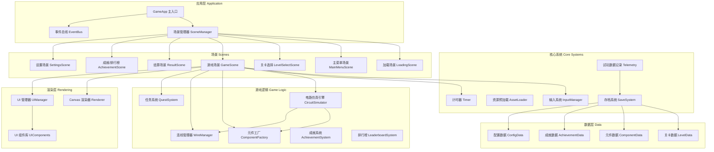

## 1. 架构设计



## 2. 技术描述

- **前端框架**：TypeScript 5.x + 原生 Canvas 2D API（无额外 UI 框架，保证性能）
- **构建工具**：Vite 5.x（HMR 快速开发，ESBuild 极速编译）
- **样式方案**：原生 CSS 变量 + CSS Modules（Vite 内置支持）
- **数据持久化**：localStorage（存档、设置、成就、排行榜）
- **包管理**：pnpm
- **代码规范**：ESLint + Prettier

### 模块边界原则

| 模块 | 职责 | 依赖方向 | 严禁 |
|------|------|----------|------|
| SceneManager | 场景生命周期、切换过渡 | 只依赖 Scene 接口 | 不访问具体游戏逻辑 |
| InputManager | 键鼠/触屏/手柄统一输入事件 | 零业务依赖 | 不修改游戏状态 |
| AssetLoader | 图片/SVG/JSON 预加载、进度 | 只依赖浏览器 API | 不渲染 |
| CircuitSimulator | 节点电压、电流、状态纯计算 | 只依赖数据结构 | 不操作 DOM/Canvas |
| Renderer | Canvas 绘制、动画插值 | 只读游戏状态 | 不修改仿真数据 |
| UIManager | DOM UI 面板、按钮、HUD | 只读状态 + 发事件 | 不直接操作仿真 |
| SaveSystem | 序列化/反序列化、存储 | 依赖数据定义 | 不含业务规则 |
| Telemetry | 记录试玩数据、上报 | 只读 + 发事件 | 不影响逻辑 |

## 3. 场景路由定义（状态机式）

| 场景标识 | 进入条件 | 可切换到 | 数据传递 |
|----------|----------|----------|----------|
| `loading` | 应用启动 | `main_menu` | 无 |
| `main_menu` | 加载完成/返回 | `level_select`, `sandbox`, `daily_challenge`, `achievement`, `settings` | 无 |
| `level_select` | 主菜单点击 | `game` (带 levelId), `main_menu` | 选中关卡 ID |
| `sandbox` | 主菜单点击 | `game` (sandbox 模式) | 模式=自由 |
| `daily_challenge` | 主菜单点击 | `game` (daily 模式) | 模式=每日+日期 |
| `game` | 关卡/沙盒/每日进入 | `result`, `level_select` | 电路状态、用时、失误 |
| `result` | 关卡通关/放弃 | `game` (重玩), `level_select`, `main_menu` | 分数、星级、解锁列表 |
| `achievement` | 主菜单点击 | `main_menu`, `leaderboard` | 无 |
| `settings` | 主菜单点击 | `main_menu` | 无 |

## 4. 核心数据类型定义

```typescript
// ========== 电路核心 ==========
type NodeId = string;
type ComponentId = string;
type WireId = string;

interface Pin {
  nodeId: NodeId;
  localX: number;  // 相对于元件原点
  localY: number;
}

interface BaseComponent {
  id: ComponentId;
  type: ComponentType;
  x: number;
  y: number;
  rotation: number;  // 0/90/180/270
  pins: Pin[];
  params: Record<string, number>;  // { resistance, capacitance, voltage ... }
  state: Record<string, number>;   // { isOn, charge, brightness ... }
}

type ComponentType = 'battery' | 'resistor' | 'capacitor' | 'switch' | 'bulb' | 'wire_joint';

interface Wire {
  id: WireId;
  fromNode: NodeId;
  toNode: NodeId;
  pathPoints: { x: number; y: number }[];
}

interface CircuitGraph {
  components: Map<ComponentId, BaseComponent>;
  wires: Map<WireId, Wire>;
  nodes: Map<NodeId, { voltage: number; components: ComponentId[] }>;
}

// ========== 仿真结果 ==========
interface SimState {
  running: boolean;
  time: number;
  nodeVoltages: Map<NodeId, number>;
  componentStates: Map<ComponentId, Record<string, number>>;
  errors: SimError[];
}

interface SimError {
  type: 'short_circuit' | 'no_power' | 'overload';
  severity: 'warn' | 'error';
  message: string;
  relatedIds: string[];
}

// ========== 关卡与任务 ==========
interface Level {
  id: string;
  title: string;
  description: string;
  chapter: number;
  difficulty: 1 | 2 | 3;
  availableComponents: { type: ComponentType; count: number }[];
  goals: LevelGoal[];
  starConditions: StarCondition[];
  hints: string[];
  preplacedComponents?: BaseComponent[];  // 预置元件
}

interface LevelGoal {
  id: string;
  description: string;
  check: (sim: SimState, circuit: CircuitGraph) => boolean;
}

interface StarCondition {
  stars: 1 | 2 | 3;
  description: string;
  check: (context: LevelContext) => boolean;
}

interface LevelContext {
  completedGoals: string[];
  timeSeconds: number;
  mistakes: number;
  componentsUsed: number;
  wiresUsed: number;
}

// ========== 存档 ==========
interface GameSave {
  version: number;
  lastPlayed: number;
  settings: UserSettings;
  levelProgress: Record<string, LevelProgress>;
  achievements: Record<string, AchievementProgress>;
  leaderboardEntries: LeaderboardEntry[];
  sandboxSaves: SandboxSave[];
  telemetry: TelemetrySession[];
  unlockedContent: UnlockInfo;
}

interface LevelProgress {
  completed: boolean;
  stars: 0 | 1 | 2 | 3;
  bestTime: number;
  bestScore: number;
  leastMistakes: number;
  attempts: number;
}

// ========== 试玩数据记录 ==========
interface TelemetrySession {
  sessionId: string;
  startTime: number;
  endTime: number;
  mode: 'level' | 'sandbox' | 'daily';
  levelId?: string;
  events: TelemetryEvent[];
  summary: TelemetrySummary;
}

interface TelemetryEvent {
  timestamp: number;
  type: 'component_add' | 'component_remove' | 'wire_add' | 'wire_remove' |
        'sim_start' | 'sim_stop' | 'sim_error' | 'goal_complete' | 'mistake' |
        'undo' | 'redo' | 'reset' | 'level_complete' | 'level_abandon';
  data?: Record<string, any>;
}

interface TelemetrySummary {
  totalTime: number;
  componentsAdded: number;
  componentsRemoved: number;
  wiresAdded: number;
  mistakesCount: number;
  simStarts: number;
  simErrors: number;
  undoCount: number;
  completed: boolean;
  score?: number;
  stars?: number;
  criticalChoices: string[];  // 关键选择描述
}
```

## 5. 电路仿真算法（教学近似）

> 核心设计理念：**不求精确，只求直观正确**。让学生看到"闭合回路→电流→灯亮""串电阻→变暗""并电容→延时"等定性规律。

### 5.1 简化假设

1. 理想导线：电阻 = 0，超导
2. 电池：理想电压源，忽略内阻
3. 灯泡：纯电阻模型，亮度 ∝ 功率（V²/R）
4. 电容：RC 充电近似，指数曲线 τ=RC
5. 不计算电磁感应、波形、交流

### 5.2 算法步骤

1. **节点合并**：通过理想导线连接的引脚合并为同一节点（并查集 Union-Find）
2. **接地处理**：电池负极设为 0V 参考点
3. **回路枚举**：BFS 从正极出发找闭合回路
4. **电阻串并简化**：每条回路计算等效电阻
5. **欧姆定律**：I = V / R_total，逐元件分配电压降
6. **电容暂态**：每步仿真步长 Δt，按 Vc(t) = Vs(1 - e^(-t/RC)) 更新
7. **状态渲染**：灯泡亮度 = clamp(P / P_rated, 0, 1)
8. **错误检测**：无电阻直接连通正负极 → 短路警告

## 6. 项目目录结构

```
src/
├── main.ts                    # 入口，初始化 GameApp
├── GameApp.ts                 # 应用根类
├── core/                      # 核心系统（零业务依赖）
│   ├── SceneManager.ts
│   ├── InputManager.ts
│   ├── AssetLoader.ts
│   ├── EventBus.ts
│   ├── SaveSystem.ts
│   ├── Timer.ts
│   └── Telemetry.ts
├── simulation/                # 仿真引擎（纯逻辑，无 DOM/Canvas）
│   ├── CircuitSimulator.ts
│   ├── types.ts
│   ├── NodeSolver.ts          # 并查集 + 节点电压
│   └── LoopAnalyzer.ts        # 回路分析
├── game/                      # 游戏逻辑层
│   ├── ComponentFactory.ts
│   ├── WireManager.ts
│   ├── QuestSystem.ts
│   ├── AchievementSystem.ts
│   ├── LeaderboardSystem.ts
│   └── data/
│       ├── levels.ts
│       ├── components.ts
│       ├── achievements.ts
│       └── dailyChallenge.ts
├── rendering/                 # 渲染层
│   ├── Renderer.ts
│   ├── ComponentRenderer.ts
│   ├── WireRenderer.ts
│   ├── GridRenderer.ts
│   └── ParticleSystem.ts      # 光效粒子
├── ui/                        # DOM UI 层
│   ├── UIManager.ts
│   ├── components/            # 各 UI 面板组件
│   └── styles/
│       ├── variables.css
│       └── global.css
├── scenes/                    # 场景实现
│   ├── BaseScene.ts
│   ├── LoadingScene.ts
│   ├── MainMenuScene.ts
│   ├── LevelSelectScene.ts
│   ├── GameScene.ts
│   ├── ResultScene.ts
│   ├── AchievementScene.ts
│   └── SettingsScene.ts
└── utils/
    ├── math.ts
    ├── geometry.ts
    ├── serialization.ts
    └── logger.ts
```
