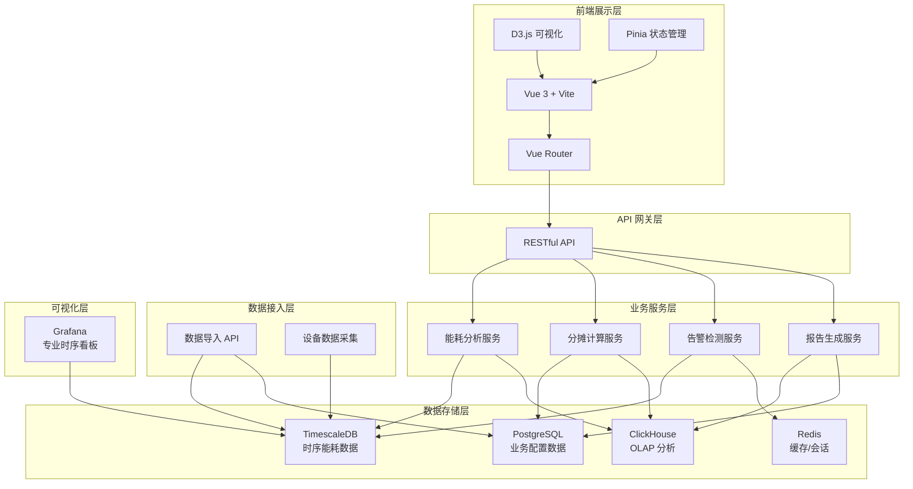
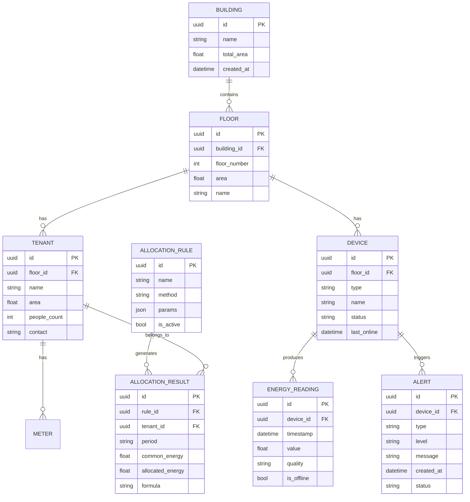

## 1. 架构设计



## 2. 技术描述

### 2.1 前端技术栈
- **框架**：Vue 3.4+ (Composition API)
- **构建工具**：Vite 5.0+
- **路由**：Vue Router 4.x
- **状态管理**：Pinia 2.x
- **UI 组件库**：Element Plus 2.x
- **可视化**：D3.js 7.x
- **图表增强**：@vueuse/core (工具函数)
- **日期处理**：dayjs
- **样式方案**：Tailwind CSS 3.x
- **代码规范**：ESLint + Prettier
- **TypeScript**：5.0+

### 2.2 数据层说明（前端 Mock 实现）
本次前端开发使用 Mock 数据模拟后端接口，数据结构与真实后端保持一致：
- 时序能耗数据：生成模拟的电表、水表、空调读数
- 业务配置数据：楼层、租户、设备、分摊规则等静态数据
- 告警数据：模拟设备离线、能耗异常等告警信息

### 2.3 初始化方式
使用 Vite 官方脚手架初始化 Vue 3 + TypeScript 项目。

## 3. 路由定义

| 路由路径 | 页面名称 | 说明 |
|---------|---------|------|
| /dashboard | 综合能耗看板 | 系统首页，多维度能耗概览 |
| /peak-valley | 峰谷对比分析 | 分时能耗对比与费用分析 |
| /allocation | 租户分摊管理 | 公共能耗分摊计算与明细 |
| /alerts | 异常告警中心 | 告警列表与处理 |
| /config | 系统配置 | 基础数据与规则配置 |
| /reports | 报告导出 | 分析报告生成与下载 |

## 4. 数据模型

### 4.1 数据模型 ER 图



### 4.2 TypeScript 类型定义

```typescript
// 基础实体类型
interface Building {
  id: string;
  name: string;
  totalArea: number;
  createdAt: string;
}

interface Floor {
  id: string;
  buildingId: string;
  floorNumber: number;
  area: number;
  name: string;
}

interface Tenant {
  id: string;
  floorId: string;
  name: string;
  area: number;
  peopleCount: number;
  contact: string;
}

type DeviceType = 'electricity' | 'water' | 'hvac';
type DeviceStatus = 'online' | 'offline' | 'warning';

interface Device {
  id: string;
  floorId: string;
  type: DeviceType;
  name: string;
  status: DeviceStatus;
  lastOnline: string;
}

// 能耗读数
interface EnergyReading {
  id: string;
  deviceId: string;
  timestamp: string;
  value: number;
  quality: 'good' | 'bad' | 'uncertain';
  isOffline: boolean;
}

// 告警
type AlertType = 'device_offline' | 'energy_spike' | 'energy_drop' | 'missing_reading';
type AlertLevel = 'critical' | 'warning' | 'info';
type AlertStatus = 'open' | 'acknowledged' | 'resolved';

interface Alert {
  id: string;
  deviceId: string;
  deviceName: string;
  type: AlertType;
  level: AlertLevel;
  message: string;
  createdAt: string;
  status: AlertStatus;
  handledAt?: string;
  handledBy?: string;
  note?: string;
}

// 分摊规则
type AllocationMethod = 'by_area' | 'by_people' | 'by_usage_ratio' | 'even';

interface AllocationRule {
  id: string;
  name: string;
  method: AllocationMethod;
  params: Record<string, any>;
  isActive: boolean;
  createdAt: string;
}

interface AllocationResult {
  id: string;
  ruleId: string;
  tenantId: string;
  tenantName: string;
  period: string;
  commonEnergy: number;
  allocatedEnergy: number;
  tenantUsage: number;
  totalEnergy: number;
  formula: string;
}

// 峰谷电价
interface TimeOfUsePrice {
  period: 'peak' | 'valley' | 'flat' | 'critical';
  startTime: string;
  endTime: string;
  price: number;
  name: string;
}

// 能耗统计数据
interface EnergyStats {
  total: number;
  peak: number;
  valley: number;
  flat: number;
  critical: number;
  unit: string;
}

// 报告导出
interface ReportConfig {
  title: string;
  startTime: string;
  endTime: string;
  dimension: 'building' | 'floor' | 'tenant' | 'device';
  dimensionId?: string;
  includeAllocation: boolean;
  allocationRuleId?: string;
}

interface ReportData {
  config: ReportConfig;
  sampleCount: number;
  timeWindow: string;
  allocationMethod?: string;
  summary: EnergyStats;
  details: any[];
  generatedAt: string;
}
```

## 5. 前端目录结构

```
src/
├── assets/              # 静态资源
│   ├── fonts/           # 字体文件
│   └── styles/          # 全局样式
├── components/          # 通用组件
│   ├── charts/          # D3 图表组件
│   │   ├── EnergyLineChart.vue
│   │   ├── PeakValleyPie.vue
│   │   ├── HourlyBarChart.vue
│   │   └── index.ts
│   ├── layout/          # 布局组件
│   │   ├── Sidebar.vue
│   │   ├── Header.vue
│   │   └── MainLayout.vue
│   └── common/          # 通用组件
│       ├── MetricCard.vue
│       ├── StatusBadge.vue
│       ├── TimeRangePicker.vue
│       └── DataTable.vue
├── views/               # 页面视图
│   ├── Dashboard.vue
│   ├── PeakValley.vue
│   ├── Allocation.vue
│   ├── Alerts.vue
│   ├── Config.vue
│   └── Reports.vue
├── stores/              # Pinia 状态管理
│   ├── energy.ts
│   ├── devices.ts
│   ├── alerts.ts
│   └── allocation.ts
├── mock/                # Mock 数据
│   ├── energyData.ts
│   ├── devices.ts
│   ├── tenants.ts
│   └── alerts.ts
├── utils/               # 工具函数
│   ├── date.ts
│   ├── calculation.ts
│   ├── export.ts
│   └── d3-helpers.ts
├── types/               # TypeScript 类型
│   └── index.ts
├── router/              # 路由配置
│   └── index.ts
├── App.vue
└── main.ts
```

## 6. 核心业务规则实现

### 6.1 设备离线数据处理
- 缺失读数标记 `isOffline: true`，`quality: 'bad'`
- 图表渲染时离线时段用虚线或空白显示，不填充零值
- 峰谷统计时自动过滤 `isOffline = true` 的数据点
- 统计结果中标注有效样本量

### 6.2 分摊计算规则
```typescript
// 按面积分摊
function allocateByArea(commonEnergy: number, tenants: Tenant[]): AllocationResult[] {
  const totalArea = tenants.reduce((sum, t) => sum + t.area, 0);
  return tenants.map(t => ({
    tenantId: t.id,
    tenantName: t.name,
    allocatedEnergy: (t.area / totalArea) * commonEnergy,
    formula: `公共能耗 × (租户面积 ${t.area}㎡ / 总面积 ${totalArea}㎡)`
  }));
}

// 按人数分摊
function allocateByPeople(commonEnergy: number, tenants: Tenant[]): AllocationResult[] {
  const totalPeople = tenants.reduce((sum, t) => sum + t.peopleCount, 0);
  return tenants.map(t => ({
    tenantId: t.id,
    tenantName: t.name,
    allocatedEnergy: (t.peopleCount / totalPeople) * commonEnergy,
    formula: `公共能耗 × (租户人数 ${t.peopleCount} / 总人数 ${totalPeople})`
  }));
}
```

### 6.3 报告导出内容
报告必须包含以下信息：
1. **时间窗口**：明确的起止时间
2. **样本量**：有效数据点数 / 总数据点数
3. **分摊口径**：使用的分摊规则和计算公式
4. **数据质量说明**：离线设备列表、缺失数据时段
