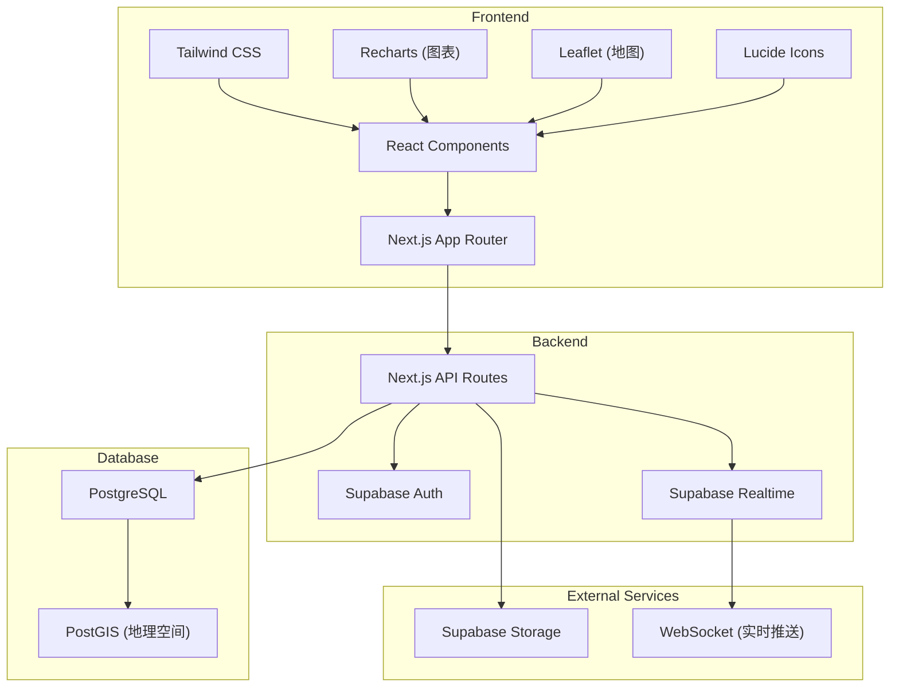
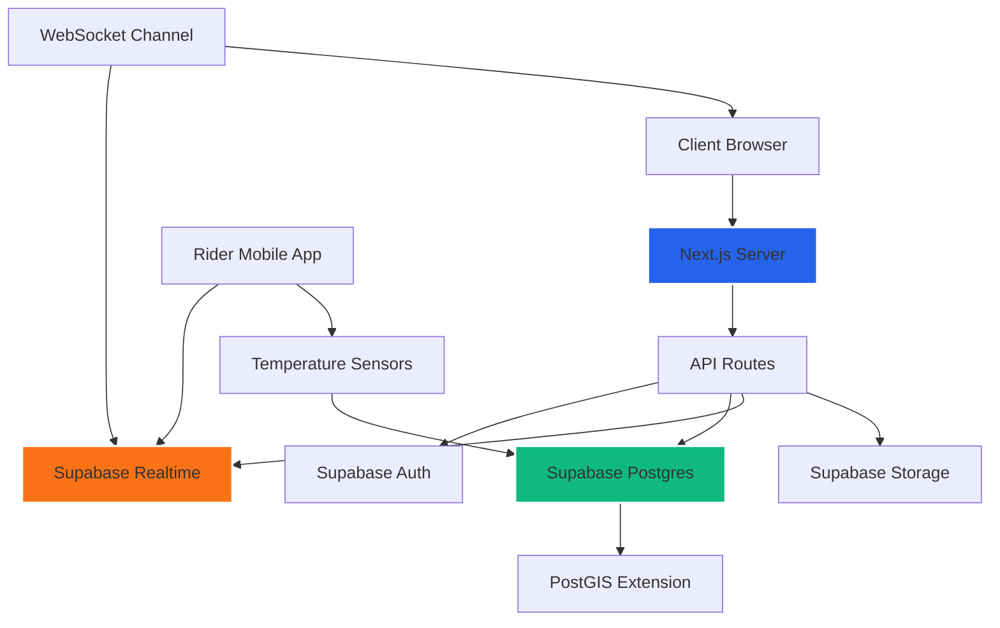
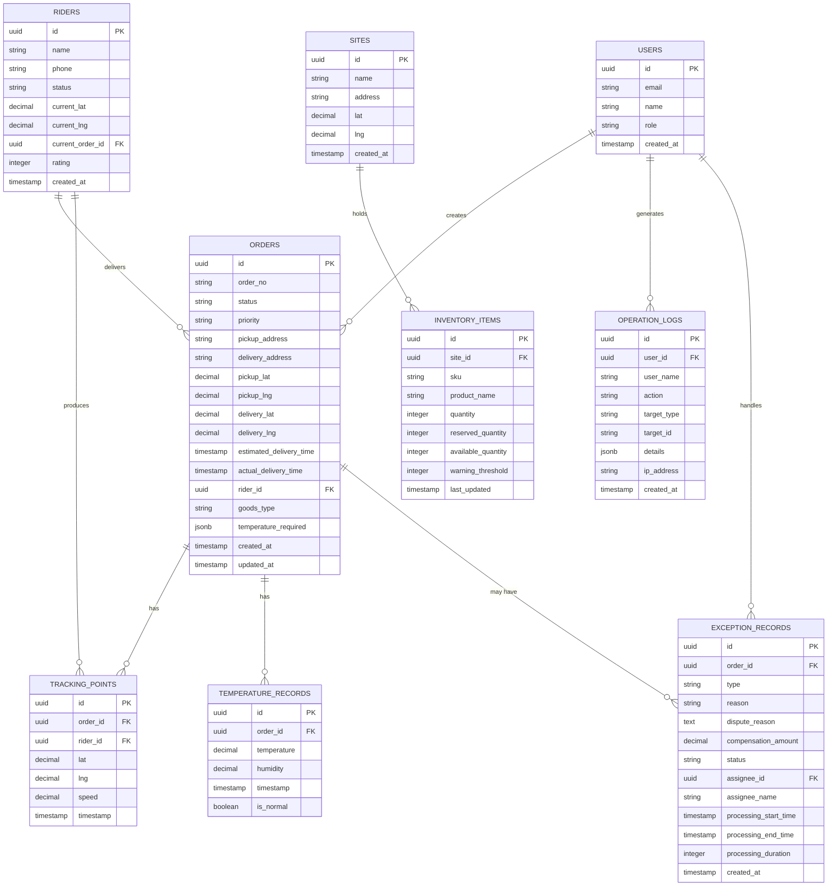

## 1. 架构设计



## 2. 技术说明

- **前端框架**: Next.js 14 (App Router) + React 18 + TypeScript
- **样式方案**: Tailwind CSS 3.4
- **UI组件库**: shadcn/ui + Lucide React Icons
- **图表库**: Recharts 2.12
- **地图组件**: Leaflet 1.9 + react-leaflet 4.2
- **后端服务**: Supabase (Auth, Database, Storage, Realtime)
- **数据库**: PostgreSQL 15 + PostGIS 扩展
- **实时通信**: Supabase Realtime + WebSocket
- **数据导出**: xlsx (Excel导出), jspdf (PDF导出)
- **状态管理**: React Context + Zustand
- **Mock数据**: 开发阶段使用Mock数据，生产环境连接Supabase

## 3. 路由定义

| 路由 | 页面用途 |
|------|---------|
| / | 首页仪表盘 - 履约时效概览、订单统计 |
| /orders | 订单管理 - 订单列表、接单、分配骑手 |
| /orders/[id] | 订单详情 - 路线查看、轨迹追踪 |
| /tracking | 轨迹监控 - 骑手实时位置、轨迹回放 |
| /temperature | 温控监控 - 冷链温度数据、异常报警 |
| /inventory | 站点库存 - 库存查询、预警管理 |
| /routes | 司机路线 - 历史路线、里程统计 |
| /discrepancy | 签收差异 - 异常对比、原因分析 |
| /exceptions | 异常管理 - 赔付争议、处理时效 |
| /settings | 系统设置 - 提醒配置、阈值设置 |
| /logs | 操作日志 - 日志查询、数据导出 |
| /login | 登录页面 |

## 4. API 定义

### 4.1 TypeScript 类型定义

```typescript
// 订单类型
interface Order {
  id: string;
  orderNo: string;
  status: 'pending' | 'assigned' | 'picked' | 'delivering' | 'completed' | 'exception';
  priority: 'normal' | 'urgent' | 'vip';
  pickupAddress: string;
  deliveryAddress: string;
  pickupLat: number;
  pickupLng: number;
  deliveryLat: number;
  deliveryLng: number;
  estimatedDeliveryTime: Date;
  actualDeliveryTime?: Date;
  riderId?: string;
  goodsType: string;
  temperatureRequired?: { min: number; max: number };
  createdAt: Date;
  updatedAt: Date;
}

// 骑手类型
interface Rider {
  id: string;
  name: string;
  phone: string;
  status: 'idle' | 'busy' | 'offline';
  currentLat?: number;
  currentLng?: number;
  currentOrderId?: string;
  rating: number;
  totalDeliveries: number;
}

// 轨迹点类型
interface TrackingPoint {
  id: string;
  orderId: string;
  riderId: string;
  lat: number;
  lng: number;
  speed: number;
  timestamp: Date;
}

// 温控数据类型
interface TemperatureRecord {
  id: string;
  orderId: string;
  temperature: number;
  humidity: number;
  timestamp: Date;
  isNormal: boolean;
}

// 异常记录类型
interface ExceptionRecord {
  id: string;
  orderId: string;
  type: 'timeout' | 'temperature' | 'discrepancy' | 'damage' | 'other';
  reason: string;
  disputeReason?: string;
  compensationAmount?: number;
  status: 'pending' | 'processing' | 'resolved' | 'closed';
  assigneeId: string;
  assigneeName: string;
  processingStartTime: Date;
  processingEndTime?: Date;
  processingDuration?: number;
  createdAt: Date;
}

// 站点库存类型
interface InventoryItem {
  id: string;
  siteId: string;
  siteName: string;
  sku: string;
  productName: string;
  quantity: number;
  reservedQuantity: number;
  availableQuantity: number;
  warningThreshold: number;
  lastUpdated: Date;
}

// 操作日志类型
interface OperationLog {
  id: string;
  userId: string;
  userName: string;
  action: string;
  targetType: string;
  targetId: string;
  details: Record<string, any>;
  ipAddress: string;
  createdAt: Date;
}

// 履约时效统计类型
interface PerformanceStats {
  date: string;
  totalOrders: number;
  onTimeDeliveries: number;
  lateDeliveries: number;
  onTimeRate: number;
  avgDeliveryTime: number;
}
```

### 4.2 API 接口列表

| 方法 | 路径 | 说明 |
|------|------|------|
| GET | /api/orders | 获取订单列表（支持筛选） |
| GET | /api/orders/[id] | 获取订单详情 |
| POST | /api/orders | 创建订单 |
| PUT | /api/orders/[id]/assign | 分配骑手 |
| PUT | /api/orders/[id]/status | 更新订单状态 |
| GET | /api/riders | 获取骑手列表 |
| GET | /api/riders/[id] | 获取骑手详情 |
| GET | /api/tracking/[orderId] | 获取订单轨迹 |
| GET | /api/temperature/[orderId] | 获取温控数据 |
| GET | /api/inventory | 获取库存列表 |
| GET | /api/inventory/[siteId] | 获取站点库存 |
| GET | /api/exceptions | 获取异常列表 |
| POST | /api/exceptions | 创建异常记录 |
| PUT | /api/exceptions/[id] | 更新异常记录 |
| GET | /api/stats/performance | 获取履约时效统计 |
| GET | /api/logs | 获取操作日志 |
| GET | /api/export/orders | 导出订单数据 |
| GET | /api/export/exceptions | 导出异常数据 |

## 5. 服务器架构图



## 6. 数据模型

### 6.1 ER 图



### 6.2 DDL 语句

```sql
-- 启用 PostGIS 扩展
CREATE EXTENSION IF NOT EXISTS postgis;
CREATE EXTENSION IF NOT EXISTS postgis_topology;

-- 用户表
CREATE TABLE users (
    id UUID PRIMARY KEY DEFAULT gen_random_uuid(),
    email VARCHAR(255) UNIQUE NOT NULL,
    name VARCHAR(100) NOT NULL,
    role VARCHAR(50) NOT NULL DEFAULT 'operator',
    created_at TIMESTAMPTZ DEFAULT NOW()
);

-- 骑手表
CREATE TABLE riders (
    id UUID PRIMARY KEY DEFAULT gen_random_uuid(),
    name VARCHAR(100) NOT NULL,
    phone VARCHAR(20) NOT NULL,
    status VARCHAR(20) NOT NULL DEFAULT 'idle',
    current_lat DECIMAL(10, 7),
    current_lng DECIMAL(10, 7),
    current_order_id UUID REFERENCES orders(id),
    rating INTEGER DEFAULT 5,
    total_deliveries INTEGER DEFAULT 0,
    created_at TIMESTAMPTZ DEFAULT NOW(),
    last_location_updated_at TIMESTAMPTZ
);

CREATE INDEX idx_riders_status ON riders(status);
CREATE INDEX idx_riders_location ON riders USING gist (ST_SetSRID(ST_MakePoint(current_lng, current_lat), 4326));

-- 订单表
CREATE TABLE orders (
    id UUID PRIMARY KEY DEFAULT gen_random_uuid(),
    order_no VARCHAR(50) UNIQUE NOT NULL,
    status VARCHAR(20) NOT NULL DEFAULT 'pending',
    priority VARCHAR(20) NOT NULL DEFAULT 'normal',
    pickup_address TEXT NOT NULL,
    delivery_address TEXT NOT NULL,
    pickup_lat DECIMAL(10, 7) NOT NULL,
    pickup_lng DECIMAL(10, 7) NOT NULL,
    delivery_lat DECIMAL(10, 7) NOT NULL,
    delivery_lng DECIMAL(10, 7) NOT NULL,
    estimated_delivery_time TIMESTAMPTZ NOT NULL,
    actual_delivery_time TIMESTAMPTZ,
    rider_id UUID REFERENCES riders(id),
    goods_type VARCHAR(100) NOT NULL,
    temperature_required JSONB,
    created_at TIMESTAMPTZ DEFAULT NOW(),
    updated_at TIMESTAMPTZ DEFAULT NOW()
);

CREATE INDEX idx_orders_status ON orders(status);
CREATE INDEX idx_orders_rider_id ON orders(rider_id);
CREATE INDEX idx_orders_created_at ON orders(created_at);
CREATE INDEX idx_orders_pickup ON orders USING gist (ST_SetSRID(ST_MakePoint(pickup_lng, pickup_lat), 4326));
CREATE INDEX idx_orders_delivery ON orders USING gist (ST_SetSRID(ST_MakePoint(delivery_lng, delivery_lat), 4326));

-- 轨迹点表
CREATE TABLE tracking_points (
    id UUID PRIMARY KEY DEFAULT gen_random_uuid(),
    order_id UUID NOT NULL REFERENCES orders(id) ON DELETE CASCADE,
    rider_id UUID NOT NULL REFERENCES riders(id),
    lat DECIMAL(10, 7) NOT NULL,
    lng DECIMAL(10, 7) NOT NULL,
    speed DECIMAL(5, 2),
    timestamp TIMESTAMPTZ NOT NULL DEFAULT NOW()
);

CREATE INDEX idx_tracking_order_id ON tracking_points(order_id);
CREATE INDEX idx_tracking_rider_id ON tracking_points(rider_id);
CREATE INDEX idx_tracking_timestamp ON tracking_points(timestamp);
CREATE INDEX idx_tracking_geom ON tracking_points USING gist (ST_SetSRID(ST_MakePoint(lng, lat), 4326));

-- 温控记录表
CREATE TABLE temperature_records (
    id UUID PRIMARY KEY DEFAULT gen_random_uuid(),
    order_id UUID NOT NULL REFERENCES orders(id) ON DELETE CASCADE,
    temperature DECIMAL(5, 2) NOT NULL,
    humidity DECIMAL(5, 2),
    timestamp TIMESTAMPTZ NOT NULL DEFAULT NOW(),
    is_normal BOOLEAN NOT NULL DEFAULT true
);

CREATE INDEX idx_temperature_order_id ON temperature_records(order_id);
CREATE INDEX idx_temperature_timestamp ON temperature_records(timestamp);

-- 异常记录表
CREATE TABLE exception_records (
    id UUID PRIMARY KEY DEFAULT gen_random_uuid(),
    order_id UUID NOT NULL REFERENCES orders(id) ON DELETE CASCADE,
    type VARCHAR(50) NOT NULL,
    reason TEXT NOT NULL,
    dispute_reason TEXT,
    compensation_amount DECIMAL(10, 2),
    status VARCHAR(20) NOT NULL DEFAULT 'pending',
    assignee_id UUID REFERENCES users(id),
    assignee_name VARCHAR(100),
    processing_start_time TIMESTAMPTZ NOT NULL DEFAULT NOW(),
    processing_end_time TIMESTAMPTZ,
    processing_duration INTEGER,
    created_at TIMESTAMPTZ DEFAULT NOW()
);

CREATE INDEX idx_exception_order_id ON exception_records(order_id);
CREATE INDEX idx_exception_status ON exception_records(status);
CREATE INDEX idx_exception_assignee_id ON exception_records(assignee_id);
CREATE INDEX idx_exception_created_at ON exception_records(created_at);

-- 站点表
CREATE TABLE sites (
    id UUID PRIMARY KEY DEFAULT gen_random_uuid(),
    name VARCHAR(100) NOT NULL,
    address TEXT NOT NULL,
    lat DECIMAL(10, 7) NOT NULL,
    lng DECIMAL(10, 7) NOT NULL,
    created_at TIMESTAMPTZ DEFAULT NOW()
);

-- 库存表
CREATE TABLE inventory_items (
    id UUID PRIMARY KEY DEFAULT gen_random_uuid(),
    site_id UUID NOT NULL REFERENCES sites(id) ON DELETE CASCADE,
    sku VARCHAR(100) NOT NULL,
    product_name VARCHAR(255) NOT NULL,
    quantity INTEGER NOT NULL DEFAULT 0,
    reserved_quantity INTEGER NOT NULL DEFAULT 0,
    available_quantity INTEGER NOT NULL DEFAULT 0,
    warning_threshold INTEGER NOT NULL DEFAULT 10,
    last_updated TIMESTAMPTZ DEFAULT NOW()
);

CREATE INDEX idx_inventory_site_id ON inventory_items(site_id);
CREATE INDEX idx_inventory_sku ON inventory_items(sku);

-- 操作日志表
CREATE TABLE operation_logs (
    id UUID PRIMARY KEY DEFAULT gen_random_uuid(),
    user_id UUID REFERENCES users(id),
    user_name VARCHAR(100) NOT NULL,
    action VARCHAR(100) NOT NULL,
    target_type VARCHAR(50) NOT NULL,
    target_id VARCHAR(100) NOT NULL,
    details JSONB,
    ip_address VARCHAR(50),
    created_at TIMESTAMPTZ DEFAULT NOW()
);

CREATE INDEX idx_logs_user_id ON operation_logs(user_id);
CREATE INDEX idx_logs_action ON operation_logs(action);
CREATE INDEX idx_logs_created_at ON operation_logs(created_at);

-- 启用行级安全策略
ALTER TABLE users ENABLE ROW LEVEL SECURITY;
ALTER TABLE orders ENABLE ROW LEVEL SECURITY;
ALTER TABLE riders ENABLE ROW LEVEL SECURITY;
ALTER TABLE tracking_points ENABLE ROW LEVEL SECURITY;
ALTER TABLE temperature_records ENABLE ROW LEVEL SECURITY;
ALTER TABLE exception_records ENABLE ROW LEVEL SECURITY;
ALTER TABLE inventory_items ENABLE ROW LEVEL SECURITY;
ALTER TABLE operation_logs ENABLE ROW LEVEL SECURITY;

-- 为 Supabase 实时订阅设置
ALTER TABLE orders REPLICA IDENTITY FULL;
ALTER TABLE riders REPLICA IDENTITY FULL;
ALTER TABLE tracking_points REPLICA IDENTITY FULL;
ALTER TABLE temperature_records REPLICA IDENTITY FULL;
ALTER TABLE exception_records REPLICA IDENTITY FULL;

-- 初始化 Mock 数据
INSERT INTO users (id, email, name, role) VALUES
    ('00000000-0000-0000-0000-000000000001', 'admin@example.com', '张主管', 'admin'),
    ('00000000-0000-0000-0000-000000000002', 'operator@example.com', '李运营', 'operator');

INSERT INTO sites (id, name, address, lat, lng) VALUES
    ('00000000-0000-0000-0000-000000000001', '朝阳站点', '北京市朝阳区建国路88号', 39.9042, 116.4074),
    ('00000000-0000-0000-0000-000000000002', '海淀站点', '北京市海淀区中关村大街1号', 39.9842, 116.3074),
    ('00000000-0000-0000-0000-000000000003', '西城站点', '北京市西城区金融街35号', 39.9142, 116.3574);

INSERT INTO riders (id, name, phone, status, current_lat, current_lng, rating, total_deliveries) VALUES
    ('00000000-0000-0000-0000-000000000001', '王骑手', '13800138001', 'idle', 39.9042, 116.4074, 5, 1256),
    ('00000000-0000-0000-0000-000000000002', '刘骑手', '13800138002', 'busy', 39.9142, 116.4174, 4, 987),
    ('00000000-0000-0000-0000-000000000003', '陈骑手', '13800138003', 'idle', 39.8942, 116.3974, 5, 1523),
    ('00000000-0000-0000-0000-000000000004', '赵骑手', '13800138004', 'delivering', 39.9242, 116.4274, 3, 756);
```
