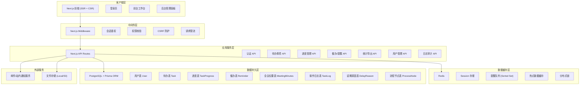
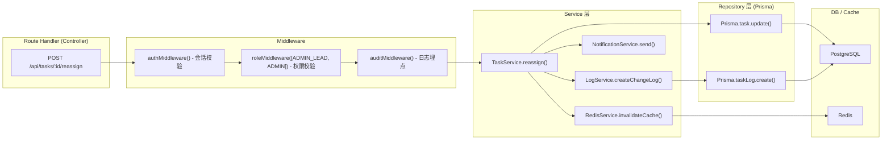
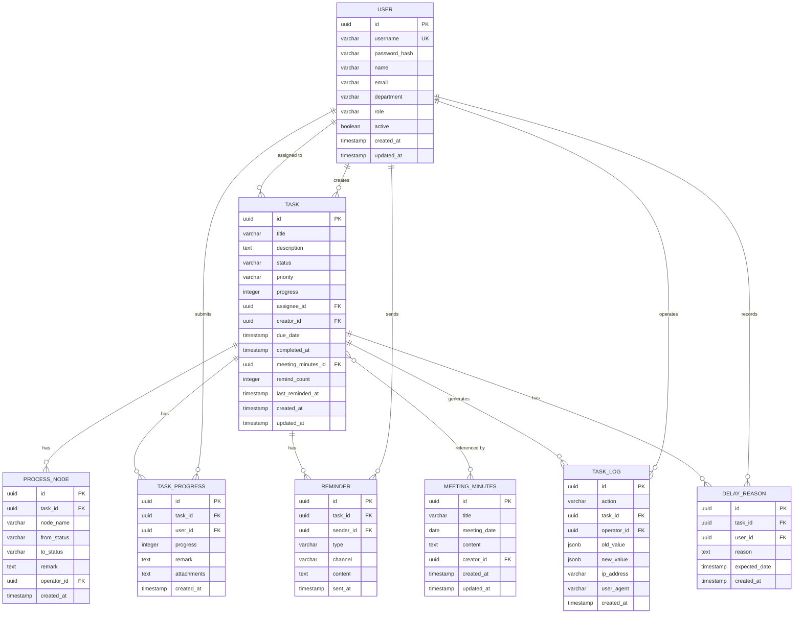

## 1. 架构设计



---

## 2. 技术说明

- **前端框架**: Next.js 14 (App Router) + React 18 + TypeScript 5
- **样式方案**: TailwindCSS 3 + shadcn/ui 组件库 + Lucide React 图标
- **状态管理**: React Query (TanStack Query) + Zustand (轻量全局状态)
- **后端**: Next.js Route Handlers (API Routes) + Node.js
- **ORM**: Prisma 5
- **数据库**: PostgreSQL 16
- **缓存/消息**: Redis 7 (ioredis)
- **认证方案**: Session + Cookie (HttpOnly, Secure, SameSite=Lax)，密码哈希使用 bcrypt
- **图表可视化**: Recharts
- **文件导出**: json2csv + exceljs
- **表单校验**: Zod + react-hook-form
- **开发工具**: ESLint + Prettier + Husky + lint-staged

---

## 3. 路由定义

| 路由 | 页面/用途 | 权限要求 |
|------|-----------|----------|
| `/login` | 登录页 | 公开 |
| `/dashboard` | 我的待办工作台（首页） | USER / ADMIN_LEAD / ADMIN |
| `/dashboard/tasks/[id]` | 事项详情（右侧抽屉模式） | 同上（仅自己的事项） |
| `/admin` | 后台管理首页（快捷统计） | ADMIN_LEAD / ADMIN |
| `/admin/tasks` | 事项管理（派发、催办） | ADMIN_LEAD / ADMIN |
| `/admin/tasks/new` | 新建待办事项 | ADMIN_LEAD / ADMIN |
| `/admin/reminders` | 日程提醒配置 | ADMIN_LEAD / ADMIN |
| `/admin/statistics` | 责任归属统计中心 | ADMIN_LEAD / ADMIN |
| `/admin/logs` | 操作日志审计 | ADMIN_LEAD / ADMIN |
| `/admin/users` | 用户管理 | ADMIN |
| `/api/auth/login` | 登录接口 | 公开 |
| `/api/auth/logout` | 登出接口 | 已登录 |
| `/api/tasks` | 待办 CRUD | 按权限 |
| `/api/tasks/[id]/claim` | 认领待办 | USER |
| `/api/tasks/[id]/progress` | 补充进度 | USER |
| `/api/tasks/[id]/delay` | 录入延期原因 | USER |
| `/api/tasks/[id]/reassign` | 变更责任人 | ADMIN_LEAD / ADMIN |
| `/api/tasks/[id]/remind` | 发送催办 | ADMIN_LEAD / ADMIN |
| `/api/tasks/export` | 记录导出 | ADMIN_LEAD / ADMIN |
| `/api/statistics/ownership` | 责任归属统计 | ADMIN_LEAD / ADMIN |
| `/api/statistics/trends` | 状态趋势数据 | ADMIN_LEAD / ADMIN |
| `/api/logs` | 操作日志查询 | ADMIN_LEAD / ADMIN |
| `/api/users` | 用户管理 | ADMIN |

---

## 4. API 定义 (TypeScript 类型)

```typescript
// ===== 用户相关 =====
type UserRole = 'USER' | 'ADMIN_LEAD' | 'ADMIN';

interface User {
  id: string;
  username: string;
  name: string;
  email: string;
  department?: string;
  role: UserRole;
  active: boolean;
  createdAt: Date;
  updatedAt: Date;
}

interface LoginRequest { username: string; password: string; }
interface LoginResponse { user: Omit<User, 'password'>; token: string; }

// ===== 待办事项相关 =====
type TaskStatus = 'PENDING_CLAIM' | 'IN_PROGRESS' | 'DELAYED' | 'COMPLETED' | 'CANCELLED';
type TaskPriority = 'LOW' | 'MEDIUM' | 'HIGH' | 'URGENT';

interface Task {
  id: string;
  title: string;
  description?: string;
  status: TaskStatus;
  priority: TaskPriority;
  progress: number; // 0-100
  assigneeId?: string;
  assignee?: User;
  creatorId: string;
  creator: User;
  dueDate?: Date;
  completedAt?: Date;
  meetingMinutesId?: string;
  remindCount: number;
  lastRemindedAt?: Date;
  createdAt: Date;
  updatedAt: Date;
  progressRecords?: TaskProgress[];
  processNodes?: ProcessNode[];
  delayReasons?: DelayReason[];
}

interface CreateTaskRequest {
  title: string;
  description?: string;
  priority: TaskPriority;
  assigneeId?: string;
  dueDate?: string;
  meetingMinutesId?: string;
}

interface UpdateProgressRequest {
  progress: number;
  remark?: string;
  attachments?: string[];
}

interface DelayReasonRequest {
  reason: string;
  expectedDate?: string;
}

interface ReassignTaskRequest {
  newAssigneeId: string;
  reason?: string;
}

// ===== 催办/提醒 =====
interface Reminder {
  id: string;
  taskId: string;
  task: Task;
  senderId: string;
  sender: User;
  type: 'MANUAL' | 'SCHEDULED' | 'AUTO_DELAY';
  channel: 'IN_APP' | 'EMAIL' | 'SMS';
  content: string;
  sentAt: Date;
}

interface ScheduleReminderRequest {
  taskIds: string[];
  cronExpression?: string;
  reminderTime?: string;
  content?: string;
}

// ===== 统计 =====
interface OwnershipStat {
  userId: string;
  userName: string;
  department?: string;
  totalCount: number;
  completedCount: number;
  delayedCount: number;
  inProgressCount: number;
  completionRate: number;
  delayRate: number;
  avgProcessingHours: number;
}

interface TrendDataPoint {
  date: string; // YYYY-MM-DD or YYYY-WW
  pendingClaim: number;
  inProgress: number;
  completed: number;
  delayed: number;
}

// ===== 日志 =====
type LogAction = 
  | 'TASK_CREATED' | 'TASK_CLAIMED' | 'TASK_COMPLETED' | 'TASK_CANCELLED'
  | 'PROGRESS_UPDATED' | 'DELAY_RECORDED'
  | 'ASSIGNEE_CHANGED' | 'STATUS_CHANGED'
  | 'REMINDER_SENT' | 'REMINDER_SCHEDULED'
  | 'USER_CREATED' | 'USER_ROLE_CHANGED';

interface TaskLog {
  id: string;
  action: LogAction;
  taskId?: string;
  operatorId: string;
  operator: User;
  oldValue?: Record<string, unknown>;
  newValue?: Record<string, unknown>;
  ipAddress?: string;
  userAgent?: string;
  createdAt: Date;
}
```

---

## 5. 服务端架构图



**服务目录结构**：
```
src/
├── app/
│   ├── (auth)/login/
│   ├── (dashboard)/dashboard/
│   └── (admin)/admin/
├── server/
│   ├── services/
│   │   ├── auth.service.ts
│   │   ├── task.service.ts
│   │   ├── progress.service.ts
│   │   ├── reminder.service.ts
│   │   ├── statistics.service.ts
│   │   ├── log.service.ts
│   │   └── user.service.ts
│   ├── repositories/
│   ├── middleware/
│   ├── lib/
│   │   ├── prisma.ts
│   │   ├── redis.ts
│   │   ├── session.ts
│   │   └── auth.ts
│   └── validators/
├── components/
├── hooks/
├── store/
├── types/
└── utils/
```

---

## 6. 数据模型

### 6.1 ER 图



### 6.2 Prisma Schema 关键字段 (DDL)

```prisma
model User {
  id            String    @id @default(cuid())
  username      String    @unique
  passwordHash  String
  name          String
  email         String    @unique
  department    String?
  role          String    @default("USER") // USER | ADMIN_LEAD | ADMIN
  active        Boolean   @default(true)
  createdAt     DateTime  @default(now())
  updatedAt     DateTime  @updatedAt

  createdTasks  Task[]    @relation("TaskCreator")
  assignedTasks Task[]    @relation("TaskAssignee")
  progressRecords TaskProgress[]
  sentReminders Reminder[]
  logs          TaskLog[]
  delayReasons  DelayReason[]
}

model Task {
  id              String          @id @default(cuid())
  title           String
  description     String?
  status          String          @default("PENDING_CLAIM") // PENDING_CLAIM|IN_PROGRESS|DELAYED|COMPLETED|CANCELLED
  priority        String          @default("MEDIUM")        // LOW|MEDIUM|HIGH|URGENT
  progress        Int             @default(0)
  assigneeId      String?
  assignee        User?           @relation("TaskAssignee", fields: [assigneeId], references: [id])
  creatorId       String
  creator         User            @relation("TaskCreator", fields: [creatorId], references: [id])
  dueDate         DateTime?
  completedAt     DateTime?
  meetingMinutesId String?
  meetingMinutes  MeetingMinutes? @relation(fields: [meetingMinutesId], references: [id])
  remindCount     Int             @default(0)
  lastRemindedAt  DateTime?
  createdAt       DateTime        @default(now())
  updatedAt       DateTime        @updatedAt

  progressRecords TaskProgress[]
  processNodes    ProcessNode[]
  reminders       Reminder[]
  delayReasons    DelayReason[]
  logs            TaskLog[]

  @@index([status])
  @@index([assigneeId, status])
  @@index([priority])
  @@index([dueDate])
  @@index([creatorId])
}

model TaskProgress {
  id          String   @id @default(cuid())
  taskId      String
  task        Task     @relation(fields: [taskId], references: [id], onDelete: Cascade)
  userId      String
  user        User     @relation(fields: [userId], references: [id])
  progress    Int
  remark      String?
  attachments String?  // JSON array string
  createdAt   DateTime @default(now())

  @@index([taskId])
}

model ProcessNode {
  id         String   @id @default(cuid())
  taskId     String
  task       Task     @relation(fields: [taskId], references: [id], onDelete: Cascade)
  nodeName   String
  fromStatus String?
  toStatus   String
  remark     String?
  operatorId String
  operator   User     @relation(fields: [operatorId], references: [id])
  createdAt  DateTime @default(now())

  @@index([taskId])
}

model DelayReason {
  id           String   @id @default(cuid())
  taskId       String
  task         Task     @relation(fields: [taskId], references: [id], onDelete: Cascade)
  userId       String
  user         User     @relation(fields: [userId], references: [id])
  reason       String   @db.Text
  expectedDate DateTime?
  createdAt    DateTime @default(now())

  @@index([taskId])
}

model Reminder {
  id        String   @id @default(cuid())
  taskId    String
  task      Task     @relation(fields: [taskId], references: [id], onDelete: Cascade)
  senderId  String
  sender    User     @relation(fields: [senderId], references: [id])
  type      String   // MANUAL | SCHEDULED | AUTO_DELAY
  channel   String   // IN_APP | EMAIL | SMS
  content   String   @db.Text
  sentAt    DateTime @default(now())

  @@index([taskId])
  @@index([sentAt])
}

model MeetingMinutes {
  id        String   @id @default(cuid())
  title     String
  meetingDate DateTime
  content   String   @db.Text
  creatorId String
  creator   User     @relation(fields: [creatorId], references: [id])
  tasks     Task[]
  createdAt DateTime @default(now())
  updatedAt DateTime @updatedAt
}

model TaskLog {
  id         String   @id @default(cuid())
  action     String   // LogAction enum string
  taskId     String?
  task       Task?    @relation(fields: [taskId], references: [id], onDelete: SetNull)
  operatorId String
  operator   User     @relation(fields: [operatorId], references: [id])
  oldValue   Json?
  newValue   Json?
  ipAddress  String?
  userAgent  String?
  createdAt  DateTime @default(now())

  @@index([taskId])
  @@index([action])
  @@index([operatorId])
  @@index([createdAt])
}
```

---
