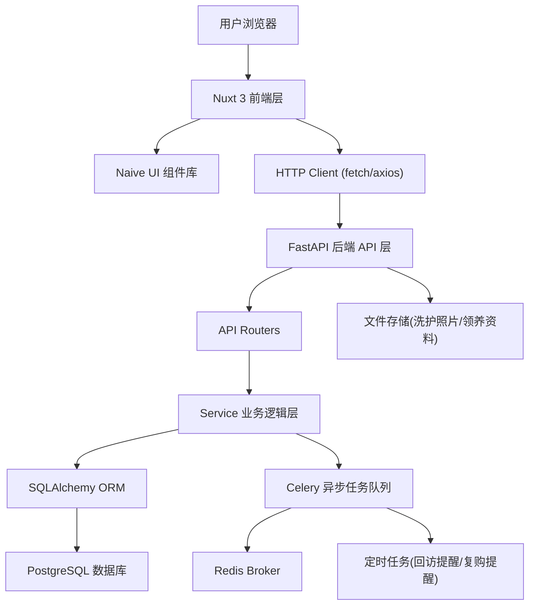
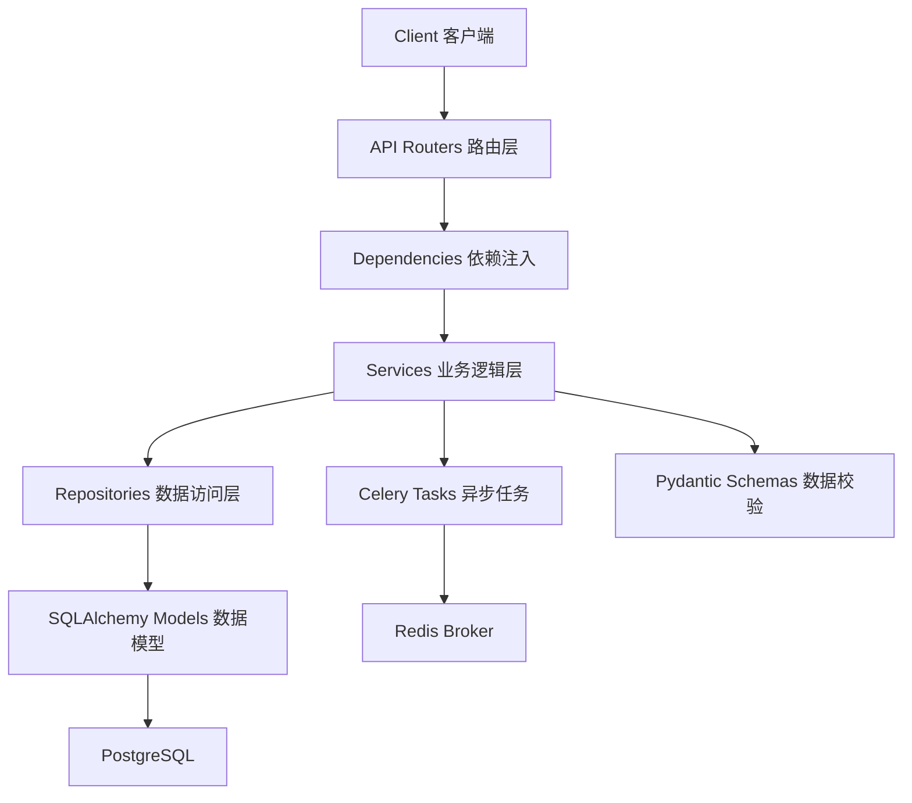
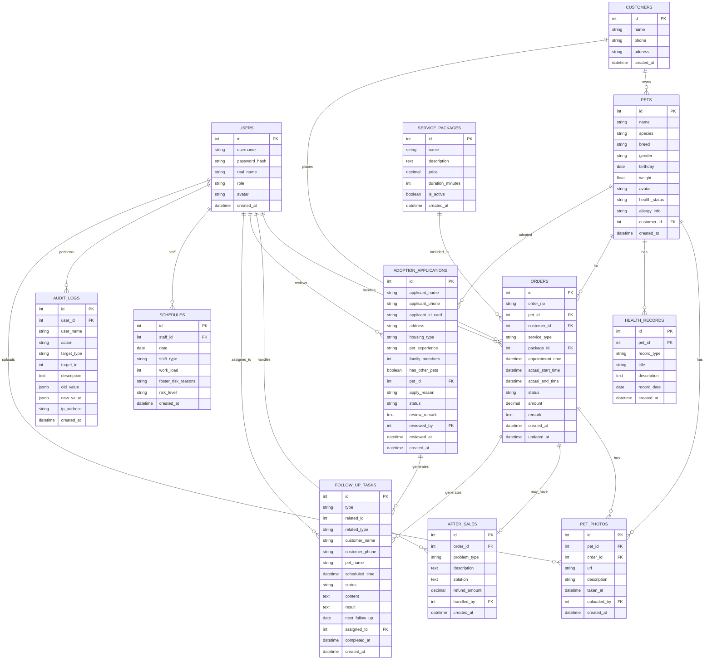

## 1. 架构设计



## 2. 技术说明

### 2.1 前端技术栈
- **框架**：Nuxt 3 (Vue 3 + Vite + SSR)
- **UI 组件库**：Naive UI（Vue 3 组件库，TypeScript 友好）
- **状态管理**：Pinia（Nuxt 官方推荐）
- **路由**：Nuxt 3 内置文件路由系统
- **HTTP 请求**：useFetch / $fetch（Nuxt 内置）+ Axios（可选）
- **图表可视化**：ECharts 5（数据趋势、负荷热力图）
- **图标**：@vicons/ionicons5（与 Naive UI 配套）
- **样式方案**：UnoCSS / Tailwind CSS（原子化 CSS）+ Naive UI 主题定制

### 2.2 后端技术栈
- **Web 框架**：FastAPI（高性能、自动生成 OpenAPI 文档、TypeScript 友好）
- **Python 版本**：Python 3.11+
- **ORM**：SQLAlchemy 2.0 + Alembic（数据库迁移）
- **数据库驱动**：asyncpg（PostgreSQL 异步驱动）
- **异步任务**：Celery 5.x + Redis（Broker）
- **数据验证**：Pydantic v2（FastAPI 内置）
- **认证授权**：JWT（python-jose）+ PassLib（密码哈希）
- **文件处理**：python-multipart + Pillow（图片处理）
- **跨域**：fastapi-cors

### 2.3 基础设施
- **数据库**：PostgreSQL 15+
- **缓存/消息队列**：Redis 7.x
- **文件存储**：本地文件系统（开发）/ 对象存储（生产）
- **反向代理**：Nginx（生产环境可选）

## 3. 前端路由定义

| 路由路径 | 页面名称 | 说明 |
|----------|----------|------|
| `/login` | 登录页 | 账号密码登录 |
| `/` | 仪表板首页 | 待办、异常、数据趋势、今日排班 |
| `/appointments` | 预约与订单列表 | 预约列表、筛选、快捷操作 |
| `/appointments/:id` | 订单详情页 | 订单全生命周期、售后处理 |
| `/appointments/packages` | 套餐配置 | 洗护套餐管理 |
| `/pets` | 宠物档案列表 | 宠物列表、检索筛选 |
| `/pets/:id` | 宠物档案详情 | 宠物信息、健康记录、照片墙、服务历史 |
| `/adoptions` | 领养申请列表 | 待审/已审领养申请 |
| `/adoptions/:id` | 领养审核详情 | 资料查看、审核操作 |
| `/follow-ups` | 回访任务中心 | 回访任务、复购提醒列表 |
| `/schedules` | 排班管理 | 排班日历、负荷分析 |
| `/schedules/load-analysis` | 负荷分析页 | 多维度负荷统计、风险预警 |
| `/audit-logs` | 操作历史 | 操作日志、审计追溯 |

## 4. API 定义

### 4.1 认证相关

```typescript
// 登录请求
interface LoginRequest {
  username: string;
  password: string;
}

// 登录响应
interface LoginResponse {
  access_token: string;
  token_type: string;
  user: UserInfo;
}

interface UserInfo {
  id: number;
  username: string;
  real_name: string;
  role: 'manager' | 'staff';
  avatar?: string;
}
```

### 4.2 预约与订单

```typescript
// 订单状态枚举
type OrderStatus = 'pending' | 'confirmed' | 'in_service' | 'completed' | 'cancelled' | 'after_sale';

// 订单列表查询
interface OrderQuery {
  page?: number;
  page_size?: number;
  status?: OrderStatus;
  start_date?: string;
  end_date?: string;
  keyword?: string;
}

// 订单信息
interface Order {
  id: number;
  order_no: string;
  pet_id: number;
  pet: PetSummary;
  customer_id: number;
  customer_name: string;
  customer_phone: string;
  service_type: string;
  package_id?: number;
  package_name?: string;
  appointment_time: string;
  actual_start_time?: string;
  actual_end_time?: string;
  status: OrderStatus;
  amount: number;
  remark?: string;
  created_at: string;
  updated_at: string;
}

// 售后处理请求
interface AfterSaleRequest {
  order_id: number;
  problem_type: string;
  description: string;
  solution: string;
  refund_amount?: number;
}
```

### 4.3 宠物档案

```typescript
interface Pet {
  id: number;
  name: string;
  species: 'dog' | 'cat' | 'other';
  breed: string;
  gender: 'male' | 'female';
  birthday?: string;
  weight?: number;
  avatar?: string;
  health_status?: string;
  allergy_info?: string;
  customer_id: number;
  customer_name: string;
  created_at: string;
}

// 洗护照片
interface PetPhoto {
  id: number;
  pet_id: number;
  order_id?: number;
  url: string;
  description?: string;
  taken_at: string;
  uploaded_by: number;
}

// 健康记录
interface HealthRecord {
  id: number;
  pet_id: number;
  record_type: 'vaccine' | 'deworming' | 'physical' | 'surgery' | 'other';
  title: string;
  description?: string;
  record_date: string;
}
```

### 4.4 领养审核

```typescript
type AdoptionStatus = 'pending' | 'approved' | 'rejected' | 'supplementing';

interface AdoptionApplication {
  id: number;
  applicant_name: string;
  applicant_phone: string;
  applicant_id_card?: string;
  address: string;
  housing_type: string;
  pet_experience: string;
  family_members: number;
  has_other_pets: boolean;
  pet_id: number;
  pet: PetSummary;
  status: AdoptionStatus;
  apply_reason: string;
  review_remark?: string;
  reviewed_by?: number;
  reviewed_at?: string;
  created_at: string;
}

// 审核请求
interface AdoptionReviewRequest {
  application_id: number;
  action: 'approve' | 'reject' | 'request_supplement';
  remark: string;
}
```

### 4.5 回访与复购提醒

```typescript
type FollowUpStatus = 'pending' | 'completed' | 'cancelled';
type FollowUpType = 'service' | 'adoption' | 'repurchase';

interface FollowUpTask {
  id: number;
  type: FollowUpType;
  related_id: number;  // 关联订单ID或领养ID
  related_type: 'order' | 'adoption';
  customer_name: string;
  customer_phone: string;
  pet_name?: string;
  scheduled_time: string;
  status: FollowUpStatus;
  content?: string;
  result?: string;
  next_follow_up?: string;
  assigned_to?: number;
  completed_at?: string;
}
```

### 4.6 排班与负荷

```typescript
interface Staff {
  id: number;
  name: string;
  role: string;
  avatar?: string;
  phone?: string;
}

interface Schedule {
  id: number;
  staff_id: number;
  staff: Staff;
  date: string;
  shift_type: 'morning' | 'afternoon' | 'full' | 'off';
  work_load: number;  // 0-100
  foster_risk_reasons?: string[];
  risk_level: 'low' | 'medium' | 'high';
}

// 负荷分析查询
interface LoadAnalysisQuery {
  start_date: string;
  end_date: string;
  staff_id?: number;
  dimension: 'staff' | 'date' | 'risk';
}

interface LoadAnalysisResult {
  dimension: string;
  labels: string[];
  data: number[];
  risk_breakdown?: { reason: string; count: number }[];
}
```

### 4.7 操作日志

```typescript
interface AuditLog {
  id: number;
  user_id: number;
  user_name: string;
  action: string;
  target_type: string;
  target_id: number;
  description: string;
  old_value?: Record<string, any>;
  new_value?: Record<string, any>;
  ip_address?: string;
  created_at: string;
}
```

## 5. 后端分层架构



### 后端目录结构
```
backend/
├── app/
│   ├── __init__.py
│   ├── main.py              # FastAPI 应用入口
│   ├── config.py            # 配置管理
│   ├── dependencies.py      # 依赖注入
│   ├── database.py          # 数据库连接
│   ├── auth/                # 认证模块
│   │   ├── __init__.py
│   │   ├── router.py
│   │   ├── service.py
│   │   └── schemas.py
│   ├── api/                 # API 路由
│   │   ├── __init__.py
│   │   ├── orders.py
│   │   ├── pets.py
│   │   ├── adoptions.py
│   │   ├── follow_ups.py
│   │   ├── schedules.py
│   │   └── audit_logs.py
│   ├── services/            # 业务逻辑层
│   │   ├── __init__.py
│   │   ├── order_service.py
│   │   ├── pet_service.py
│   │   ├── adoption_service.py
│   │   ├── follow_up_service.py
│   │   ├── schedule_service.py
│   │   └── audit_service.py
│   ├── models/              # SQLAlchemy 模型
│   │   ├── __init__.py
│   │   ├── user.py
│   │   ├── order.py
│   │   ├── pet.py
│   │   ├── adoption.py
│   │   ├── follow_up.py
│   │   ├── schedule.py
│   │   └── audit_log.py
│   ├── schemas/             # Pydantic 模型
│   │   ├── __init__.py
│   │   ├── user.py
│   │   ├── order.py
│   │   ├── pet.py
│   │   ├── adoption.py
│   │   ├── follow_up.py
│   │   ├── schedule.py
│   │   └── audit_log.py
│   └── tasks/               # Celery 异步任务
│       ├── __init__.py
│       ├── celery_app.py
│       └── reminder_tasks.py
├── alembic/                 # 数据库迁移
├── uploads/                 # 文件上传目录
├── requirements.txt
└── .env.example
```

## 6. 数据模型

### 6.1 ER 图



### 6.2 关键索引说明

| 表名 | 索引字段 | 类型 | 说明 |
|------|----------|------|------|
| orders | status, appointment_time | 复合索引 | 按状态和预约时间筛选 |
| orders | pet_id | 普通索引 | 查询宠物历史订单 |
| orders | customer_id | 普通索引 | 查询客户历史订单 |
| pets | customer_id | 普通索引 | 查询客户宠物 |
| pets | name | 普通索引 | 按宠物名搜索 |
| adoption_applications | status | 普通索引 | 待审核列表筛选 |
| follow_up_tasks | status, scheduled_time | 复合索引 | 待处理任务筛选 |
| follow_up_tasks | assigned_to | 普通索引 | 按负责人筛选 |
| schedules | staff_id, date | 复合唯一索引 | 员工排班唯一 |
| audit_logs | user_id, created_at | 复合索引 | 操作日志查询 |
| audit_logs | target_type, target_id | 复合索引 | 关联记录追溯 |
