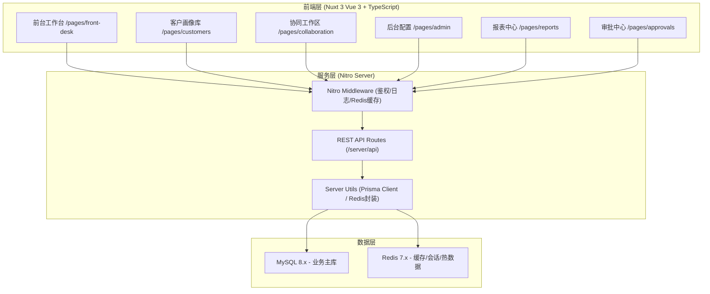
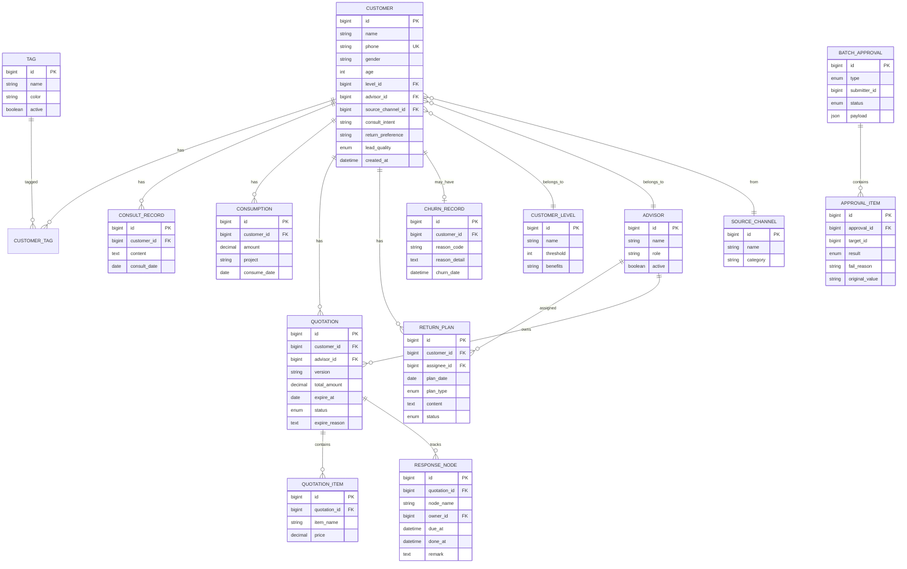

## 1. 架构设计



## 2. 技术说明

- **前端框架**：Nuxt 3.12+ (Vue 3.4 + TypeScript 5.4)，SSR/SSG 混合模式
- **UI 组件**：Nuxt UI 2.x + TailwindCSS 3.4 + @vueuse/core
- **图标库**：lucide-vue-next（与 Lucide React 风格一致的 Vue 版本）
- **状态管理**：Pinia 2.x（Nuxt 官方推荐）
- **后端服务**：Nitro（Nuxt 内置）+ H3 路由
- **ORM**：Prisma 5.14+（MySQL 驱动）
- **数据库**：MySQL 8.0+（主存）+ Redis 7.0+（缓存/会话/排行榜）
- **初始化工具**：npx nuxi init 模板

## 3. 路由定义

| 路由路径 | 用途 | 权限角色 |
|----------|------|----------|
| `/login` | 登录页 | 公开 |
| `/` | 首页总览看板 | 全员 |
| `/front-desk` | 前台工作台（咨询/复诊/消费录入） | 前台、顾问 |
| `/customers` | 客户画像库列表 | 全员 |
| `/customers/:id` | 客户画像详情 + 协同工作区 | 全员 |
| `/collaboration` | 跨部门协同视图（一体化） | 顾问、经理 |
| `/admin/tags` | 标签管理 | 经理以上 |
| `/admin/levels` | 客户等级配置 | 经理以上 |
| `/admin/advisors` | 顾问团队管理 | 经理以上 |
| `/admin/templates` | 回访计划模板 | 经理以上 |
| `/reports/conversion` | 来源转化报表 | 顾问以上 |
| `/reports/lead-quality` | 线索质量统计 | 经理以上 |
| `/approvals/batch` | 批量审批中心 | 经理以上 |

## 4. API 定义

### 4.1 客户模块
```typescript
// GET /api/customers - 客户列表（分页+筛选）
interface CustomerListQuery {
  page: number
  pageSize: number
  keyword?: string
  tagIds?: number[]
  levelId?: number
  advisorId?: number
  leadQuality?: 'A' | 'B' | 'C' | 'D'
}

// POST /api/customers - 新建客户
interface CustomerCreateInput {
  name: string
  phone: string
  gender?: 'M' | 'F'
  age?: number
  sourceChannelId: number
  consultIntent: string
  returnPreference?: string
  tagIds?: number[]
  advisorId?: number
}

// GET /api/customers/:id - 客户画像详情（聚合所有关联数据）
interface CustomerDetailVO {
  base: Customer
  tags: Tag[]
  level: CustomerLevel
  advisor: Advisor
  consults: ConsultRecord[]
  returnVisits: ReturnPlan[]
  consumptions: ConsumptionRecord[]
  quotations: Quotation[]
  churnInfo?: ChurnRecord
}
```

### 4.2 协同模块
```typescript
// POST /api/customers/:id/churn - 记录流失原因
interface ChurnCreateInput {
  reasonCode: string
  reasonDetail?: string
  quotationId?: number
}

// GET /api/customers/:id/quotations - 报价版本列表（不跳转，直接返回）
interface QuotationVO {
  id: number
  version: string
  amount: number
  items: QuotationItem[]
  expireAt: Date
  status: 'DRAFT' | 'SENT' | 'ACCEPTED' | 'EXPIRED' | 'REJECTED'
  expireReason?: string
  responseNodes: ResponseNode[]
}

// POST /api/customers/:id/return-plans - 新增回访计划（同屏操作）
interface ReturnPlanInput {
  planDate: Date
  planType: 'FOLLOW_UP' | 'REVISIT' | 'QUOTATION'
  content: string
  assigneeId: number
}
```

### 4.3 报表模块
```typescript
// GET /api/reports/conversion - 来源转化漏斗
interface ConversionReportVO {
  channels: ChannelFunnel[]
  quotationExpireAnalysis: {
    byReason: { reason: string; count: number; percentage: number }[]
    byOwner: { ownerName: string; expiredCount: number; totalCount: number }[]
    responseNodes: { node: string; avgDelayHours: number; ownerId: number }[]
  }
}

// GET /api/reports/lead-quality - 线索质量统计
interface LeadQualityReportVO {
  qualityDistribution: { grade: string; count: number; avgAmount: number }[]
  byAdvisor: { advisorId: number; A: number; B: number; C: number; D: number }[]
}
```

### 4.4 批量审批模块
```typescript
// POST /api/approvals/batch - 提交批量审批（含影响对象预览）
interface BatchApprovalInput {
  type: 'LEVEL_UPGRADE' | 'TAG_ADD' | 'ADVISOR_TRANSFER' | 'QUOTATION_APPROVE'
  targetIds: number[]
  payload: Record<string, any>
}

interface BatchApprovalPreviewVO {
  type: string
  totalCount: number
  affectedObjects: { id: number; name: string; currentValue: string; newValue: string }[]
  warningCount: number
  warnings: { targetId: number; message: string }[]
}

// POST /api/approvals/execute - 执行批量审批
interface BatchApprovalResultVO {
  successCount: number
  failCount: number
  results: {
    targetId: number
    targetName: string
    success: boolean
    originalStatus?: string
    failReason?: string
  }[]
}
```

## 5. 服务端架构图

```mermaid
graph LR
    A[Nitro Route Handler] --> B[Auth Middleware]
    B --> C[Validation Layer (zod)]
    C --> D[Service Layer]
    D --> E[Prisma Repository]
    D --> F[Redis Cache Layer]
    E --> G[(MySQL)]
    F --> H[(Redis)]
    D --> I[Event Bus (Nitro Hooks)]
    I --> J[Audit Logger]
    I --> K[Notification Service]
```

## 6. 数据模型

### 6.1 ER 图



### 6.2 Prisma Schema 核心配置

```prisma
generator client {
  provider = "prisma-client-js"
}

datasource db {
  provider = "mysql"
  url      = env("DATABASE_URL")
}

// Redis 缓存策略:
// - 客户详情: customers:{id} TTL=300s，更新时主动失效
// - 标签/等级字典: dict:tags / dict:levels TTL=1800s
// - 报表数据: reports:conversion:{date} TTL=3600s
// - 会话存储: session:{token} TTL=86400s
```
