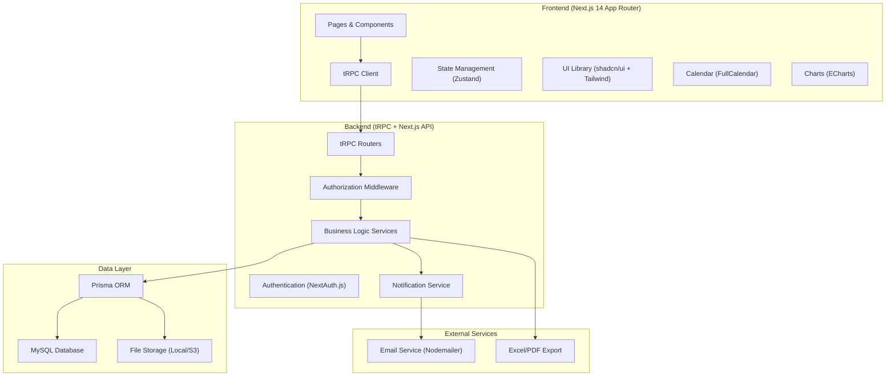
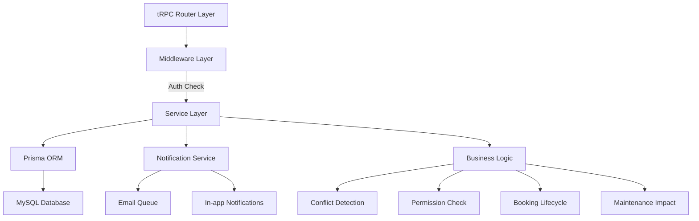
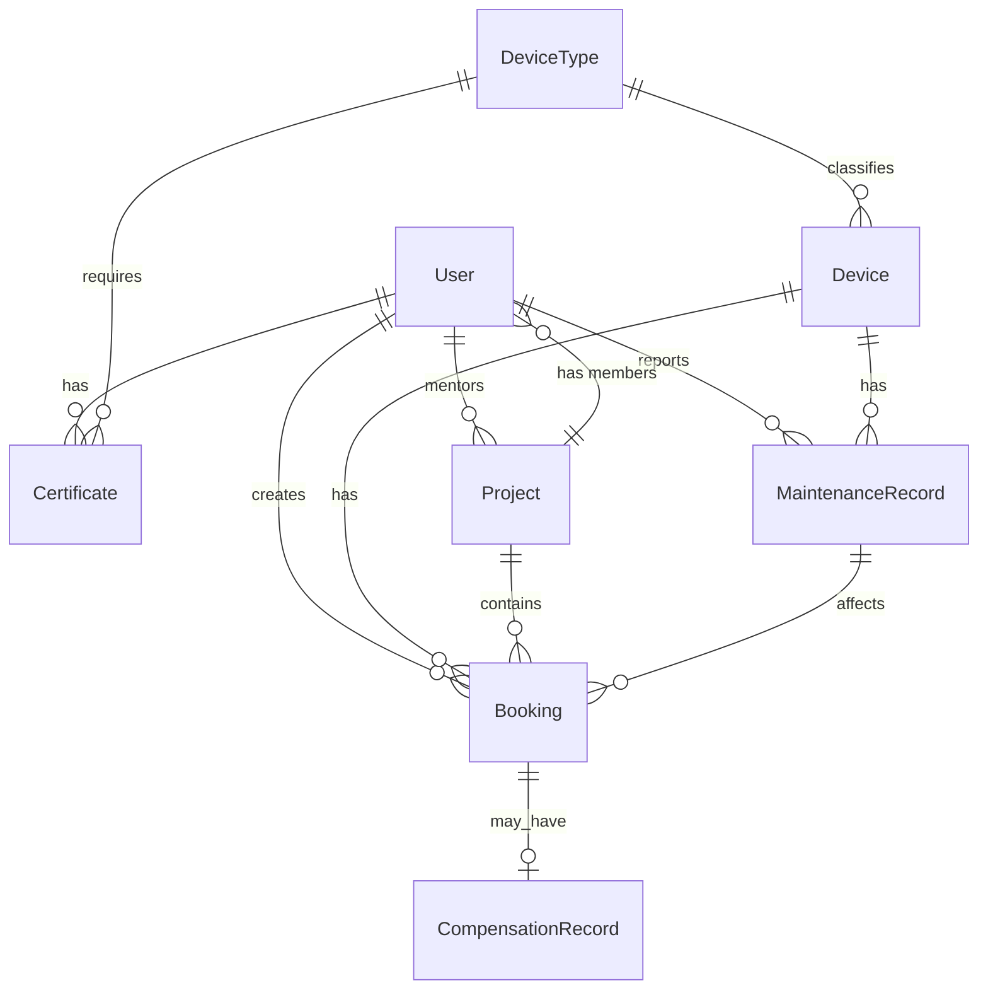

## 1. Architecture Design



## 2. Technology Description

### 2.1 技术栈选型

- **前端框架**: Next.js 14 (App Router) - React 服务端渲染，SEO 友好
- **API 层**: tRPC 11 - 端到端类型安全的 API 解决方案
- **ORM**: Prisma 5 - 类型安全的数据库访问
- **数据库**: MySQL 8.0 - 关系型数据库，支持事务
- **认证**: NextAuth.js 5 - 灵活的身份验证解决方案
- **UI 组件**: shadcn/ui + Tailwind CSS 3 - 可定制的组件库
- **状态管理**: Zustand - 轻量级状态管理
- **日历组件**: FullCalendar - 功能强大的日程日历
- **图表**: ECharts - 数据可视化图表
- **文件导出**: SheetJS (Excel) + jsPDF (PDF)
- **邮件服务**: Nodemailer - 邮件发送

### 2.2 项目初始化

使用 `create-t3-app` 初始化 Next.js + tRPC + Prisma 项目。

## 3. Route Definitions

| Route | 页面用途 | 权限要求 |
|-------|----------|----------|
| / | 首页仪表板 | 已登录用户 |
| /login | 登录页面 | 公开 |
| /devices | 设备列表 | 已登录用户 |
| /devices/[id] | 设备详情 + 预约日历 | 已登录用户 |
| /bookings | 我的预约 | 学生/导师 |
| /bookings/new | 新建预约 | 学生 |
| /approvals | 审批中心 | 导师/管理员 |
| /maintenance | 故障与维护 | 管理员/维护人员 |
| /reports | 报表中心 | 管理员 |
| /admin | 系统管理 | 管理员 |
| /profile | 个人中心 | 已登录用户 |

## 4. API Definitions (tRPC Routers)

### 4.1 核心类型定义

```typescript
// 用户相关
type UserRole = 'STUDENT' | 'MENTOR' | 'ADMIN' | 'MAINTENANCE';

interface User {
  id: string;
  studentId?: string;
  name: string;
  email: string;
  role: UserRole;
  department: string;
  hasCompletedSafetyTraining: boolean;
  safetyTrainingDate?: Date;
  certificates: Certificate[];
}

// 资格证书
interface Certificate {
  id: string;
  userId: string;
  deviceTypeId: string;
  title: string;
  fileUrl: string;
  verified: boolean;
  verifiedAt?: Date;
  expiresAt?: Date;
}

// 设备
interface Device {
  id: string;
  name: string;
  type: string;
  model: string;
  location: string;
  status: 'AVAILABLE' | 'IN_USE' | 'MAINTENANCE' | 'BROKEN';
  description?: string;
  imageUrl?: string;
  requiresNightAuthorization: boolean;
}

// 预约
type BookingStatus = 'PENDING_MENTOR' | 'PENDING_ADMIN' | 'APPROVED' | 'REJECTED' | 'CANCELLED' | 'COMPLETED';

interface Booking {
  id: string;
  userId: string;
  deviceId: string;
  projectId: string;
  startTime: Date;
  endTime: Date;
  purpose: string;
  status: BookingStatus;
  isNightBooking: boolean;
  nightAuthorized: boolean;
  cancelledReason?: string;
  compensationRecord?: CompensationRecord;
}

// 课题项目
interface Project {
  id: string;
  name: string;
  projectNumber: string;
  mentorId: string;
  members: string[];
}

// 故障维修
interface MaintenanceRecord {
  id: string;
  deviceId: string;
  reportedBy: string;
  description: string;
  status: 'REPORTED' | 'IN_PROGRESS' | 'RESOLVED';
  startTime: Date;
  estimatedEndTime?: Date;
  actualEndTime?: Date;
  affectedBookings: string[];
}

// 补偿记录
interface CompensationRecord {
  id: string;
  bookingId: string;
  reason: string;
  priorityBonus: number;
  voucherCode?: string;
  createdAt: Date;
}
```

### 4.2 tRPC Router 结构

```typescript
// app/api/trpc/[trpc]/routers/index.ts
const appRouter = {
  auth: authRouter,
  user: userRouter,
  device: deviceRouter,
  booking: bookingRouter,
  project: projectRouter,
  certificate: certificateRouter,
  maintenance: maintenanceRouter,
  report: reportRouter,
};
```

## 5. Server Architecture



### 5.1 核心服务层

- **BookingService**: 预约创建、冲突检测、状态流转
- **MaintenanceService**: 故障处理、自动取消、补偿记录
- **ApprovalService**: 多级审批流程、夜间授权
- **NotificationService**: 邮件和站内通知
- **ReportService**: 数据统计、报表生成

## 6. Data Model

### 6.1 ER Diagram



### 6.2 Prisma Schema

```prisma
// prisma/schema.prisma
generator client {
  provider = "prisma-client-js"
}

datasource db {
  provider = "mysql"
  url      = env("DATABASE_URL")
}

model User {
  id                        String           @id @default(cuid())
  name                      String
  email                     String           @unique
  studentId                 String?          @unique
  role                      String           @default("STUDENT")
  department                String?
  hasCompletedSafetyTraining Boolean         @default(false)
  safetyTrainingDate        DateTime?
  createdAt                 DateTime         @default(now())
  updatedAt                 DateTime         @updatedAt
  
  certificates              Certificate[]
  bookings                  Booking[]
  mentoredProjects          Project[]        @relation("MentorProjects")
  projectMemberships        Project[]        @relation("ProjectMembers")
  reportedMaintenance       MaintenanceRecord[]
}

model DeviceType {
  id                        String           @id @default(cuid())
  name                      String           @unique
  description               String?
  requiresCertificate       Boolean          @default(true)
  
  devices                   Device[]
  requiredCertificates      Certificate[]
}

model Device {
  id                        String           @id @default(cuid())
  name                      String
  typeId                    String
  model                     String?
  location                  String?
  status                    String           @default("AVAILABLE")
  description               String?
  imageUrl                  String?
  requiresNightAuthorization Boolean         @default(true)
  createdAt                 DateTime         @default(now())
  
  type                      DeviceType       @relation(fields: [typeId], references: [id])
  bookings                  Booking[]
  maintenanceRecords        MaintenanceRecord[]
}

model Project {
  id                        String           @id @default(cuid())
  name                      String
  projectNumber             String           @unique
  mentorId                  String
  description               String?
  createdAt                 DateTime         @default(now())
  
  mentor                    User             @relation("MentorProjects", fields: [mentorId], references: [id])
  members                   User[]           @relation("ProjectMembers")
  bookings                  Booking[]
}

model Certificate {
  id                        String           @id @default(cuid())
  userId                    String
  deviceTypeId              String
  title                     String
  fileUrl                   String
  verified                  Boolean          @default(false)
  verifiedAt                DateTime?
  verifiedBy                String?
  expiresAt                 DateTime?
  createdAt                 DateTime         @default(now())
  
  user                      User             @relation(fields: [userId], references: [id])
  deviceType                DeviceType       @relation(fields: [deviceTypeId], references: [id])
}

model Booking {
  id                        String           @id @default(cuid())
  userId                    String
  deviceId                  String
  projectId                 String
  startTime                 DateTime
  endTime                   DateTime
  purpose                   String
  status                    String           @default("PENDING_MENTOR")
  isNightBooking            Boolean          @default(false)
  nightAuthorized           Boolean          @default(false)
  rejectedReason            String?
  cancelledReason           String?
  createdAt                 DateTime         @default(now())
  updatedAt                 DateTime         @updatedAt
  
  user                      User             @relation(fields: [userId], references: [id])
  device                    Device           @relation(fields: [deviceId], references: [id])
  project                   Project          @relation(fields: [projectId], references: [id])
  compensation              CompensationRecord?
  affectedByMaintenance     MaintenanceRecord? @relation(fields: [affectedMaintenanceId], references: [id])
  affectedMaintenanceId     String?
}

model MaintenanceRecord {
  id                        String           @id @default(cuid())
  deviceId                  String
  reportedBy                String
  description               String
  status                    String           @default("REPORTED")
  startTime                 DateTime
  estimatedEndTime          DateTime?
  actualEndTime             DateTime?
  createdAt                 DateTime         @default(now())
  
  device                    Device           @relation(fields: [deviceId], references: [id])
  reporter                  User             @relation(fields: [reportedBy], references: [id])
  affectedBookings          Booking[]
}

model CompensationRecord {
  id                        String           @id @default(cuid())
  bookingId                 String           @unique
  reason                    String
  priorityBonus             Int              @default(0)
  voucherCode               String?
  createdAt                 DateTime         @default(now())
  
  booking                   Booking          @relation(fields: [bookingId], references: [id])
}

model Notification {
  id                        String           @id @default(cuid())
  userId                    String
  title                     String
  content                   String
  type                      String
  read                      Boolean          @default(false)
  createdAt                 DateTime         @default(now())
  
  user                      User             @relation(fields: [userId], references: [id])
}
```

### 6.3 索引设计

```sql
-- 预约查询优化
CREATE INDEX idx_booking_device_time ON Booking(deviceId, startTime, endTime);
CREATE INDEX idx_booking_user_status ON Booking(userId, status);
CREATE INDEX idx_booking_status_time ON Booking(status, startTime);

-- 设备状态查询
CREATE INDEX idx_device_status ON Device(status);

-- 维护记录查询
CREATE INDEX idx_maintenance_device_time ON MaintenanceRecord(deviceId, startTime);
```
