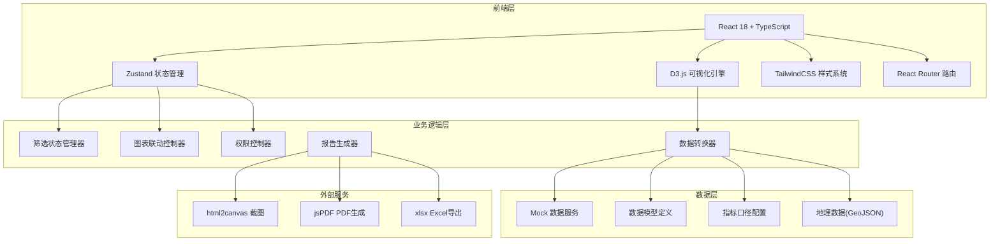
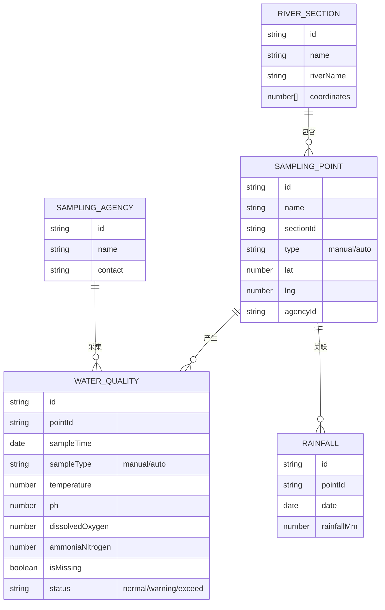

## 1. 架构设计



## 2. 技术说明

- **前端框架**: React@18 + TypeScript@5 + Vite@5
- **状态管理**: Zustand@4（轻量级，筛选状态全局共享）
- **可视化引擎**: D3.js@7（时间序列、地理地图、交互事件）
- **样式系统**: TailwindCSS@3 + CSS变量
- **路由**: React Router DOM@6
- **图标**: Lucide React
- **报告导出**: html2canvas + jsPDF + xlsx
- **数据来源**: 内置Mock数据（后续可对接真实API）

## 3. 路由定义

| 路由 | 页面 | 权限要求 |
|-------|---------|------------|
| / | 分析工作台（首页） | 公开 |
| /reports | 报告中心 | 研究团队及以上 |
| /reports/:id | 报告详情 | 研究团队及以上 |
| /settings | 系统设置 | 管理员 |

## 4. 数据模型

### 4.1 核心数据结构



### 4.2 筛选状态模型
```typescript
interface FilterState {
  selectedSections: string[];      // 河段ID列表
  selectedPoints: string[];        // 采样点ID列表
  selectedMonths: string[];        // 月份 YYYY-MM
  selectedIndicators: string[];    // 指标: temperature/ph/do/nh3n
  selectedAgencies: string[];      // 采样机构ID
  dateRange: { start: Date; end: Date };
}
```

### 4.3 指标标准配置
```typescript
const INDICATOR_STANDARDS = {
  temperature: { 
    name: '水温', 
    unit: '℃', 
    standard: { min: 0, max: 35 },
    description: '水体温度，影响溶解氧饱和度和水生生物活性'
  },
  ph: { 
    name: 'pH值', 
    unit: '', 
    standard: { min: 6, max: 9 },
    description: '水体酸碱度，正常范围6-9，超出可能影响水生生物'
  },
  dissolvedOxygen: { 
    name: '溶解氧', 
    unit: 'mg/L', 
    standard: { min: 5, max: null },
    description: '溶解在水中的氧气含量，低于5mg/L影响鱼类生存'
  },
  ammoniaNitrogen: { 
    name: '氨氮', 
    unit: 'mg/L', 
    standard: { min: null, max: 1.5 },
    description: '水体中氨和铵离子含量，过高表明存在污染'
  }
};
```

## 5. 组件架构

```
src/
├── components/
│   ├── filters/
│   │   ├── GlobalFilterBar.tsx    # 全局筛选栏
│   │   ├── SectionSelector.tsx    # 河段选择器
│   │   ├── PointSelector.tsx      # 采样点选择器
│   │   ├── MonthSelector.tsx      # 月份选择器
│   │   ├── IndicatorSelector.tsx  # 指标选择器
│   │   └── AgencySelector.tsx     # 机构选择器
│   ├── charts/
│   │   ├── TrendChart.tsx         # D3趋势图
│   │   ├── SamplingMap.tsx        # D3采样地图
│   │   └── GaugeCard.tsx          # 仪表盘卡片
│   ├── common/
│   │   ├── DataCard.tsx           # 数据概览卡片
│   │   ├── MetricTooltip.tsx      # 指标说明浮窗
│   │   ├── Legend.tsx             # 图例组件
│   │   └── EmptyState.tsx         # 空状态组件
│   └── report/
│       ├── ReportGenerator.tsx    # 报告生成器
│       └── ReportPreview.tsx      # 报告预览
├── store/
│   ├── useFilterStore.ts          # 筛选状态管理
│   ├── useDataStore.ts            # 数据状态管理
│   └── usePermissionStore.ts      # 权限状态管理
├── hooks/
│   ├── useWaterQualityData.ts     # 水质数据Hook
│   ├── useChartInteraction.ts     # 图表联动Hook
│   └── useReportExport.ts         # 报告导出Hook
├── data/
│   ├── mock/                      # Mock数据
│   ├── indicators.ts              # 指标配置
│   └── geojson/                   # 地理数据
├── utils/
│   ├── dataProcessing.ts          # 数据处理工具
│   ├── d3Helpers.ts               # D3辅助函数
│   └── exportUtils.ts             # 导出工具函数
├── pages/
│   ├── Dashboard.tsx              # 分析工作台
│   └── Reports.tsx                # 报告中心
└── types/
    └── index.ts                   # 类型定义
```

## 6. 关键技术实现点

### 6.1 D3图表联动机制
- 使用Zustand存储全局选中状态（选中的采样点、时间范围）
- 趋势图点击采样点 → 更新store → 地图高亮对应点位
- 地图点击点位 → 更新store → 趋势图过滤显示该点数据
- 筛选器变化 → 触发所有订阅组件的重渲染

### 6.2 缺测点处理
- 数据预处理时标记isMissing字段
- D3折线图使用d3.line().defined(d => !d.isMissing)实现断点
- 缺测点显示为空心圆圈，悬停提示"该时段无数据"

### 6.3 人工/自动站分层
- 数据点按sampleType分组
- 使用不同的线条样式（实线=自动站，虚线=人工采样）
- 图例可单独开关某类数据

### 6.4 报告生成
- 捕获当前筛选状态和图表可视区域
- 使用html2canvas截图核心图表
- 结合指标说明文字生成PDF/Excel
- 筛选条件作为报告元数据嵌入
