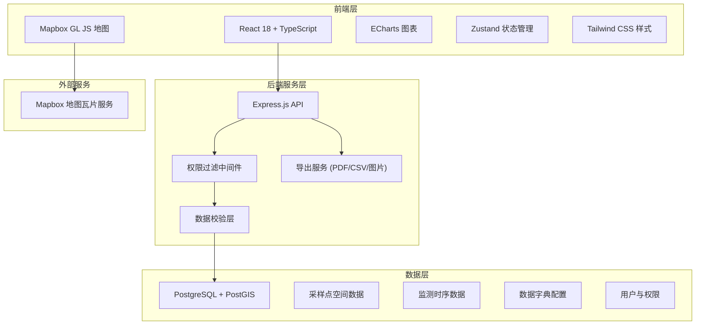
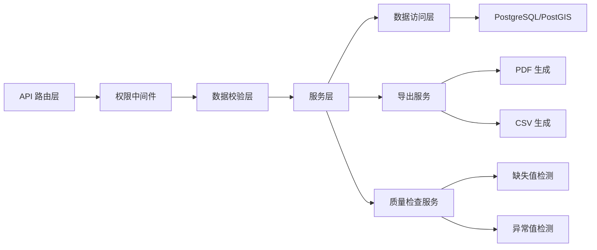
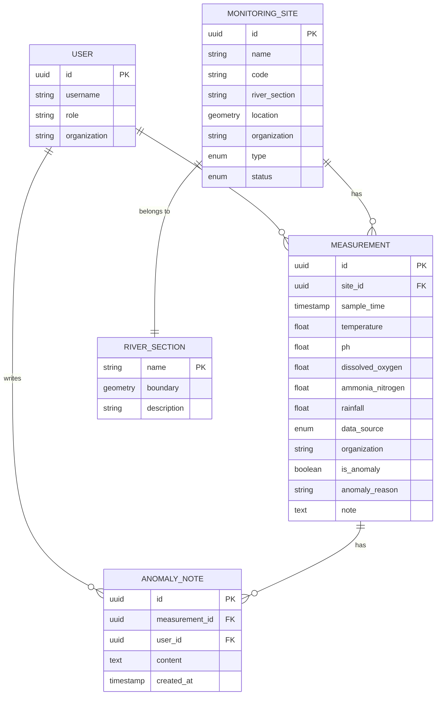

## 1. 架构设计



## 2. 技术描述

- **前端框架**：React 18 + TypeScript + Vite
- **状态管理**：Zustand
- **地图引擎**：Mapbox GL JS v2
- **图表库**：ECharts 5
- **样式方案**：Tailwind CSS 3
- **UI 组件**：Lucide React 图标库
- **后端框架**：Express.js 4 + TypeScript
- **数据库**：PostgreSQL + PostGIS（开发环境使用内存模拟数据层）
- **导出功能**：html2canvas（截图）、jspdf（PDF）、Papa Parse（CSV）
- **权限控制**：基于角色的访问控制（RBAC）

**说明**：由于开发环境限制，本项目使用模拟数据层替代真实 PostgreSQL 数据库，完整的数据模型和 SQL 定义在文档中提供，可在部署时直接对接真实数据库。

## 3. 路由定义

### 前端路由
| 路由路径 | 页面名称 | 权限要求 |
|----------|----------|----------|
| / | 总览仪表盘 | 所有登录用户 |
| /map | 地图监测视图 | 所有登录用户 |
| /trends | 趋势分析 | 所有登录用户 |
| /site/:id | 采样点详情 | 所有登录用户 |
| /data-management | 数据管理中心 | 管理员 |
| /export | 报告导出中心 | 所有登录用户 |

### 后端 API 路由
| 方法 | 路径 | 功能 | 权限 |
|------|------|------|------|
| GET | /api/overview | 获取总览仪表盘数据 | 登录用户 |
| GET | /api/sites | 获取采样点列表（支持筛选） | 登录用户 |
| GET | /api/sites/:id | 获取单个采样点详情 | 登录用户 |
| GET | /api/measurements | 查询监测数据（多维度筛选） | 登录用户 |
| GET | /api/measurements/trend | 获取趋势数据 | 登录用户 |
| POST | /api/measurements/import | 批量导入监测数据 | 管理员 |
| GET | /api/anomalies | 获取异常点列表 | 登录用户 |
| POST | /api/anomalies/:id/note | 为异常点添加备注 | 登录用户 |
| GET | /api/datadict | 获取数据字典 | 登录用户 |
| GET | /api/quality-check | 数据质量检查（缺失值、样本量） | 管理员 |
| GET | /api/export/csv | 导出 CSV 数据 | 登录用户 |
| GET | /api/export/pdf | 生成 PDF 报告 | 登录用户 |
| POST | /api/auth/login | 用户登录 | 公开 |

## 4. API 定义与类型

### 核心类型定义

```typescript
// 采样点类型
interface MonitoringSite {
  id: string;
  name: string;
  code: string;
  riverSection: string;
  longitude: number;
  latitude: number;
  location: GeoJSON.Point;
  organization: string;
  type: 'manual' | 'automatic';
  status: 'active' | 'inactive';
  createdAt: string;
}

// 监测记录类型
interface Measurement {
  id: string;
  siteId: string;
  sampleTime: string;
  temperature: number | null;
  ph: number | null;
  dissolvedOxygen: number | null;
  ammoniaNitrogen: number | null;
  rainfall: number | null;
  dataSource: 'manual' | 'automatic';
  organization: string;
  isAnomaly: boolean;
  anomalyReason?: string;
  note?: string;
  sampledBy?: string;
}

// 数据字典类型
interface DataDictionary {
  indicators: Array<{
    code: string;
    name: string;
    unit: string;
    standardMin: number;
    standardMax: number;
    gradeThresholds: Record<string, number>;
  }>;
  riverSections: string[];
  organizations: string[];
  waterQualityGrades: Array<{
    grade: string;
    color: string;
    description: string;
  }>;
}

// 质量检查结果
interface QualityCheckResult {
  totalRecords: number;
  missingValues: {
    temperature: number;
    ph: number;
    dissolvedOxygen: number;
    ammoniaNitrogen: number;
    rainfall: number;
  };
  anomalyCount: number;
  sampleCountBySite: Record<string, number>;
  sampleCountByMonth: Record<string, number>;
}

// 查询参数
interface MeasurementQuery {
  siteIds?: string[];
  riverSections?: string[];
  organizations?: string[];
  indicators?: string[];
  startDate?: string;
  endDate?: string;
  dataSource?: 'manual' | 'automatic' | 'all';
  onlyAnomalies?: boolean;
}
```

## 5. 服务器架构



### 目录结构
```
api/
├── src/
│   ├── middleware/
│   │   ├── auth.ts          # 权限验证中间件
│   │   └── validation.ts    # 参数校验中间件
│   ├── controllers/
│   │   ├── overview.ts      # 总览数据接口
│   │   ├── sites.ts         # 采样点接口
│   │   ├── measurements.ts  # 监测数据接口
│   │   ├── anomalies.ts     # 异常点接口
│   │   ├── datadict.ts      # 数据字典接口
│   │   └── export.ts        # 导出接口
│   ├── services/
│   │   ├── measurementService.ts
│   │   ├── qualityService.ts
│   │   └── exportService.ts
│   ├── data/
│   │   ├── mockData.ts      # 模拟数据
│   │   └── schema.sql       # 数据库建表语句
│   └── index.ts             # 入口文件
```

## 6. 数据模型

### 6.1 ER 图



### 6.2 DDL 语句

```sql
-- 启用 PostGIS
CREATE EXTENSION IF NOT EXISTS postgis;

-- 河段表
CREATE TABLE river_sections (
    name VARCHAR(100) PRIMARY KEY,
    boundary GEOMETRY(MultiPolygon, 4326),
    description TEXT,
    created_at TIMESTAMP DEFAULT CURRENT_TIMESTAMP
);

-- 采样点表
CREATE TABLE monitoring_sites (
    id UUID PRIMARY KEY DEFAULT gen_random_uuid(),
    name VARCHAR(200) NOT NULL,
    code VARCHAR(50) UNIQUE NOT NULL,
    river_section VARCHAR(100) REFERENCES river_sections(name),
    location GEOMETRY(Point, 4326) NOT NULL,
    organization VARCHAR(200) NOT NULL,
    type VARCHAR(20) CHECK (type IN ('manual', 'automatic')) NOT NULL,
    status VARCHAR(20) CHECK (status IN ('active', 'inactive')) DEFAULT 'active',
    created_at TIMESTAMP DEFAULT CURRENT_TIMESTAMP
);

CREATE INDEX idx_sites_location ON monitoring_sites USING GIST(location);
CREATE INDEX idx_sites_river_section ON monitoring_sites(river_section);

-- 监测数据表
CREATE TABLE measurements (
    id UUID PRIMARY KEY DEFAULT gen_random_uuid(),
    site_id UUID REFERENCES monitoring_sites(id) NOT NULL,
    sample_time TIMESTAMP NOT NULL,
    temperature FLOAT,
    ph FLOAT,
    dissolved_oxygen FLOAT,
    ammonia_nitrogen FLOAT,
    rainfall FLOAT,
    data_source VARCHAR(20) CHECK (data_source IN ('manual', 'automatic')) NOT NULL,
    organization VARCHAR(200) NOT NULL,
    is_anomaly BOOLEAN DEFAULT FALSE,
    anomaly_reason VARCHAR(500),
    note TEXT,
    sampled_by VARCHAR(100),
    created_at TIMESTAMP DEFAULT CURRENT_TIMESTAMP
);

CREATE INDEX idx_measurements_site_time ON measurements(site_id, sample_time DESC);
CREATE INDEX idx_measurements_sample_time ON measurements(sample_time DESC);
CREATE INDEX idx_measurements_anomaly ON measurements(is_anomaly) WHERE is_anomaly = TRUE;

-- 用户表
CREATE TABLE users (
    id UUID PRIMARY KEY DEFAULT gen_random_uuid(),
    username VARCHAR(100) UNIQUE NOT NULL,
    password_hash VARCHAR(255) NOT NULL,
    role VARCHAR(20) CHECK (role IN ('researcher', 'admin')) DEFAULT 'researcher',
    organization VARCHAR(200),
    created_at TIMESTAMP DEFAULT CURRENT_TIMESTAMP
);

-- 异常备注表
CREATE TABLE anomaly_notes (
    id UUID PRIMARY KEY DEFAULT gen_random_uuid(),
    measurement_id UUID REFERENCES measurements(id) NOT NULL,
    user_id UUID REFERENCES users(id) NOT NULL,
    content TEXT NOT NULL,
    created_at TIMESTAMP DEFAULT CURRENT_TIMESTAMP
);

-- 数据字典视图
CREATE VIEW v_data_dictionary_indicators AS
SELECT 
    'temperature' as code, '水温' as name, '°C' as unit,
    0 as standard_min, 35 as standard_max,
    '{"Ⅰ": 20, "Ⅱ": 25, "Ⅲ": 30}'::json as grade_thresholds
UNION ALL
SELECT 
    'ph' as code, 'pH值' as name, '' as unit,
    6 as standard_min, 9 as standard_max,
    '{"Ⅰ": 7, "Ⅱ": 7.5, "Ⅲ": 8}'::json as grade_thresholds
UNION ALL
SELECT 
    'dissolved_oxygen' as code, '溶解氧' as name, 'mg/L' as unit,
    2 as standard_min, 15 as standard_max,
    '{"Ⅰ": 7.5, "Ⅱ": 6, "Ⅲ": 5, "Ⅳ": 3, "Ⅴ": 2}'::json as grade_thresholds
UNION ALL
SELECT 
    'ammonia_nitrogen' as code, '氨氮' as name, 'mg/L' as unit,
    0 as standard_min, 2 as standard_max,
    '{"Ⅰ": 0.15, "Ⅱ": 0.5, "Ⅲ": 1.0, "Ⅳ": 1.5, "Ⅴ": 2.0}'::json as grade_thresholds;
```

## 7. 前端工程结构

```
src/
├── components/
│   ├── layout/
│   │   ├── Sidebar.tsx       # 左侧导航
│   │   ├── Header.tsx        # 顶部栏
│   │   └── PageContainer.tsx # 页面容器
│   ├── dashboard/
│   │   ├── IndicatorCard.tsx # 指标卡片
│   │   ├── RiverSectionBar.tsx
│   │   └── AnomalyList.tsx
│   ├── map/
│   │   ├── MapView.tsx       # Mapbox 地图容器
│   │   ├── LayerControl.tsx  # 图层控制
│   │   └── SitePopup.tsx     # 采样点弹窗
│   ├── charts/
│   │   ├── TrendChart.tsx    # 趋势图（支持断点）
│   │   ├── IndicatorSparkline.tsx
│   │   └── GradeDistribution.tsx
│   ├── filters/
│   │   ├── DateRangePicker.tsx
│   │   ├── MultiSelect.tsx
│   │   └── FilterBar.tsx
│   └── common/
│       ├── DataTable.tsx
│       ├── ExportButton.tsx
│       └── AnomalyBadge.tsx
├── pages/
│   ├── Dashboard.tsx
│   ├── MapView.tsx
│   ├── TrendAnalysis.tsx
│   ├── SiteDetail.tsx
│   ├── DataManagement.tsx
│   └── ExportCenter.tsx
├── store/
│   ├── useFilterStore.ts     # 筛选条件状态
│   └── useAuthStore.ts       # 用户权限状态
├── hooks/
│   ├── useMeasurements.ts    # 监测数据查询
│   ├── useSites.ts           # 采样点查询
│   └── useExport.ts          # 导出功能
├── utils/
│   ├── dataQuality.ts        # 数据质量检查
│   ├── indicators.ts         # 指标计算
│   └── formatters.ts         # 格式化工具
├── types/
│   └── index.ts              # 类型定义
└── App.tsx
```
