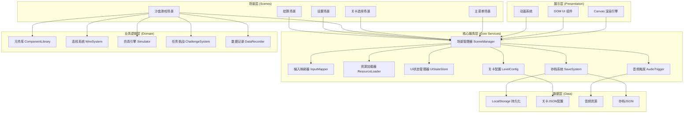

## 1. 架构设计



## 2. 技术描述
- **前端语言**: TypeScript 5.x（严格模式）
- **构建工具**: Vite 5.x（快速热更新，原生ESM）
- **渲染**: HTML5 Canvas 2D API（游戏画布）+ React 18（DOM UI层）
- **UI框架**: React 18 + TailwindCSS 3（非Canvas的菜单、面板、设置页）
- **状态管理**: Zustand 4（轻量级UI状态存储）
- **音频**: Web Audio API（程序化生成音效，无需外部音频文件）
- **样式**: TailwindCSS 3 + CSS Modules（组件隔离）
- **数据持久化**: LocalStorage API（JSON序列化）
- **测试**: Vitest（单元测试）

## 3. 模块定义

### 3.1 目录结构
```
src/
├── core/                    # 核心服务层
│   ├── SceneManager.ts      # 场景生命周期管理、切换
│   ├── InputMapper.ts       # 键鼠输入→动作映射、拖拽识别
│   ├── ResourceLoader.ts    # 资源预加载、缓存管理
│   ├── UIStateStore.ts      # Zustand stores定义
│   ├── AudioTrigger.ts      # Web Audio音效合成器
│   ├── SaveSystem.ts        # 存档读写、导入导出
│   └── LevelConfig.ts       # 关卡配置加载、校验
├── scenes/                  # 场景层
│   ├── BaseScene.ts         # 场景基类
│   ├── MenuScene.tsx        # 主菜单
│   ├── LevelSelectScene.tsx # 关卡选择
│   ├── SandboxScene.tsx     # 沙盒主场景
│   ├── SettingsScene.tsx    # 设置面板
│   └── ResultScene.tsx      # 结算页
├── game/                    # 业务逻辑层
│   ├── components/          # 电路元件定义
│   │   ├── BaseComponent.ts
│   │   ├── Battery.ts
│   │   ├── Resistor.ts
│   │   ├── Capacitor.ts
│   │   ├── Switch.ts
│   │   ├── Bulb.ts
│   │   └── Wire.ts
│   ├── ComponentLibrary.ts  # 元件库管理
│   ├── WireSystem.ts        # 连线路由、连接检测
│   ├── Simulator.ts         # 电路仿真（节点电压法简化版）
│   ├── ChallengeSystem.ts   # 任务目标判定
│   ├── DataRecorder.ts      # 行为数据记录
│   └── types.ts             # 游戏类型定义
├── rendering/               # 展示层
│   ├── CanvasRenderer.ts    # Canvas主渲染循环
│   ├── AnimationSystem.ts   # 粒子、发光、过渡动画
│   └── ui/                  # React UI组件
│       ├── ComponentPanel.tsx
│       ├── InfoPanel.tsx
│       ├── StatusBar.tsx
│       └── common/
├── data/                    # 静态数据
│   ├── levels/              # 关卡JSON
│   │   ├── level-001.json
│   │   └── ...
│   └── defaults.ts          # 默认配置
├── utils/                   # 工具函数
│   ├── geometry.ts          # 向量、碰撞检测
│   ├── serialization.ts     # 序列化工具
│   └── logger.ts            # 开发调试日志
├── App.tsx
├── main.tsx
└── index.css
```

### 3.2 核心模块职责

| 模块 | 职责 | 关键方法 |
|------|------|---------|
| SceneManager | 场景注册/切换/生命周期钩子 | `register()`, `switchTo()`, `update()`, `render()` |
| InputMapper | 统一输入事件，映射为语义动作 | `bind(action, keys)`, `onDragStart/End/Move()`, `consumeEvent()` |
| AudioTrigger | 用OscillatorNode合成音效 | `playClick()`, `playWireConnect()`, `playBulbOn()`, `playError()`, `playSuccess()` |
| SaveSystem | 存档CRUD、导入导出JSON | `saveSlot()`, `loadSlot()`, `exportSave()`, `importSave()`, `deleteSlot()` |
| Simulator | 简化版电路仿真（教学近似） | `buildGraph()`, `solve()`, `getVoltageAt()`, `getCurrentThrough()`, `hasShortCircuit()` |
| DataRecorder | 记录玩家行为数据 | `recordFailure()`, `recordRetry()`, `recordTutorialSkip()`, `generateReport()` |
| WireSystem | 导线连接和路径 | `connectPorts()`, `disconnect()`, `routePath()`, `getConnectedComponents()` |

## 4. 数据模型

### 4.1 存档结构 (SaveData)
```typescript
interface SaveData {
  version: string;
  createdAt: number;
  updatedAt: number;
  settings: GameSettings;
  progress: PlayerProgress;
  analytics: PlayerAnalytics;
  savedCircuits: SavedCircuit[];
}

interface PlayerProgress {
  unlockedLevelIds: string[];
  levelStars: Record<string, 0 | 1 | 2 | 3>;
  levelBestTimes: Record<string, number>;
  tutorialCompleted: boolean;
  tutorialSkipped: boolean;
}

interface PlayerAnalytics {
  totalPlayTime: number;
  levelsAttempted: Record<string, number>;
  levelFailures: Record<string, FailureRecord[]>;
  levelRetries: Record<string, number>;
  componentsPlaced: number;
  wiresDrawn: number;
  tutorialStepsSkipped: string[];
}

interface FailureRecord {
  step: string;
  timestamp: number;
  errorType: 'short_circuit' | 'no_power' | 'wrong_component' | 'disconnected';
  circuitStateSnapshotId: string;
}

interface SavedCircuit {
  id: string;
  name: string;
  levelId?: string;
  createdAt: number;
  thumbnail: string; // base64
  circuit: CircuitData;
}

interface CircuitData {
  components: ComponentInstance[];
  wires: WireInstance[];
}
```

### 4.2 关卡配置结构
```typescript
interface LevelConfig {
  id: string;
  order: number;
  name: string;
  description: string;
  difficulty: 'tutorial' | 'easy' | 'medium' | 'hard';
  prerequisites: string[];
  availableComponents: ComponentType[];
  preplacedComponents?: ComponentInstance[];
  fixedComponents?: string[]; // 不可删除的元件ID
  objectives: Objective[];
  starConditions: StarCondition[];
  hints: HintStep[];
  tutorialSteps?: TutorialStep[];
}

interface Objective {
  id: string;
  type: 'bulb_lit' | 'all_switches_used' | 'component_count' | 'no_short_circuit';
  params: Record<string, any>;
  description: string;
}

interface StarCondition {
  stars: 1 | 2 | 3;
  condition: Objective;
}
```

### 4.3 电路仿真类型
```typescript
type ComponentType = 'battery' | 'resistor' | 'capacitor' | 'switch' | 'bulb';

interface Port {
  id: string;
  componentId: string;
  position: Vec2;
}

interface ComponentInstance {
  id: string;
  type: ComponentType;
  position: Vec2;
  rotation: number;
  properties: ComponentProperties;
  ports: Port[];
}

interface WireInstance {
  id: string;
  fromPort: string; // port id
  toPort: string;
  path?: Vec2[];
}

interface SimulationResult {
  hasShortCircuit: boolean;
  shortCircuitPath?: string[];
  nodeVoltages: Record<string, number>;
  wireCurrents: Record<string, number>;
  componentStates: Record<string, ComponentState>;
}

interface ComponentState {
  voltage: number;
  current: number;
  power: number;
  lit?: boolean;      // bulb
  closed?: boolean;   // switch
  charge?: number;    // capacitor
}
```

## 5. 仿真算法说明（教学近似）

采用**简化节点电压法**，面向教学而非精确工程计算：
1. 将电路抽象为图：元件=边的特殊节点，端口=连接点，导线=边
2. 电源（Battery）固定两端电势差
3. 电阻（Resistor）应用欧姆定律：V = IR
4. 电容（Capacitor）简化为：初始=开路，稳态=短路（用于演示充放电概念）
5. 开关（Switch）：on=导线，off=开路
6. 灯泡（Bulb）：视作电阻 + 发光判定（功率>阈值则点亮）
7. 短路检测：存在不经过任何元件的电源环路
8. 求解使用**迭代松弛法**（3-5次迭代足够，避免精确矩阵求逆）

## 6. 验收测试清单

### 6.1 输入反馈
- [ ] 元件拖拽时跟随鼠标，有半透明预览
- [ ] 放置元件时播放"咔嗒"音效 + 元件落地动画
- [ ] 导线连接时端点发光 + "滋滋"接通音
- [ ] 开关切换有视觉翻转 + 弹片音
- [ ] 删除元件有淡出动画 + 撤销提示
- [ ] 错误操作（如短路）有红色闪烁 + 警告音

### 6.2 存档系统
- [ ] 自动存档在操作后3秒触发（防抖）
- [ ] 手动保存创建命名存档 + 缩略图
- [ ] 导出功能生成可下载的JSON文件
- [ ] 导入功能校验版本并合并进度
- [ ] 清空存档有二次确认弹窗
- [ ] 跨会话恢复：关闭重开后进度完整恢复

### 6.3 结算状态
- [ ] 通关时1.5秒延迟后触发结算场景过渡
- [ ] 星级判定按条件显示（默认3星）
- [ ] 数据面板显示：耗时、失败次数、重试步骤、元件使用数
- [ ] "保存方案"按钮导出当前电路
- [ ] "下一关"按钮正确解锁并跳转后续关卡
- [ ] 结算数据持久化到analytics
