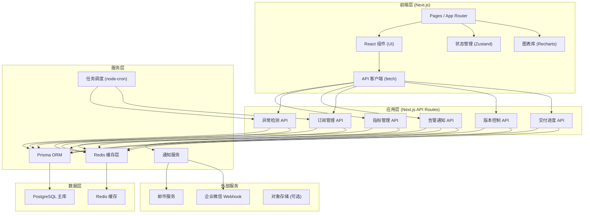
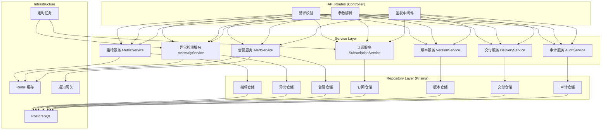
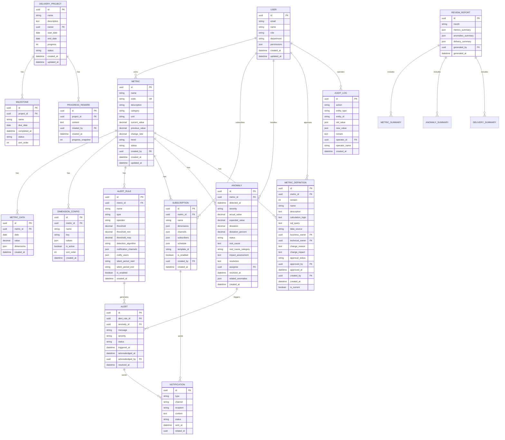

## 1. 架构设计



## 2. 技术描述

### 2.1 技术栈选型

- **前端框架**: Next.js 14 (App Router) + React 18 + TypeScript
- **UI 框架**: Tailwind CSS 3 + shadcn/ui 组件库
- **状态管理**: Zustand（轻量级，适合中小规模应用）
- **图表库**: Recharts（React 原生，交互丰富）
- **图标库**: lucide-react
- **后端框架**: Next.js API Routes（Serverless 架构，无需额外部署）
- **ORM**: Prisma 5（类型安全，迁移管理）
- **数据库**: PostgreSQL 15（关系型数据，支持复杂查询）
- **缓存**: Redis 7（热点数据缓存、会话管理、分布式锁）
- **任务调度**: node-cron（定时检测、日报生成）
- **包管理**: pnpm

### 2.2 设计原则

1. **类型安全**: 全链路 TypeScript，从数据库模型到前端组件保持类型一致
2. **关注点分离**: API 路由只处理请求响应，业务逻辑抽取到 service 层
3. **缓存优先**: 热点指标数据优先读取 Redis 缓存，降低数据库压力
4. **可追溯性**: 所有关键操作（口径变更、权限改动、金额调整）强制记录备注和操作人
5. **可观测性**: 关键接口埋点，异常自动捕获和告警

## 3. 路由定义

| 路由路径 | 页面用途 |
|----------|---------|
| `/` | 驾驶舱首页 - 核心指标概览、异常监控、趋势分析 |
| `/metrics/[id]` | 指标详情页 - 维度配置、日报订阅、告警规则、明细查询 |
| `/anomalies` | 异常列表页 - 异常记录列表、筛选、导出 |
| `/anomalies/[id]` | 异常分析页 - 原因分析、波动趋势、关联指标 |
| `/definitions` | 口径维护页 - 指标定义列表、版本管理、变更审批 |
| `/definitions/[id]` | 口径详情页 - 指标定义编辑、版本对比、历史回溯 |
| `/delivery` | 交付进度页 - 项目进度跟踪、交付报表、月底复盘 |
| `/settings` | 系统设置页 - 用户管理、权限配置、操作日志 |

### API 路由

| API 路径 | 方法 | 用途 |
|----------|------|------|
| `/api/metrics` | GET | 获取指标列表 |
| `/api/metrics/[id]` | GET | 获取指标详情 |
| `/api/metrics/[id]/data` | GET | 获取指标时序数据 |
| `/api/metrics/[id]/dimensions` | PUT | 更新指标维度配置 |
| `/api/anomalies` | GET | 获取异常列表 |
| `/api/anomalies/[id]` | GET/PUT | 获取/更新异常详情 |
| `/api/anomalies/detect` | POST | 触发异常检测 |
| `/api/alerts` | GET | 获取告警列表 |
| `/api/alerts/[id]` | PUT | 确认/处理告警 |
| `/api/subscriptions` | GET/POST | 获取/创建日报订阅 |
| `/api/subscriptions/[id]` | PUT/DELETE | 更新/删除订阅 |
| `/api/definitions` | GET/POST | 获取/创建指标定义 |
| `/api/definitions/[id]` | GET/PUT | 获取/更新指标定义 |
| `/api/definitions/[id]/versions` | GET | 获取版本历史 |
| `/api/definitions/[id]/versions/compare` | GET | 版本对比 |
| `/api/delivery/projects` | GET | 获取交付项目列表 |
| `/api/delivery/projects/[id]` | PUT | 更新项目进度 |
| `/api/delivery/reports` | GET/POST | 获取/生成复盘报表 |
| `/api/users` | GET | 获取用户列表 |
| `/api/users/[id]/permissions` | PUT | 更新用户权限（需备注） |

## 4. API 类型定义

```typescript
// 核心指标类型
interface Metric {
  id: string;
  name: string;
  code: string;
  description: string;
  category: 'user_growth' | 'engagement' | 'retention' | 'conversion' | 'revenue';
  unit: string;
  currentValue: number;
  previousValue: number;
  changeRate: number;
  trend: 'up' | 'down' | 'stable';
  status: 'normal' | 'warning' | 'critical';
  dimensions: DimensionConfig[];
  alertRules: AlertRule[];
  subscriptions: Subscription[];
  updatedAt: Date;
}

// 维度配置
interface DimensionConfig {
  id: string;
  name: string;
  key: string;
  values: string[];
  isActive: boolean;
}

// 告警规则
interface AlertRule {
  id: string;
  metricId: string;
  name: string;
  type: 'threshold' | 'trend' | 'anomaly';
  operator: 'gt' | 'lt' | 'gte' | 'lte' | 'between';
  threshold: number;
  thresholdMin?: number;
  thresholdMax?: number;
  detectionAlgorithm: '3sigma' | 'isolation_forest' | 'moving_average';
  notificationChannels: ('email' | 'wechat' | 'sms')[];
  notifyUsers: string[];
  silentPeriodStart?: string;
  silentPeriodEnd?: string;
  isEnabled: boolean;
}

// 日报订阅
interface Subscription {
  id: string;
  metricId: string;
  name: string;
  dimensions: Record<string, string[]>;
  channels: ('email' | 'wechat')[];
  subscribers: string[];
  schedule: {
    hour: number;
    minute: number;
    timezone: string;
  };
  templateId: string;
  isEnabled: boolean;
  createdBy: string;
  createdAt: Date;
}

// 异常记录
interface Anomaly {
  id: string;
  metricId: string;
  metricName: string;
  detectedAt: Date;
  severity: 'low' | 'medium' | 'high' | 'critical';
  actualValue: number;
  expectedValue: number;
  deviation: number;
  deviationPercent: number;
  status: 'open' | 'investigating' | 'resolved' | 'ignored';
  rootCause?: string;
  rootCauseCategory?: 'data_quality' | 'business_change' | 'system_failure' | 'external_factor' | 'other';
  impactAssessment?: string;
  resolution?: string;
  assignee?: string;
  resolvedAt?: Date;
  relatedAnomalies: string[];
  createdAt: Date;
}

// 指标定义（口径）
interface MetricDefinition {
  id: string;
  metricId: string;
  version: number;
  name: string;
  description: string;
  calculationLogic: string;
  sqlQuery: string;
  dataSource: string;
  businessOwner: string;
  technicalOwner: string;
  changeReason: string;
  changeImpact: string;
  approvalStatus: 'draft' | 'pending' | 'approved' | 'rejected';
  approvedBy?: string;
  approvedAt?: Date;
  createdBy: string;
  createdAt: Date;
  isCurrent: boolean;
}

// 交付项目
interface DeliveryProject {
  id: string;
  name: string;
  description: string;
  owner: string;
  startDate: Date;
  endDate: Date;
  progress: number;
  status: 'not_started' | 'in_progress' | 'delayed' | 'completed';
  milestones: Milestone[];
  remarks: ProgressRemark[];
  createdAt: Date;
  updatedAt: Date;
}

interface Milestone {
  id: string;
  name: string;
  dueDate: Date;
  completedAt?: Date;
  status: 'pending' | 'completed' | 'delayed';
}

interface ProgressRemark {
  id: string;
  content: string;
  createdBy: string;
  createdAt: Date;
  progressSnapshot: number;
}

// 复盘报表
interface ReviewReport {
  id: string;
  month: string;
  metricsSummary: {
    metricId: string;
    metricName: string;
    targetValue: number;
    actualValue: number;
    completionRate: number;
    anomalyCount: number;
  }[];
  anomaliesSummary: {
    total: number;
    bySeverity: Record<string, number>;
    byCategory: Record<string, number>;
    avgResolutionTime: number;
  };
  deliverySummary: {
    totalProjects: number;
    completedProjects: number;
    onTimeRate: number;
  };
  generatedBy: string;
  generatedAt: Date;
}

// 操作日志（用于金额/权限改动追溯）
interface AuditLog {
  id: string;
  action: string;
  entityType: 'user_permission' | 'metric_threshold' | 'amount_setting' | 'definition_change';
  entityId: string;
  oldValue: Record<string, unknown>;
  newValue: Record<string, unknown>;
  remark: string;
  operatorId: string;
  operatorName: string;
  createdAt: Date;
}
```

## 5. 服务端架构



## 6. 数据模型

### 6.1 ER 图



### 6.2 Prisma Schema 关键索引

```prisma
// 指标数据按日期和维度查询优化
model MetricData {
  id         String   @id @default(uuid())
  metricId   String
  date       DateTime
  value      Decimal
  dimensions Json

  @@index([metricId, date])
  @@index([metricId, date, dimensions])
}

// 异常按状态和严重级别查询优化
model Anomaly {
  id         String   @id @default(uuid())
  metricId   String
  detectedAt DateTime
  severity   String
  status     String

  @@index([status, detectedAt])
  @@index([metricId, detectedAt])
  @@index([severity, status])
}

// 审计日志快速检索
model AuditLog {
  id         String   @id @default(uuid())
  entityType String
  entityId   String
  createdAt  DateTime

  @@index([entityType, entityId, createdAt])
  @@index([createdAt])
}
```

### 6.3 Redis 缓存设计

| Key 模式 | 数据类型 | 过期时间 | 用途 |
|----------|----------|----------|------|
| `metric:{id}:current` | String | 5分钟 | 指标当前值缓存 |
| `metric:{id}:trend:{range}` | Hash | 15分钟 | 指标趋势数据（7d/30d/90d） |
| `anomalies:active` | List | 1分钟 | 活跃异常列表 |
| `anomaly:{id}` | Hash | 1小时 | 异常详情 |
| `cache:lock:{operation}` | String | - | 分布式锁 |
| `rate_limit:{user}:{endpoint}` | String | 1分钟 | 接口限流 |
| `session:{token}` | Hash | 24小时 | 用户会话 |

## 7. 安全设计

### 7.1 认证授权

- 基于 JWT 的无状态认证，Token 存储在 HttpOnly Cookie 中
- 接口级别权限校验，敏感操作（权限改动、金额调整）二次验证
- 行级数据隔离，根据用户角色控制数据可见范围

### 7.2 敏感操作审计

- 所有修改操作强制记录 `remark` 字段
- 金额改动、权限变更自动写入 `AuditLog`
- 操作日志保留至少 180 天，不可删除

### 7.3 输入校验

- 所有 API 参数使用 Zod 进行运行时校验
- SQL 查询使用 Prisma 参数化，防止注入
- XSS 防护：用户输入内容渲染时自动转义
