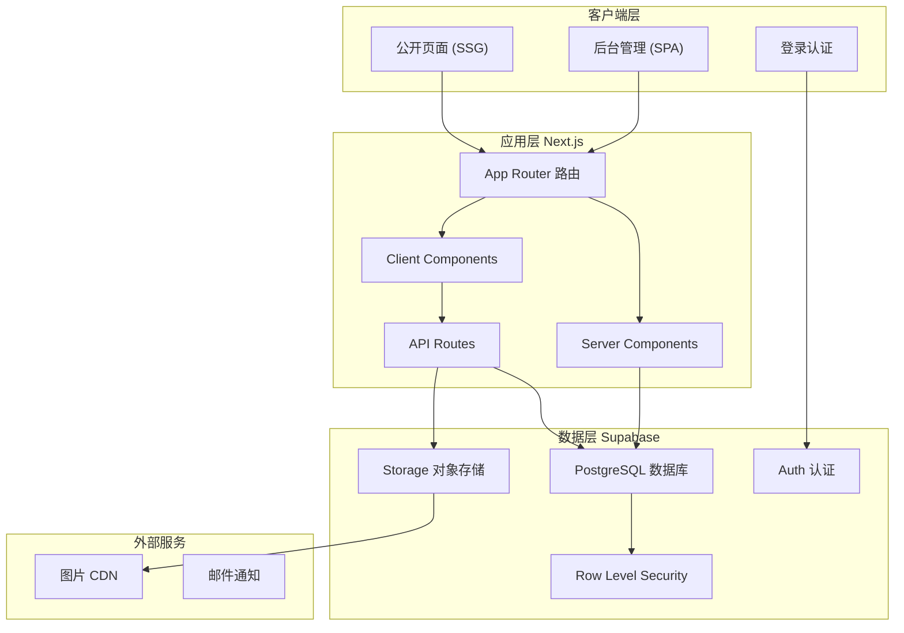
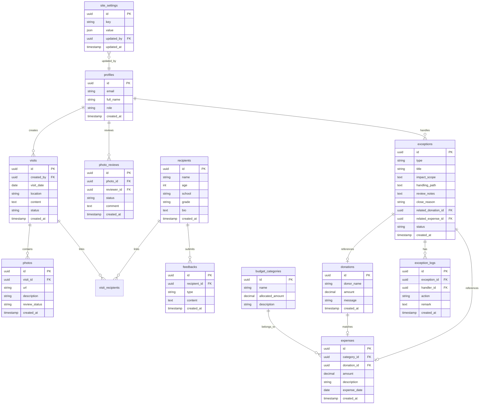

## 1. 架构设计



---

## 2. 技术描述

### 2.1 核心技术栈
- **前端框架**: Next.js 14 (App Router) + React 18 + TypeScript
- **样式方案**: Tailwind CSS 3.4
- **后端服务**: Supabase (PostgreSQL + Auth + Storage)
- **数据库**: PostgreSQL 15
- **状态管理**: Zustand (客户端状态) + React Query (服务端状态)
- **图标库**: Lucide React
- **图表库**: Recharts
- **表单处理**: React Hook Form + Zod

### 2.2 项目初始化
使用 Next.js 官方脚手架初始化项目：
```bash
npx create-next-app@latest . --typescript --tailwind --eslint --app --src-dir --import-alias "@/*"
```

### 2.3 依赖包
```json
{
  "dependencies": {
    "@supabase/ssr": "^0.3.0",
    "@supabase/supabase-js": "^2.42.0",
    "lucide-react": "^0.363.0",
    "recharts": "^2.12.0",
    "zustand": "^4.5.0",
    "@tanstack/react-query": "^5.28.0",
    "react-hook-form": "^7.51.0",
    "zod": "^3.22.0"
  },
  "devDependencies": {
    "supabase": "^1.150.0"
  }
}
```

---

## 3. 路由定义

| 路由 | 类型 | 权限 | 描述 |
|------|------|------|------|
| `/` | Server Component | 公开 | 项目公开首页 |
| `/progress` | Server Component | 公开 | 项目进展页 |
| `/finance` | Server Component | 公开 | 资金使用页 |
| `/feedback` | Server Component | 公开 | 受助反馈页 |
| `/login` | Client Component | 公开 | 后台登录页 |
| `/admin` | Server Component | 需登录 | 后台仪表盘 |
| `/admin/budget` | Server Component | 需登录 | 预算管理 |
| `/admin/visits` | Server Component | 需登录 | 探访记录 |
| `/admin/photos` | Server Component | 需登录 | 照片审核 |
| `/admin/donations` | Server Component | 需登录 | 捐赠明细 |
| `/admin/exceptions` | Server Component | 需登录 | 异常处理 |
| `/admin/settings` | Server Component | 需登录 | 系统设置 |
| `/api/auth/*` | API Route | 公开 | Supabase Auth 回调 |
| `/api/upload` | API Route | 需登录 | 图片上传 |

---

## 4. 数据模型

### 4.1 ER 图



### 4.2 DDL 语句

```sql
-- 扩展
create extension if not exists "uuid-ossp";

-- Profiles 表
create table profiles (
  id uuid references auth.users not null primary key,
  email text unique not null,
  full_name text,
  role text not null default 'officer' check (role in ('officer', 'admin')),
  created_at timestamp with time zone default timezone('utc'::text, now()) not null
);

-- 探访记录表
create table visits (
  id uuid primary key default uuid_generate_v4(),
  created_by uuid references profiles(id) not null,
  visit_date date not null,
  location text not null,
  content text not null,
  status text not null default 'draft' check (status in ('draft', 'submitted', 'published')),
  created_at timestamp with time zone default timezone('utc'::text, now()) not null
);

-- 照片表
create table photos (
  id uuid primary key default uuid_generate_v4(),
  visit_id uuid references visits(id) on delete cascade,
  url text not null,
  description text,
  review_status text not null default 'pending' check (review_status in ('pending', 'approved', 'rejected')),
  created_at timestamp with time zone default timezone('utc'::text, now()) not null
);

-- 照片审核表
create table photo_reviews (
  id uuid primary key default uuid_generate_v4(),
  photo_id uuid references photos(id) on delete cascade not null,
  reviewer_id uuid references profiles(id) not null,
  status text not null check (status in ('approved', 'rejected')),
  comment text,
  created_at timestamp with time zone default timezone('utc'::text, now()) not null
);

-- 受助者表
create table recipients (
  id uuid primary key default uuid_generate_v4(),
  name text not null,
  age integer,
  school text,
  grade text,
  bio text,
  created_at timestamp with time zone default timezone('utc'::text, now()) not null
);

-- 探访-受助者关联表
create table visit_recipients (
  visit_id uuid references visits(id) on delete cascade,
  recipient_id uuid references recipients(id) on delete cascade,
  primary key (visit_id, recipient_id)
);

-- 反馈表
create table feedbacks (
  id uuid primary key default uuid_generate_v4(),
  recipient_id uuid references recipients(id) on delete cascade not null,
  type text not null check (type in ('story', 'letter', 'grade')),
  content text not null,
  created_at timestamp with time zone default timezone('utc'::text, now()) not null
);

-- 预算科目表
create table budget_categories (
  id uuid primary key default uuid_generate_v4(),
  name text not null unique,
  allocated_amount decimal(12,2) not null default 0,
  description text,
  created_at timestamp with time zone default timezone('utc'::text, now()) not null
);

-- 支出表
create table expenses (
  id uuid primary key default uuid_generate_v4(),
  category_id uuid references budget_categories(id) not null,
  donation_id uuid references donations(id),
  amount decimal(12,2) not null,
  description text not null,
  expense_date date not null,
  created_at timestamp with time zone default timezone('utc'::text, now()) not null
);

-- 捐赠表
create table donations (
  id uuid primary key default uuid_generate_v4(),
  donor_name text not null,
  amount decimal(12,2) not null,
  message text,
  is_anonymous boolean not null default false,
  created_at timestamp with time zone default timezone('utc'::text, now()) not null
);

-- 异常表
create table exceptions (
  id uuid primary key default uuid_generate_v4(),
  type text not null check (type in ('material_diff', 'fund_diff', 'other')),
  title text not null,
  impact_scope text,
  handling_path text,
  review_notes text,
  close_reason text,
  related_donation_id uuid references donations(id),
  related_expense_id uuid references expenses(id),
  status text not null default 'open' check (status in ('open', 'processing', 'closed')),
  created_at timestamp with time zone default timezone('utc'::text, now()) not null
);

-- 异常处理日志表
create table exception_logs (
  id uuid primary key default uuid_generate_v4(),
  exception_id uuid references exceptions(id) on delete cascade not null,
  handler_id uuid references profiles(id) not null,
  action text not null,
  remark text,
  created_at timestamp with time zone default timezone('utc'::text, now()) not null
);

-- 系统设置表
create table site_settings (
  id uuid primary key default uuid_generate_v4(),
  key text not null unique,
  value jsonb not null,
  updated_by uuid references profiles(id),
  updated_at timestamp with time zone default timezone('utc'::text, now()) not null
);

-- RLS 策略
alter table profiles enable row level security;
alter table visits enable row level security;
alter table photos enable row level security;
alter table photo_reviews enable row level security;
alter table recipients enable row level security;
alter table feedbacks enable row level security;
alter table budget_categories enable row level security;
alter table expenses enable row level security;
alter table donations enable row level security;
alter table exceptions enable row level security;
alter table exception_logs enable row level security;
alter table site_settings enable row level security;

-- 公开数据策略
create policy "公开数据对所有人可读" on visits for select using (status = 'published');
create policy "公开照片对所有人可读" on photos for select using (review_status = 'approved');
create policy "受助信息公开" on recipients for select using (true);
create policy "反馈公开" on feedbacks for select using (true);
create policy "预算公开" on budget_categories for select using (true);
create policy "支出公开" on expenses for select using (true);
create policy "捐赠公开" on donations for select using (true);
create policy "设置公开" on site_settings for select using (true);

-- 后台管理策略
create policy "管理员可操作所有数据" on profiles for all using (auth.uid() is not null);
create policy "项目官员可管理探访" on visits for all using (auth.uid() is not null);
create policy "项目官员可管理照片" on photos for all using (auth.uid() is not null);
create policy "项目官员可审核照片" on photo_reviews for all using (auth.uid() is not null);
create policy "项目官员可管理受助者" on recipients for all using (auth.uid() is not null);
create policy "项目官员可管理反馈" on feedbacks for all using (auth.uid() is not null);
create policy "项目官员可管理预算" on budget_categories for all using (auth.uid() is not null);
create policy "项目官员可管理支出" on expenses for all using (auth.uid() is not null);
create policy "项目官员可管理捐赠" on donations for all using (auth.uid() is not null);
create policy "项目官员可管理异常" on exceptions for all using (auth.uid() is not null);
create policy "项目官员可管理异常日志" on exception_logs for all using (auth.uid() is not null);
create policy "管理员可管理设置" on site_settings for all using (auth.uid() is not null);

-- 初始数据
insert into budget_categories (name, allocated_amount, description) values
('助学金', 500000, '用于受助学生的学费、生活费补贴'),
('学习物资', 100000, '书籍、文具、学习用品采购'),
('探访经费', 50000, '探访交通、住宿、餐饮费用'),
('活动经费', 80000, '夏令营、研学等集体活动'),
('其他支出', 20000, '其他临时必要支出');

insert into site_settings (key, value) values
('project_name', '"阳光助学计划"'),
('project_slogan', '"每一份爱心，点亮一个未来"'),
('total_raised', '1250000'),
('beneficiary_count', '156'),
('service_hours', '3280'),
('achievement_photos', '[]'),
('project_budget', '750000');
```

---

## 5. API 定义

### 5.1 TypeScript 类型定义

```typescript
// 基础实体类型
export interface Profile {
  id: string;
  email: string;
  full_name: string | null;
  role: 'officer' | 'admin';
  created_at: string;
}

export interface Visit {
  id: string;
  created_by: string;
  visit_date: string;
  location: string;
  content: string;
  status: 'draft' | 'submitted' | 'published';
  created_at: string;
}

export interface Photo {
  id: string;
  visit_id: string;
  url: string;
  description: string | null;
  review_status: 'pending' | 'approved' | 'rejected';
  created_at: string;
}

export interface Recipient {
  id: string;
  name: string;
  age: number | null;
  school: string | null;
  grade: string | null;
  bio: string | null;
  created_at: string;
}

export interface Feedback {
  id: string;
  recipient_id: string;
  type: 'story' | 'letter' | 'grade';
  content: string;
  created_at: string;
}

export interface BudgetCategory {
  id: string;
  name: string;
  allocated_amount: number;
  description: string | null;
  created_at: string;
}

export interface Expense {
  id: string;
  category_id: string;
  donation_id: string | null;
  amount: number;
  description: string;
  expense_date: string;
  created_at: string;
}

export interface Donation {
  id: string;
  donor_name: string;
  amount: number;
  message: string | null;
  is_anonymous: boolean;
  created_at: string;
}

export interface ExceptionRecord {
  id: string;
  type: 'material_diff' | 'fund_diff' | 'other';
  title: string;
  impact_scope: string | null;
  handling_path: string | null;
  review_notes: string | null;
  close_reason: string | null;
  related_donation_id: string | null;
  related_expense_id: string | null;
  status: 'open' | 'processing' | 'closed';
  created_at: string;
}

export interface ExceptionLog {
  id: string;
  exception_id: string;
  handler_id: string;
  action: string;
  remark: string | null;
  created_at: string;
}

export interface SiteSetting {
  id: string;
  key: string;
  value: any;
  updated_by: string | null;
  updated_at: string;
}

// API 响应类型
export interface ApiResponse<T> {
  data: T;
  error?: string;
}

export interface PaginatedResponse<T> {
  data: T[];
  total: number;
  page: number;
  pageSize: number;
}
```

---

## 6. 项目结构

```
src/
├── app/
│   ├── layout.tsx                    # 根布局
│   ├── page.tsx                      # 公开首页
│   ├── progress/
│   │   └── page.tsx                  # 项目进展页
│   ├── finance/
│   │   └── page.tsx                  # 资金使用页
│   ├── feedback/
│   │   └── page.tsx                  # 受助反馈页
│   ├── login/
│   │   └── page.tsx                  # 登录页
│   └── admin/
│       ├── layout.tsx                # 后台布局
│       ├── page.tsx                  # 仪表盘
│       ├── budget/
│       │   └── page.tsx              # 预算管理
│       ├── visits/
│       │   ├── page.tsx              # 探访记录列表
│       │   ├── new/
│       │   │   └── page.tsx          # 新建探访
│       │   └── [id]/
│       │       └── page.tsx          # 探访详情/编辑
│       ├── photos/
│       │   └── page.tsx              # 照片审核
│       ├── donations/
│       │   └── page.tsx              # 捐赠明细
│       ├── exceptions/
│       │   ├── page.tsx              # 异常列表
│       │   ├── new/
│       │   │   └── page.tsx          # 新建异常
│       │   └── [id]/
│       │       └── page.tsx          # 异常详情/处理
│       └── settings/
│           └── page.tsx              # 系统设置
├── components/
│   ├── public/                       # 公开页组件
│   │   ├── Header.tsx
│   │   ├── Hero.tsx
│   │   ├── StatsCard.tsx
│   │   ├── Timeline.tsx
│   │   ├── PhotoGallery.tsx
│   │   ├── BudgetChart.tsx
│   │   ├── StudentCard.tsx
│   │   └── Footer.tsx
│   ├── admin/                        # 后台组件
│   │   ├── Sidebar.tsx
│   │   ├── Navbar.tsx
│   │   ├── StatCard.tsx
│   │   ├── DataTable.tsx
│   │   ├── Modal.tsx
│   │   └── ExceptionBadge.tsx
│   └── ui/                           # 基础UI组件
│       ├── Button.tsx
│       ├── Input.tsx
│       ├── Textarea.tsx
│       ├── Select.tsx
│       └── Card.tsx
├── lib/
│   ├── supabase/
│   │   ├── client.ts                 # 客户端 Supabase
│   │   ├── server.ts                 # 服务端 Supabase
│   │   └── middleware.ts             # 认证中间件
│   ├── hooks/                        # 自定义 Hooks
│   │   ├── useVisits.ts
│   │   ├── useDonations.ts
│   │   └── useExceptions.ts
│   ├── store/                        # Zustand 状态
│   │   └── useAuthStore.ts
│   ├── types/                        # 类型定义
│   │   └── index.ts
│   └── utils/                        # 工具函数
│       ├── format.ts
│       └── constants.ts
├── middleware.ts                     # 路由认证中间件
└── styles/
    └── globals.css                   # 全局样式
```
