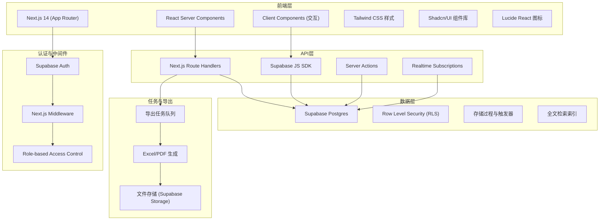
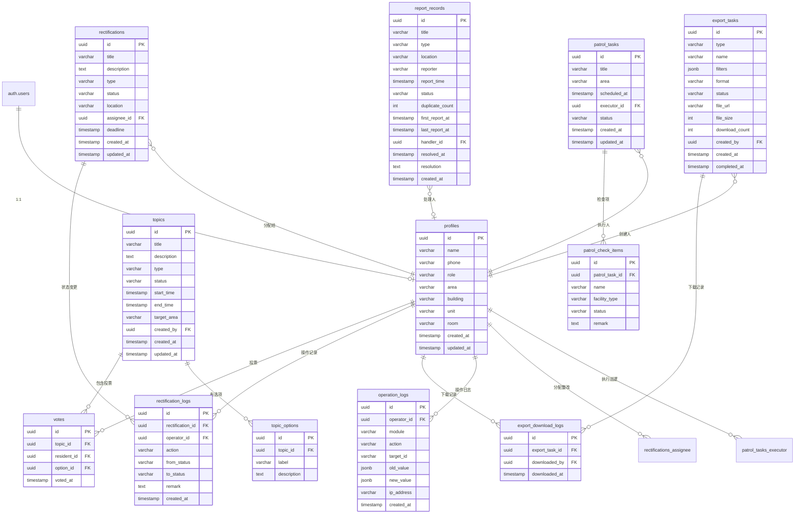

## 1. 架构设计



## 2. 技术描述

- **前端框架**：Next.js 14 (App Router) + React 18 + TypeScript
- **样式方案**：Tailwind CSS 3.4 + Tailwind Animate + CSS Variables
- **UI组件**：Shadcn/UI 组件库 + Lucide React 图标
- **图表方案**：Recharts 数据可视化
- **后端服务**：Supabase (Auth + Database + Storage + Realtime)
- **数据库**：PostgreSQL 15 (含扩展：pg_trgm, pgcrypto)
- **数据访问**：Supabase JS SDK v2 + 类型安全的SQL查询
- **认证方案**：Supabase Auth (邮箱密码 + 手机验证码)
- **权限控制**：PostgreSQL RLS策略 + 应用层角色校验
- **导出功能**：SheetJS (Excel) + jsPDF (PDF)
- **表单处理**：React Hook Form + Zod 校验
- **状态管理**：React Query (TanStack Query) + Zustand
- **开发规范**：ESLint + Prettier + TypeScript Strict

## 3. 路由定义

| 路由 | 页面用途 | 权限 |
|-------|---------|------|
| `/` | 首页重定向（根据角色跳转） | 公开 |
| `/login` | 登录页（角色选择+认证） | 公开 |
| `/resident` | 居民代表首页（待投票+统计） | 居民代表 |
| `/resident/topics` | 议题列表页 | 居民代表 |
| `/resident/topics/[id]` | 议题投票详情页 | 居民代表 |
| `/resident/history` | 个人参与历史页 | 居民代表 |
| `/admin` | 管理后台首页（数据概览） | 管理员 |
| `/admin/residents` | 居民台账管理页 | 管理员 |
| `/admin/topics` | 议题管理列表页 | 管理员 |
| `/admin/topics/new` | 新建议题页 | 管理员 |
| `/admin/topics/[id]/edit` | 编辑议题页 | 管理员 |
| `/admin/rectifications` | 整改复查管理页 | 管理员 |
| `/admin/patrols` | 巡逻任务管理页 | 管理员 |
| `/admin/reports` | 重复上报统计页 | 管理员 |
| `/admin/exports` | 导出任务管理页 | 管理员 |
| `/admin/settings` | 系统设置页（维护配置+日志） | 管理员 |

## 4. 核心类型定义

```typescript
// 用户角色
type UserRole = 'resident' | 'admin';

// 用户信息
interface User {
  id: string;
  role: UserRole;
  name: string;
  phone: string;
  idCard?: string;
  area?: string;
  building?: string;
  unit?: string;
  room?: string;
  avatarUrl?: string;
  createdAt: Date;
  updatedAt: Date;
}

// 居民参与状态
interface ResidentParticipation {
  residentId: string;
  totalVotes: number;
  lastParticipationAt: Date | null;
  participationRate: number;
  status: 'active' | 'inactive' | 'new';
}

// 议题
interface Topic {
  id: string;
  title: string;
  description: string;
  type: 'vote' | 'survey' | 'announcement';
  status: 'draft' | 'ongoing' | 'ended';
  startTime: Date;
  endTime: Date;
  options: TopicOption[];
  targetArea?: string;
  createdBy: string;
  createdAt: Date;
  updatedAt: Date;
}

interface TopicOption {
  id: string;
  label: string;
  description?: string;
}

// 投票记录
interface Vote {
  id: string;
  topicId: string;
  residentId: string;
  optionId: string;
  votedAt: Date;
}

// 整改复查任务
interface Rectification {
  id: string;
  title: string;
  description: string;
  type: string;
  status: 'pending' | 'in_progress' | 'review' | 'completed' | 'rework';
  location: string;
  assigneeId: string;
  deadline: Date;
  images?: string[];
  createdAt: Date;
  updatedAt: Date;
}

// 整改操作记录
interface RectificationLog {
  id: string;
  rectificationId: string;
  operatorId: string;
  action: string;
  fromStatus: string;
  toStatus: string;
  remark: string;
  createdAt: Date;
}

// 巡逻任务
interface PatrolTask {
  id: string;
  title: string;
  area: string;
  scheduledAt: Date;
  executorId: string;
  status: 'pending' | 'in_progress' | 'completed';
  checkItems: PatrolCheckItem[];
  createdAt: Date;
  updatedAt: Date;
}

interface PatrolCheckItem {
  id: string;
  name: string;
  facilityType: string;
  status: 'good' | 'damaged' | 'missing';
  remark?: string;
}

// 重复上报记录
interface ReportRecord {
  id: string;
  title: string;
  type: string;
  location: string;
  reporter: string;
  reportTime: Date;
  status: 'pending' | 'processing' | 'resolved';
  duplicateCount: number;
  firstReportAt: Date;
  lastReportAt: Date;
  handlerId?: string;
  resolvedAt?: Date;
  resolution?: string;
}

// 导出任务
interface ExportTask {
  id: string;
  type: string;
  name: string;
  filters: Record<string, any>;
  format: 'xlsx' | 'csv' | 'pdf';
  status: 'pending' | 'processing' | 'completed' | 'failed';
  fileUrl?: string;
  fileSize?: number;
  downloadCount: number;
  createdBy: string;
  createdAt: Date;
  completedAt?: Date;
}

// 导出下载记录
interface ExportDownloadLog {
  id: string;
  exportTaskId: string;
  downloadedBy: string;
  downloadedAt: Date;
}

// 操作日志
interface OperationLog {
  id: string;
  operatorId: string;
  module: string;
  action: string;
  targetId?: string;
  oldValue?: Record<string, any>;
  newValue?: Record<string, any>;
  ipAddress?: string;
  createdAt: Date;
}
```

## 5. 数据模型

### 5.1 ER图



### 5.2 DDL 建表语句

```sql
-- 启用扩展
CREATE EXTENSION IF NOT EXISTS "pgcrypto";
CREATE EXTENSION IF NOT EXISTS "pg_trgm";

-- Profiles 表
CREATE TABLE profiles (
    id UUID REFERENCES auth.users(id) PRIMARY KEY,
    name VARCHAR(100) NOT NULL,
    phone VARCHAR(20) UNIQUE NOT NULL,
    role VARCHAR(20) NOT NULL CHECK (role IN ('resident', 'admin')),
    id_card VARCHAR(18),
    area VARCHAR(100),
    building VARCHAR(20),
    unit VARCHAR(20),
    room VARCHAR(20),
    avatar_url VARCHAR(500),
    created_at TIMESTAMPTZ DEFAULT NOW(),
    updated_at TIMESTAMPTZ DEFAULT NOW()
);

-- Topics 表
CREATE TABLE topics (
    id UUID PRIMARY KEY DEFAULT gen_random_uuid(),
    title VARCHAR(200) NOT NULL,
    description TEXT,
    type VARCHAR(50) NOT NULL CHECK (type IN ('vote', 'survey', 'announcement')),
    status VARCHAR(20) NOT NULL DEFAULT 'draft' CHECK (status IN ('draft', 'ongoing', 'ended')),
    start_time TIMESTAMPTZ NOT NULL,
    end_time TIMESTAMPTZ NOT NULL,
    target_area VARCHAR(100),
    created_by UUID REFERENCES profiles(id) NOT NULL,
    created_at TIMESTAMPTZ DEFAULT NOW(),
    updated_at TIMESTAMPTZ DEFAULT NOW()
);

-- Topic Options 表
CREATE TABLE topic_options (
    id UUID PRIMARY KEY DEFAULT gen_random_uuid(),
    topic_id UUID REFERENCES topics(id) ON DELETE CASCADE NOT NULL,
    label VARCHAR(200) NOT NULL,
    description TEXT,
    sort_order INT DEFAULT 0
);

-- Votes 表
CREATE TABLE votes (
    id UUID PRIMARY KEY DEFAULT gen_random_uuid(),
    topic_id UUID REFERENCES topics(id) ON DELETE CASCADE NOT NULL,
    resident_id UUID REFERENCES profiles(id) NOT NULL,
    option_id UUID REFERENCES topic_options(id) ON DELETE CASCADE NOT NULL,
    voted_at TIMESTAMPTZ DEFAULT NOW(),
    UNIQUE(topic_id, resident_id)
);

-- Rectifications 表
CREATE TABLE rectifications (
    id UUID PRIMARY KEY DEFAULT gen_random_uuid(),
    title VARCHAR(200) NOT NULL,
    description TEXT,
    type VARCHAR(100) NOT NULL,
    status VARCHAR(20) NOT NULL DEFAULT 'pending' CHECK (status IN ('pending', 'in_progress', 'review', 'completed', 'rework')),
    location VARCHAR(500) NOT NULL,
    assignee_id UUID REFERENCES profiles(id) NOT NULL,
    deadline TIMESTAMPTZ NOT NULL,
    images TEXT[],
    created_at TIMESTAMPTZ DEFAULT NOW(),
    updated_at TIMESTAMPTZ DEFAULT NOW()
);

-- Rectification Logs 表
CREATE TABLE rectification_logs (
    id UUID PRIMARY KEY DEFAULT gen_random_uuid(),
    rectification_id UUID REFERENCES rectifications(id) ON DELETE CASCADE NOT NULL,
    operator_id UUID REFERENCES profiles(id) NOT NULL,
    action VARCHAR(100) NOT NULL,
    from_status VARCHAR(20),
    to_status VARCHAR(20),
    remark TEXT,
    created_at TIMESTAMPTZ DEFAULT NOW()
);

-- Patrol Tasks 表
CREATE TABLE patrol_tasks (
    id UUID PRIMARY KEY DEFAULT gen_random_uuid(),
    title VARCHAR(200) NOT NULL,
    area VARCHAR(200) NOT NULL,
    scheduled_at TIMESTAMPTZ NOT NULL,
    executor_id UUID REFERENCES profiles(id) NOT NULL,
    status VARCHAR(20) NOT NULL DEFAULT 'pending' CHECK (status IN ('pending', 'in_progress', 'completed')),
    created_at TIMESTAMPTZ DEFAULT NOW(),
    updated_at TIMESTAMPTZ DEFAULT NOW()
);

-- Patrol Check Items 表
CREATE TABLE patrol_check_items (
    id UUID PRIMARY KEY DEFAULT gen_random_uuid(),
    patrol_task_id UUID REFERENCES patrol_tasks(id) ON DELETE CASCADE NOT NULL,
    name VARCHAR(200) NOT NULL,
    facility_type VARCHAR(100) NOT NULL,
    status VARCHAR(20) NOT NULL CHECK (status IN ('good', 'damaged', 'missing')),
    remark TEXT
);

-- Report Records 表
CREATE TABLE report_records (
    id UUID PRIMARY KEY DEFAULT gen_random_uuid(),
    title VARCHAR(200) NOT NULL,
    type VARCHAR(100) NOT NULL,
    location VARCHAR(500) NOT NULL,
    reporter VARCHAR(100) NOT NULL,
    report_time TIMESTAMPTZ NOT NULL,
    status VARCHAR(20) NOT NULL DEFAULT 'pending' CHECK (status IN ('pending', 'processing', 'resolved')),
    duplicate_count INT DEFAULT 1,
    first_report_at TIMESTAMPTZ DEFAULT NOW(),
    last_report_at TIMESTAMPTZ DEFAULT NOW(),
    handler_id UUID REFERENCES profiles(id),
    resolved_at TIMESTAMPTZ,
    resolution TEXT,
    created_at TIMESTAMPTZ DEFAULT NOW()
);

-- Export Tasks 表
CREATE TABLE export_tasks (
    id UUID PRIMARY KEY DEFAULT gen_random_uuid(),
    type VARCHAR(100) NOT NULL,
    name VARCHAR(200) NOT NULL,
    filters JSONB NOT NULL DEFAULT '{}',
    format VARCHAR(10) NOT NULL CHECK (format IN ('xlsx', 'csv', 'pdf')),
    status VARCHAR(20) NOT NULL DEFAULT 'pending' CHECK (status IN ('pending', 'processing', 'completed', 'failed')),
    file_url VARCHAR(500),
    file_size INT,
    download_count INT DEFAULT 0,
    created_by UUID REFERENCES profiles(id) NOT NULL,
    created_at TIMESTAMPTZ DEFAULT NOW(),
    completed_at TIMESTAMPTZ
);

-- Export Download Logs 表
CREATE TABLE export_download_logs (
    id UUID PRIMARY KEY DEFAULT gen_random_uuid(),
    export_task_id UUID REFERENCES export_tasks(id) ON DELETE CASCADE NOT NULL,
    downloaded_by UUID REFERENCES profiles(id) NOT NULL,
    downloaded_at TIMESTAMPTZ DEFAULT NOW()
);

-- Operation Logs 表
CREATE TABLE operation_logs (
    id UUID PRIMARY KEY DEFAULT gen_random_uuid(),
    operator_id UUID REFERENCES profiles(id) NOT NULL,
    module VARCHAR(100) NOT NULL,
    action VARCHAR(100) NOT NULL,
    target_id VARCHAR(100),
    old_value JSONB,
    new_value JSONB,
    ip_address VARCHAR(50),
    created_at TIMESTAMPTZ DEFAULT NOW()
);

-- 创建索引
CREATE INDEX idx_topics_status ON topics(status);
CREATE INDEX idx_topics_created_by ON topics(created_by);
CREATE INDEX idx_votes_topic_id ON votes(topic_id);
CREATE INDEX idx_votes_resident_id ON votes(resident_id);
CREATE INDEX idx_rectifications_status ON rectifications(status);
CREATE INDEX idx_rectifications_assignee_id ON rectifications(assignee_id);
CREATE INDEX idx_rectification_logs_rectification_id ON rectification_logs(rectification_id);
CREATE INDEX idx_patrol_tasks_status ON patrol_tasks(status);
CREATE INDEX idx_patrol_tasks_executor_id ON patrol_tasks(executor_id);
CREATE INDEX idx_report_records_status ON report_records(status);
CREATE INDEX idx_report_records_type ON report_records(type);
CREATE INDEX idx_report_records_duplicate ON report_records(title, type, location);
CREATE INDEX idx_export_tasks_status ON export_tasks(status);
CREATE INDEX idx_export_tasks_created_by ON export_tasks(created_by);
CREATE INDEX idx_operation_logs_module ON operation_logs(module);
CREATE INDEX idx_operation_logs_operator_id ON operation_logs(operator_id);
CREATE INDEX idx_profiles_role ON profiles(role);
CREATE INDEX idx_profiles_area ON profiles(area);

-- 创建更新时间触发器
CREATE OR REPLACE FUNCTION update_updated_at()
RETURNS TRIGGER AS $$
BEGIN
    NEW.updated_at = NOW();
    RETURN NEW;
END;
$$ LANGUAGE plpgsql;

CREATE TRIGGER update_profiles_updated_at
    BEFORE UPDATE ON profiles
    FOR EACH ROW EXECUTE FUNCTION update_updated_at();

CREATE TRIGGER update_topics_updated_at
    BEFORE UPDATE ON topics
    FOR EACH ROW EXECUTE FUNCTION update_updated_at();

CREATE TRIGGER update_rectifications_updated_at
    BEFORE UPDATE ON rectifications
    FOR EACH ROW EXECUTE FUNCTION update_updated_at();

CREATE TRIGGER update_patrol_tasks_updated_at
    BEFORE UPDATE ON patrol_tasks
    FOR EACH ROW EXECUTE FUNCTION update_updated_at();

-- RLS 策略
ALTER TABLE profiles ENABLE ROW LEVEL SECURITY;
ALTER TABLE topics ENABLE ROW LEVEL SECURITY;
ALTER TABLE topic_options ENABLE ROW LEVEL SECURITY;
ALTER TABLE votes ENABLE ROW LEVEL SECURITY;
ALTER TABLE rectifications ENABLE ROW LEVEL SECURITY;
ALTER TABLE rectification_logs ENABLE ROW LEVEL SECURITY;
ALTER TABLE patrol_tasks ENABLE ROW LEVEL SECURITY;
ALTER TABLE patrol_check_items ENABLE ROW LEVEL SECURITY;
ALTER TABLE report_records ENABLE ROW LEVEL SECURITY;
ALTER TABLE export_tasks ENABLE ROW LEVEL SECURITY;
ALTER TABLE export_download_logs ENABLE ROW LEVEL SECURITY;
ALTER TABLE operation_logs ENABLE ROW LEVEL SECURITY;

-- Profiles 策略：管理员可见所有，居民仅可见自己
CREATE POLICY "Profiles are viewable by admin and self"
    ON profiles FOR SELECT
    USING (
        auth.uid() = id OR
        EXISTS (
            SELECT 1 FROM profiles p
            WHERE p.id = auth.uid() AND p.role = 'admin'
        )
    );

-- Topics 策略
CREATE POLICY "Topics are viewable by all authenticated users"
    ON topics FOR SELECT
    USING (auth.role() = 'authenticated');

CREATE POLICY "Topics are editable by admin"
    ON topics FOR ALL
    USING (
        EXISTS (
            SELECT 1 FROM profiles p
            WHERE p.id = auth.uid() AND p.role = 'admin'
        )
    );

-- Votes 策略
CREATE POLICY "Votes are viewable by admin and voter"
    ON votes FOR SELECT
    USING (
        auth.uid() = resident_id OR
        EXISTS (
            SELECT 1 FROM profiles p
            WHERE p.id = auth.uid() AND p.role = 'admin'
        )
    );

CREATE POLICY "Votes are insertable by residents"
    ON votes FOR INSERT
    WITH CHECK (
        auth.uid() = resident_id AND
        EXISTS (
            SELECT 1 FROM profiles p
            WHERE p.id = auth.uid() AND p.role = 'resident'
        )
    );

-- Rectifications 策略
CREATE POLICY "Rectifications are viewable by admin and assignee"
    ON rectifications FOR SELECT
    USING (
        auth.uid() = assignee_id OR
        EXISTS (
            SELECT 1 FROM profiles p
            WHERE p.id = auth.uid() AND p.role = 'admin'
        )
    );

CREATE POLICY "Rectifications are editable by admin"
    ON rectifications FOR ALL
    USING (
        EXISTS (
            SELECT 1 FROM profiles p
            WHERE p.id = auth.uid() AND p.role = 'admin'
        )
    );

-- 操作日志策略：仅管理员可见，所有人通过触发器插入
CREATE POLICY "Operation logs are viewable by admin only"
    ON operation_logs FOR SELECT
    USING (
        EXISTS (
            SELECT 1 FROM profiles p
            WHERE p.id = auth.uid() AND p.role = 'admin'
        )
    );

-- 操作日志自动记录触发器
CREATE OR REPLACE FUNCTION log_operation()
RETURNS TRIGGER AS $$
DECLARE
    v_module TEXT;
    v_action TEXT;
    v_old JSONB;
    v_new JSONB;
BEGIN
    v_module := TG_TABLE_NAME;
    
    IF TG_OP = 'INSERT' THEN
        v_action := 'create';
        v_old := NULL;
        v_new := to_jsonb(NEW);
    ELSIF TG_OP = 'UPDATE' THEN
        v_action := 'update';
        v_old := to_jsonb(OLD);
        v_new := to_jsonb(NEW);
    ELSIF TG_OP = 'DELETE' THEN
        v_action := 'delete';
        v_old := to_jsonb(OLD);
        v_new := NULL;
    END IF;

    INSERT INTO operation_logs (
        operator_id,
        module,
        action,
        target_id,
        old_value,
        new_value,
        ip_address
    ) VALUES (
        auth.uid(),
        v_module,
        v_action,
        CASE WHEN TG_OP != 'INSERT' THEN OLD.id::TEXT ELSE NEW.id::TEXT END,
        v_old,
        v_new,
        inet_client_addr()::TEXT
    );
    
    RETURN NULL;
END;
$$ LANGUAGE plpgsql SECURITY DEFINER;

-- 为核心表添加操作日志触发器
CREATE TRIGGER trigger_log_topics
    AFTER INSERT OR UPDATE OR DELETE ON topics
    FOR EACH ROW EXECUTE FUNCTION log_operation();

CREATE TRIGGER trigger_log_rectifications
    AFTER INSERT OR UPDATE OR DELETE ON rectifications
    FOR EACH ROW EXECUTE FUNCTION log_operation();

CREATE TRIGGER trigger_log_patrol_tasks
    AFTER INSERT OR UPDATE OR DELETE ON patrol_tasks
    FOR EACH ROW EXECUTE FUNCTION log_operation();

CREATE TRIGGER trigger_log_export_tasks
    AFTER INSERT OR UPDATE OR DELETE ON export_tasks
    FOR EACH ROW EXECUTE FUNCTION log_operation();
```
