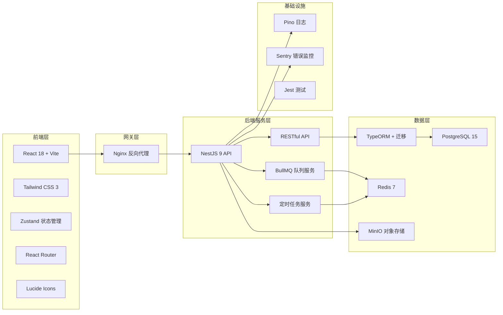
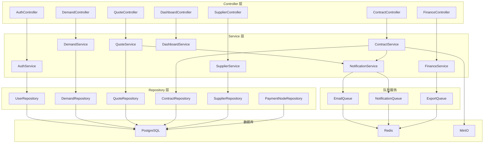
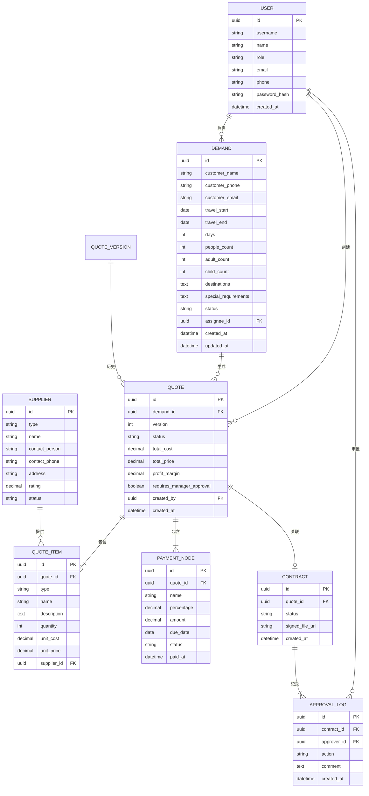

## 1. 架构设计



## 2. 技术说明

### 2.1 前端技术栈
- **框架**: React 18 + TypeScript 5
- **构建工具**: Vite 5
- **样式**: Tailwind CSS 3 + PostCSS
- **状态管理**: Zustand 4
- **路由**: React Router 6
- **图标**: Lucide React
- **HTTP 客户端**: Axios
- **日期处理**: Day.js
- **表单**: React Hook Form + Zod
- **图表**: Recharts

### 2.2 后端技术栈
- **框架**: NestJS 9 + TypeScript
- **ORM**: TypeORM 0.3 + 数据库迁移
- **数据库**: PostgreSQL 15
- **缓存/队列**: Redis 7 + BullMQ
- **对象存储**: MinIO (本地兼容 S3)
- **认证**: JWT + Passport
- **日志**: Pino
- **错误监控**: Sentry (可配置)
- **测试**: Jest + Supertest
- **API 文档**: Swagger/OpenAPI

### 2.3 项目结构
```
/ (项目根)
├── frontend/              # 前端应用
│   ├── src/
│   │   ├── components/    # 通用组件
│   │   ├── pages/         # 页面组件
│   │   ├── hooks/         # 自定义 hooks
│   │   ├── stores/        # Zustand stores
│   │   ├── services/      # API 服务
│   │   ├── types/         # TypeScript 类型
│   │   ├── utils/         # 工具函数
│   │   └── App.tsx
│   ├── package.json
│   └── vite.config.ts
├── backend/               # 后端应用
│   ├── src/
│   │   ├── modules/       # 业务模块
│   │   │   ├── auth/      # 认证模块
│   │   │   ├── demand/    # 客户需求
│   │   │   ├── quote/     # 报价管理
│   │   │   ├── supplier/  # 供应商
│   │   │   ├── contract/  # 合同审批
│   │   │   ├── finance/   # 财务/利润
│   │   │   └── dashboard/ # 看板
│   │   ├── common/        # 公共模块
│   │   ├── queues/        # BullMQ 队列
│   │   ├── entities/      # TypeORM 实体
│   │   └── main.ts
│   ├── migrations/        # 数据库迁移
│   ├── test/              # 测试文件
│   ├── package.json
│   └── ormconfig.ts
└── docker-compose.yml     # 本地开发环境
```

## 3. 路由定义

| 路由路径 | 页面名称 | 权限要求 |
|---------|----------|----------|
| /login | 登录页 | 公开 |
| /dashboard | 后台看板 | 登录用户 |
| /demands | 需求列表 | 产品经理/销售/主管 |
| /demands/new | 新建需求 | 产品经理 |
| /demands/:id | 需求详情 | 相关人员 |
| /quotes | 报价列表 | 产品经理/销售 |
| /quotes/new?demandId=:id | 新建报价 | 产品经理 |
| /quotes/:id | 报价详情/版本对比 | 相关人员 |
| /contracts | 合同审批列表 | 销售/主管/财务 |
| /contracts/:id | 合同审批详情 | 相关人员 |
| /suppliers | 供应商管理 | 产品经理/主管 |
| /suppliers/:id | 供应商详情 | 产品经理 |
| /templates | 行程模板 | 产品经理 |
| /finance/profit | 利润统计 | 财务/主管 |
| /settings/users | 用户管理 | 管理员 |

## 4. API 定义

### 4.1 核心类型定义

```typescript
// 用户类型
interface User {
  id: string;
  username: string;
  name: string;
  role: 'admin' | 'manager' | 'product' | 'sales' | 'finance';
  email: string;
  phone: string;
  createdAt: Date;
}

// 客户需求
interface Demand {
  id: string;
  customerName: string;
  customerPhone: string;
  customerEmail: string;
  travelDates: { start: Date; end: Date };
  days: number;
  peopleCount: number;
  adultCount: number;
  childCount: number;
  destinations: string[];
  specialRequirements: string;
  status: 'pending' | 'quoting' | 'quoted' | 'confirmed' | 'cancelled';
  assigneeId: string;
  assignee?: User;
  createdAt: Date;
  updatedAt: Date;
}

// 报价单
interface Quote {
  id: string;
  demandId: string;
  demand?: Demand;
  version: number;
  status: 'draft' | 'pending_approval' | 'approved' | 'rejected' | 'sent';
  totalCost: number;
  totalPrice: number;
  profitMargin: number;
  requiresManagerApproval: boolean;
  items: QuoteItem[];
  paymentNodes: PaymentNode[];
  createdById: string;
  createdAt: Date;
}

// 报价项
interface QuoteItem {
  id: string;
  type: 'hotel' | 'vehicle' | 'ticket' | 'service' | 'other';
  name: string;
  description: string;
  quantity: number;
  unitCost: number;
  unitPrice: number;
  supplierId?: string;
  supplier?: Supplier;
}

// 供应商
interface Supplier {
  id: string;
  type: 'hotel' | 'vehicle' | 'ticket' | 'guide';
  name: string;
  contactPerson: string;
  contactPhone: string;
  address: string;
  rating: number;
  status: 'active' | 'inactive';
}

// 合同审批
interface Contract {
  id: string;
  quoteId: string;
  quote?: Quote;
  status: 'draft' | 'pending' | 'approved' | 'rejected' | 'signed';
  approvalLogs: ApprovalLog[];
  signedFileUrl?: string;
}

// 付款节点
interface PaymentNode {
  id: string;
  name: string;
  percentage: number;
  amount: number;
  dueDate: Date;
  status: 'pending' | 'paid' | 'overdue';
  paidAt?: Date;
}

// 审批记录
interface ApprovalLog {
  id: string;
  contractId: string;
  approverId: string;
  approver?: User;
  action: 'submit' | 'approve' | 'reject';
  comment: string;
  createdAt: Date;
}
```

### 4.2 REST API 端点

| 方法 | 路径 | 描述 |
|------|------|------|
| POST | /api/auth/login | 用户登录 |
| GET | /api/auth/profile | 获取当前用户 |
| GET | /api/demands | 获取需求列表（支持筛选） |
| POST | /api/demands | 创建客户需求 |
| GET | /api/demands/:id | 获取需求详情 |
| PUT | /api/demands/:id | 更新需求 |
| GET | /api/quotes | 获取报价列表 |
| POST | /api/quotes | 创建报价 |
| GET | /api/quotes/:id | 获取报价详情 |
| GET | /api/quotes/:id/versions | 获取报价历史版本 |
| GET | /api/quotes/:id/compare?version1=v1&version2=v2 | 版本对比 |
| POST | /api/quotes/:id/submit | 提交报价审批 |
| GET | /api/contracts | 获取合同列表 |
| POST | /api/contracts/:id/approve | 审批合同 |
| GET | /api/suppliers | 获取供应商列表 |
| GET | /api/dashboard/overview | 看板概览数据 |
| GET | /api/dashboard/overdue-tasks | 超时任务 |
| GET | /api/dashboard/resource-utilization | 资源利用率 |
| GET | /api/finance/profit-report | 利润报表 |

## 5. 后端架构图



## 6. 数据模型

### 6.1 ER 图



### 6.2 DDL 脚本

```sql
-- 用户表
CREATE TABLE users (
    id UUID PRIMARY KEY DEFAULT gen_random_uuid(),
    username VARCHAR(50) UNIQUE NOT NULL,
    name VARCHAR(100) NOT NULL,
    role VARCHAR(20) NOT NULL CHECK (role IN ('admin', 'manager', 'product', 'sales', 'finance')),
    email VARCHAR(100),
    phone VARCHAR(20),
    password_hash VARCHAR(255) NOT NULL,
    created_at TIMESTAMP DEFAULT CURRENT_TIMESTAMP,
    updated_at TIMESTAMP DEFAULT CURRENT_TIMESTAMP
);

-- 客户需求表
CREATE TABLE demands (
    id UUID PRIMARY KEY DEFAULT gen_random_uuid(),
    customer_name VARCHAR(100) NOT NULL,
    customer_phone VARCHAR(20) NOT NULL,
    customer_email VARCHAR(100),
    travel_start DATE NOT NULL,
    travel_end DATE NOT NULL,
    days INTEGER NOT NULL,
    people_count INTEGER NOT NULL,
    adult_count INTEGER DEFAULT 0,
    child_count INTEGER DEFAULT 0,
    destinations TEXT,
    special_requirements TEXT,
    status VARCHAR(20) DEFAULT 'pending' CHECK (status IN ('pending', 'quoting', 'quoted', 'confirmed', 'cancelled')),
    assignee_id UUID REFERENCES users(id),
    created_at TIMESTAMP DEFAULT CURRENT_TIMESTAMP,
    updated_at TIMESTAMP DEFAULT CURRENT_TIMESTAMP
);

CREATE INDEX idx_demands_status ON demands(status);
CREATE INDEX idx_demands_assignee ON demands(assignee_id);
CREATE INDEX idx_demands_travel_start ON demands(travel_start);

-- 报价单表
CREATE TABLE quotes (
    id UUID PRIMARY KEY DEFAULT gen_random_uuid(),
    demand_id UUID REFERENCES demands(id),
    version INTEGER DEFAULT 1,
    status VARCHAR(30) DEFAULT 'draft' CHECK (status IN ('draft', 'pending_approval', 'approved', 'rejected', 'sent')),
    total_cost DECIMAL(12,2) DEFAULT 0,
    total_price DECIMAL(12,2) DEFAULT 0,
    profit_margin DECIMAL(5,2) DEFAULT 0,
    requires_manager_approval BOOLEAN DEFAULT FALSE,
    created_by UUID REFERENCES users(id),
    created_at TIMESTAMP DEFAULT CURRENT_TIMESTAMP
);

CREATE INDEX idx_quotes_demand ON quotes(demand_id);
CREATE INDEX idx_quotes_status ON quotes(status);
CREATE INDEX idx_quotes_created_by ON quotes(created_by);

-- 报价项表
CREATE TABLE quote_items (
    id UUID PRIMARY KEY DEFAULT gen_random_uuid(),
    quote_id UUID REFERENCES quotes(id) ON DELETE CASCADE,
    type VARCHAR(20) NOT NULL CHECK (type IN ('hotel', 'vehicle', 'ticket', 'service', 'other')),
    name VARCHAR(200) NOT NULL,
    description TEXT,
    quantity INTEGER DEFAULT 1,
    unit_cost DECIMAL(12,2) DEFAULT 0,
    unit_price DECIMAL(12,2) DEFAULT 0,
    supplier_id UUID REFERENCES suppliers(id)
);

-- 供应商表
CREATE TABLE suppliers (
    id UUID PRIMARY KEY DEFAULT gen_random_uuid(),
    type VARCHAR(20) NOT NULL CHECK (type IN ('hotel', 'vehicle', 'ticket', 'guide')),
    name VARCHAR(200) NOT NULL,
    contact_person VARCHAR(100),
    contact_phone VARCHAR(20),
    address TEXT,
    rating DECIMAL(2,1) DEFAULT 0,
    status VARCHAR(20) DEFAULT 'active' CHECK (status IN ('active', 'inactive')),
    created_at TIMESTAMP DEFAULT CURRENT_TIMESTAMP
);

-- 合同表
CREATE TABLE contracts (
    id UUID PRIMARY KEY DEFAULT gen_random_uuid(),
    quote_id UUID REFERENCES quotes(id),
    status VARCHAR(20) DEFAULT 'draft' CHECK (status IN ('draft', 'pending', 'approved', 'rejected', 'signed')),
    signed_file_url VARCHAR(500),
    created_at TIMESTAMP DEFAULT CURRENT_TIMESTAMP
);

-- 审批记录表
CREATE TABLE approval_logs (
    id UUID PRIMARY KEY DEFAULT gen_random_uuid(),
    contract_id UUID REFERENCES contracts(id) ON DELETE CASCADE,
    approver_id UUID REFERENCES users(id),
    action VARCHAR(20) NOT NULL CHECK (action IN ('submit', 'approve', 'reject')),
    comment TEXT,
    created_at TIMESTAMP DEFAULT CURRENT_TIMESTAMP
);

-- 付款节点表
CREATE TABLE payment_nodes (
    id UUID PRIMARY KEY DEFAULT gen_random_uuid(),
    quote_id UUID REFERENCES quotes(id) ON DELETE CASCADE,
    name VARCHAR(100) NOT NULL,
    percentage DECIMAL(5,2) DEFAULT 0,
    amount DECIMAL(12,2) DEFAULT 0,
    due_date DATE,
    status VARCHAR(20) DEFAULT 'pending' CHECK (status IN ('pending', 'paid', 'overdue')),
    paid_at TIMESTAMP
);

-- 初始数据：测试账号
INSERT INTO users (username, name, role, email, phone, password_hash) VALUES
('admin', '系统管理员', 'admin', 'admin@travel.com', '13800000000', '$2b$10$N9qo8uLOickgx2ZMRZoMyeIjZAgcfl7p92ldGxad68LJZdL17lhWy'),
('manager', '张主管', 'manager', 'manager@travel.com', '13800000001', '$2b$10$N9qo8uLOickgx2ZMRZoMyeIjZAgcfl7p92ldGxad68LJZdL17lhWy'),
('product1', '李产品', 'product', 'product1@travel.com', '13800000002', '$2b$10$N9qo8uLOickgx2ZMRZoMyeIjZAgcfl7p92ldGxad68LJZdL17lhWy'),
('sales1', '王销售', 'sales', 'sales1@travel.com', '13800000003', '$2b$10$N9qo8uLOickgx2ZMRZoMyeIjZAgcfl7p92ldGxad68LJZdL17lhWy'),
('finance1', '赵财务', 'finance', 'finance1@travel.com', '13800000004', '$2b$10$N9qo8uLOickgx2ZMRZoMyeIjZAgcfl7p92ldGxad68LJZdL17lhWy');
```
