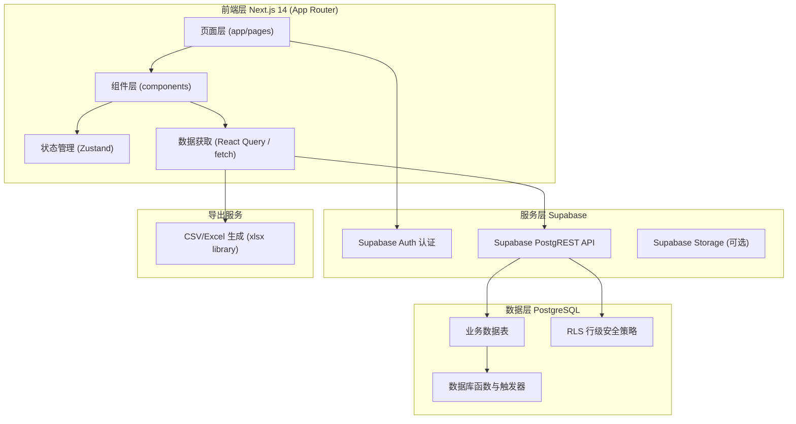
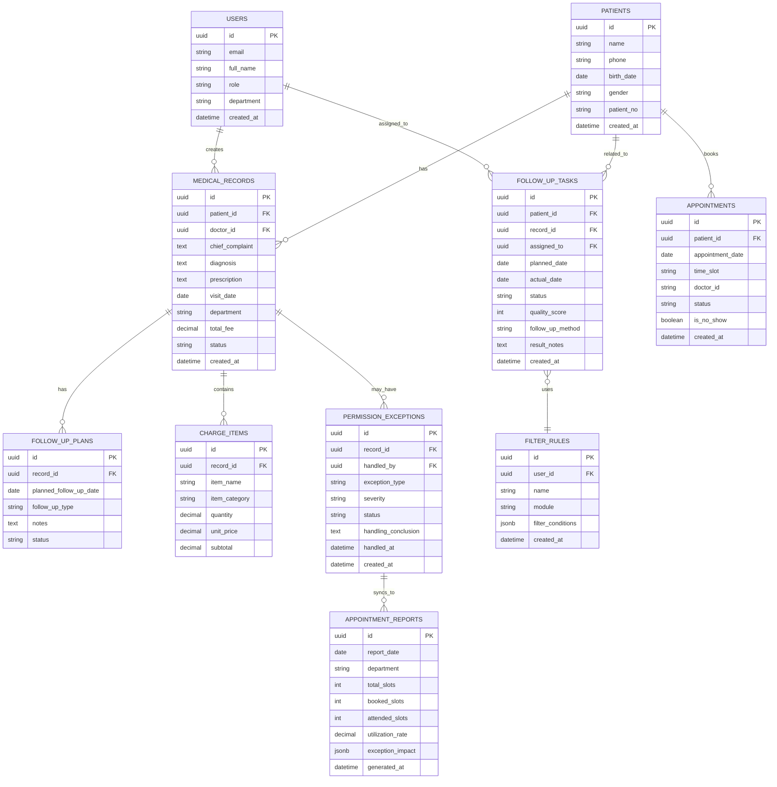

## 1. 架构设计



## 2. 技术描述

### 2.1 技术栈选型

| 层级 | 技术选型 | 版本 | 说明 |
|------|----------|------|------|
| 前端框架 | Next.js | 14.x | 使用 App Router，支持 SSR、RSC，SEO友好 |
| 前端语言 | TypeScript | 5.x | 类型安全保障 |
| UI框架 | Tailwind CSS | 3.x | 原子化CSS，定制主题色 |
| 图标库 | Lucide React | latest | 线性图标库，风格统一 |
| 图表库 | Recharts | latest | React图表库，支持折线图、柱状图、环形图 |
| 状态管理 | Zustand | latest | 轻量级状态管理，替代Redux |
| 数据获取 | @tanstack/react-query | latest | 服务端状态管理，缓存与重试 |
| 后端服务 | Supabase | latest | BaaS平台，提供Auth、DB、API、Storage |
| 数据库 | PostgreSQL | 15.x | Supabase内置，支持JSONB、RLS、触发器 |
| 导出库 | xlsx (SheetJS) | latest | 客户端/服务端Excel导出 |
| 日期处理 | date-fns | latest | 轻量级日期工具库 |
| 表单处理 | react-hook-form | latest | 高性能表单库 |
| 表单校验 | zod | latest | TypeScript优先的Schema校验 |
| UI组件 | shadcn/ui | latest | 基于Radix UI的可定制组件库 |

### 2.2 初始化方式

使用官方 Next.js 脚手架初始化项目：
```bash
npx create-next-app@latest . --typescript --tailwind --eslint --app --src-dir --import-alias "@/*"
```

## 3. 路由定义

采用 Next.js App Router 目录结构：

| 路由路径 | 页面名称 | 说明 |
|----------|----------|------|
| `/login` | 登录页 | 用户登录入口 |
| `/` | 运营仪表盘 | 首页，数据概览与趋势 |
| `/medical-records` | 病历列表 | 病历列表与搜索筛选 |
| `/medical-records/[id]` | 病历详情 | 单条病历完整信息 |
| `/follow-up-tasks` | 随访任务管理 | 任务列表、筛选、规则管理 |
| `/patient-statistics` | 患者统计分析 | 复诊率、流失率统计 |
| `/follow-up-export` | 随访质量导出 | 筛选与导出功能 |
| `/permission-exceptions` | 权限异常处理 | 异常列表与处理流程 |
| `/appointment-reports` | 号源利用报表 | 号源统计与异常影响分析 |

## 4. 数据模型

### 4.1 ER 图



### 4.2 DDL 语句

```sql
-- 扩展
CREATE EXTENSION IF NOT EXISTS "uuid-ossp";

-- 用户表
CREATE TABLE users (
    id UUID PRIMARY KEY DEFAULT uuid_generate_v4(),
    email VARCHAR(255) UNIQUE NOT NULL,
    full_name VARCHAR(100) NOT NULL,
    role VARCHAR(50) NOT NULL CHECK (role IN ('operation', 'frontdesk', 'auditor', 'admin')),
    department VARCHAR(100),
    created_at TIMESTAMPTZ DEFAULT NOW()
);

-- 患者表
CREATE TABLE patients (
    id UUID PRIMARY KEY DEFAULT uuid_generate_v4(),
    name VARCHAR(100) NOT NULL,
    phone VARCHAR(20) NOT NULL,
    birth_date DATE,
    gender VARCHAR(10) CHECK (gender IN ('男', '女', '其他')),
    patient_no VARCHAR(50) UNIQUE NOT NULL,
    created_at TIMESTAMPTZ DEFAULT NOW()
);
CREATE INDEX idx_patients_phone ON patients(phone);
CREATE INDEX idx_patients_patient_no ON patients(patient_no);

-- 病历表
CREATE TABLE medical_records (
    id UUID PRIMARY KEY DEFAULT uuid_generate_v4(),
    patient_id UUID NOT NULL REFERENCES patients(id) ON DELETE CASCADE,
    doctor_id UUID NOT NULL REFERENCES users(id),
    chief_complaint TEXT NOT NULL,
    diagnosis TEXT,
    prescription TEXT,
    visit_date DATE NOT NULL,
    department VARCHAR(100) NOT NULL,
    total_fee DECIMAL(10, 2) DEFAULT 0,
    status VARCHAR(50) DEFAULT 'active' CHECK (status IN ('active', 'archived', 'exception')),
    created_at TIMESTAMPTZ DEFAULT NOW()
);
CREATE INDEX idx_records_patient ON medical_records(patient_id);
CREATE INDEX idx_records_visit_date ON medical_records(visit_date);
CREATE INDEX idx_records_department ON medical_records(department);

-- 复诊计划表
CREATE TABLE follow_up_plans (
    id UUID PRIMARY KEY DEFAULT uuid_generate_v4(),
    record_id UUID NOT NULL REFERENCES medical_records(id) ON DELETE CASCADE,
    planned_follow_up_date DATE NOT NULL,
    follow_up_type VARCHAR(50) NOT NULL CHECK (follow_up_type IN ('电话', '微信', '到店', '短信')),
    notes TEXT,
    status VARCHAR(50) DEFAULT 'pending' CHECK (status IN ('pending', 'completed', 'cancelled')),
    created_at TIMESTAMPTZ DEFAULT NOW()
);

-- 收费项目表
CREATE TABLE charge_items (
    id UUID PRIMARY KEY DEFAULT uuid_generate_v4(),
    record_id UUID NOT NULL REFERENCES medical_records(id) ON DELETE CASCADE,
    item_name VARCHAR(200) NOT NULL,
    item_category VARCHAR(50) NOT NULL CHECK (item_category IN ('诊费', '中药', '理疗', '检查', '其他')),
    quantity DECIMAL(10, 2) NOT NULL DEFAULT 1,
    unit_price DECIMAL(10, 2) NOT NULL,
    subtotal DECIMAL(10, 2) NOT NULL,
    created_at TIMESTAMPTZ DEFAULT NOW()
);

-- 随访任务表
CREATE TABLE follow_up_tasks (
    id UUID PRIMARY KEY DEFAULT uuid_generate_v4(),
    patient_id UUID NOT NULL REFERENCES patients(id) ON DELETE CASCADE,
    record_id UUID REFERENCES medical_records(id) ON DELETE SET NULL,
    assigned_to UUID REFERENCES users(id),
    planned_date DATE NOT NULL,
    actual_date DATE,
    status VARCHAR(50) DEFAULT 'pending' CHECK (status IN ('pending', 'in_progress', 'completed', 'overdue', 'cancelled')),
    quality_score INT CHECK (quality_score BETWEEN 0 AND 100),
    follow_up_method VARCHAR(50) CHECK (follow_up_method IN ('电话', '微信', '到店', '短信')),
    result_notes TEXT,
    created_at TIMESTAMPTZ DEFAULT NOW()
);
CREATE INDEX idx_tasks_planned_date ON follow_up_tasks(planned_date);
CREATE INDEX idx_tasks_status ON follow_up_tasks(status);
CREATE INDEX idx_tasks_assigned_to ON follow_up_tasks(assigned_to);

-- 筛选规则表
CREATE TABLE filter_rules (
    id UUID PRIMARY KEY DEFAULT uuid_generate_v4(),
    user_id UUID NOT NULL REFERENCES users(id) ON DELETE CASCADE,
    name VARCHAR(100) NOT NULL,
    module VARCHAR(50) NOT NULL CHECK (module IN ('medical_records', 'follow_up_tasks', 'patient_statistics', 'follow_up_export')),
    filter_conditions JSONB NOT NULL DEFAULT '{}',
    created_at TIMESTAMPTZ DEFAULT NOW()
);
CREATE INDEX idx_filter_rules_user_module ON filter_rules(user_id, module);

-- 病例权限异常表
CREATE TABLE permission_exceptions (
    id UUID PRIMARY KEY DEFAULT uuid_generate_v4(),
    record_id UUID NOT NULL REFERENCES medical_records(id) ON DELETE CASCADE,
    handled_by UUID REFERENCES users(id),
    exception_type VARCHAR(100) NOT NULL,
    severity VARCHAR(20) NOT NULL CHECK (severity IN ('low', 'medium', 'high', 'critical')),
    status VARCHAR(50) DEFAULT 'pending' CHECK (status IN ('pending', 'processing', 'resolved', 'closed')),
    handling_conclusion TEXT,
    handled_at TIMESTAMPTZ,
    created_at TIMESTAMPTZ DEFAULT NOW()
);
CREATE INDEX idx_exceptions_status ON permission_exceptions(status);
CREATE INDEX idx_exceptions_severity ON permission_exceptions(severity);

-- 号源表
CREATE TABLE appointments (
    id UUID PRIMARY KEY DEFAULT uuid_generate_v4(),
    patient_id UUID REFERENCES patients(id) ON DELETE SET NULL,
    appointment_date DATE NOT NULL,
    time_slot VARCHAR(20) NOT NULL,
    doctor_id UUID REFERENCES users(id),
    status VARCHAR(50) DEFAULT 'booked' CHECK (status IN ('booked', 'attended', 'cancelled', 'no_show')),
    is_no_show BOOLEAN DEFAULT FALSE,
    created_at TIMESTAMPTZ DEFAULT NOW()
);
CREATE INDEX idx_appointments_date ON appointments(appointment_date);

-- 号源利用报表表
CREATE TABLE appointment_reports (
    id UUID PRIMARY KEY DEFAULT uuid_generate_v4(),
    report_date DATE NOT NULL,
    department VARCHAR(100) NOT NULL,
    total_slots INT NOT NULL DEFAULT 0,
    booked_slots INT NOT NULL DEFAULT 0,
    attended_slots INT NOT NULL DEFAULT 0,
    utilization_rate DECIMAL(5, 4) NOT NULL DEFAULT 0,
    exception_impact JSONB DEFAULT '{}',
    generated_at TIMESTAMPTZ DEFAULT NOW()
);
CREATE UNIQUE INDEX idx_reports_date_dept ON appointment_reports(report_date, department);

-- 触发器：异常处理完成后同步号源报表
CREATE OR REPLACE FUNCTION sync_exception_to_report()
RETURNS TRIGGER AS $$
BEGIN
    IF NEW.status = 'resolved' AND NEW.handled_at IS NOT NULL THEN
        INSERT INTO appointment_reports (report_date, department, total_slots, booked_slots, attended_slots, utilization_rate, exception_impact)
        VALUES (
            DATE(NEW.handled_at),
            (SELECT department FROM medical_records WHERE id = NEW.record_id LIMIT 1),
            0, 0, 0, 0,
            jsonb_build_object(
                'exception_id', NEW.id,
                'record_id', NEW.record_id,
                'conclusion', NEW.handling_conclusion,
                'severity', NEW.severity,
                'synced_at', NOW()
            )
        )
        ON CONFLICT (report_date, department) DO UPDATE
        SET exception_impact = appointment_reports.exception_impact || EXCLUDED.exception_impact;
    END IF;
    RETURN NEW;
END;
$$ LANGUAGE plpgsql;

CREATE TRIGGER trigger_sync_exception_report
AFTER UPDATE ON permission_exceptions
FOR EACH ROW
EXECUTE FUNCTION sync_exception_to_report();
```

## 5. 目录结构

```
.
├── src/
│   ├── app/
│   │   ├── layout.tsx                 # 根布局，含Sidebar和Header
│   │   ├── page.tsx                   # 运营仪表盘
│   │   ├── login/
│   │   │   └── page.tsx               # 登录页
│   │   ├── medical-records/
│   │   │   ├── page.tsx               # 病历列表
│   │   │   └── [id]/
│   │   │       └── page.tsx           # 病历详情
│   │   ├── follow-up-tasks/
│   │   │   └── page.tsx               # 随访任务管理
│   │   ├── patient-statistics/
│   │   │   └── page.tsx               # 患者统计分析
│   │   ├── follow-up-export/
│   │   │   └── page.tsx               # 随访质量导出
│   │   ├── permission-exceptions/
│   │   │   └── page.tsx               # 权限异常处理
│   │   └── appointment-reports/
│   │       └── page.tsx               # 号源利用报表
│   ├── components/
│   │   ├── layout/
│   │   │   ├── Sidebar.tsx
│   │   │   ├── Header.tsx
│   │   │   └── PageContainer.tsx
│   │   ├── ui/                        # shadcn/ui 组件
│   │   ├── charts/
│   │   │   ├── TrendLineChart.tsx
│   │   │   ├── DonutChart.tsx
│   │   │   └── BarChart.tsx
│   │   ├── dashboard/
│   │   │   ├── StatCard.tsx
│   │   │   └── QuickActions.tsx
│   │   ├── medical-records/
│   │   │   ├── RecordTable.tsx
│   │   │   ├── RecordDetail.tsx
│   │   │   └── ChiefComplaintSection.tsx
│   │   ├── follow-up/
│   │   │   ├── TaskTable.tsx
│   │   │   ├── TaskFilterBar.tsx
│   │   │   └── FilterRuleManager.tsx
│   │   ├── statistics/
│   │   │   ├── RevisitStats.tsx
│   │   │   └── ChurnAnalysis.tsx
│   │   ├── exceptions/
│   │   │   ├── ExceptionList.tsx
│   │   │   └── ExceptionHandleModal.tsx
│   │   └── reports/
│   │       ├── AppointmentStats.tsx
│   │       └── ExceptionImpactPanel.tsx
│   ├── lib/
│   │   ├── supabase/
│   │   │   ├── client.ts              # Supabase Browser Client
│   │   │   ├── server.ts              # Supabase Server Client
│   │   │   └── middleware.ts          # Supabase Auth Middleware
│   │   ├── utils.ts                   # 通用工具函数
│   │   ├── formatters.ts              # 日期、金额格式化
│   │   └── export.ts                  # Excel/CSV导出工具
│   ├── hooks/
│   │   ├── useMedicalRecords.ts
│   │   ├── useFollowUpTasks.ts
│   │   ├── useStatistics.ts
│   │   └── useFilterRules.ts
│   ├── store/
│   │   ├── useAuthStore.ts
│   │   └── useFilterStore.ts
│   ├── types/
│   │   ├── database.ts                # 数据库类型定义
│   │   └── index.ts                   # 业务类型定义
│   └── middleware.ts                  # Next.js 路由守卫
├── migrations/
│   └── 001_init_schema.sql            # 数据库初始化脚本
├── public/
├── .env.local.example                 # 环境变量示例
├── tailwind.config.ts                 # Tailwind 主题配置
├── next.config.mjs
├── tsconfig.json
└── package.json
```
