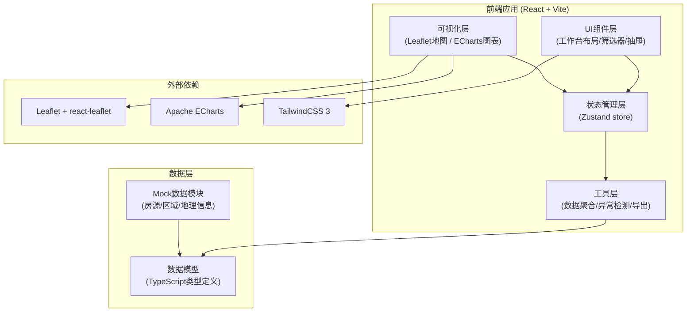
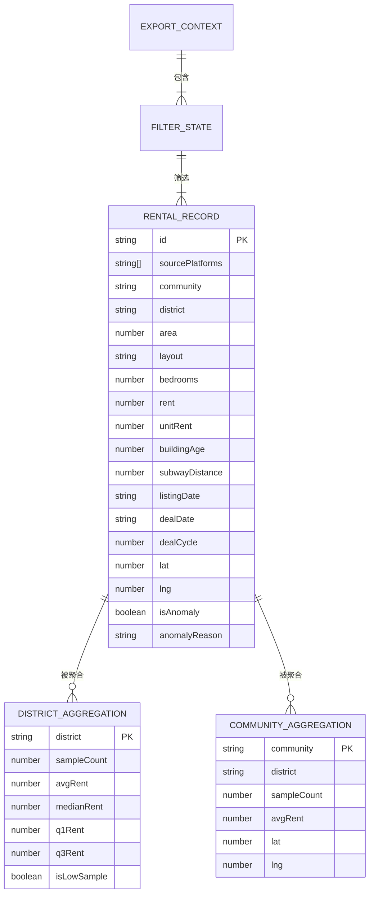

## 1. 架构设计



## 2. 技术描述

- **前端框架**: React@18 + TypeScript + Vite@5
- **样式方案**: TailwindCSS@3 + CSS变量主题系统
- **地图可视化**: Leaflet@1.9 + react-leaflet@4
- **统计图表**: Apache ECharts@5 + echarts-for-react
- **状态管理**: Zustand@4 (轻量级，适合复杂筛选状态)
- **数据处理**: 自定义工具函数（IQR异常检测、数据聚合、去重合并）
- **导出功能**: SheetJS (xlsx) + jsPDF
- **UI组件**: 自研组件（避免引入重量级组件库）

## 3. 路由定义

| 路由 | 页面/组件 | 用途 |
|------|----------|------|
| `/` | WorkbenchPage | 分析工作台主页面（地图+图表+筛选器） |
| `/export` | ExportPanel | 导出中心（报表配置和下载） |
| `/trace/:id` | TracePanel | 数据可追溯验证页面（独立查看详情） |

## 4. 核心数据模型

### 4.1 TypeScript 类型定义

```typescript
// 原始房源记录（多平台合并后）
interface RentalRecord {
  id: string;                    // 唯一ID（去重合并后）
  sourcePlatforms: string[];     // 来源平台（如['链家', '贝壳']）
  community: string;             // 小区名称
  district: string;              // 行政区
  area: number;                  // 面积(㎡)
  layout: string;                // 户型（如'2室1厅'）
  bedrooms: number;              // 室数
  rent: number;                  // 租金(元/月)
  unitRent: number;              // 单位面积租金(元/㎡/月)
  floor: string;                 // 楼层
  buildingAge: number;           // 楼龄(年)
  subwayDistance: number;        // 地铁距离(m)
  listingDate: string;           // 挂牌日期 YYYY-MM-DD
  dealDate?: string;             // 成交日期 YYYY-MM-DD
  dealCycle?: number;            // 成交周期(天)
  lat: number;                   // 纬度
  lng: number;                   // 经度
  isAnomaly: boolean;            // 是否异常样本
  anomalyReason?: string;        // 异常原因
  annotation?: string;           // 人工注释
  mergeHistory: string[];        // 合并的原始记录ID
}

// 区域聚合结果
interface DistrictAggregation {
  district: string;
  sampleCount: number;
  avgRent: number;
  medianRent: number;
  q1Rent: number;
  q3Rent: number;
  minRent: number;
  maxRent: number;
  avgUnitRent: number;
  avgDealCycle: number;
  avgBuildingAge: number;
  avgSubwayDistance: number;
  layoutDistribution: Record<string, number>;
  isLowSample: boolean;          // 样本量是否不足
}

// 筛选条件
interface FilterState {
  districts: string[];
  layouts: string[];
  dateRange: [string, string];   // [开始, 结束]
  sources: string[];
  rentRange: [number, number];
  areaRange: [number, number];
  buildingAgeRange: [number, number];
  subwayDistanceRange: [number, number];
  dealCycleRange: [number, number];
  excludeAnomaly: boolean;
  iqrThreshold: number;          // 默认1.5
}

// 导出上下文
interface ExportContext {
  exportTime: string;
  dataUpdateTime: string;
  filterState: FilterState;
  sampleCount: number;
  anomalyCount: number;
  userId: string;
  userRole: string;
}
```

### 4.2 ER图



## 5. 核心算法

### 5.1 重复房源合并算法
- **匹配键**: 小区 + 面积 + 户型 + 楼层 ± 5%
- **租金取中位数**，保留所有来源平台标记
- **地理坐标取平均值**
- **合并历史**记录所有原始记录ID，确保可追溯

### 5.2 异常值检测算法
- 使用IQR（四分位距）方法：Q1 - 1.5×IQR 到 Q3 + 1.5×IQR 之外为异常
- 支持自定义阈值倍数
- 异常标记支持人工覆盖

### 5.3 数据聚合可追溯
- 每个聚合值附带计算表达式和样本ID列表
- 前端可展开验证：均价 = Σ(租金) / N，逐条核对

## 6. 指标口径说明

| 指标 | 计算口径 | 备注 |
|------|----------|------|
| 租金均价 | 有效样本租金之和 / 样本量 | 排除异常样本（可选） |
| 租金中位数 | 样本租金排序后第50百分位数 | 抗异常值能力强 |
| 单位面积租金 | 租金 / 房屋面积 | 消除面积影响的可比指标 |
| 成交周期 | 成交日期 - 挂牌日期 | 仅统计已成交房源 |
| 楼龄 | 统计年份 - 建成年份 | |
| 地铁距离 | 小区中心点到最近地铁站直线距离 | |
| 样本不足 | 样本量 < 30 | 区域透明度降低至0.4 |
