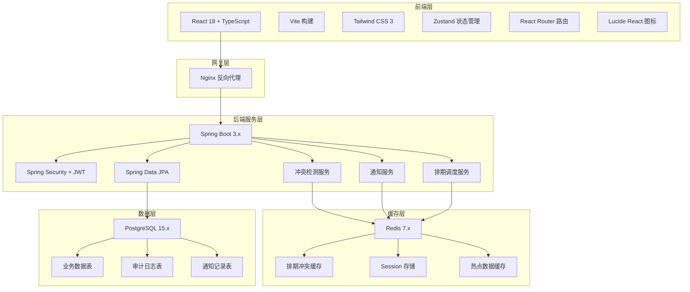
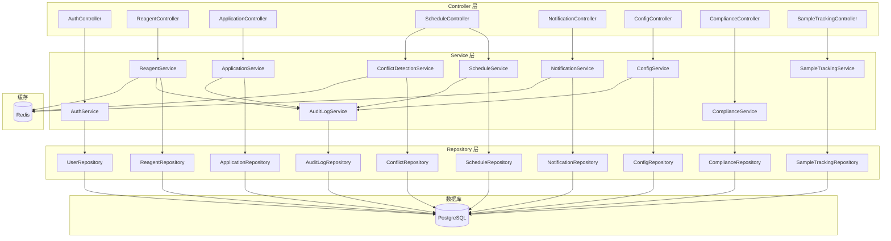
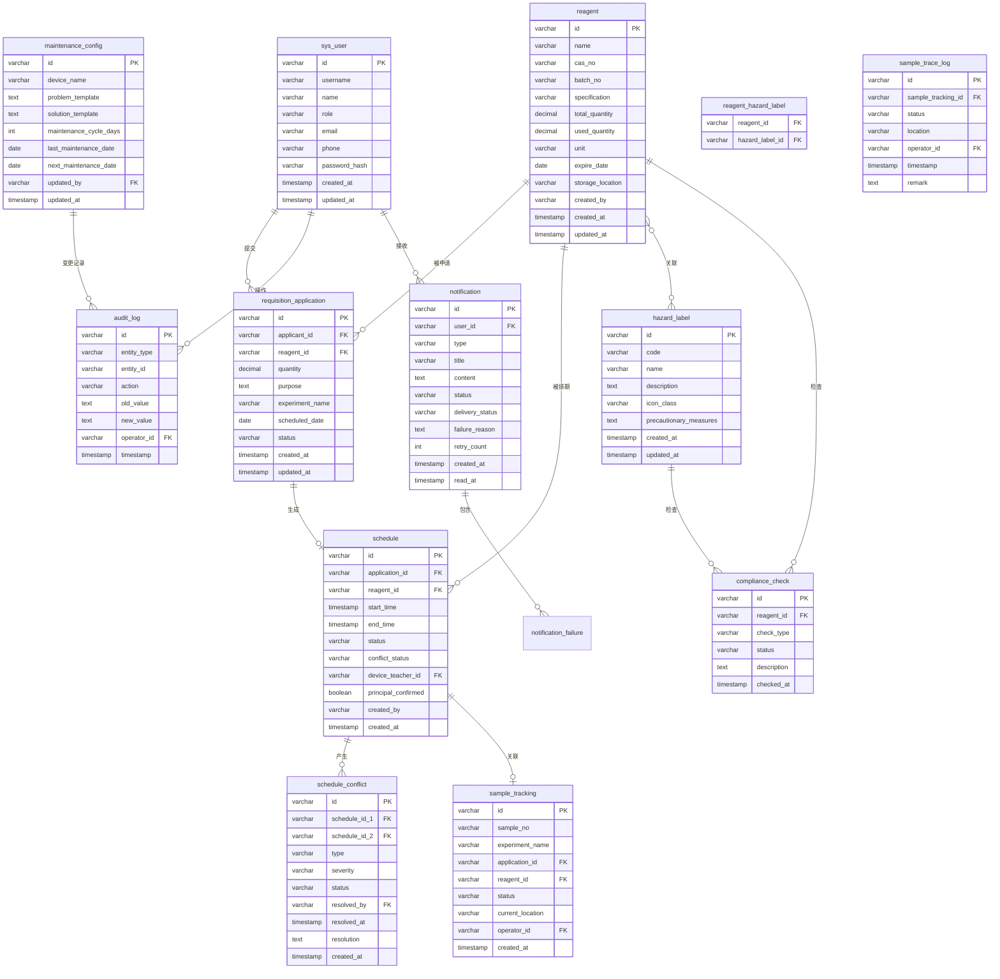

## 1. 架构设计



## 2. 技术描述

### 2.1 前端技术栈
- **框架**: React 18 + TypeScript
- **构建工具**: Vite 5.x
- **样式**: Tailwind CSS 3.4
- **状态管理**: Zustand 4.x
- **路由**: React Router DOM 6.x
- **图标**: Lucide React
- **UI组件**: 自定义组件库 + Radix UI 基础组件
- **图表**: Recharts 2.x
- **HTTP客户端**: Axios

### 2.2 后端技术栈
- **框架**: Spring Boot 3.2.x
- **安全框架**: Spring Security 6.x + JWT
- **ORM**: Spring Data JPA + Hibernate
- **数据库**: PostgreSQL 15.x
- **缓存**: Redis 7.x + Spring Data Redis
- **冲突检测**: 自定义规则引擎 + 分布式锁
- **消息通知**: WebSocket + 异步任务
- **API文档**: SpringDoc OpenAPI 2.x

### 2.3 初始化说明
- 前端使用 `vite-init` 初始化 `react-ts` 模板
- 后端使用 Spring Initializr 初始化 Spring Boot 项目
- 数据库使用 PostgreSQL Docker 镜像启动
- Redis 使用 Docker 镜像启动

## 3. 前端路由定义

| 路由 | 页面名称 | 权限要求 |
|------|----------|----------|
| /login | 登录页 | 公开 |
| /dashboard | 首页仪表板 | 登录用户 |
| /application | 领用申请列表 | 登录用户 |
| /application/new | 新建领用申请 | 科研人员/负责人 |
| /application/:id | 申请详情 | 登录用户 |
| /schedule | 排期管理 | 管理员/设备老师 |
| /schedule/calendar | 排期日历 | 管理员/设备老师 |
| /schedule/conflicts | 冲突处理 | 管理员/设备老师 |
| /compliance | 安全合规看板 | 管理员 |
| /compliance/hazardous | 危化品监控 | 管理员 |
| /config | 配置中心 | 管理员 |
| /config/reagents | 试剂批次管理 | 管理员 |
| /config/labels | 危化标签配置 | 管理员 |
| /config/maintenance | 维保配置 | 管理员 |
| /config/audit | 操作审计 | 管理员 |
| /notifications | 通知中心 | 登录用户 |
| /notifications/failures | 失败记录 | 登录用户 |
| /tracking | 样本追踪看板 | 负责人/管理员 |

## 4. 后端 API 定义

### 4.1 TypeScript 类型定义

```typescript
// 用户相关
interface User {
  id: string;
  username: string;
  name: string;
  role: 'RESEARCHER' | 'ADMIN' | 'DEVICE_TEACHER' | 'PRINCIPAL';
  email: string;
  phone: string;
  createdAt: string;
  updatedAt: string;
}

// 试剂相关
interface Reagent {
  id: string;
  name: string;
  casNo: string;
  batchNo: string;
  specification: string;
  totalQuantity: number;
  usedQuantity: number;
  unit: string;
  hazardLabels: HazardLabel[];
  expireDate: string;
  storageLocation: string;
  createdAt: string;
  createdBy: string;
}

// 危化标签
interface HazardLabel {
  id: string;
  code: string;
  name: string;
  description: string;
  iconClass: string;
  precautionaryMeasures: string;
}

// 领用申请
interface RequisitionApplication {
  id: string;
  applicantId: string;
  applicantName: string;
  reagentId: string;
  reagentName: string;
  quantity: number;
  purpose: string;
  experimentName: string;
  scheduledDate: string;
  status: 'DRAFT' | 'PENDING' | 'APPROVED' | 'REJECTED' | 'SCHEDULED' | 'COMPLETED';
  attachments: Attachment[];
  auditLog: AuditLog[];
  createdAt: string;
  updatedAt: string;
}

// 排期
interface Schedule {
  id: string;
  applicationId: string;
  reagentId: string;
  startTime: string;
  endTime: string;
  status: 'SCHEDULED' | 'IN_PROGRESS' | 'COMPLETED' | 'CANCELLED';
  conflictStatus: 'NONE' | 'PENDING' | 'RESOLVED';
  deviceTeacherId?: string;
  principalConfirmed: boolean;
  createdAt: string;
  createdBy: string;
}

// 冲突记录
interface ScheduleConflict {
  id: string;
  scheduleId1: string;
  scheduleId2: string;
  type: 'INVENTORY' | 'TIME_OVERLAP' | 'DEVICE';
  severity: 'WARNING' | 'CRITICAL';
  status: 'OPEN' | 'RESOLVED';
  resolvedBy?: string;
  resolvedAt?: string;
  resolution?: string;
}

// 配置变更记录
interface AuditLog {
  id: string;
  entityType: string;
  entityId: string;
  action: 'CREATE' | 'UPDATE' | 'DELETE';
  oldValue?: string;
  newValue?: string;
  operatorId: string;
  operatorName: string;
  timestamp: string;
}

// 通知
interface Notification {
  id: string;
  userId: string;
  type: 'APPLICATION' | 'SCHEDULE' | 'CONFLICT' | 'COMPLIANCE' | 'SYSTEM';
  title: string;
  content: string;
  status: 'UNREAD' | 'READ';
  deliveryStatus: 'PENDING' | 'SENT' | 'FAILED';
  failureReason?: string;
  retryCount: number;
  createdAt: string;
  readAt?: string;
}

// 维保配置
interface MaintenanceConfig {
  id: string;
  deviceName: string;
  problemTemplate: string;
  solutionTemplate: string;
  maintenanceCycleDays: number;
  lastMaintenanceDate?: string;
  nextMaintenanceDate: string;
  updatedBy: string;
  updatedAt: string;
}

// 样本追踪
interface SampleTracking {
  id: string;
  sampleNo: string;
  experimentName: string;
  applicationId: string;
  reagentId: string;
  status: 'PENDING' | 'PROCESSING' | 'ANALYZING' | 'COMPLETED' | 'ARCHIVED';
  currentLocation: string;
  operatorId: string;
  traceLog: TraceLog[];
  createdAt: string;
}

interface TraceLog {
  id: string;
  status: string;
  location: string;
  operatorId: string;
  operatorName: string;
  timestamp: string;
  remark?: string;
}

// 安全合规
interface ComplianceStatus {
  id: string;
  reagentId: string;
  checkType: 'EXPIRATION' | 'STORAGE' | 'USAGE' | 'DOCUMENT';
  status: 'COMPLIANT' | 'WARNING' | 'NON_COMPLIANT';
  description: string;
  checkedAt: string;
}
```

### 4.2 API 接口定义

#### 认证模块
```
POST /api/auth/login
  Request: { username, password }
  Response: { accessToken, refreshToken, user }

POST /api/auth/logout
  Request: {}
  Response: { success: true }

GET /api/auth/me
  Response: User
```

#### 试剂管理
```
GET /api/reagents
  Query: page, size, keyword, hazardType, expireStatus
  Response: { content: Reagent[], total, page, size }

GET /api/reagents/:id
  Response: Reagent

POST /api/reagents
  Request: Partial<Reagent>
  Response: Reagent

PUT /api/reagents/:id
  Request: Partial<Reagent>
  Response: Reagent

DELETE /api/reagents/:id
  Response: { success: true }
```

#### 领用申请
```
GET /api/applications
  Query: page, size, status, applicantId, dateRange
  Response: { content: RequisitionApplication[], total }

GET /api/applications/:id
  Response: RequisitionApplication

POST /api/applications
  Request: Partial<RequisitionApplication>
  Response: RequisitionApplication

PUT /api/applications/:id
  Request: Partial<RequisitionApplication>
  Response: RequisitionApplication

PUT /api/applications/:id/approve
  Request: { approved: boolean, remark?: string }
  Response: RequisitionApplication
```

#### 排期管理
```
GET /api/schedules
  Query: startDate, endDate, reagentId, status
  Response: Schedule[]

GET /api/schedules/calendar
  Query: month, year
  Response: Schedule[]

POST /api/schedules
  Request: Partial<Schedule>
  Response: Schedule

PUT /api/schedules/:id
  Request: Partial<Schedule>
  Response: Schedule

POST /api/schedules/check-conflicts
  Request: { reagentId, startTime, endTime, excludeScheduleId? }
  Response: { hasConflict: boolean, conflicts: ScheduleConflict[] }

GET /api/schedules/conflicts
  Query: status, page, size
  Response: { content: ScheduleConflict[], total }

PUT /api/schedules/conflicts/:id/resolve
  Request: { resolution, resolvedScheduleId? }
  Response: ScheduleConflict
```

#### 通知模块
```
GET /api/notifications
  Query: page, size, type, status, deliveryStatus
  Response: { content: Notification[], total, unreadCount }

GET /api/notifications/failures
  Query: page, size, type
  Response: { content: Notification[], total }

PUT /api/notifications/:id/read
  Response: Notification

PUT /api/notifications/failures/:id/retry
  Response: { success: boolean, newStatus: string }
```

#### 配置中心
```
GET /api/config/hazard-labels
  Response: HazardLabel[]

POST /api/config/hazard-labels
  Request: Partial<HazardLabel>
  Response: HazardLabel

PUT /api/config/hazard-labels/:id
  Request: Partial<HazardLabel>
  Response: HazardLabel

GET /api/config/maintenance
  Response: MaintenanceConfig[]

POST /api/config/maintenance
  Request: Partial<MaintenanceConfig>
  Response: MaintenanceConfig

PUT /api/config/maintenance/:id
  Request: Partial<MaintenanceConfig>
  Response: MaintenanceConfig

GET /api/config/audit-logs
  Query: page, size, entityType, operatorId, dateRange
  Response: { content: AuditLog[], total }
```

#### 安全合规
```
GET /api/compliance/dashboard
  Response: {
    overallComplianceRate: number,
    expiringSoon: number,
    nonCompliantItems: ComplianceStatus[],
    hazardousCount: number
  }

GET /api/compliance/checks
  Query: reagentId, status, checkType
  Response: ComplianceStatus[]
```

#### 样本追踪
```
GET /api/sample-tracking
  Query: page, size, status, sampleNo, dateRange
  Response: { content: SampleTracking[], total }

GET /api/sample-tracking/:id
  Response: SampleTracking

PUT /api/sample-tracking/:id/status
  Request: { status, location, remark }
  Response: SampleTracking

GET /api/sample-tracking/relation-graph
  Query: applicationId
  Response: { nodes, edges }
```

## 5. 服务端架构图



## 6. 数据模型

### 6.1 ER 图



### 6.2 DDL 语句

```sql
-- 用户表
CREATE TABLE sys_user (
    id VARCHAR(32) PRIMARY KEY,
    username VARCHAR(50) UNIQUE NOT NULL,
    name VARCHAR(100) NOT NULL,
    role VARCHAR(20) NOT NULL CHECK (role IN ('RESEARCHER', 'ADMIN', 'DEVICE_TEACHER', 'PRINCIPAL')),
    email VARCHAR(100),
    phone VARCHAR(20),
    password_hash VARCHAR(255) NOT NULL,
    created_at TIMESTAMP DEFAULT CURRENT_TIMESTAMP,
    updated_at TIMESTAMP DEFAULT CURRENT_TIMESTAMP
);

CREATE INDEX idx_user_role ON sys_user(role);

-- 试剂表
CREATE TABLE reagent (
    id VARCHAR(32) PRIMARY KEY,
    name VARCHAR(200) NOT NULL,
    cas_no VARCHAR(50),
    batch_no VARCHAR(100) NOT NULL,
    specification VARCHAR(200),
    total_quantity DECIMAL(10,2) NOT NULL DEFAULT 0,
    used_quantity DECIMAL(10,2) NOT NULL DEFAULT 0,
    unit VARCHAR(20) NOT NULL,
    expire_date DATE,
    storage_location VARCHAR(200),
    created_by VARCHAR(32) NOT NULL REFERENCES sys_user(id),
    created_at TIMESTAMP DEFAULT CURRENT_TIMESTAMP,
    updated_at TIMESTAMP DEFAULT CURRENT_TIMESTAMP
);

CREATE INDEX idx_reagent_name ON reagent(name);
CREATE INDEX idx_reagent_batch ON reagent(batch_no);
CREATE INDEX idx_reagent_expire ON reagent(expire_date);

-- 危化标签表
CREATE TABLE hazard_label (
    id VARCHAR(32) PRIMARY KEY,
    code VARCHAR(50) UNIQUE NOT NULL,
    name VARCHAR(100) NOT NULL,
    description TEXT,
    icon_class VARCHAR(100),
    precautionary_measures TEXT,
    created_at TIMESTAMP DEFAULT CURRENT_TIMESTAMP,
    updated_at TIMESTAMP DEFAULT CURRENT_TIMESTAMP
);

-- 试剂-标签关联表
CREATE TABLE reagent_hazard_label (
    reagent_id VARCHAR(32) REFERENCES reagent(id) ON DELETE CASCADE,
    hazard_label_id VARCHAR(32) REFERENCES hazard_label(id) ON DELETE CASCADE,
    PRIMARY KEY (reagent_id, hazard_label_id)
);

-- 领用申请表
CREATE TABLE requisition_application (
    id VARCHAR(32) PRIMARY KEY,
    applicant_id VARCHAR(32) NOT NULL REFERENCES sys_user(id),
    reagent_id VARCHAR(32) NOT NULL REFERENCES reagent(id),
    quantity DECIMAL(10,2) NOT NULL,
    purpose TEXT NOT NULL,
    experiment_name VARCHAR(200),
    scheduled_date DATE NOT NULL,
    status VARCHAR(20) NOT NULL DEFAULT 'DRAFT' CHECK (status IN ('DRAFT', 'PENDING', 'APPROVED', 'REJECTED', 'SCHEDULED', 'COMPLETED')),
    created_at TIMESTAMP DEFAULT CURRENT_TIMESTAMP,
    updated_at TIMESTAMP DEFAULT CURRENT_TIMESTAMP
);

CREATE INDEX idx_application_applicant ON requisition_application(applicant_id);
CREATE INDEX idx_application_reagent ON requisition_application(reagent_id);
CREATE INDEX idx_application_status ON requisition_application(status);
CREATE INDEX idx_application_date ON requisition_application(scheduled_date);

-- 排期表
CREATE TABLE schedule (
    id VARCHAR(32) PRIMARY KEY,
    application_id VARCHAR(32) UNIQUE NOT NULL REFERENCES requisition_application(id),
    reagent_id VARCHAR(32) NOT NULL REFERENCES reagent(id),
    start_time TIMESTAMP NOT NULL,
    end_time TIMESTAMP NOT NULL,
    status VARCHAR(20) NOT NULL DEFAULT 'SCHEDULED' CHECK (status IN ('SCHEDULED', 'IN_PROGRESS', 'COMPLETED', 'CANCELLED')),
    conflict_status VARCHAR(20) NOT NULL DEFAULT 'NONE' CHECK (conflict_status IN ('NONE', 'PENDING', 'RESOLVED')),
    device_teacher_id VARCHAR(32) REFERENCES sys_user(id),
    principal_confirmed BOOLEAN NOT NULL DEFAULT FALSE,
    created_by VARCHAR(32) NOT NULL REFERENCES sys_user(id),
    created_at TIMESTAMP DEFAULT CURRENT_TIMESTAMP
);

CREATE INDEX idx_schedule_reagent ON schedule(reagent_id);
CREATE INDEX idx_schedule_time ON schedule(start_time, end_time);
CREATE INDEX idx_schedule_status ON schedule(status);
CREATE INDEX idx_schedule_conflict ON schedule(conflict_status);

-- 排期冲突表
CREATE TABLE schedule_conflict (
    id VARCHAR(32) PRIMARY KEY,
    schedule_id_1 VARCHAR(32) NOT NULL REFERENCES schedule(id),
    schedule_id_2 VARCHAR(32) NOT NULL REFERENCES schedule(id),
    type VARCHAR(20) NOT NULL CHECK (type IN ('INVENTORY', 'TIME_OVERLAP', 'DEVICE')),
    severity VARCHAR(20) NOT NULL CHECK (severity IN ('WARNING', 'CRITICAL')),
    status VARCHAR(20) NOT NULL DEFAULT 'OPEN' CHECK (status IN ('OPEN', 'RESOLVED')),
    resolved_by VARCHAR(32) REFERENCES sys_user(id),
    resolved_at TIMESTAMP,
    resolution TEXT,
    created_at TIMESTAMP DEFAULT CURRENT_TIMESTAMP
);

CREATE INDEX idx_conflict_schedule1 ON schedule_conflict(schedule_id_1);
CREATE INDEX idx_conflict_schedule2 ON schedule_conflict(schedule_id_2);
CREATE INDEX idx_conflict_status ON schedule_conflict(status);

-- 通知表
CREATE TABLE notification (
    id VARCHAR(32) PRIMARY KEY,
    user_id VARCHAR(32) NOT NULL REFERENCES sys_user(id),
    type VARCHAR(20) NOT NULL CHECK (type IN ('APPLICATION', 'SCHEDULE', 'CONFLICT', 'COMPLIANCE', 'SYSTEM')),
    title VARCHAR(200) NOT NULL,
    content TEXT NOT NULL,
    status VARCHAR(10) NOT NULL DEFAULT 'UNREAD' CHECK (status IN ('UNREAD', 'READ')),
    delivery_status VARCHAR(20) NOT NULL DEFAULT 'PENDING' CHECK (delivery_status IN ('PENDING', 'SENT', 'FAILED')),
    failure_reason TEXT,
    retry_count INT NOT NULL DEFAULT 0,
    created_at TIMESTAMP DEFAULT CURRENT_TIMESTAMP,
    read_at TIMESTAMP
);

CREATE INDEX idx_notification_user ON notification(user_id);
CREATE INDEX idx_notification_status ON notification(status);
CREATE INDEX idx_notification_delivery ON notification(delivery_status);

-- 审计日志表
CREATE TABLE audit_log (
    id VARCHAR(32) PRIMARY KEY,
    entity_type VARCHAR(50) NOT NULL,
    entity_id VARCHAR(32) NOT NULL,
    action VARCHAR(10) NOT NULL CHECK (action IN ('CREATE', 'UPDATE', 'DELETE')),
    old_value TEXT,
    new_value TEXT,
    operator_id VARCHAR(32) NOT NULL REFERENCES sys_user(id),
    timestamp TIMESTAMP DEFAULT CURRENT_TIMESTAMP
);

CREATE INDEX idx_audit_entity ON audit_log(entity_type, entity_id);
CREATE INDEX idx_audit_operator ON audit_log(operator_id);
CREATE INDEX idx_audit_time ON audit_log(timestamp);

-- 合规检查表
CREATE TABLE compliance_check (
    id VARCHAR(32) PRIMARY KEY,
    reagent_id VARCHAR(32) NOT NULL REFERENCES reagent(id),
    check_type VARCHAR(20) NOT NULL CHECK (check_type IN ('EXPIRATION', 'STORAGE', 'USAGE', 'DOCUMENT')),
    status VARCHAR(20) NOT NULL CHECK (status IN ('COMPLIANT', 'WARNING', 'NON_COMPLIANT')),
    description TEXT,
    checked_at TIMESTAMP DEFAULT CURRENT_TIMESTAMP
);

CREATE INDEX idx_compliance_reagent ON compliance_check(reagent_id);
CREATE INDEX idx_compliance_status ON compliance_check(status);

-- 维保配置表
CREATE TABLE maintenance_config (
    id VARCHAR(32) PRIMARY KEY,
    device_name VARCHAR(200) NOT NULL,
    problem_template TEXT NOT NULL,
    solution_template TEXT,
    maintenance_cycle_days INT NOT NULL,
    last_maintenance_date DATE,
    next_maintenance_date DATE NOT NULL,
    updated_by VARCHAR(32) NOT NULL REFERENCES sys_user(id),
    updated_at TIMESTAMP DEFAULT CURRENT_TIMESTAMP
);

-- 样本追踪表
CREATE TABLE sample_tracking (
    id VARCHAR(32) PRIMARY KEY,
    sample_no VARCHAR(100) UNIQUE NOT NULL,
    experiment_name VARCHAR(200),
    application_id VARCHAR(32) REFERENCES requisition_application(id),
    reagent_id VARCHAR(32) REFERENCES reagent(id),
    status VARCHAR(20) NOT NULL DEFAULT 'PENDING' CHECK (status IN ('PENDING', 'PROCESSING', 'ANALYZING', 'COMPLETED', 'ARCHIVED')),
    current_location VARCHAR(200),
    operator_id VARCHAR(32) NOT NULL REFERENCES sys_user(id),
    created_at TIMESTAMP DEFAULT CURRENT_TIMESTAMP
);

CREATE INDEX idx_sample_no ON sample_tracking(sample_no);
CREATE INDEX idx_sample_status ON sample_tracking(status);
CREATE INDEX idx_sample_application ON sample_tracking(application_id);

-- 样本追踪日志表
CREATE TABLE sample_trace_log (
    id VARCHAR(32) PRIMARY KEY,
    sample_tracking_id VARCHAR(32) NOT NULL REFERENCES sample_tracking(id) ON DELETE CASCADE,
    status VARCHAR(20) NOT NULL,
    location VARCHAR(200),
    operator_id VARCHAR(32) NOT NULL REFERENCES sys_user(id),
    timestamp TIMESTAMP DEFAULT CURRENT_TIMESTAMP,
    remark TEXT
);

CREATE INDEX idx_trace_sample ON sample_trace_log(sample_tracking_id);
CREATE INDEX idx_trace_time ON sample_trace_log(timestamp);

-- 初始化数据
INSERT INTO sys_user (id, username, name, role, email, password_hash) VALUES
('admin001', 'admin', '系统管理员', 'ADMIN', 'admin@lab.com', '$2a$10$N9qo8uLOickgx2ZMRZoMyeIjZAgcfl7p92ldGxad68LJZdL17lhWy'),
('teacher001', 'teacher1', '张老师', 'DEVICE_TEACHER', 'zhang@lab.com', '$2a$10$N9qo8uLOickgx2ZMRZoMyeIjZAgcfl7p92ldGxad68LJZdL17lhWy'),
('principal001', 'principal1', '李负责人', 'PRINCIPAL', 'li@lab.com', '$2a$10$N9qo8uLOickgx2ZMRZoMyeIjZAgcfl7p92ldGxad68LJZdL17lhWy'),
('researcher001', 'researcher1', '王研究员', 'RESEARCHER', 'wang@lab.com', '$2a$10$N9qo8uLOickgx2ZMRZoMyeIjZAgcfl7p92ldGxad68LJZdL17lhWy');

INSERT INTO hazard_label (id, code, name, description, icon_class, precautionary_measures) VALUES
('hazard001', 'GHS01', '爆炸物', '可能引起爆炸', 'icon-explosive', '远离热源，密封保存'),
('hazard002', 'GHS02', '易燃物', '可能引起火灾', 'icon-flammable', '远离火源，阴凉处保存'),
('hazard003', 'GHS03', '氧化性', '可能加剧燃烧', 'icon-oxidizing', '远离可燃物存放'),
('hazard004', 'GHS05', '腐蚀性', '会腐蚀金属和皮肤', 'icon-corrosive', '佩戴防护手套和护目镜'),
('hazard005', 'GHS06', '毒性', '吸入或接触有害', 'icon-toxic', '在通风橱中操作'),
('hazard006', 'GHS07', '刺激性', '对皮肤和眼睛有刺激性', 'icon-irritant', '避免直接接触'),
('hazard007', 'GHS08', '健康危害', '可能对健康造成长期影响', 'icon-health-hazard', '操作后彻底清洗'),
('hazard008', 'GHS09', '环境危害', '对水生环境有害', 'icon-environmental', '避免释放到环境中');

INSERT INTO reagent (id, name, cas_no, batch_no, specification, total_quantity, used_quantity, unit, expire_date, storage_location, created_by) VALUES
('reagent001', '乙醇', '64-17-5', 'B202401001', '分析纯 500ml', 20, 5, '瓶', '2026-12-31', '化学品柜A-01', 'admin001'),
('reagent002', '甲醇', '67-56-1', 'B202401002', '色谱纯 500ml', 15, 3, '瓶', '2026-12-31', '化学品柜A-02', 'admin001'),
('reagent003', '丙酮', '67-64-1', 'B202401003', '分析纯 500ml', 10, 2, '瓶', '2026-06-30', '化学品柜A-03', 'admin001'),
('reagent004', '硫酸', '7664-93-9', 'B202402001', '分析纯 500ml', 8, 1, '瓶', '2027-01-31', '危化品柜B-01', 'admin001'),
('reagent005', '盐酸', '7647-01-0', 'B202402002', '分析纯 500ml', 12, 4, '瓶', '2026-08-31', '危化品柜B-02', 'admin001'),
('reagent006', '硝酸', '7697-37-2', 'B202402003', '分析纯 500ml', 6, 0, '瓶', '2026-05-31', '危化品柜B-03', 'admin001');

INSERT INTO reagent_hazard_label (reagent_id, hazard_label_id) VALUES
('reagent001', 'hazard002'),
('reagent002', 'hazard002'),
('reagent002', 'hazard006'),
('reagent003', 'hazard002'),
('reagent004', 'hazard003'),
('reagent004', 'hazard005'),
('reagent005', 'hazard005'),
('reagent006', 'hazard003'),
('reagent006', 'hazard005');

INSERT INTO maintenance_config (id, device_name, problem_template, solution_template, maintenance_cycle_days, next_maintenance_date, updated_by) VALUES
('maint001', '高效液相色谱仪', '压力异常、峰形异常、基线漂移', '检查色谱柱、清洗管路、更换流动相', 30, '2026-07-20', 'admin001'),
('maint002', '气相色谱仪', '不出峰、保留时间漂移、灵敏度下降', '更换衬管、清洗进样口、老化色谱柱', 30, '2026-07-15', 'admin001'),
('maint003', '紫外分光光度计', '波长不准、吸光度异常', '校准波长、更换比色皿、清洗样品池', 60, '2026-08-20', 'admin001'),
('maint004', '通风橱', '风速不够、报警异常', '检查风机、清理过滤网、校准传感器', 90, '2026-09-20', 'admin001');
```
