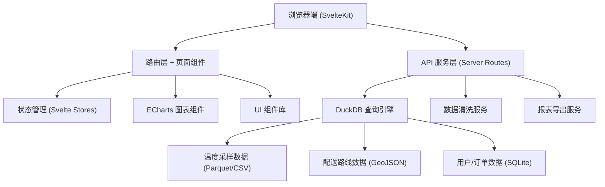
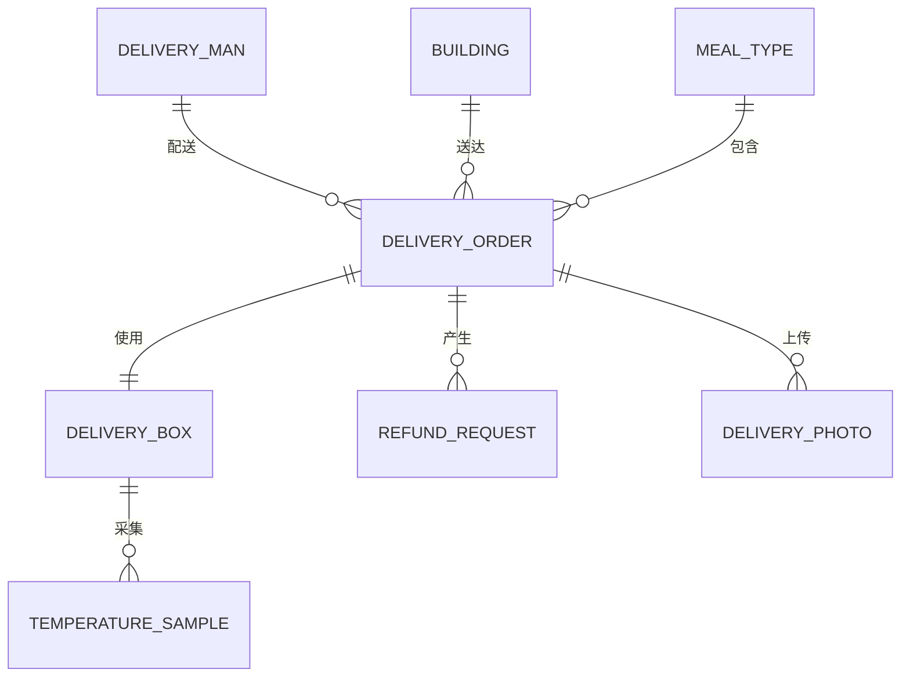

## 1. 架构设计



## 2. 技术描述

- **前端框架**：SvelteKit 2.x + TypeScript
- **构建工具**：Vite 5.x
- **样式方案**：TailwindCSS 3.x + CSS Variables
- **图表库**：ECharts 5.x
- **数据引擎**：DuckDB (duckdb-wasm 浏览器端 / Node.js 服务端)
- **日期处理**：dayjs
- **数据导出**：xlsx (Excel 导出) + jsPDF (PDF 导出)

## 3. 路由定义

| 路由 | 页面用途 |
|------|---------|
| / | 异常概览看板（首页） |
| /analysis | 多维度分析页面 |
| /detail/[boxId] | 异常详情页（箱号下钻） |
| /settings | 阈值配置页面 |
| /export | 日报导出页面 |
| /api/overview | 异常概览数据 API |
| /api/analysis | 多维度分析数据 API |
| /api/detail/[boxId] | 箱号详情 API |
| /api/export | 日报导出 API |
| /api/settings | 配置读写 API |

## 4. API 定义

### 4.1 概览数据接口

```typescript
// GET /api/overview?date=2024-01-01
interface OverviewResponse {
  date: string;
  stats: {
    lowTempBoxCount: number;
    lateDeliveryCount: number;
    refundRequestCount: number;
    pendingVisitCount: number;
  };
  lowTempBoxes: Array<{
    boxId: string;
    minTemperature: number;
    sampleCount: number;
    status: 'pending' | 'confirmed';
    deliveryMan: string;
    mealType: string;
  }>;
  lateBuildings: Array<{
    buildingName: string;
    lateCount: number;
    avgDelayMinutes: number;
    onTimeRate: number;
  }>;
  refundRequests: Array<{
    id: string;
    applicant: string;
    reason: string;
    amount: number;
    status: 'pending' | 'approved' | 'rejected';
  }>;
  pendingVisits: Array<{
    id: string;
    userName: string;
    deliveryDate: string;
    status: 'pending' | 'completed';
  }>;
}
```

### 4.2 多维度分析接口

```typescript
// GET /api/analysis?dimension=deliveryMan&date=2024-01-01
interface AnalysisResponse {
  dimension: 'deliveryMan' | 'mealType' | 'timeSlot' | 'building';
  data: Array<{
    name: string;
    onTimeRate: number;
    lowTempCount: number;
    totalOrders: number;
    avgTemperature: number;
  }>;
  buildingHeatmap?: Array<{
    buildingName: string;
    lat: number;
    lng: number;
    value: number;
  }>;
}
```

### 4.3 箱号详情接口

```typescript
// GET /api/detail/[boxId]
interface DetailResponse {
  boxId: string;
  deliveryMan: string;
  mealType: string;
  deliveryDate: string;
  building: string;
  temperatureCurve: Array<{
    time: string;
    temperature: number;
    location?: { lat: number; lng: number };
  }>;
  route: Array<{
    time: string;
    location: { lat: number; lng: number };
    address: string;
  }>;
  photos: Array<{
    url: string;
    thumbnail: string;
    uploadTime: string;
  }>;
  excludedSamples: Array<{
    time: string;
    temperature: number;
    reason: string;
  }>;
}
```

### 4.4 配置接口

```typescript
// GET/POST /api/settings
interface Settings {
  lowTempThreshold: number;       // 低温阈值，默认 60°C
  minSampleCount: number;         // 最低采样次数，默认 3 次
  lateDeliveryThreshold: number;  // 晚签收阈值（分钟），默认 15 分钟
  exportTimeRange: string;        // 默认导出时段
}
```

## 5. 数据清洗规则

在 DuckDB 中执行数据清洗，剔除异常采样点：

```sql
-- 温度数据清洗逻辑
WITH raw_data AS (
  SELECT 
    box_id,
    sample_time,
    temperature,
    -- 标记异常：温度突变 > 20°C 或 < 0°C 或 > 100°C
    CASE 
      WHEN temperature < 0 OR temperature > 100 THEN 'out_of_range'
      WHEN ABS(temperature - LAG(temperature) OVER (PARTITION BY box_id ORDER BY sample_time)) > 20 THEN 'sudden_change'
      ELSE NULL
    END AS exclude_reason
  FROM temperature_samples
  WHERE delivery_date = @date
)
SELECT 
  box_id,
  sample_time,
  temperature
FROM raw_data
WHERE exclude_reason IS NULL;
```

## 6. 数据模型

### 6.1 ER 图



### 6.2 DuckDB 表结构

```sql
-- 配送箱温度采样表
CREATE TABLE temperature_samples (
  id VARCHAR PRIMARY KEY,
  box_id VARCHAR NOT NULL,
  delivery_date DATE NOT NULL,
  sample_time TIMESTAMP NOT NULL,
  temperature FLOAT NOT NULL,
  lat FLOAT,
  lng FLOAT
);

-- 配送订单表
CREATE TABLE delivery_orders (
  id VARCHAR PRIMARY KEY,
  box_id VARCHAR NOT NULL,
  delivery_man_id VARCHAR NOT NULL,
  building_id VARCHAR NOT NULL,
  meal_type_id VARCHAR NOT NULL,
  delivery_date DATE NOT NULL,
  scheduled_time TIMESTAMP NOT NULL,
  actual_time TIMESTAMP,
  status VARCHAR NOT NULL
);

-- 配送员表
CREATE TABLE delivery_men (
  id VARCHAR PRIMARY KEY,
  name VARCHAR NOT NULL,
  phone VARCHAR
);

-- 楼栋表
CREATE TABLE buildings (
  id VARCHAR PRIMARY KEY,
  name VARCHAR NOT NULL,
  lat FLOAT NOT NULL,
  lng FLOAT NOT NULL,
  address VARCHAR
);

-- 餐品类型表
CREATE TABLE meal_types (
  id VARCHAR PRIMARY KEY,
  name VARCHAR NOT NULL,
  standard_temp FLOAT NOT NULL
);

-- 退款申请表
CREATE TABLE refund_requests (
  id VARCHAR PRIMARY KEY,
  order_id VARCHAR NOT NULL,
  applicant VARCHAR NOT NULL,
  reason VARCHAR NOT NULL,
  amount FLOAT NOT NULL,
  status VARCHAR NOT NULL,
  created_at TIMESTAMP NOT NULL
);

-- 签收照片表
CREATE TABLE delivery_photos (
  id VARCHAR PRIMARY KEY,
  order_id VARCHAR NOT NULL,
  url VARCHAR NOT NULL,
  thumbnail VARCHAR NOT NULL,
  upload_time TIMESTAMP NOT NULL
);
```
