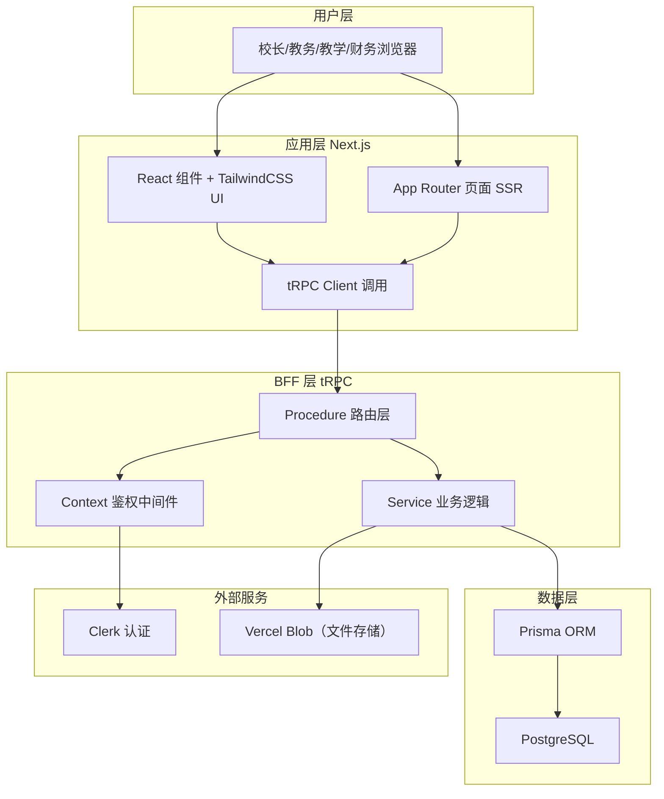
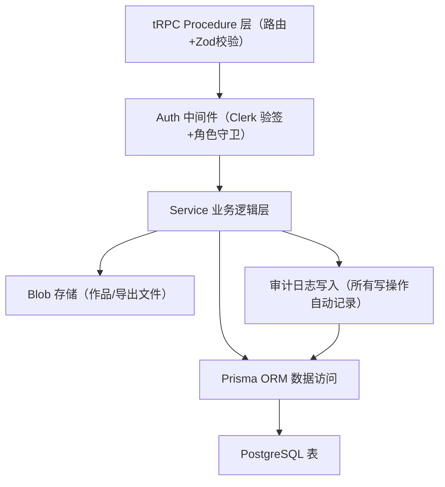

## 1. 架构设计

采用 Next.js App Router + tRPC 全栈 BFF 架构，前后端一体化部署在 Vercel，配合 Prisma ORM 连接 PostgreSQL 数据库，使用 Clerk 管理身份认证与权限。



## 2. 技术说明

- **前端框架**：Next.js 14 (App Router) + React 18 + TypeScript 5
- **样式方案**：TailwindCSS 3.4 + framer-motion（动效）+ lucide-react（图标）
- **UI 组件**：自研基础组件（避免 shadcn/ui 千篇一律），结合 radix-ui primitives
- **BFF 层**：tRPC 11 + Zod 3（参数校验）+ SuperJSON（序列化）
- **ORM & 数据库**：Prisma 5 + PostgreSQL 16
- **认证授权**：Clerk（SaaS 用户中心）+ 中间件角色守卫
- **文件存储**：Vercel Blob（作品图片、导出文件）
- **部署**：Vercel（Serverless Functions + Edge Middleware）
- **包管理**：pnpm
- **代码质量**：ESLint + Prettier + husky（可选）

## 3. 路由定义

| 路由路径 | 页面用途 | 权限要求 |
|----------|----------|----------|
| `/` | 仪表盘首页（KPI + 风险提醒 + 待办） | 已登录用户 |
| `/leads` | 线索列表（分页、筛选、批量操作） | 校长/教务 |
| `/leads/[id]` | 线索详情（时间线、试听记录、跟进备注） | 校长/教务 |
| `/trials` | 试听管理（日历排期、结果反馈） | 校长/教务/教学 |
| `/trials/schedule` | 试听排期日历 | 校长/教务 |
| `/classes` | 班级列表（进行中/已结课） | 已登录用户 |
| `/classes/[id]` | 班级详情（课表、学员、消课记录） | 已登录用户 |
| `/classes/[id]/works` | 班级作品反馈（作品列表+评分） | 校长/教学 |
| `/consumptions` | 消课记录查询（多维度筛选+追溯） | 校长/财务/教学 |
| `/feedback` | 家校反馈中心（消息列表+历史追溯） | 已登录用户 |
| `/audit` | 跨部门对账台（消课对账+题库版本+操作日志） | 校长/财务 |
| `/reports` | 报表复盘中心（月度报表+续费风险+下载中心） | 校长 |
| `/settings/profile` | 个人设置 | 已登录用户 |
| `/settings/campus` | 校区信息设置 | 校长 |
| `/settings/staff` | 员工与角色管理 | 校长 |
| `/settings/rules` | 提醒规则配置 | 校长 |
| `/sign-in` | Clerk 登录页（Clerk 内置） | - |

## 4. API 定义（tRPC Router 结构）

### 4.1 tRPC Router 树形结构

```
appRouter
├── dashboard            // 仪表盘相关
│   ├── getKPIs          // 获取 KPI 指标
│   ├── getRenewalRisks  // 续费风险列表
│   ├── getUnfollowedTrials  // 试听未跟进列表
│   └── getTodayTodos    // 今日待办
├── leads                // 线索管理
│   ├── list             // 分页列表（带筛选）
│   ├── getById          // 详情
│   ├── create           // 新增线索
│   ├── update           // 修改线索
│   ├── addFollowUp      // 添加跟进记录
│   ├── assign           // 分配跟进人
│   ├── batchUpdate      // 批量操作
│   └── export           // 导出（记录操作人）
├── trials               // 试听管理
│   ├── list             // 试听列表
│   ├── scheduleList     // 日历排期数据
│   ├── create           // 安排试听
│   ├── update           // 修改试听
│   ├── feedback         // 提交反馈结果
│   └── listUnfollowed   // 未跟进试听清单
├── classes              // 班级管理
│   ├── list             // 班级列表
│   ├── getById          // 班级详情
│   ├── getSchedule      // 班级课表（周/月）
│   ├── getStudents      // 学员列表
│   └── getConsumptions  // 班级消课记录
├── works                // 作品反馈
│   ├── listByClass      // 班级作品列表
│   ├── submit           // 提交作品
│   ├── feedback         // 分维度评分+评语
│   └── history          // 作品反馈历史
├── consumptions         // 消课记录
│   ├── list             // 消课列表（多条件筛选+分页）
│   ├── trace            // 追溯原始记录
│   ├── markException    // 标记异常
│   └── reconcile        // 对账确认
├── feedback             // 家校反馈
│   ├── list             // 反馈消息列表
│   ├── markRead         // 标记已读
│   ├── reply            // 回复反馈
│   └── history          // 历史追溯
├── audit                // 对账台
│   ├── questionBankVersions  // 题库版本列表
│   ├── compareVersions       // 版本差异对比
│   ├── operationLogs         // 操作日志审计
│   └── downloadLogs          // 下载记录
├── reports              // 报表
│   ├── monthlyReport    // 月度综合报表
│   ├── renewalReport    // 续费风险报表
│   ├── exportTaskList   // 导出任务列表
│   └── reDownload       // 重新下载
└── settings             // 设置
    ├── getCampus        // 校区信息
    ├── updateCampus     // 更新校区信息
    ├── staffList        // 员工列表
    ├── updateStaffRole  // 修改员工角色
    └── updateRules      // 更新提醒规则
```

### 4.2 核心请求响应类型（TypeScript）

```ts
// 通用分页入参
interface PaginationInput {
  page: number;          // 页码，从 1 开始
  pageSize: number;      // 每页条数，默认 20
}

// 通用筛选条件
interface DateRangeFilter {
  startDate: string;     // YYYY-MM-DD
  endDate: string;
}

// 线索列表入参
interface LeadsListInput extends PaginationInput {
  source?: string;              // 线索来源
  intendedMajor?: string;       // 意向专业
  assigneeId?: string;          // 跟进人
  status?: LeadStatus;          // 状态
  level?: "HOT" | "WARM" | "COLD";
  dateRange?: DateRangeFilter;  // 创建时间范围
  keyword?: string;             // 姓名/电话搜索
}

// 线索列表响应
interface LeadsListOutput {
  items: Lead[];
  total: number;
  page: number;
  pageSize: number;
}

// 添加跟进记录入参
interface AddFollowUpInput {
  leadId: string;
  type: "PHONE" | "WECHAT" | "VISIT" | "OTHER";
  content: string;
  nextFollowAt?: string;
}

// 试听反馈入参
interface TrialFeedbackInput {
  trialId: string;
  satisfaction: 1 | 2 | 3 | 4 | 5;
  parentFeedback: string;
  intentionLevel: "HIGH" | "MEDIUM" | "LOW";
  teacherRemark: string;
}

// 消课记录查询入参
interface ConsumptionListInput extends PaginationInput {
  classId?: string;
  studentId?: string;
  teacherId?: string;
  dateRange?: DateRangeFilter;
  status?: "NORMAL" | "EXCEPTION" | "RECONCILED";
}

// 消课追溯响应
interface ConsumptionTraceOutput {
  consumption: Consumption;
  lesson: Lesson;                // 原始课次
  attendance: Attendance[];      // 出勤记录
  questionBankVersion: QuestionBankVersion;
  operator: Staff;
  revisionHistory: Revision[];   // 修改历史
}

// 批量导出入参（所有导出共用）
interface ExportInput {
  filters: Record<string, any>;
  format: "XLSX" | "CSV" | "PDF";
}

// 导出任务响应
interface ExportTaskOutput {
  taskId: string;
  fileName: string;
  status: "PROCESSING" | "DONE" | "FAILED";
  downloadUrl?: string;
  operatorId: string;
  operatorName: string;
  createdAt: string;
}
```

## 5. 服务端架构图



核心分层原则：
- **Procedure 层**：只做路由分发 + 参数 Zod 校验 + 调用 Service
- **Service 层**：纯业务逻辑，可复用，事务管理
- **Middleware 层**：鉴权、日志、异常处理横切关注点

## 6. 数据模型

### 6.1 ER 图

```mermaid
erDiagram
    CAMPUS ||--o{ STAFF : "拥有"
    CAMPUS ||--o{ LEAD : "拥有"
    CAMPUS ||--o{ CLASS : "拥有"
    CAMPUS ||--o{ STUDENT : "拥有"
    CAMPUS ||--o{ SETTING_RULE : "配置"

    STAFF ||--o{ LEAD : "跟进"
    STAFF ||--o{ FOLLOW_UP : "记录"
    STAFF ||--o{ TRIAL : "安排"
    STAFF ||--o{ CONSUMPTION : "操作"
    STAFF ||--o{ OPERATION_LOG : "执行"
    STAFF ||--o{ EXPORT_TASK : "发起"

    LEAD ||--o{ FOLLOW_UP : "有"
    LEAD ||--o| STUDENT : "转化为"
    LEAD ||--o{ TRIAL : "产生"

    STUDENT }o--o{ CLASS : "编入"
    CLASS ||--o{ LESSON : "包含"
    CLASS }o--|| QUESTION_BANK_VERSION : "使用"

    LESSON ||--o{ ATTENDANCE : "产生"
    LESSON ||--o{ CONSUMPTION : "生成"

    STUDENT ||--o{ ATTENDANCE : "签到"
    STUDENT ||--o{ CONSUMPTION : "课时扣减"
    STUDENT ||--o{ WORK : "提交"
    STUDENT ||--o{ PARENT_FEEDBACK : "关联"

    WORK ||--o{ WORK_FEEDBACK : "评分"

    CONSUMPTION ||--o{ REVISION : "修改记录"
    QUESTION_BANK_VERSION ||--o{ QUESTION_BANK_DIFF : "变更"

    EXPORT_TASK }o--|| STAFF : "归属"

    CAMPUS {
        uuid id PK
        string name
        string address
        string phone
    }
    STAFF {
        uuid id PK
        string clerkUserId UK
        uuid campusId FK
        string name
        string role
        string status
    }
    LEAD {
        uuid id PK
        uuid campusId FK
        uuid assigneeId FK
        string name
        string phone
        string source
        string intendedMajor
        string status
        string level
    }
    FOLLOW_UP {
        uuid id PK
        uuid leadId FK
        uuid staffId FK
        string type
        text content
        datetime nextFollowAt
    }
    TRIAL {
        uuid id PK
        uuid leadId FK
        uuid scheduledBy FK
        datetime trialAt
        string status
        boolean followedUp
    }
    STUDENT {
        uuid id PK
        uuid campusId FK
        uuid leadId FK
        string name
        int totalHours
        int remainingHours
    }
    CLASS {
        uuid id PK
        uuid campusId FK
        uuid questionBankVersionId FK
        string name
        string major
        string status
    }
    LESSON {
        uuid id PK
        uuid classId FK
        datetime startAt
        int durationHours
        string status
    }
    ATTENDANCE {
        uuid id PK
        uuid lessonId FK
        uuid studentId FK
        string status
    }
    CONSUMPTION {
        uuid id PK
        uuid lessonId FK
        uuid studentId FK
        uuid operatorId FK
        int hours
        string status
        text remark
    }
    WORK {
        uuid id PK
        uuid studentId FK
        string imageUrl
        string title
    }
    WORK_FEEDBACK {
        uuid id PK
        uuid workId FK
        uuid teacherId FK
        int compositionScore
        int colorScore
        int creativityScore
        text comment
    }
    QUESTION_BANK_VERSION {
        uuid id PK
        string versionNo
        datetime enabledAt
    }
    OPERATION_LOG {
        uuid id PK
        uuid staffId FK
        string module
        string action
        json beforeData
        json afterData
    }
    EXPORT_TASK {
        uuid id PK
        uuid operatorId FK
        string fileName
        string status
        string downloadUrl
    }
    PARENT_FEEDBACK {
        uuid id PK
        uuid studentId FK
        string content
        boolean isRead
    }
    REVISION {
        uuid id PK
        uuid consumptionId FK
        json beforeData
        json afterData
    }
```

### 6.2 核心索引设计建议

```sql
-- 线索：常用组合查询索引
CREATE INDEX idx_leads_campus_status_created ON leads(campus_id, status, created_at DESC);
CREATE INDEX idx_leads_assignee ON leads(assignee_id) WHERE status IN ('NEW', 'FOLLOWING');

-- 消课记录：对账高频查询索引
CREATE INDEX idx_consumptions_class_date ON consumptions(class_id, created_at);
CREATE INDEX idx_consumptions_student_date ON consumptions(student_id, created_at);
CREATE INDEX idx_consumptions_status_date ON consumptions(status, created_at) WHERE status != 'RECONCILED';

-- 试听：未跟进提醒索引
CREATE INDEX idx_trials_unfollowed ON trials(scheduled_at) WHERE followed_up = false AND status = 'COMPLETED';

-- 续费风险：剩余课时 + 状态索引
CREATE INDEX idx_students_renewal ON students(campus_id, remaining_hours) WHERE status = 'ACTIVE';

-- 操作日志：按时间 + 模块追溯
CREATE INDEX idx_operation_logs_time ON operation_logs(created_at DESC);
CREATE INDEX idx_operation_logs_module ON operation_logs(module, created_at DESC);
```
