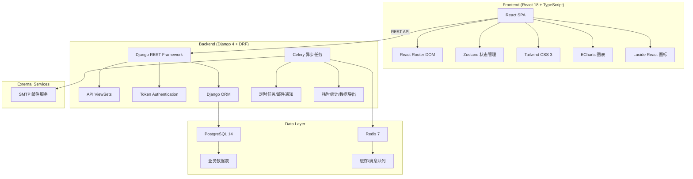
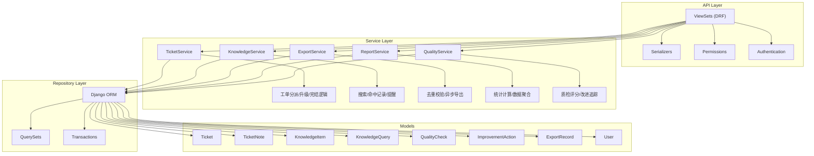
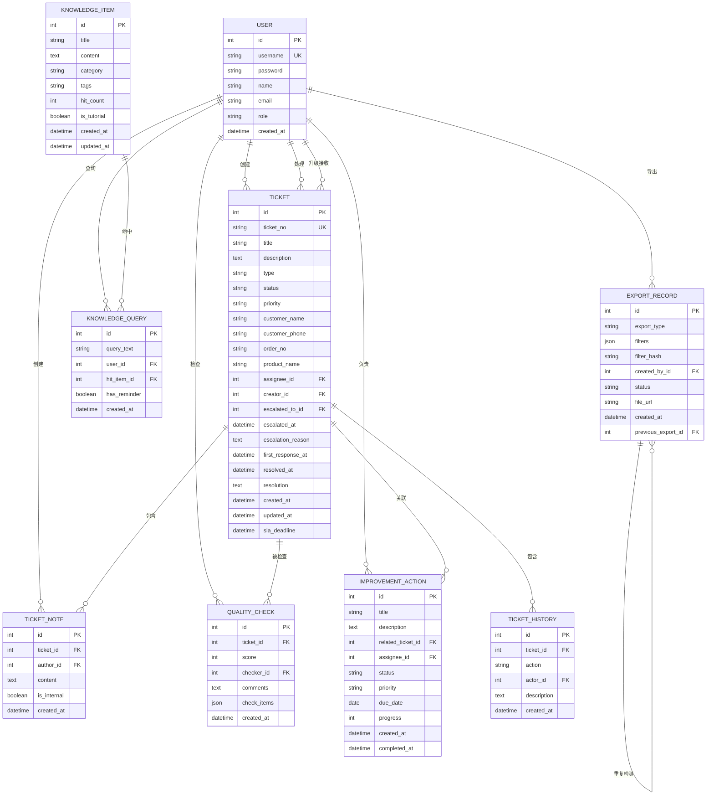

## 1. 架构设计



## 2. 技术描述

### 2.1 前端技术栈
- **框架**: React 18.2 + TypeScript 5
- **构建工具**: Vite 5
- **路由**: React Router DOM 6
- **状态管理**: Zustand 4
- **样式**: Tailwind CSS 3.4
- **UI 组件**: 自定义组件 + Radix UI 基础组件
- **图表**: ECharts 5.5
- **图标**: Lucide React
- **HTTP 客户端**: Axios
- **日期处理**: Day.js

### 2.2 后端技术栈
- **框架**: Django 4.2 + Django REST Framework 3.14
- **Python**: 3.11
- **数据库**: PostgreSQL 14+
- **缓存/消息队列**: Redis 7+
- **异步任务**: Celery 5.3 + Celery Beat
- **认证**: TokenAuthentication + JWT
- **数据库驱动**: psycopg2-binary

### 2.3 部署架构
- **前端**: Nginx 静态文件服务
- **后端**: Gunicorn + Django
- **反向代理**: Nginx
- **进程管理**: Supervisor

## 3. 路由定义

### 3.1 前端路由

| 路由路径 | 页面名称 | 权限要求 |
|----------|----------|----------|
| /login | 登录页 | 公开 |
| / | 首屏仪表盘 | 已登录 |
| /tickets | 工单列表 | 客服/运营/管理员 |
| /tickets/:id | 工单详情 | 客服/运营/管理员 |
| /tickets/create | 创建工单 | 客服/运营/管理员 |
| /knowledge | 知识库搜索 | 售后经理/管理员 |
| /knowledge/:id | 知识详情 | 售后经理/管理员 |
| /operations | 运营管理中心 | 运营/管理员 |
| /operations/service | 客服工单筛选 | 运营/管理员 |
| /operations/quality | 会话质检 | 运营/管理员 |
| /operations/improvement | 改进动作追踪 | 运营/管理员 |
| /reports | 统计报表 | 售后经理/运营/管理员 |
| /settings | 系统设置 | 管理员 |

### 3.2 后端 API 路由

| 方法 | 路径 | 功能 |
|------|------|------|
| POST | /api/auth/login/ | 用户登录 |
| POST | /api/auth/logout/ | 用户登出 |
| GET | /api/auth/user/ | 获取当前用户信息 |
| GET | /api/tickets/ | 获取工单列表 |
| POST | /api/tickets/ | 创建工单 |
| GET | /api/tickets/:id/ | 获取工单详情 |
| PUT | /api/tickets/:id/ | 更新工单 |
| PATCH | /api/tickets/:id/ | 部分更新工单 |
| POST | /api/tickets/:id/assign/ | 分派工单 |
| POST | /api/tickets/:id/escalate/ | 工单升级 |
| POST | /api/tickets/:id/resolve/ | 工单处理完结 |
| POST | /api/tickets/:id/notes/ | 添加工单备注 |
| GET | /api/tickets/dashboard/stats/ | 仪表盘统计数据 |
| GET | /api/knowledge/ | 知识库列表/搜索 |
| GET | /api/knowledge/:id/ | 知识详情 |
| POST | /api/knowledge/queries/ | 记录查询 |
| POST | /api/knowledge/:id/reminder/ | 设置更新提醒 |
| GET | /api/knowledge/hot/ | 热门搜索 |
| GET | /api/operations/service-tickets/ | 客服工单筛选 |
| GET | /api/operations/quality-checks/ | 会话质检列表 |
| POST | /api/operations/quality-checks/ | 创建质检记录 |
| GET | /api/operations/improvements/ | 改进动作列表 |
| POST | /api/operations/improvements/ | 创建改进动作 |
| PATCH | /api/operations/improvements/:id/ | 更新改进动作 |
| GET | /api/exports/check-duplicate/ | 检查重复导出 |
| POST | /api/exports/ | 创建导出任务 |
| GET | /api/exports/:id/download/ | 下载导出文件 |
| GET | /api/reports/duration/ | 时长统计报表 |
| GET | /api/reports/results/ | 处理结果分析 |
| GET | /api/reports/trends/ | 趋势分析报表 |
| GET | /api/users/ | 用户列表（管理员） |
| POST | /api/users/ | 创建用户（管理员） |

## 4. API 类型定义

```typescript
// 用户类型
interface User {
  id: number;
  username: string;
  name: string;
  email: string;
  role: 'manager' | 'operator' | 'agent' | 'admin';
  avatar?: string;
}

// 工单类型
interface Ticket {
  id: number;
  ticket_no: string;
  title: string;
  description: string;
  type: 'refund' | 'exchange' | 'complaint' | 'consult' | 'other';
  status: 'pending' | 'processing' | 'escalated' | 'resolved' | 'closed';
  priority: 'low' | 'medium' | 'high' | 'urgent';
  customer_name: string;
  customer_phone: string;
  order_no?: string;
  product_name?: string;
  assignee?: User;
  creator: User;
  escalated_to?: User;
  escalated_at?: string;
  escalation_reason?: string;
  first_response_at?: string;
  resolved_at?: string;
  resolution?: string;
  created_at: string;
  updated_at: string;
  sla_deadline: string;
  is_overdue: boolean;
  first_response_duration?: number;
  total_duration?: number;
}

// 工单备注
interface TicketNote {
  id: number;
  ticket: number;
  author: User;
  content: string;
  is_internal: boolean;
  created_at: string;
}

// 处理记录
interface TicketHistory {
  id: number;
  ticket: number;
  action: string;
  actor: User;
  description: string;
  created_at: string;
}

// 知识库条目
interface KnowledgeItem {
  id: number;
  title: string;
  content: string;
  category: string;
  tags: string[];
  hit_count: number;
  is_tutorial: boolean;
  related_items: number[];
  created_at: string;
  updated_at: string;
}

// 查询记录
interface KnowledgeQuery {
  id: number;
  query_text: string;
  user: User;
  hit_item?: KnowledgeItem;
  has_reminder: boolean;
  created_at: string;
}

// 质检记录
interface QualityCheck {
  id: number;
  ticket: Ticket;
  score: number;
  checker: User;
  comments: string;
  check_items: Record<string, boolean>;
  created_at: string;
}

// 改进动作
interface ImprovementAction {
  id: number;
  title: string;
  description: string;
  related_ticket?: Ticket;
  assignee: User;
  status: 'pending' | 'in_progress' | 'completed' | 'cancelled';
  priority: 'low' | 'medium' | 'high';
  due_date: string;
  progress: number;
  created_at: string;
  completed_at?: string;
}

// 导出记录
interface ExportRecord {
  id: number;
  export_type: string;
  filters: Record<string, any>;
  filter_hash: string;
  created_by: User;
  status: 'pending' | 'processing' | 'completed' | 'failed';
  file_url?: string;
  created_at: string;
  is_duplicate: boolean;
  previous_export?: ExportRecord;
}

// 仪表盘统计
interface DashboardStats {
  todo: {
    total: number;
    urgent: number;
    due_soon: number;
  };
  exceptions: {
    overdue: number;
    escalated_no_response: number;
    repeated_complaints: number;
  };
  reports: {
    today_tickets: number;
    today_resolved: number;
    avg_response_time: number;
    resolution_rate: number;
  };
}

// 报表数据
interface DurationReport {
  avg_first_response: number;
  avg_total_duration: number;
  stage_distribution: { stage: string; avg_duration: number }[];
}

interface ResultReport {
  status_distribution: { status: string; count: number }[];
  resolution_rate: number;
  recurrence_rate: number;
}

interface TrendReport {
  dates: string[];
  ticket_counts: number[];
  escalation_rates: number[];
  satisfaction_rates: number[];
}
```

## 5. 服务器架构图



## 6. 数据模型

### 6.1 ER 图



### 6.2 DDL 语句

```sql
-- 用户表
CREATE TABLE "user" (
    id SERIAL PRIMARY KEY,
    username VARCHAR(150) NOT NULL UNIQUE,
    password VARCHAR(128) NOT NULL,
    name VARCHAR(100) NOT NULL,
    email VARCHAR(254),
    role VARCHAR(20) NOT NULL CHECK (role IN ('manager', 'operator', 'agent', 'admin')),
    created_at TIMESTAMP WITH TIME ZONE DEFAULT CURRENT_TIMESTAMP
);

-- 工单表
CREATE TABLE ticket (
    id SERIAL PRIMARY KEY,
    ticket_no VARCHAR(32) NOT NULL UNIQUE,
    title VARCHAR(200) NOT NULL,
    description TEXT NOT NULL,
    type VARCHAR(20) NOT NULL CHECK (type IN ('refund', 'exchange', 'complaint', 'consult', 'other')),
    status VARCHAR(20) NOT NULL DEFAULT 'pending' CHECK (status IN ('pending', 'processing', 'escalated', 'resolved', 'closed')),
    priority VARCHAR(20) NOT NULL DEFAULT 'medium' CHECK (priority IN ('low', 'medium', 'high', 'urgent')),
    customer_name VARCHAR(100) NOT NULL,
    customer_phone VARCHAR(20) NOT NULL,
    order_no VARCHAR(50),
    product_name VARCHAR(200),
    assignee_id INTEGER REFERENCES "user"(id),
    creator_id INTEGER NOT NULL REFERENCES "user"(id),
    escalated_to_id INTEGER REFERENCES "user"(id),
    escalated_at TIMESTAMP WITH TIME ZONE,
    escalation_reason TEXT,
    first_response_at TIMESTAMP WITH TIME ZONE,
    resolved_at TIMESTAMP WITH TIME ZONE,
    resolution TEXT,
    created_at TIMESTAMP WITH TIME ZONE DEFAULT CURRENT_TIMESTAMP,
    updated_at TIMESTAMP WITH TIME ZONE DEFAULT CURRENT_TIMESTAMP,
    sla_deadline TIMESTAMP WITH TIME ZONE NOT NULL
);

CREATE INDEX idx_ticket_status ON ticket(status);
CREATE INDEX idx_ticket_priority ON ticket(priority);
CREATE INDEX idx_ticket_assignee ON ticket(assignee_id);
CREATE INDEX idx_ticket_created_at ON ticket(created_at);
CREATE INDEX idx_ticket_sla_deadline ON ticket(sla_deadline);

-- 工单备注表
CREATE TABLE ticket_note (
    id SERIAL PRIMARY KEY,
    ticket_id INTEGER NOT NULL REFERENCES ticket(id) ON DELETE CASCADE,
    author_id INTEGER NOT NULL REFERENCES "user"(id),
    content TEXT NOT NULL,
    is_internal BOOLEAN NOT NULL DEFAULT TRUE,
    created_at TIMESTAMP WITH TIME ZONE DEFAULT CURRENT_TIMESTAMP
);

CREATE INDEX idx_ticket_note_ticket ON ticket_note(ticket_id);

-- 工单历史记录表
CREATE TABLE ticket_history (
    id SERIAL PRIMARY KEY,
    ticket_id INTEGER NOT NULL REFERENCES ticket(id) ON DELETE CASCADE,
    action VARCHAR(50) NOT NULL,
    actor_id INTEGER NOT NULL REFERENCES "user"(id),
    description TEXT,
    created_at TIMESTAMP WITH TIME ZONE DEFAULT CURRENT_TIMESTAMP
);

CREATE INDEX idx_ticket_history_ticket ON ticket_history(ticket_id);

-- 知识库条目表
CREATE TABLE knowledge_item (
    id SERIAL PRIMARY KEY,
    title VARCHAR(200) NOT NULL,
    content TEXT NOT NULL,
    category VARCHAR(50) NOT NULL,
    tags VARCHAR(500),
    hit_count INTEGER NOT NULL DEFAULT 0,
    is_tutorial BOOLEAN NOT NULL DEFAULT FALSE,
    created_at TIMESTAMP WITH TIME ZONE DEFAULT CURRENT_TIMESTAMP,
    updated_at TIMESTAMP WITH TIME ZONE DEFAULT CURRENT_TIMESTAMP
);

CREATE INDEX idx_knowledge_category ON knowledge_item(category);
CREATE INDEX idx_knowledge_is_tutorial ON knowledge_item(is_tutorial);

-- 知识查询记录表
CREATE TABLE knowledge_query (
    id SERIAL PRIMARY KEY,
    query_text VARCHAR(500) NOT NULL,
    user_id INTEGER NOT NULL REFERENCES "user"(id),
    hit_item_id INTEGER REFERENCES knowledge_item(id),
    has_reminder BOOLEAN NOT NULL DEFAULT FALSE,
    created_at TIMESTAMP WITH TIME ZONE DEFAULT CURRENT_TIMESTAMP
);

CREATE INDEX idx_knowledge_query_user ON knowledge_query(user_id);
CREATE INDEX idx_knowledge_query_created ON knowledge_query(created_at);

-- 质检记录表
CREATE TABLE quality_check (
    id SERIAL PRIMARY KEY,
    ticket_id INTEGER NOT NULL REFERENCES ticket(id),
    score INTEGER NOT NULL CHECK (score >= 0 AND score <= 100),
    checker_id INTEGER NOT NULL REFERENCES "user"(id),
    comments TEXT,
    check_items JSONB NOT NULL,
    created_at TIMESTAMP WITH TIME ZONE DEFAULT CURRENT_TIMESTAMP
);

CREATE INDEX idx_quality_check_ticket ON quality_check(ticket_id);
CREATE INDEX idx_quality_check_created ON quality_check(created_at);

-- 改进动作表
CREATE TABLE improvement_action (
    id SERIAL PRIMARY KEY,
    title VARCHAR(200) NOT NULL,
    description TEXT NOT NULL,
    related_ticket_id INTEGER REFERENCES ticket(id),
    assignee_id INTEGER NOT NULL REFERENCES "user"(id),
    status VARCHAR(20) NOT NULL DEFAULT 'pending' CHECK (status IN ('pending', 'in_progress', 'completed', 'cancelled')),
    priority VARCHAR(20) NOT NULL DEFAULT 'medium' CHECK (priority IN ('low', 'medium', 'high')),
    due_date DATE NOT NULL,
    progress INTEGER NOT NULL DEFAULT 0 CHECK (progress >= 0 AND progress <= 100),
    created_at TIMESTAMP WITH TIME ZONE DEFAULT CURRENT_TIMESTAMP,
    completed_at TIMESTAMP WITH TIME ZONE
);

CREATE INDEX idx_improvement_assignee ON improvement_action(assignee_id);
CREATE INDEX idx_improvement_status ON improvement_action(status);
CREATE INDEX idx_improvement_due_date ON improvement_action(due_date);

-- 导出记录表
CREATE TABLE export_record (
    id SERIAL PRIMARY KEY,
    export_type VARCHAR(50) NOT NULL,
    filters JSONB NOT NULL,
    filter_hash VARCHAR(64) NOT NULL,
    created_by_id INTEGER NOT NULL REFERENCES "user"(id),
    status VARCHAR(20) NOT NULL DEFAULT 'pending' CHECK (status IN ('pending', 'processing', 'completed', 'failed')),
    file_url VARCHAR(500),
    created_at TIMESTAMP WITH TIME ZONE DEFAULT CURRENT_TIMESTAMP,
    previous_export_id INTEGER REFERENCES export_record(id)
);

CREATE INDEX idx_export_hash ON export_record(filter_hash);
CREATE INDEX idx_export_created_by ON export_record(created_by_id);
CREATE INDEX idx_export_created ON export_record(created_at);
```
