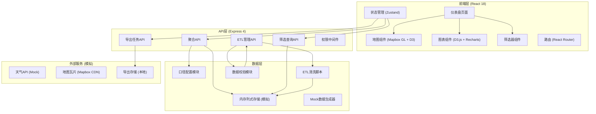
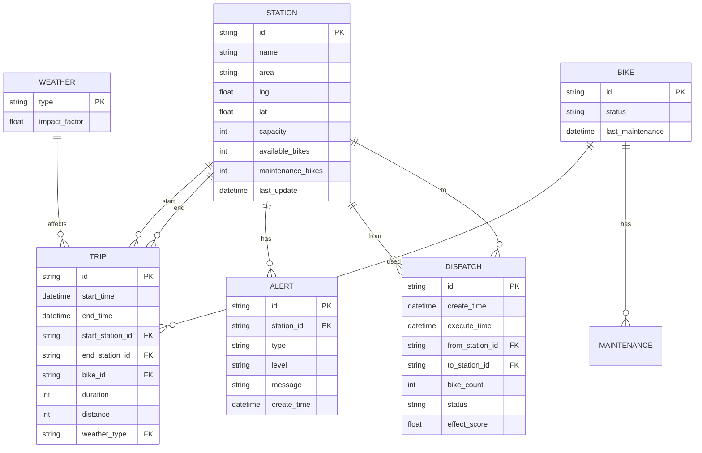

## 1. 架构设计



## 2. 技术栈描述

### 2.1 前端技术
- **框架**: React@18 + TypeScript
- **构建工具**: Vite@5
- **样式**: TailwindCSS@3 + 自定义CSS变量主题系统
- **状态管理**: Zustand（轻量、不可变状态更新）
- **路由**: React Router Dom@6
- **图表**:
  - Mapbox GL JS（地图底图、站点标记、流向弧线）
  - D3.js（自定义可视化、热力图、OD矩阵）
  - Recharts（标准折线图、柱状图、面积图）
- **图标**: Lucide React
- **动画**: Framer Motion（页面过渡、微交互）

### 2.2 后端技术
- **框架**: Express@4 + TypeScript
- **数据处理**: 内存列式存储模拟（面向分析场景的列存结构）
- **ETL**: 自定义清洗脚本 + 数据校验规则引擎
- **导出**: Node.js 原生CSV/Excel生成（exceljs）
- **权限**: 基于角色的简单权限中间件

### 2.3 数据模型说明
- 采用列存模拟：按列组织数据，适合快速聚合查询
- 口径配置化：所有业务指标定义在配置文件中，支持热更新
- 数据可追溯：每条聚合结果保留原始数据ID列表，支持下钻验证

## 3. 路由定义

### 3.1 前端路由
| 路由路径 | 页面名称 | 说明 |
|----------|----------|------|
| / | 总览仪表盘 | 默认首页，核心KPI+地图+告警 |
| /stations | 站点分析 | 站点列表+筛选+详情 |
| /routes | 线路分析 | OD流向+热门线路 |
| /dispatch | 调度管理 | 调度记录+效果对比 |
| /forecast | 预测中心 | 峰值预测+天气分析 |
| /data | 数据管理 | ETL状态+口径配置+导出 |

### 3.2 后端API路由
| 路由路径 | 方法 | 用途 |
|----------|------|------|
| /api/overview | GET | 获取总览仪表盘聚合数据 |
| /api/stations | GET | 获取站点列表，支持筛选参数 |
| /api/stations/:id | GET | 获取单个站点详情和趋势 |
| /api/routes/od | GET | 获取OD流向矩阵数据 |
| /api/routes/top | GET | 获取热门线路排行 |
| /api/dispatch/records | GET | 获取调度记录列表 |
| /api/dispatch/effect | GET | 调度效果对比数据 |
| /api/forecast/peak | GET | 峰值预测数据 |
| /api/forecast/weather | GET | 天气关联分析数据 |
| /api/etl/status | GET | 获取ETL状态和校验结果 |
| /api/etl/metrics | GET/PUT | 获取/更新指标口径配置 |
| /api/export/tasks | GET/POST | 导出任务列表/创建导出 |
| /api/export/tasks/:id | GET | 获取导出任务状态和下载 |
| /api/filters | GET/POST | 筛选组合列表/保存 |

## 4. API定义

### 4.1 核心类型定义
```typescript
// 站点类型
interface Station {
  id: string;
  name: string;
  area: string;
  lng: number;
  lat: number;
  capacity: number;
  availableBikes: number;
  availableDocks: number;
  maintenanceBikes: number;
  status: 'normal' | 'low' | 'full' | 'maintenance';
  lastUpdate: number;
}

// 骑行记录
interface TripRecord {
  id: string;
  startTime: number;
  endTime: number;
  startStationId: string;
  endStationId: string;
  bikeId: string;
  duration: number;
  distance: number;
  weather: string;
}

// 调度记录
interface DispatchRecord {
  id: string;
  createTime: number;
  executeTime: number;
  fromStationId: string;
  toStationId: string;
  bikeCount: number;
  operator: string;
  status: 'pending' | 'processing' | 'completed' | 'failed';
  effectScore?: number;
}

// 告警
interface Alert {
  id: string;
  stationId: string;
  type: 'shortage' | 'overflow' | 'maintenance_timeout';
  level: 'low' | 'medium' | 'high';
  message: string;
  createTime: number;
}

// ETL状态
interface EtlStatus {
  source: string;
  lastUpdate: number;
  status: 'success' | 'failed' | 'running';
  recordCount: number;
  missingFields: string[];
  errorMessage?: string;
}

// 筛选条件
interface FilterCondition {
  id?: string;
  name?: string;
  timeRange: [number, number];
  areas: string[];
  stationIds: string[];
  bikeStatus: ('available' | 'maintenance' | 'all')[];
  weatherTypes: string[];
}
```

### 4.2 统一响应格式
```typescript
interface ApiResponse<T> {
  code: number;
  message: string;
  data: T;
  traceId?: string;
  etlInfo?: {
    updateTime: number;
    dataVersion: string;
    warnings: string[];
  };
}
```

## 5. 数据模型

### 5.1 ER图


### 5.2 核心口径配置
```typescript
const metricConfig = {
  availableInventory: {
    formula: 'totalBikes - maintenanceBikes',
    description: '可调度库存 = 总车辆数 - 维修中车辆'
  },
  peakHours: {
    morning: [7, 9],
    evening: [17, 19],
    description: '早晚高峰时段定义'
  },
  alertThresholds: {
    shortage: 0.1,
    overflow: 0.9,
    description: '站点余量低于10%告警，高于90%告警'
  },
  serviceLevel: {
    formula: 'availableBikes / capacity',
    thresholds: { good: 0.3, warning: 0.15, critical: 0.05 }
  }
};
```

## 6. 数据校验与异常处理

### 6.1 字段完整性校验规则
- 骑行记录：必填字段 start_station_id, end_station_id, start_time, bike_id
- 站点状态：必填字段 available_bikes, capacity, last_update
- 调度记录：必填字段 from_station_id, to_station_id, bike_count, status

### 6.2 异常值检测
- 骑行时长 > 4小时 标记为异常
- 站点余量日波动 > 80% 标记为异常
- 连续3次更新无变化 标记为数据停滞

### 6.3 前端异常展示规则
- 数据更新失败：顶部红色闪烁条 + 图表灰色占位 + 错误详情
- 字段缺失：图表上标注"数据不完整"水印 + 具体缺失字段列表
- 数据异常：异常点用红色标记 + 悬浮显示异常原因注释
